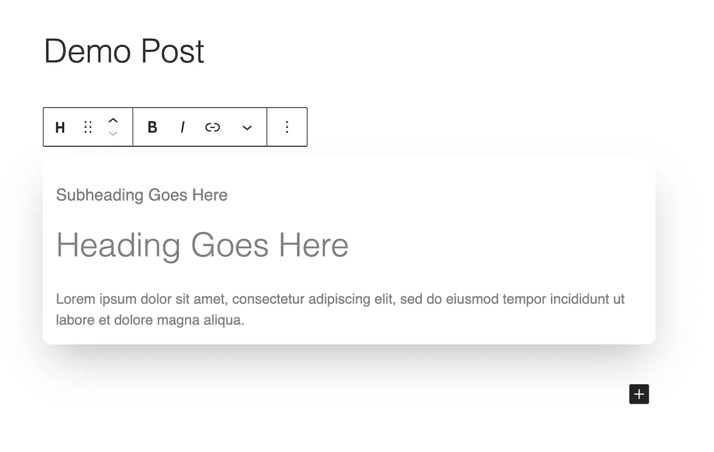
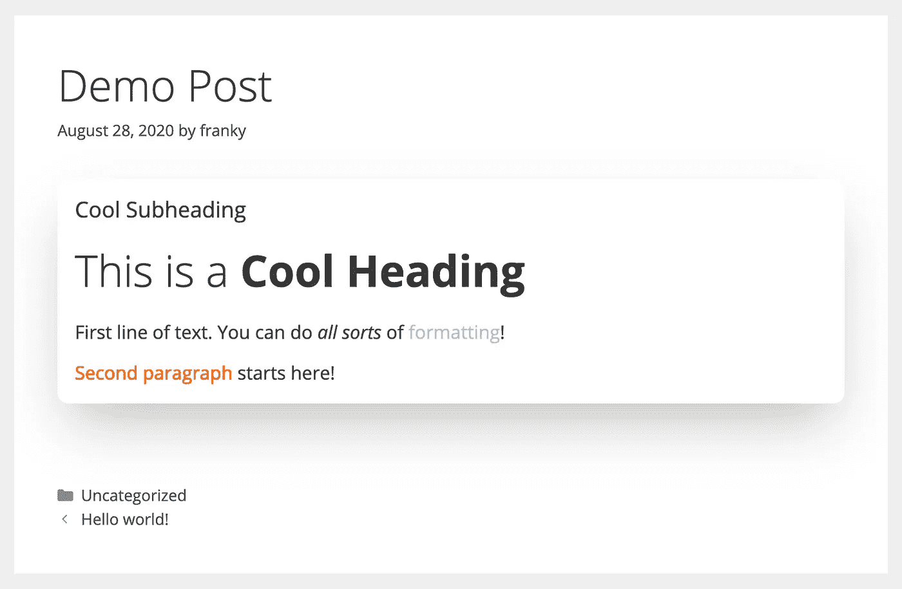
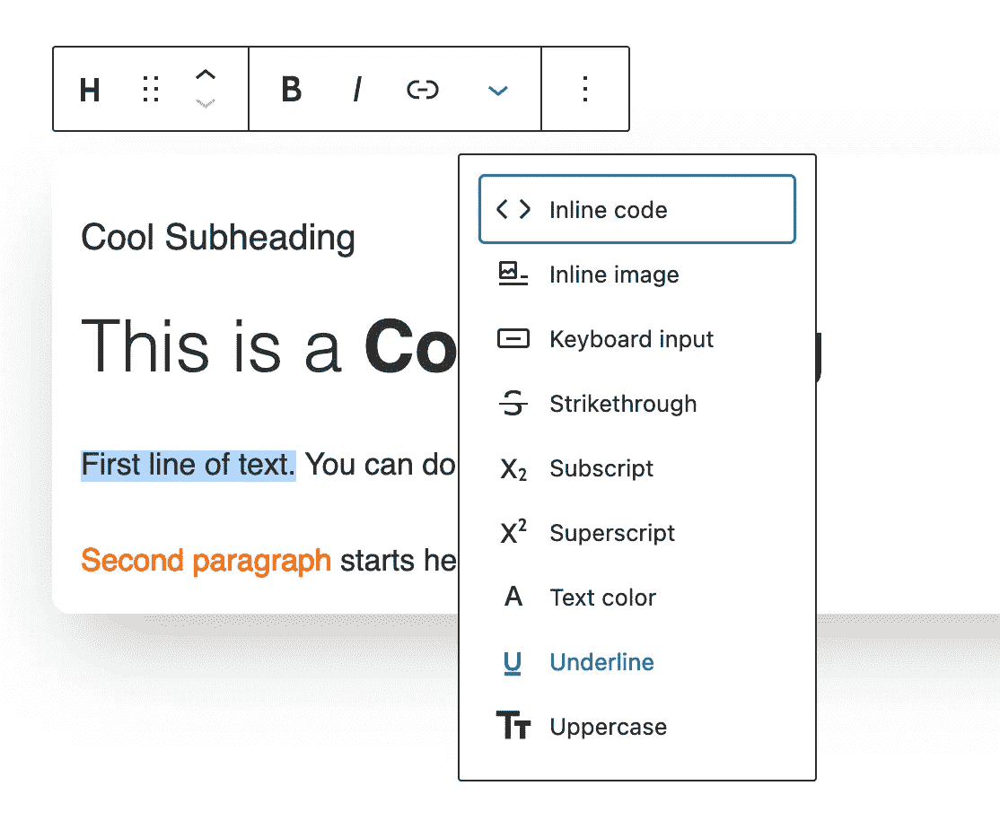

# Gutenberg Hacks — RichText 示例通过自定义格式变得简单

> 原文：<https://medium.com/geekculture/gutenberg-hacks-richtext-made-simple-with-examples-70c9ffae706a?source=collection_archive---------23----------------------->


This is how I start the day

在本指南中，我将向您展示如何尽可能简单地在您的块中使用`RichText`组件。忘记设置“source”或“selector”属性的需要，只需简单的字符串属性就可以了！

本指南的插件代码全部推送到[我的 Github repo](https://github.com/franky-adl/gtg-demo/tree/richtext-block-demo) (注意你应该在 richtext-block-demo 分支)。一如既往地阅读我的回购中的完整代码；我在这里只强调重要的部分。

# 了解你的街区

`RichText`组件允许开发人员在块编辑器中现场编辑文本行，为我们提供各种格式选项(如粗体、斜体、上标、下标等)。我们还可以将组件的容器设置为任何块级元素，比如一个`div`、`h2`或`p`标签。

# 让我们深入研究代码

这次我将把这个演示块做成一个简单的卡片，带有副标题、标题和内容文本。

```
 attributes: {
    subheading: {
      type: 'string',
    },
    heading: {
      type: 'string',
    },
    content: {
      type: 'string',
    }
  },
```

正确导入并从`props.attributes`析构每个属性后，在编辑函数中添加`RichText`组件，如下所示:

```
 return (
      <div {...blockProps}>
        <RichText
          tagName='h3'
          className='card-subheading'
          value={subheading}
          onChange={(newVal) => setAttributes({subheading: newVal})}
          placeholder="Subheading Goes Here"
        />
        <RichText
          tagName='h1'
          className='card-heading'
          value={heading}
          onChange={(newVal) => setAttributes({heading: newVal})}
          placeholder="Heading Goes Here"
        />
        <RichText
          tagName='div'
          className='card-content'
          multiline='p'
          value={content}
          onChange={(newVal) => setAttributes({content: newVal})}
          placeholder="Lorem ipsum dolor sit amet, consectetur adipiscing elit, sed do eiusmod tempor incididunt ut labore et dolore magna aliqua."
        />
      </div>
    );
```

关于 RichText 组件可以采用的可用属性的完整列表，请阅读此[链接](https://github.com/WordPress/gutenberg/blob/HEAD/packages/block-editor/src/components/rich-text/README.md)中的更多内容。`h3`和`h1` `RichText`组件非常标准，注意我们在内容组件中有一个额外的`multiline`属性设置为`p`。这意味着当我们点击这个组件中的`Enter`时，下一行的文本将被包裹在`p`标签中，而不是添加一个换行符的默认行为。

记住在保存功能中使用`RichText.Content`而不是相同的`RichText`标签。

在块编辑器中，我们的块应该如下所示:



screencap of the ‘GTG Demo Block(RichText)’ block

填充文本输入，我们可以在前端得到像这样酷的东西:



# 为 RichText 组件添加额外的格式选项

您可能想知道，“格式选项中的下划线图标在哪里？”我也不知道为什么。尽管这个按钮已经不在了，但你仍然可以通过按下`Ctrl+U`或`Cmd+U`来给选中的文本加下划线，这取决于你使用的是 Windows 还是 Mac。但是这里是你如何添加缺少下划线格式选项的方法。

我结合了来自官方指南的[和这个 Github 回购文件](https://developer.wordpress.org/block-editor/how-to-guides/format-api/1-register-format/)的[的实现。只需将这段代码添加到您的 editor.js(调用`registerBlockType`的 js 文件)中:](https://gist.github.com/phpbits/69e96d64cdb29005c9c1e41569eacb1c)

```
const UnderlineButton = ( props ) => {
  return (
    <RichTextToolbarButton
      icon="editor-underline"
      title="Underline"
      onClick={ () => {
        props.onChange(
          toggleFormat( props.value, {
            type: formatName
          } ) 
        );
      } }
      isActive={ props.isActive }
    />
  );
};

registerFormatType( formatName, {
  title: 'Underline',
  tagName: 'u',
  className: null,
  edit: UnderlineButton,
} );
```

下划线按钮现在会出现在每一个富文本工具栏上(图片标题、按钮、段落等)！

