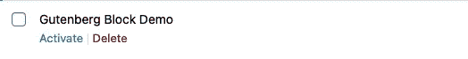
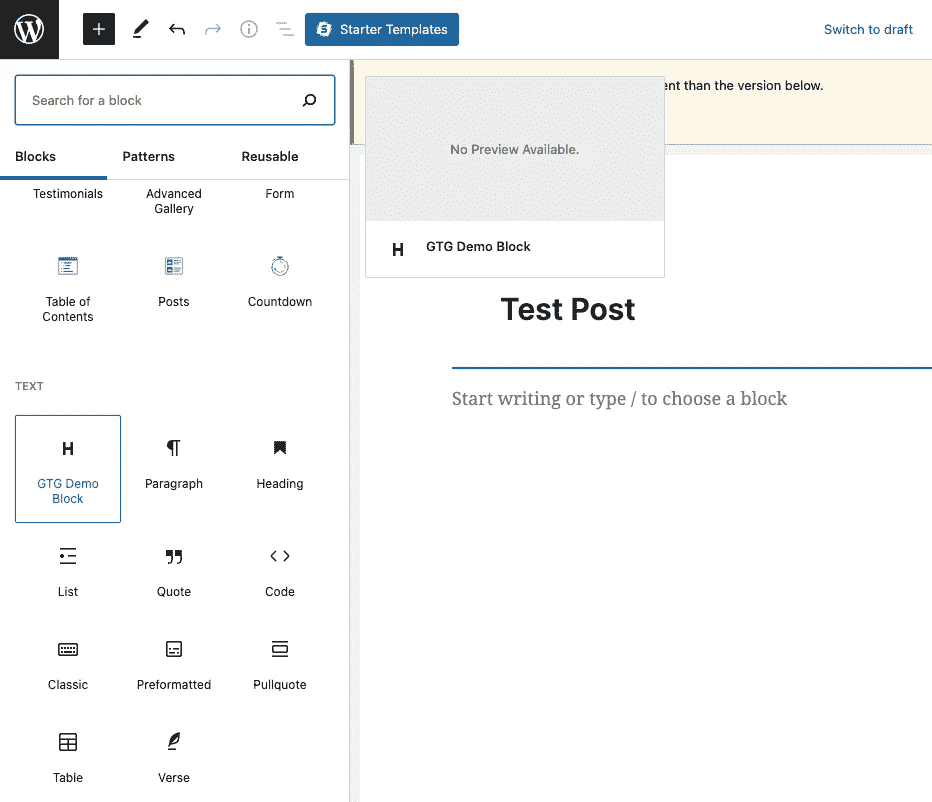
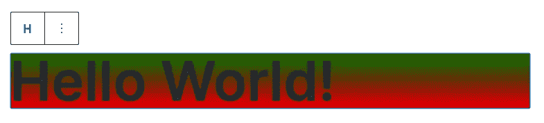
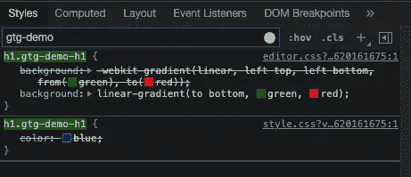
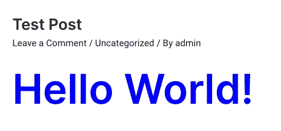

# Gutenberg 教程:#1 如何用 Webpack 构建一个简单的 Gutenberg 块

> 原文：<https://medium.com/geekculture/gutenberg-tutorials-1-how-to-build-a-simple-gutenberg-block-in-esnext-jsx-d8b7cabb7684?source=collection_archive---------5----------------------->

这是古腾堡教程系列的第一篇文章。本系列旨在帮助 Gutenberg 初学者和我自己(通过教学学习😄).TBH，我从写这篇文章中学到了新东西！

你可以在 [Github 库](https://github.com/franky-adl/gtg-demo)上下载本教程中使用的代码，或者你也可以按照下面的所有步骤构建相同的插件。

看看我的下一个教程:[古腾堡教程:#2 当你做 wp_register_script 的时候如何管理依赖关系](https://franky-arkon-digital.medium.com/gutenberg-tutorials-2-how-to-manage-dependencies-when-you-do-wp-register-script-4de9fab47444)

# 我为什么要写这个

也许你已经阅读了官方的[积木编辑器手册教程](https://developer.wordpress.org/block-editor/how-to-guides/block-tutorial/)关于如何构建你的第一个积木类型，但是感觉你并不了解整个事情。当我第一次开始编写定制的 Gutenberg 块时，我也有同样的感觉，特别是因为我习惯于用好的 ol' PHP 和 ES5 JavaScript 开发主题和插件。在官方教程中，你会很快发现 ES5 的语法非常难懂，而且大多数教程已经在使用 ESNext 和 JSX 语法了。当然，ESNext + JSX 语法是正确的选择。

> *以后想看这个故事吗？* [*把它保存在日记本里。*](https://usejournal.com/?utm_source=medium.com&utm_medium=noteworthy_blog&utm_campaign=tech&utm_content=guest_post_read_later_text)

如果你想更好地理解如何使用 ESNext 和 JSX 语法来构建古腾堡块，而不使用现成的工具，如 [@wordpress/scripts](https://www.npmjs.com/package/@wordpress/scripts) 和 [create-guten-block](https://github.com/ahmadawais/create-guten-block) ，**请继续阅读**。我将尽可能简单地解释我如何设置我的 JavaScript 和 SCSS 构建**来构建任何古腾堡块。**

# 本指南中的章节

1.  流行语解释
2.  古腾堡块插件文件
3.  使用 Webpack 输出 transpiled js 和 css 文件
4.  激活并测试插件
5.  惊讶于你刚刚学到的东西！🎊

# 流行语解释

首先，让我们快速浏览一下这些术语，这样我们就能在本指南的后面部分达成一致。

ESNext —当前版本中没有的每一个最新的 JavaScript 特性都被称为 ESNext。

**JSX** —与 React.js 一起开发的 JavaScript 语言语法的扩展。这允许您直接在 js 文件中编写类似 html 的标签。

**SCSS**—CSS 的扩展，代表时髦的 CSS。注意 SCSS 和萨斯有不同的语法:见这个 [stackoverflow 回答](https://stackoverflow.com/questions/5654447/whats-the-difference-between-scss-and-sass)。

**Babel** —一个 JavaScript 转换程序，用于将最新的 JavaScript 语法转换成大多数浏览器支持的旧版本。

**Webpack** —一个捆绑器，可以捆绑、转换和打包 JavaScript 和资源文件，以便在浏览器中使用。

# 古腾堡块插件文件

最简单的，你只需要一个`plugin.php`和一个`editor.js`就可以拥有一个工作的 Gutenberg 块插件。**`**plugin.php**`**的主要目的是让 WordPress 将它识别为一个插件并注册块，以确保当块编辑器加载时，注册的脚本和样式句柄被排队。而** `**editor.js**` **的主要用途是定义块在块编辑器中实际如何工作。**但是对于我们将要构建的设置，两个文件是不够的。那是因为我们想在`editor.js`加上 SCSS 写 ESNext + JSX，我们将需要一堆其他文件来帮助我们的事业。现在让我们深入研究代码！**

**假设你在 WordPress 插件目录中，为 Gutenberg Block 插件创建一个新目录。为了简单起见，我们只做一个单块插件。**

```
mkdir gtg-demo && cd gtg-demo
touch plugin.php
```

**`plugin.php`内容:**

```
<?php
/*
Plugin Name: Gutenberg Block Demo
*/
function gtg_demo_register_block() {
  wp_register_script(
    'gtg-demo-editor-script',
    plugins_url( 'build/editor.js', __FILE__ ),
    array( 'wp-blocks' ),
    filemtime( plugin_dir_path( __FILE__ ) . 'build/editor.js' )
  );wp_register_style(
    'gtg-demo-style',
    plugins_url( 'build/style.css', __FILE__ ),
    [],
    filemtime( plugin_dir_path( __FILE__ ) . 'build/style.css' )
  );wp_register_style(
    'gtg-demo-editor-style',
    plugins_url( 'build/editor.css', __FILE__ ),
    [],
    filemtime( plugin_dir_path( __FILE__ ) . 'build/editor.css' )
  );register_block_type( 'myfirstblock/gtg-demo', array(
    'editor_script' => 'gtg-demo-editor-script',
    'editor_style' => 'gtg-demo-editor-style',
    'style' => 'gtg-demo-style'
  ) );

}
add_action( 'init', 'gtg_demo_register_block' );
```

**这里我们将`build/editor.js`(js 和 css 构建文件稍后生成，先放在这里)注册为`gtg-demo-editor-script`句柄，css 文件分别注册为`gtg-demo-editor-style`和`gtg-demo-style`句柄。然后，这些句柄被送入`register_block_type`来注册块，以确保当块编辑器加载时，注册的脚本和样式句柄被排队。`filemtime`函数返回文件内容更改的时间，这有助于在每次更改文件时创建不同的 url 查询(例如 editor.css？ver=341237498)，破坏文件上的任何浏览器缓存。引用自[官方教程](https://developer.wordpress.org/block-editor/how-to-guides/block-tutorial/writing-your-first-block-type/):**

> **`editor_script`和`editor_style`文件将只在编辑器中排队，而`script`和`style`将在编辑器中排队，并在您的站点前面查看帖子时排队。**

**请注意，我们在此注册的块类型名称以“myfirstblock”命名，以防止与其他注册的块类型冲突。**

# **使用 Webpack 输出 transpiled js 和 css 文件**

**这一部分可能有点长，但对于理解我们的古腾堡区块的构建过程绝对是必不可少的。**

**为了使用 ESNext + JSX 语法来编写我们的块，我们需要一个 transpiler 来将它们转换成浏览器兼容的代码。再加上需要将 SCSS 编译成 CSS，著名的捆绑工具— **Webpack** 现在来帮忙了！对于刚刚接触 Webpack 或者没有学习足够 Webpack 基础知识的人来说， [Webpack 官方指南](https://webpack.js.org/guides/getting-started/)实际上非常有帮助。建议你先看前 10 个指南左右，有个清晰的认识。**

**在接下来的步骤中，我们会非常需要 npm，确保你已经安装了 node.js 和 NPM。假设您仍然在 gtg-demo 插件目录中，初始化本地 npm 项目:**

```
npm init -y
```

**在这里，我们从 npm 安装 Webpack。截至目前，Webpack 5 已经发布。对于 Webpack 4 或更高版本，如果我们想在命令行上使用 Webpack，我们还必须安装`webpack-cli`:**

```
npm install webpack webpack-cli --save-dev
touch webpack.config.js
```

**`webpack.config.js`内容:**

```
const path = require("path");
const MiniCssExtractPlugin = require('mini-css-extract-plugin');module.exports = {
  entry: { 
    editor: path.resolve(__dirname, "src/editor.js"),
    style: path.resolve(__dirname, "src/style.js"),
  },
  output: {
    path: path.resolve(__dirname, "build"),
    filename: '[name].js',
    clean: true
  },
  plugins: [
    new MiniCssExtractPlugin(),
  ],
  module: {
    rules: [
      {
        test: /\.scss$/,
        use: [MiniCssExtractPlugin.loader, "css-loader", "postcss-loader", "sass-loader"]
      },
      {
        test: /\.js$/,
        exclude: /node_modules/,
        use: ["babel-loader"]
      }
    ],
  },
};
```

**哇，那可真是太多了。在安装其他开发依赖项之前，让我先解释一下我们在用`wepback.config.js`做什么。默认情况下，通过在您的目录中运行命令`webpack`，Webpack 将遵循相同目录中的`webpack.config.js`中所述的指令。**

**module.exports 中的配置对象定义了我们对 Webpack 的所有指令。**

**首先,“条目”属性允许您定义一个或多个由 Webpack 处理的条目脚本。背后的想法是这样的:**

****通过说明您的条目 js 文件需要哪些依赖关系，Webpack 可以使用这些信息来构建依赖关系图。然后，它使用该图生成一个优化的包，其中脚本将按正确的顺序执行。****

**当我解释`webpack.config.js`的每个部分时，我们将执行相应的步骤。对于“条目”属性，每个条目的语法是[名称]:[文件路径]。[name]部分后来在“output”属性中被引用。让我们首先为条目创建 src 文件:**

```
mkdir src && cd src
touch editor.js style.js editor.scss style.scss
```

**`editor.js`内容:**

```
const { registerBlockType } = wp.blocks;
import './editor.scss';registerBlockType( 'myfirstblock/gtg-demo', {
  title: 'GTG Demo Block',
  icon: 'heading', // [https://developer.wordpress.org/resource/dashicons/#heading](https://developer.wordpress.org/resource/dashicons/#heading)
  category: 'text',
  edit: props => {
    return (
      <h1 className={'gtg-demo-h1'}>Hello World!</h1>
    );
  },
  save: props => {
    return (
      <h1 className={'gtg-demo-h1'}>Hello World!</h1>
    );
  },
} );
```

**editor.scss 内容:**

```
$start-color: green;
$end-color: red;h1.gtg-demo-h1 {
  background: linear-gradient(to bottom, $start-color, $end-color);
}
```

**这个`editor.js`有 JSX 语法，必须由我们稍后安装的巴别塔加载器来编译。在`registerBlockType`中，`edit`属性让我们定义块如何在块编辑器中呈现/表现，而`save`属性让我们定义块应如何保存在数据库中(以及如何在前端呈现)。我们这里的简单块只显示了一个带有“GTG-demo-h1”CSS 类的 h1 标题。**

**注意，`registerBlockType`的第一个参数应该与我们之前在`plugin.php`中注册的命名空间块类型相同。通过'`icon`'属性，您可以插入一个大图标名称，它将成为您的块在块列表中的图标。‘`category`’允许您指定您的块应该出现在块列表中的哪个类别下。在这个函数中，您还可以指定许多其他属性，但是现在我们将尽量简化它。**

**好的，在文件的顶部，你应该看到我们正在导入`editor.scss`文件作为`editor.js`的依赖项。`editor.scss`文件稍后将被传输到`build/editor.css`，正如我之前解释的那样，这将只应用于块编辑器。由于各种原因，当你开发更复杂的 Gutenberg 块时，你需要为编辑器和前端使用不同的 css 样式。**

**`style.js`内容:**

```
import './style.scss';
```

**`style.scss`内容:**

```
h1.gtg-demo-h1 {
  color: blue;
}
```

**我们的 Gutenberg 块实际上没有使用`style.js`,它只是作为引入我们的`style.scss`依赖项的垫脚石，这些依赖项稍后将被传输到`build/style.css`,正如我在`plugin.php`部分解释的那样，这些依赖项将应用于块编辑器和前端。**

**现在让我解释一下 webpack.config.js 中的' output '属性的作用。**

```
...
output: {
  path: path.resolve(__dirname, "build"),
  filename: '[name].js',
  clean: true
},
...
```

**“path”属性指定您希望 Webpack 将捆绑文件输出到的位置。在这里，Webpack 将把捆绑文件放在“build”目录中，如果该目录尚未创建，它还将创建该目录。**

**“filename”属性指定您希望如何命名捆绑文件。这个[name]句柄表示我们之前在“entry”属性中定义的相应入口点名称。**

**“clean”设置为 true 意味着 Webpack 将在每次构建新文件之前清理构建目录。**

**接下来，我们将继续学习模块规则:**

```
...
module: {
  rules: [
    {
      test: /\.scss$/,
      use: [MiniCssExtractPlugin.loader, "css-loader", "postcss-loader", "sass-loader"]
    },
    {
      test: /\.js$/,
      exclude: /node_modules/,
      use: ["babel-loader"]
    }
  ],
},
...
```

**这些规则指导 Webpack 如何传输或捆绑源文件。“test”属性接受正则表达式，因此“use”属性中的加载程序将只处理匹配的源文件。**注意，数组中的加载程序以相反的顺序加载**，这意味着我们将首先运行`sass-loader`，最后运行`MiniCssExtractPlugin.loader`。**

**要使用 sass-loader 将 SCSS 代码转换成 CSS 代码，我们需要安装(如果您仍然在 src/目录中，请使用 cd 回到根目录):**

```
cd ..
npm install sass-loader sass --save-dev
```

**要使用`postcss-loader`将现代 css 转换成大多数浏览器都能理解的东西(例如，在 CSS 规则中添加-webkit 前缀)，我们需要安装:**

```
npm install postcss-loader postcss-preset-env --save-dev
touch postcss.config.js
```

**`postcss.config.js`内容:**

```
module.exports = {
  plugins: [
    require('postcss-preset-env')({
      browsers: 'last 2 versions',
    }),
  ],
};
```

**名为 [postcss-preset-env](https://www.npmjs.com/package/postcss-preset-env) 的 PostCSS 插件是我们可以利用的最常用的预置之一，因此我们不必自己配置所有的细节。**

**接下来，`css-loader`像解释 JavaScript 中的`import/require()`一样解释 CSS 中的`@import`和`url()`，并将正确地解析它们。`MiniCssExtractPlugin.loader`为你的每个包含 CSS 的 JS 文件创建一个 CSS 文件；它通常与`css-loader`一起使用。安装它们:**

```
npm install css-loader mini-css-extract-plugin --save-dev
```

**最后，我们需要`babel-loader`来传输我们的 ESNext + JSX 代码。我们的演示代码中没有 ESNext 特性，但这是一个很好的实践，因为您不必担心是否使用了 ESNext 语法。我们将使用[@ WordPress/babel-preset-default](https://www.npmjs.com/package/@wordpress/babel-preset-default)预置，因为这也被 [@wordpress/scripts](http://twitter.com/wordpress/scripts) 使用。**

**引用预设描述:**

> **预置包括启用 WordPress 支持的语言特性和语法扩展的配置。这包括 [ECMAScript 提案](https://github.com/tc39/proposals)已经达到[阶段 4(“完成”)](https://tc39.es/process-document/)，以及 [JSX 语法扩展](https://reactjs.org/docs/introducing-jsx.html)。**

**让我们安装这些:**

```
npm install @babel/core babel-loader @wordpress/babel-preset-default --save-dev
touch babel.config.json
```

**`babel.config.json`内容:**

```
{
  "presets": [ "[@wordpress/default](http://twitter.com/wordpress/default)" ]
}
```

**现在棋盘已经摆好，让我们开始行动吧！打开您的`package.json`文件—在“脚本”属性中，添加“构建”和“观察”脚本:**

```
"scripts": {
  "test": "echo \"Error: no test specified\" && exit 1",
  "build": "webpack",
  "watch": "webpack --watch"
},
```

**“build”脚本简单地运行`webpack`命令来根据我们的`webpack.config.js`构建我们的包，而“watch”脚本直接观察依赖链中的任何文件是否发生变化，Webpack 会自动为您重新构建文件，因此您不必每次都手动运行`npm run build`。现在只需运行:**

```
npm run build
```

**构建成功后，您应该注意到会生成以下文件:**

```
build/editor.js
build/editor.css
build/style.js
build/style.css
```

**从`plugin.php`开始的故事终于兜了一圈🎊！现在你应该明白为什么我们一开始就使用这些文件注册脚本和样式了。**

# **激活并测试插件**

**打开你的 WordPress 站点，激活你新创建的 Gutenberg Block 插件。**

****

**创建一个测试帖子，打开 blocks 列表，看看我们的 block 是否在那里:**

****

**点击“GTG 演示模块”将其添加到帖子中:**

****

**瞧啊。嗯，这看起来很怪异，但它证明了我们的 css 正在工作！从 inspect 控制台中，我们看到我们的 css 样式也正确地加上了前缀:**

****

**让我们保存文章并在前端查看:**

****

**来自`style.css`的`color: blue`规则这次没有被块编辑器样式覆盖，背景渐变也消失了，因为`editor.css`没有在前端应用。**

**本教程到此为止。我很感激你一直读到最后！**

**TBH，这是我在媒体上的第一篇博文！请指出我犯的任何错误。我也很想知道你对这个设置的看法！干杯！**