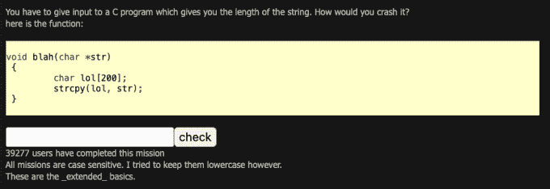
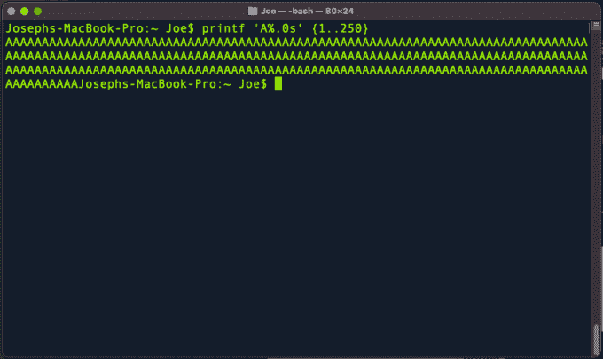
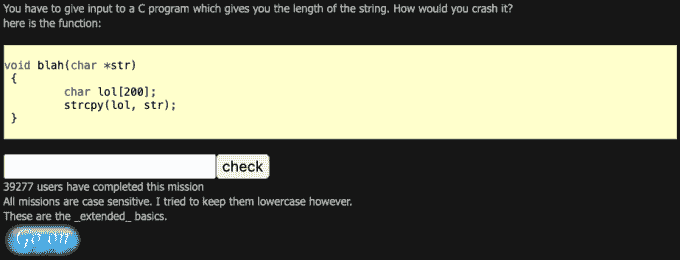

# 黑掉这个网站:扩展基础-任务 1

> 原文：<https://medium.com/geekculture/hack-this-site-extended-basic-mission-1-7027aa0babfd?source=collection_archive---------21----------------------->

Hack This Site: Extended Basic — Mission 1

大家好，欢迎来到[哈克斯](https://haxez.org/)，今天我们要看的是[黑掉这个网站](https://hackthissite.org/)扩展基本任务 1。这次任务的题目是“一遍又一遍？”并要求您执行缓冲区溢出来完成它。在导航到 mission 时，我们会看到一条消息，说明我们有一个 C 程序可以计算用户输入的长度。它继续解释我们需要使程序崩溃。它还为我们提供了应用程序的源代码。

Extended Basic Missions

# 任务 1 —源代码

我不会假装我了解 C 编程语言的来龙去脉。那是在我出生之前，所以我从来没有学过。然而，如果我们查看源代码，我们可以看到它使用 void 语句声明了一个独立的函数。此外，我们可以推断出字符限制为 200 个字符，如'`char lol [200]`'行所述。考虑到这一点，我们可以有把握地假设输入超过 200 个字符可能会导致错误。

The Source Code

# 任务 1 —缓冲区溢出

当发送给应用程序的数据比预期的多时，就会发生缓冲区溢出。本质上，程序的每个部分都有一个分配的系统内存量。如果向应用程序发送的数据超过了应用程序分配的内存，就会出现意外的结果。这可能会导致应用程序崩溃，但在某些情况下，它可能允许代码执行。然而，这个任务的目的是使应用程序崩溃。我们知道应用程序需要 200 个字符。因此，如果我们用终端使用'【T1]'生成 250 个字符并提交给应用程序，我们应该让它崩溃。

Terminal — Creating Payload

# 任务完成

现在，如果我们将该字符串复制并粘贴到应用程序提交框中，然后单击 submit，我们应该会看到它进行处理并完成任务。我们可以说任务完成了，因为它应该在输入表单下面生成一个蓝色的 Go On 按钮。

Mission Complete