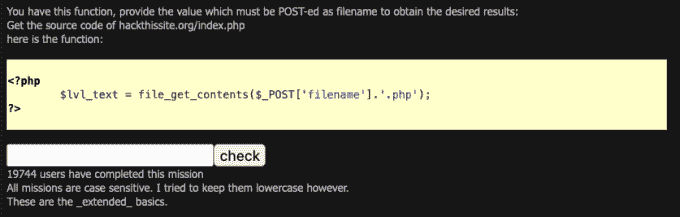
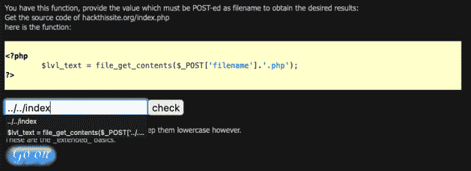

# 黑掉这个网站:扩展基础-任务 2

> 原文：<https://medium.com/geekculture/hack-this-site-extended-basic-mission-2-1bc91a788c58?source=collection_archive---------12----------------------->

Hack This Site: Extended Basic — Mission 2

你好朋友，欢迎来到[哈克斯](https://haxez.org/)，我们将在这里报道[黑掉这个网站](https://hackthissite.org/)扩展基本任务 2。如果您对应用程序结构有所了解，这个挑战是相当简单的。它要求我们稍微修改所提供的脚本，以便访问 web 应用程序根目录下的 index.php 页面。为了做到这一点，我们需要执行一个目录遍历来获取 index.html 页面。

# 该功能

正如你从下面的截图中看到的，我们有一些相当基本的 PHP 代码，试图获取由值'`filename`'指定的文件名的内容。此外，它指定了文件名的扩展名类型，在本例中是'【T1]'。在代码下面，我们有一个提交框，我们需要在这里提交挑战的解决方案。

The Function

# 解决方案

考虑到这几点，我们需要做的就是告诉脚本向上导航两个目录。我们目前在“`extbasic`”目录中查看名为 2“`/missions/extbasic/2`”的文件。因此，通过遍历两个目录，我们应该在根目录。在那里，我们需要指定'`index.php`'，然而文件扩展名'【T5]'已经被附加了，所以我们只需要指定单词 index。正确的解决方法应该是'`../../index`'。粘贴到检查表格，你应该完成任务，并能够进行下一个。

The Solution

# 扩展的基本任务 2 —结论

这是一个简单但有趣的挑战，它测试您对 web 应用程序目录结构的了解和代码阅读能力。虽然我不知道如何立即写下这些，但我很容易就明白了代码试图做什么。一旦你理解了代码在做什么，并且理解了任务的规则，那么事情就相当简单了。这种类型的攻击称为目录遍历攻击，可以通过验证用户输入和对目录实施严格的权限策略来防止。不管怎样，我希望这能帮你解决任务。