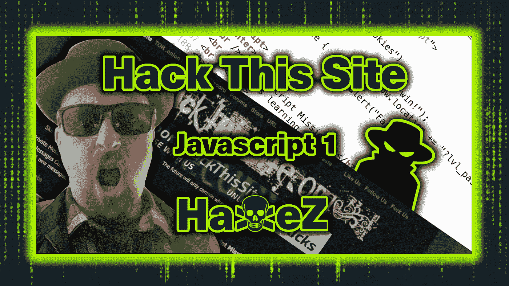
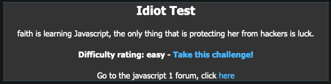
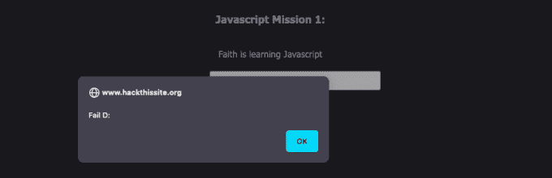
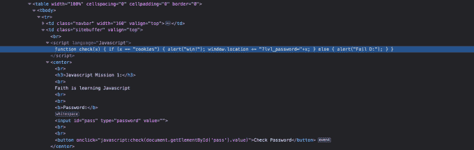
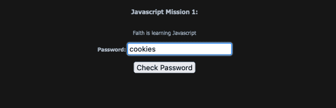

# 黑掉这个网站:Javascript 任务—第一级

> 原文：<https://medium.com/geekculture/hack-this-site-javascript-mission-level-1-36e32d19ac47?source=collection_archive---------10----------------------->

Hack This Site: Javascript Mission — Level 1

# 介绍

你好，环球网，欢迎来到独一无二的[哈克斯](https://haxez.org/)，我们将在[黑掉这个网站](https://hackthissite.org/)的基础上完成 Javascript 任务 1 级。我们刚刚完成了[现实任务](https://haxez.org/category/web/hack-this-site/realistic/)，我想是时候休息一下，做一些不那么紧张的事情了。所以事不宜迟，我们开始吧。在导航到任务时，我们得到一个标题，叫做白痴测试(我向你保证非常适合我)。根据我们掌握的信息，听起来带有小 f 的 Faith(已提交 bug 报告)正在学习 Javascript。我们去看看吧。

Idiot Test

# 测试 Javascript

当我们点击这个任务的链接时，会看到一个 Javascript Mission 1 的标题和一个密码提交表单。此外，如果我们在表单中输入数据(不正确的数据)，就会弹出一个 javascript 警告窗口，告诉我们失败了。通常，Javascript 是一种客户端语言(在用户的浏览器上运行)，我们不能拦截这个请求并强行使用它。这也意味着我们可以查看脚本，看看它在做什么。

You fail

# 分析 Javascript

如下所示，为了找出脚本在做什么，我们需要查看页面源代码并定位代码。总的来说，最快的方法是在密码表单内右键单击，然后单击 inspect。可以看到，这应该会直接将您带到驱动表单的代码。如下图所示，Javascript 代码正在检查变量'`x`'是否等于 cookies。如果该值等于 cookies，则会弹出一个警告框，提示“赢”。如果该值不等于 cookies，那么我们会弹出一个警告框，提示“失败”。

Page Source

# 用饼干贿赂

为了通过这个任务，我们需要做的就是将值 cookies 提交到密码提交表单中。是的，它真的很简单，甚至不需要理解代码就可以完成。因此，在密码提交表单中输入单词 cookies，然后单击 submit。

Cookies

正如承诺的那样，这样做后你会收到一个弹出框，声称你赢了。

You Win