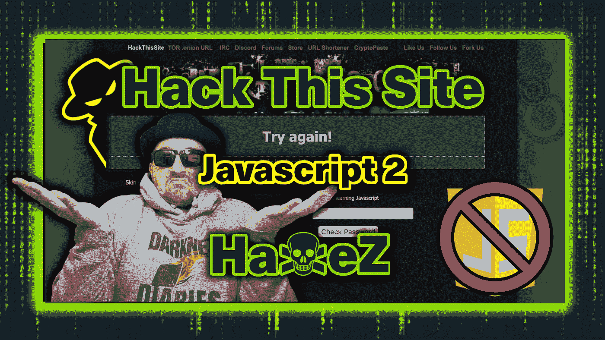
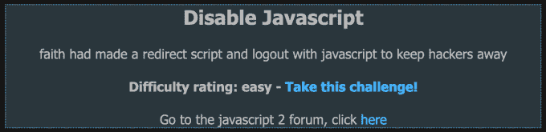
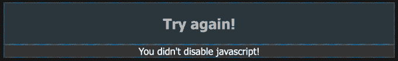
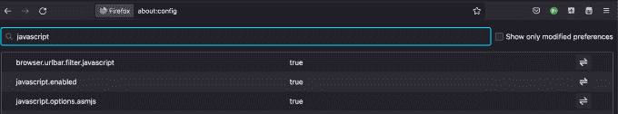
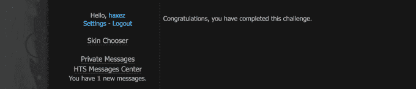

# 黑掉这个网站:Javascript 任务—第二级

> 原文：<https://medium.com/geekculture/hack-this-site-javascript-mission-level-2-f2ca7fdb59c?source=collection_archive---------9----------------------->

Hack This Site: Javascript Mission — Level 2

# 介绍

你好，环球网，欢迎来到[哈克斯](https://haxez.org/)，今天我们要看的是[黑掉这个网站](https://jhackthissite.org/) Javascript 任务 2。对于这个任务，我们只需要改变浏览器的设置或者安装一个插件。因此，我们禁用了允许我们完成任务的 Javascript。从下图可以看出，这个任务叫做禁用 Javascript，据说有一个重定向到注销黑客的脚本。

Disable Javascript

# 已启用脚本

因此，导航到任务会提示一条错误消息，说我们需要再试一次，因为我们没有禁用 Javascript。为了完成这个任务，我们需要禁用脚本不运行，我们没有得到“注销”。

Try Again

# 禁用 Javascript

为了禁用脚本，我们可以安装一个浏览器插件，或者我们可以前往我们的浏览器设置。我用的是 Firefox，所以我们需要的设置是在浏览器的`'about:config'.`中点击`about:config`，搜索 Javascript。您应该会看到一个值设置为 true 的已启用选项。单击小箭头图标，并将值更改为 false。有很多其他浏览器的指南，或者你可以在浏览器商店里搜索禁用它的插件。

Disabling Javascript

# 脚本已禁用

现在它被禁用了，我们可以回到任务中，点击“这里”超链接来完成任务。这一次您应该不会看到错误。您应该会看到另一个链接，上面写着“单击此处获胜”。单击该链接，您应该会看到下图，祝贺您完成挑战。

Scripting Disabled

# 结论

老实说，这个没什么好说的。教用户如何在浏览器中禁用和启用客户端脚本是一个很好的任务。客户端脚本是许多攻击的罪魁祸首，如跨站脚本(XSS ),当与其他漏洞结合在一起时，会导致许多问题。无论如何，我已经尽可能地把这个帖子发出去了，但是我能说的已经不多了…谢谢你的阅读。