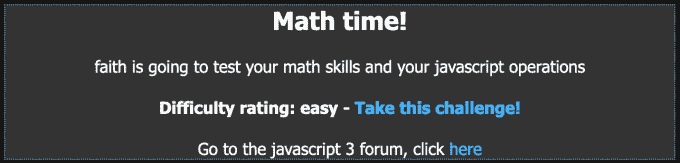
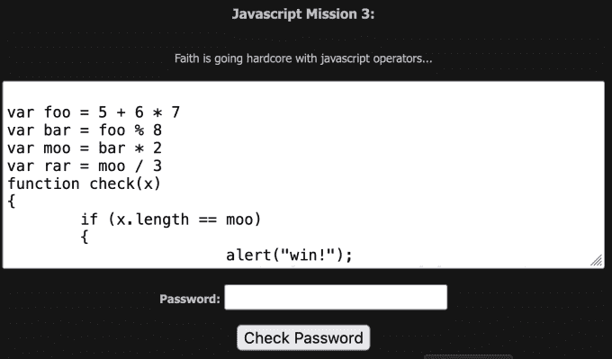

# 黑掉这个网站:Javascript 任务—第三级

> 原文：<https://medium.com/geekculture/hack-this-site-javascript-mission-level-3-d0a042b5198d?source=collection_archive---------8----------------------->

Hack This Site: Javascript Mission — Level 3

# 介绍

你好，互联网，欢迎来到 [HaXeZ](https://haxez.org/) ，今天我们将解决[黑掉这个网站](https://hackthissite.org/)的第三个 Javascript 任务。你怎么评价我都行，但我必须承认我从这次挑战中学到了很多。我在学校的时间不太理想，所以我不经常去。不幸的是，这意味着我错过了很多重要的科目，包括数学。直到今天我才听说过 BODMAS，我已经 35 岁了。我不知道自己是如何在不知情的情况下在计算机领域走到这一步的。这个挑战相当简单，只要你知道变量是如何工作的，并且懂数学。

Math Time

# Javascript

查看下面的代码，我们可以看到我们需要提交一个与变量'`moo`'的值长度相同的密码。我们之所以知道这一点，是因为 if 语句需要'【T1]'来通知我们已经赢得了任务。为了得到“`moo`”的值，我们需要执行一些计算来计算出该值。

The Javascript

# 数学

好吧，让我们来分解一下数学。

因为 BODMAS 计算是 6 * 7 + 5，所以'【T3]'的值是 47。

“`bar`的值是 7，因为它是 47 除以 8 的余数

因此，'`moo`'的值是 14，因为'`bar`'的值是 7，'`moo`'的值是'`bar` ' * 2。

我们可以丢弃'`rar`'的值，因为在计算过程中任何地方都没有使用'`rar`'。因此，我们只剩下值 14。我们知道密码提交表单要求我们的输入长度与'`moo`'相同。本质上，我们应该能够提交任意 14 个字符来完成任务。

The Mathematics

# 恭喜

在向密码提交表单提交 14 个字符后，您应该完成挑战。这就是全部了。然而，如果你不知道 BODMAS，我不知道，如果你不知道编程中的百分号意味着模或余数，那就很难了。

Congratulations