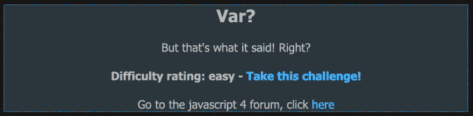
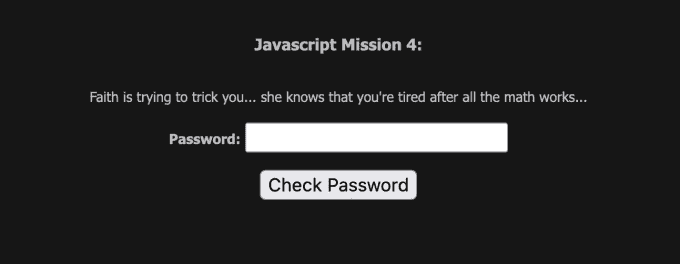
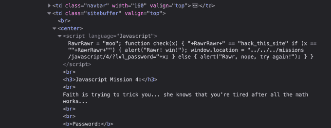
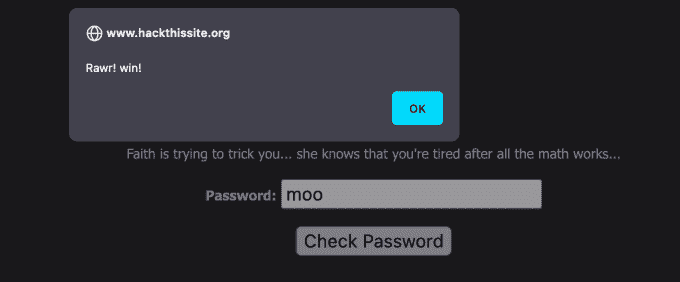

# 黑掉这个网站:Javascript 任务—第 4 级

> 原文：<https://medium.com/geekculture/hack-this-site-javascript-mission-level-4-1d895ba1fc58?source=collection_archive---------13----------------------->

Hack This Site: Javascript Mission — Level 4

# 介绍

你好，互联网，欢迎来到 [HaXeZ](https://haxez.org/) ，今天我们将解决[黑掉这个网站](https://hackthissite.org/) Javascript 任务 4。由于 Javascript 的编写方式，这个任务有点欺骗性。换句话说，这个任务有意地试图欺骗您，让您认为变量的值是另外一个值。然而，我们对细节的敏锐关注足以完成任务。

Javascript 4

# 任务

这个任务叫做 Var，我们可以推导出，意味着我们又要处理变量了。从下面的图片可以看出，这条信息写着“Faith 正在试图欺骗你…她知道你在所有的数学工作之后累了”。总而言之，费思打算尝试一些诡计来阻止我们完成这项任务。我们可以用随机数据测试表单，看看会发生什么，但是正如我们所料，我们只是得到一个警告，通知我们这是不正确的。

The Mission

# Javascript

如果我们检查页面，我们可以看到支持该功能的脚本。这是第一个骗局出现的地方。如果您查看页面源代码而不是检查元素，您可能不会注意到正在设置第一个变量。下图显示第一个变量被设置在最右边。不过，可能太小了，看不清。

Hidden Moo

但是，如果我们检查该脚本，您会看到在脚本的最开始，我们可以看到值'`moo`'被分配给变量'`RawrRawr`'。接下来，我们可以看到一个名为“`x`”的函数被创建，其中“`hack_this_site`”的值被添加到变量“`+RawrRawr+`”中。话又说回来，也许不是。如果我们看看'`moo`'是如何分配给'【T6]'的，我们只会看到一个等号。在 javascript 中， [double equals](https://www.w3schools.com/js/js_comparisons.asp) 符号充当比较两个值的运算符，所以这里发生的只是将“`hack_this_site`”与“`RawrRawr`”进行比较。

The Javascript

# 解决方案

'`RawrRawr`'的值还是 moo，接下来看看脚本怎么做吧。该脚本有一个 if 语句，将'`x`'与两个语音标记之间的空值加上'`RawrRawr`'的值进行比较。所以从本质上来说，这个脚本是在检查'`x`'的值，而不是检查'`moo`'的值，因为'`moo`'是更早设置的。所以完成任务的密码应该是 moo。在框中输入，然后单击提交进行评分。

The Solution