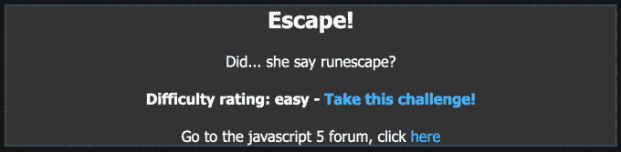
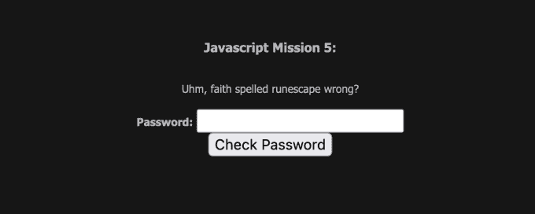
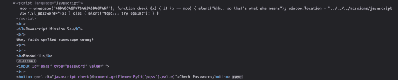
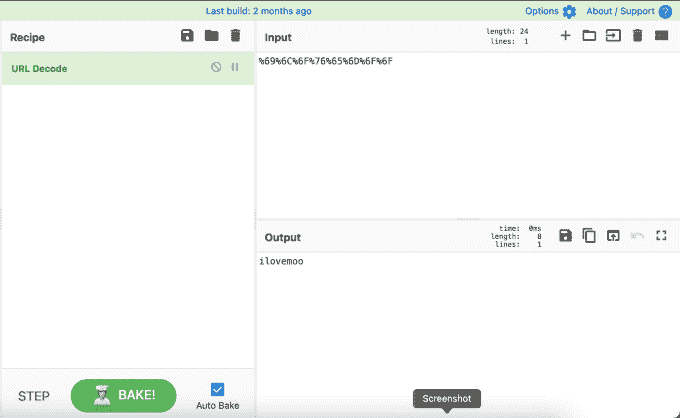
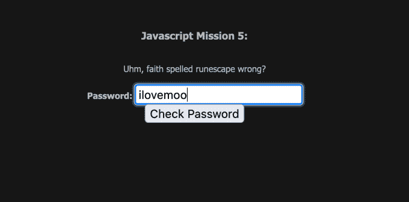
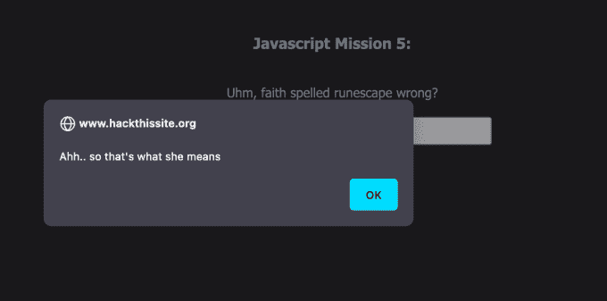

# 黑掉这个网站:Javascript 任务—第 5 级

> 原文：<https://medium.com/geekculture/hack-this-site-javascript-mission-level-5-a3c8f7d3d7c1?source=collection_archive---------10----------------------->

Hack This Site: Javascript Mission — Level 5

# 介绍

你好，环球网，欢迎来到 [HaXeZ](https://haxez.org/) ，今天我们将在 [Hack This Site](https://hackthissite.org/) 上学习 Javascript Mission 5。这个任务非常有趣，甚至给了我一个借口来使用 GCHQ CyberChef 工具解密一些编码文本。如果你知道如何处理你找到的数据，这个任务相当简单。

Escape

# 任务

在导航到任务时，我们看到了一个密码输入表单和一些询问 Faith 是否拼错了 Runescape 的文字。这要晚一些，因为它引用了一个用于编码或解码文本的 Javascript 函数。我们可以在密码表单中输入一些文本并提交，但是如果没有正确的文本，我们会收到一条错误消息，通知我们密码是错误的。

The Mission

# Javascript

但是，如果我们检查密码表单或查看页面源代码，我们可以看到 Javascript。此外，脚本的第一部分声明了一个名为'【T0]'的变量，并说它等于 unescape。函数的作用是:计算一个新的字符串，其中的十六进制转义序列被它所代表的字符所替换。除了声明变量'`moo`'和' unescape '函数，我们还有下面的编码字符串'`%69%6C%6F%76%65%6D%6F%6F`'。

The Javascript

# Javascript 去泡沫

为了解码字符串，我们可以使用我们最喜欢的政府开发的解码工具， [CyberChef](https://gchq.github.io/) 。令人惊讶的是，考虑到它来自公共部门(请不要逮捕我)，CyberChef 工作得真的很好。从下图可以看出，界面很简单。你选择一个食谱，然后粘贴你的编码文本，然后它就会发挥它的魔力，为你解码。它甚至有一个神奇的配方，可以自动检测你输入的内容。这真的是一个伟大的应用。

CyberChef

# 解决方案

如上图所示，解码后的文本是“`ilovemoo`”。如果你把它提交给密码表单，那么你就应该完成任务。

ilovemoo

恭喜你，你已经完成了 Javascript 任务 5。

Congratulations