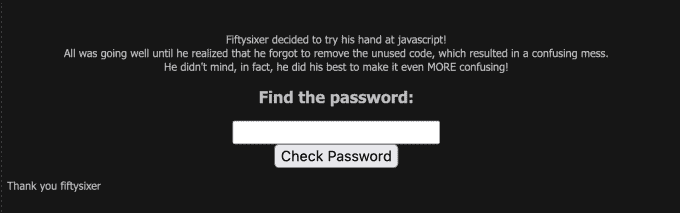
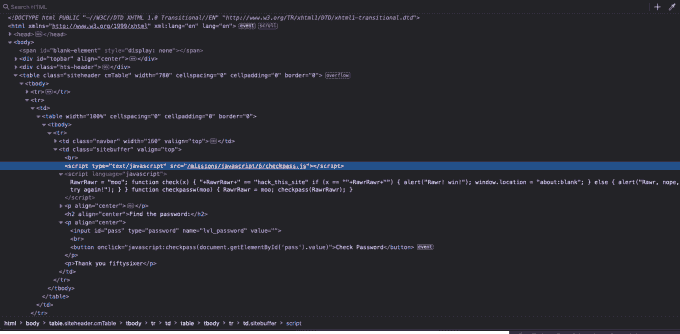
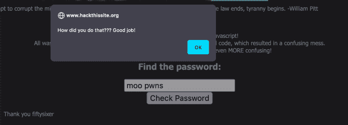

# 黑掉这个网站:Javascript 任务—第 6 级

> 原文：<https://medium.com/geekculture/hack-this-site-javascript-mission-level-6-3cc314717515?source=collection_archive---------22----------------------->


Hack This Site: Javascript Mission — Level 6

朋友们好，欢迎来到 [HaXeZ](https://haxez.org/) ，今天我们将在 [Hack 这个网站](https://hackthissite.org/)上解决 Javascript 任务 6。只要你注意细节，这个挑战并不太难。这个任务从以前的任务中提取剧本，并试图用它来分散你的注意力。但是，隐藏在应用程序的另一个页面上的是用于身份验证的正确脚本。


go go away .js

# 任务

导航到任务，我们看到预期的密码提交表单。然而，这次我们看到的不是 Faith，而是一条消息，说 Fiftysixer 已经决定尝试创建一些 Javascript。这说明他忘记删除之前的代码了。这使得新代码更加混乱，但显然，56 xer 喜欢这样。我们可以向表单提交测试数据，但是我们得到一个不正确的错误消息。



The Password Form

# Javascript

如果我们查看 Javascript，我们可以看到它看起来很像我们之前任务的脚本。这个脚本试图通过比较变量和字符串来欺骗我们，而不是将字符串赋给变量。这个任务的解决方案是“`moo'`”。但是，如果我们将'`moo`'提交给密码表单，我们仍然会得到一个不正确的错误消息。值得注意的是，这里有一个链接，似乎是另一个名为 checkpass.js 的 Javascript 文件。



The Javascript

# 真正的 Javascript

如果我们导航到 URL 中的脚本，我们可以看到它确实是检查密码的正确脚本。从下图中可以看出，javascript 声明了三个变量并给它们赋值。

```
dairycow="moo";
moo = "pwns";
rawr = "moo";
```

我不太熟悉 Javascript 语法，但是我想知道'【T2]'声明中缺少空格是否有任何意义。在变量声明之后，我们有一个函数来检查密码。它声明，如果用户提交的值与'`rawr`'和'`moo`'的值相同，那么我们就赢了。否则我们就输了。需要注意的是'`rawr`'和'`moo`'之间也有语音标记，所以我们需要确保在提交的内容中有一个空格。


The Real Javascript

# 解决方案

所以这就是我们解决任务所需要做的。提交'`moo pwns`'作为密码，你应该完成任务。恭喜你。



How did you do that