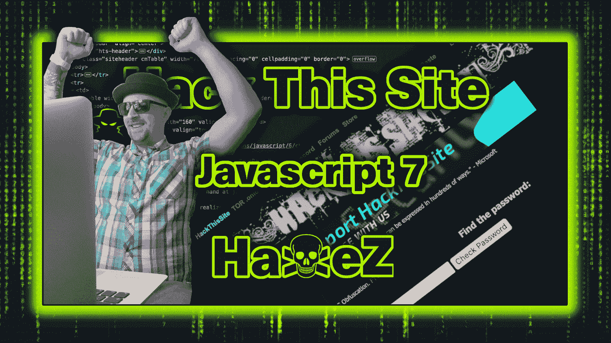
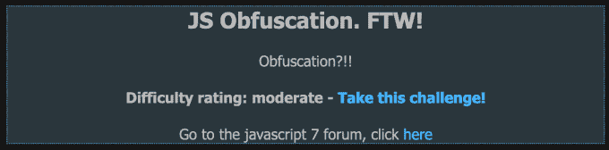
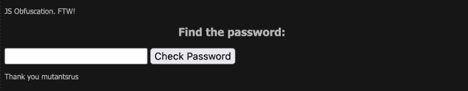
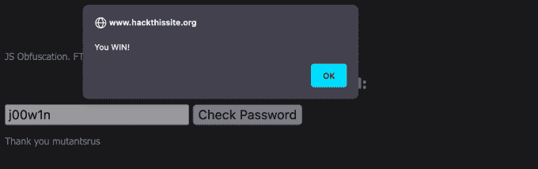
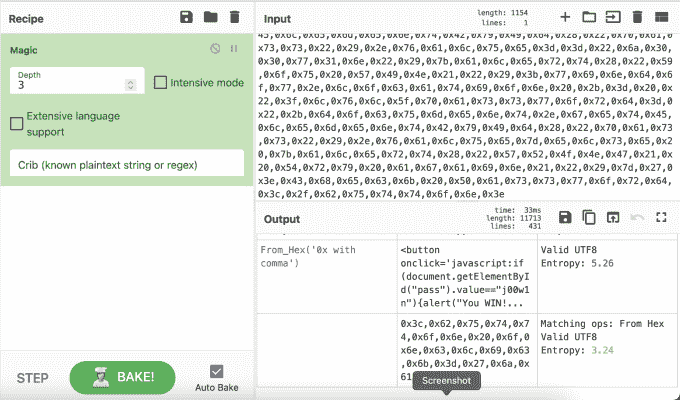

# 黑掉这个网站:Javascript 任务—第 7 级

> 原文：<https://medium.com/geekculture/hack-this-site-javascript-mission-level-7-7f5db508cd51?source=collection_archive---------23----------------------->

Hack This Site: Javascript Mission — Level 7

做得好，哈克斯的朋友们，我们做到了，我们成功完成了[黑掉这个网站](https://hackthissite.org/)的最后一个 Javascript 任务。在完成了所有其他任务后，我感觉自己成了一名脚本专家。好吧，也许不是，但进步就是进步。此外，一旦我们完成了这个任务，我们可以继续其他更令人兴奋的任务。这次任务很像我们之前的一次任务。然而，这次不是对密码进行编码或混淆，而是对整个脚本进行混淆。

JS Obfuscation FTW

# 介绍

导航到任务，我们可以看到一个密码输入表单。除了标题和对创作者的感谢之外，没有比这更多的信息了。如果我们向密码输入表单提交测试数据，那么我们将得到一个不正确的错误消息。为了了解发生了什么，我们需要查看应用程序的页面源代码。

Password Submission Form

# Javascript

从下图可以看出，该脚本似乎是乱码数据。都是 X 后面跟着两位数。我们可以尝试在线解码，但有一个简单得多的解决方案。我们所需要做的就是右键单击 Check Password 按钮并检查其背后的功能。

Obfuscated Javascript

# 按钮 Javascript

正如你从下面的截图中看到的，检查按钮向我们展示了驱动它的 Javascript。Javascript 正在检查用户提交的值'`pass`'是否与值'`j00w1n`'匹配。如果值匹配，那么我们得到一个警告说“你赢了！”。如果不匹配，我们会收到一条消息说“错误！再试一次”。

The Button — Javascript

# 解决方案

所以，为了完成这个使命，为了完成 Javascript 系列。你所需要做的就是将值'【T2]'提交到密码表单中。正如你在下图中看到的，我们得到了一个警告框，告诉我们已经成功完成了任务。

The Solution

# 警报方法

我敢肯定，开发人员并没有打算让这个任务这么容易。我完全相信他们想让我们解开密码。因此，下面的截图显示了我使用 GCHQ 工具 CyberChef 对代码进行解密。从截图中可以看到，输出显示了带有密码的按钮值。

CyberChef