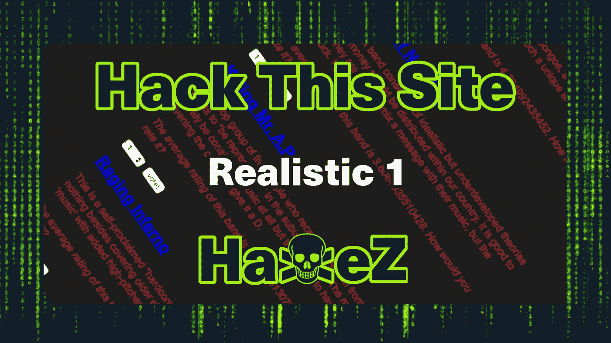
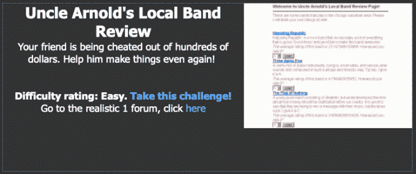
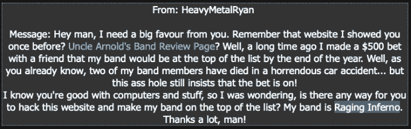
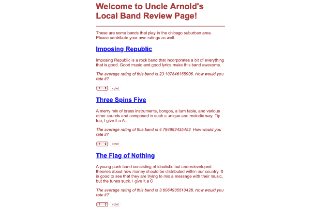
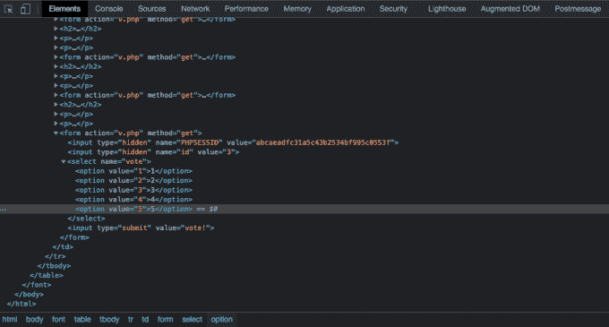
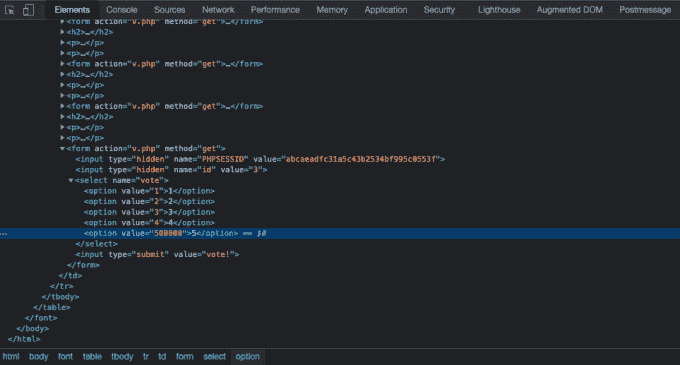
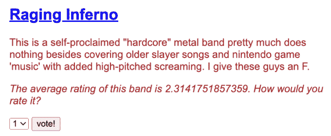

# 黑掉这个网站:现实的网络任务—1 级

> 原文：<https://medium.com/geekculture/hack-this-site-realistic-web-mission-level-1-5e9154fa0a0d?source=collection_archive---------15----------------------->

Hack This Site: Realistic Web Mission — Level 1

今天我们来看看[黑掉这个网站](https://hackthissite.org/)现实网络任务 1 级。这项任务要求黑客修改 web 应用程序的源代码，以修改其行为。黑客背后的原因是为了提高乐队“狂暴地狱”的排名。这个黑客使用了一个类似于基本任务的技术，在这个任务中，我们必须修改 Sam 的电子邮件地址来给我们自己发送电子邮件。如果你想看我关于基本任务的帖子，你可以在这里[看。](https://haxez.org/category/web/hack-this-site/hack-this-site-basic-missions/)

Uncle Arnold’s Local Band Review

导航到现实任务 1，你会看到一条来自 HeavyMetalRyan 的消息，他解释说他打赌他的乐队会排名第一。不幸的是，他的两名乐队成员在一次事故中丧生，但与他打赌的人坚持打赌仍在继续。HeavyMetalRyan 希望我们黑掉网络应用程序，这样他的乐队就能在排行榜上名列前茅。

Message from HeavyMetalRyan

# 探索 Web 应用程序

该应用程序的功能似乎是基本的。每个波段都会列出，旁边有一个投票选项。投票选项允许用户提交一个介于 1 到 5 之间的分数。除了与乐队的链接，应用程序上似乎没有任何其他功能。

Exploring The Application

HeavyMetalRyan 在他的信息中说，他的乐队叫做“愤怒的地狱”。到目前为止，他们似乎没有得到最多的好评。使用投票系统似乎是将所选号码的值提交回服务器。为了破解应用程序，我们需要查看页面源代码。

# 网络应用黑客

为了“黑掉”应用程序，我们需要在提交投票之前查看页面源代码并进行一些修改。在许多浏览器中，这可以通过右键单击页面并从上下文菜单中选择“查看源代码”来完成。下图显示了修改前的页面源代码。您可以看到选项 5 的值为 5。当按下投票按钮时，数值 5 将被记录为投票。

Web Application Source Code

为了完成这个挑战，我们需要将值 5 修改为一个更大的值。这意味着当单击投票按钮时，将提交较高的值，而不是值 5。下图显示了修改后的页面源代码。

Manipulating The Source Code

修改值后，我们可以选择已经修改的选项，然后单击“投票”按钮。这应该会将修改后的值发送回服务器，而不是最初想要的值。

Casting The Vote

提交投票后，您应该已经完成了挑战。我希望你喜欢这篇文章，但如果你更喜欢看演示，请查看视频。