# 黑掉这个网站:现实的网络任务——10 级

> 原文：<https://medium.com/geekculture/hack-this-site-realistic-web-mission-level-10-a2ee5e525a7c?source=collection_archive---------13----------------------->


Hack This Site: Realistic Web Mission — Level 10

哦，你好，真想不到在这里见到你。今天我们来看看[黑掉这个网站](https://hackthissite.org/)现实网络任务 10。换句话说，我们将演示如何不实现认证机制。总的来说，这次任务很有趣。它需要从公开列出的教师名单中创建一个单词表。然后，我们使用这个单词表来暴力破解登录页面，以访问人员控制面板。登录后，我们必须通过修改 cookies 来将自己标记为管理员。然后，我们修改了一个帖子请求来更改成绩。如果你没有看过我在现实系列上的其他帖子，你可以在这里看到:[第一部分](https://haxez.org/2021/09/hack-this-site-realistic-web-missions-level-1/)、[第二部分](https://haxez.org/2021/09/hack-this-site-realistic-web-mission-level-2/)、[第三部分](https://haxez.org/2021/09/hack-this-site-realistic-web-mission-level-3/)、[第四部分](https://haxez.org/2021/09/hack-this-site-realistic-web-mission-level-4/)、[第五部分](https://haxez.org/2021/09/hack-this-site-realistic-web-mission-level-5/)、[第六部分](https://haxez.org/2021/09/hack-this-site-realistic-web-mission-level-6/)、[第七部分](https://haxez.org/2021/10/hack-this-site-realistic-web-mission-level-7/)和[第八部分](https://haxez.org/2021/10/hack-this-site-realistic-web-mission-level-8/)


Holy Word High School

# 介绍

可怜的扎克·桑切斯在学校过得很艰难。其实他不一定能毕业，因为成绩太差了。因此，他给我们发信息，询问我们是否可以侵入他学校的在线成绩数据库，更改他的成绩。此外，他还向我们提供了他的用户名和密码，让我们可以探索这个应用程序。

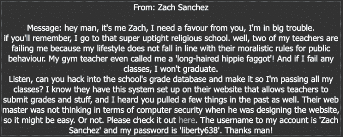

Message From Zach Sanchez

# 探索 Web 应用程序

这个应用程序相当简单，它在页面顶部有三个链接，在页面中间有一个链接。从下图可以看出，它没有太多的功能。例如,“主页”按钮让您返回主页，员工列表让您看到用户列表，学生访问系统让您看到登录页面。


Web Application — Holy Word High School

如果我们单击学生访问系统，就会出现一个登录页面，要求输入用户名和密码。Zach 向我们提供了他的登录凭证，所以让我们测试一下，看看它能让我们访问什么。

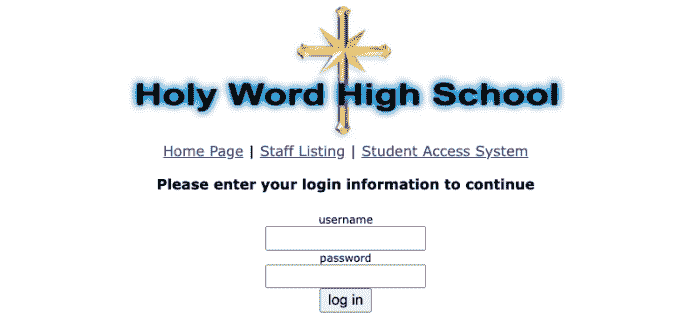

Web Application — Authentication Mechanism

以 Zach 的身份登录后，我们并没有获得很多增加的功能。如下图所示，我们可以查看他的班级、他的成绩以及老师留下的任何评论。我们在这没什么能改变他的成绩。

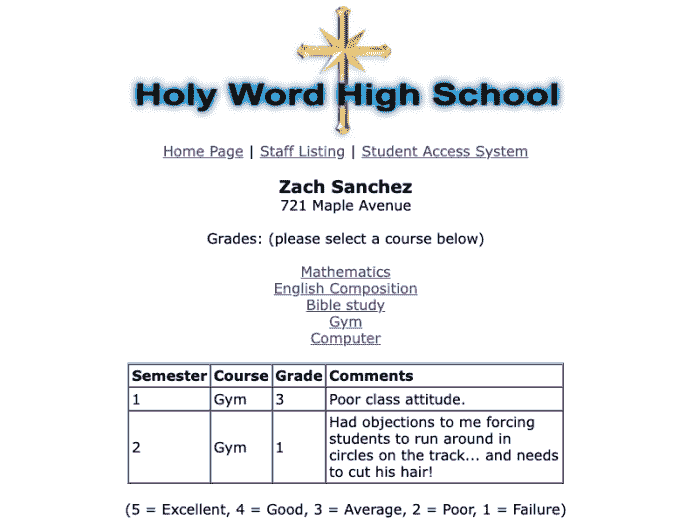

Zach Grades

如果我们返回主页，查看应用程序的页面源代码，就会发现有一个对主页上没有显示的页面的引用。值得注意的是，该页面被命名为 staff，这表明它可能是工作人员用来登录的页面。也许我们可以使用此页面来访问和更改 Zach 的分数。

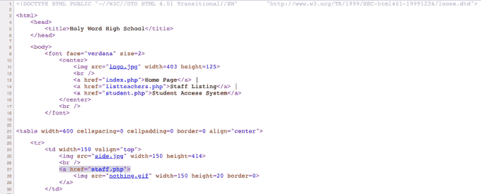

Web Application — Page Source

# Web 应用程序暴力

当访问 staff.php 页面时，我们会看到一个登录表单。虽然我们有一个登录页面，但我们没有任何用于登录的凭据。我已经详细研究了这个应用程序，但没有找到任何其他信息。

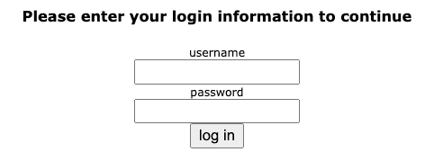

Staff Authentication

但是，我们在教师列表页面上有一份员工名单。记住这一点，也许我们可以使用这个列表来识别应用程序的真正用户。首先，我将用户的名和姓复制到一个文本文件中，并保存为 usernames.txt。

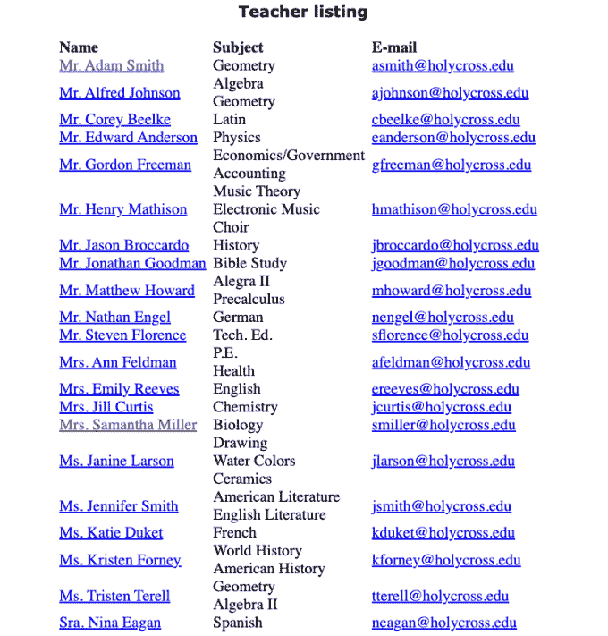

Teacher Listing

接下来，我从 GitHub 克隆了[用户名-无政府状态](https://github.com/urbanadventurer/username-anarchy)库。一下载完存储库，我就告诉它使用名和姓、名和姓以及其他一些组合来生成一个单词表。然后我保存了结果。

```
Josephs-MacBook-Pro:username-anarchy Joe$ sudo ./username-anarchy --input-file /Users/Joe/Desktop/usernames.txt --select-format first,first.last,f.last,flast
adam
adam.smith
a.smith
asmith
alfred
alfred.johnson
a.johnson
ajohnson
corey
corey.beelke
c.beelke
cbeelke
edward
edward.anderson
e.anderson
eanderson
gordon
gordon.freeman
g.freeman
gfreeman
henry
henry.mathison
h.mathison
hmathison
```

然后，我刷新登录页面，用 Burp Suite 捕获登录请求。一旦请求被捕获，我就把它发送给入侵者工具。然后，我删除了自动生成的有效负载位置，突出显示了用户名和密码参数值，并添加了有效负载位置。

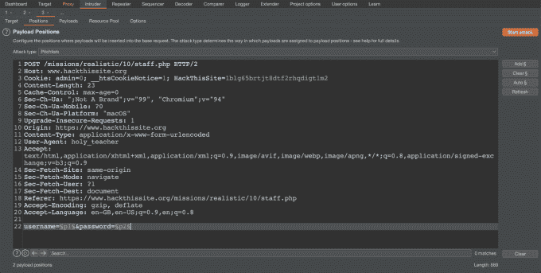

Burp — Intruder

# 发起攻击

我选择了攻击类型，然后将单词列表中的值粘贴到 payloads 选项卡上的位置 1 和 2。攻击准备就绪后，我点击了启动攻击按钮。

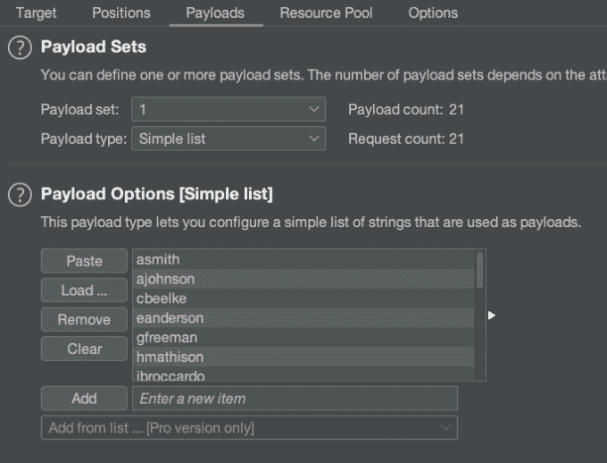

Burp — Brute Force

等了一会儿后，我们找到了正确的用户名和密码组合。正如您在下图中看到的，当提交正确的凭证时，来自应用程序的响应长度是不同的。当提交不正确的凭据时，响应长度都相同(1876)。这是因为来自服务器的响应是相同的。然而，当提交正确的凭证时，响应长度是不同的，因为它正在加载页面。

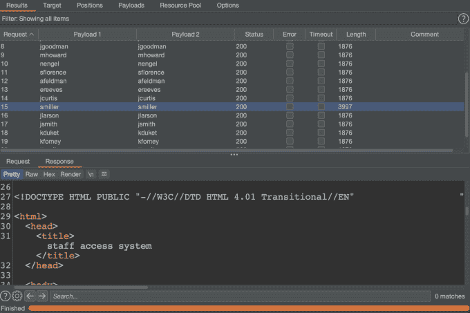

Burp Intruder — Results

# 登录

有了正确的凭证，我们现在可以以 Samantha Miller 的身份登录员工区。该应用程序的这一区域似乎为我们提供了更多的功能，但不幸的是，我们对它的访问受到限制，因为我们不是管理员。

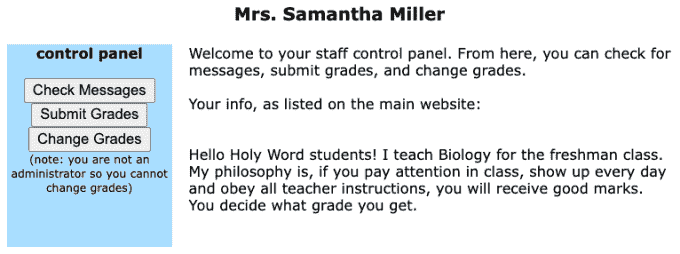

Staff — Control Panel

为了将我们的权限提升到管理员权限，我们需要检查页面并查看我们的 cookies。我们可以用打嗝来拦截请求，并为每个请求更改它们，但这将使我们的生活更加困难。下图说明了如何将 admin cookie 的值从 0 更改为 1。

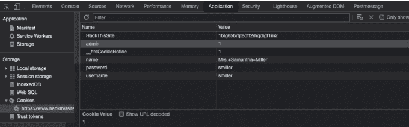

Web Application — Cookies

# 改变等级

现在我们拥有管理员权限，可以访问“更改等级”选项。不幸的是，现在改成绩已经太晚了，因为成绩马上就要寄出去了。然而，如果我们查看应用程序的源代码，我们可以看到有一个 POST 方法，其中包括一个 change grades 函数。

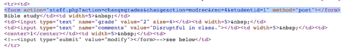

Web Application — Page Source

如果我们复制 POST 请求并稍加修改，我们可以将其发送到 Burp Repeater 并使用它来更改成绩。下面的代码片段显示了 post 请求，需要修改的值以粗体突出显示。将等级值更改为 5，然后将 rec 值更改为 0 并发送请求，然后将 rec 值增加 1 并再次发送请求。

```
staff.php?action=changegrades&changeaction=modrec**&rec=**1&studentid=1&**grade=5**
```

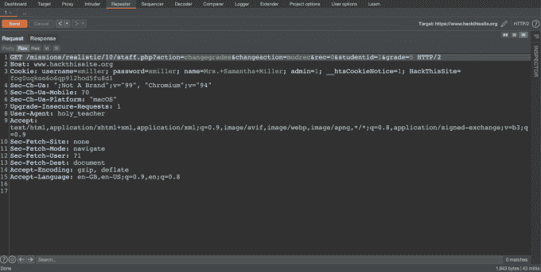

Burp — Repeater

您可以继续修改和发送请求，直到响应从提交的等级变为完成任务的祝贺消息。

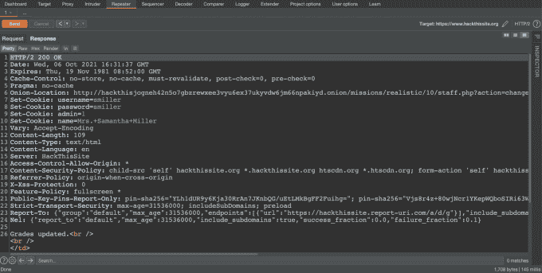

Burp Response — Grades Updated

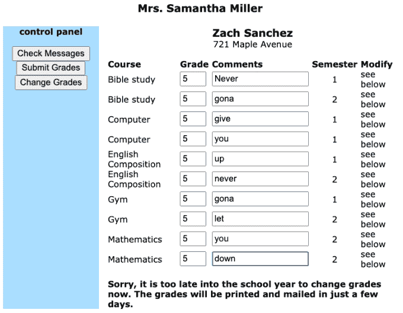

Web Application — Grades Updated

就这样，你应该完成了信息。

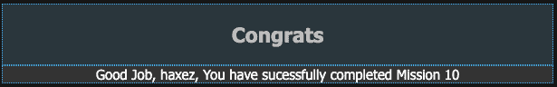

Congratulations