# 黑掉这个网站:现实的网络任务——11 级

> 原文：<https://medium.com/geekculture/hack-this-site-realistic-web-mission-level-11-302e0a64c02f?source=collection_archive---------11----------------------->


你好，谢谢光临哈克斯。今天我们来看看[黑掉这个网站](https://hackthissite.org/)现实网络任务 11 级。我不像其他人那样喜欢这个挑战。原因是因为任务不再按预期进行。我怀疑这可能是由于浏览器安全性的改进或应用程序的更改。这个挑战最初要求你通过一个用户代理来窃取 cookies。然而，情况似乎不再如此。如果你没有看过我在现实系列上的其他帖子，你可以在这里看到:[第一部分](https://haxez.org/2021/09/hack-this-site-realistic-web-missions-level-1/)、[第二部分](https://haxez.org/2021/09/hack-this-site-realistic-web-mission-level-2/)、[第三部分](https://haxez.org/2021/09/hack-this-site-realistic-web-mission-level-3/)、[第四部分](https://haxez.org/2021/09/hack-this-site-realistic-web-mission-level-4/)、[第五部分](https://haxez.org/2021/09/hack-this-site-realistic-web-mission-level-5/)、[第六部分](https://haxez.org/2021/09/hack-this-site-realistic-web-mission-level-6/)、[第七部分](https://haxez.org/2021/10/hack-this-site-realistic-web-mission-level-7/)和[第八部分](https://haxez.org/2021/10/hack-this-site-realistic-web-mission-level-8/)


BudgetServ Web Hosting

# 介绍

我们收到了来自 Space46 的消息，他解释说他们的 ISP 已经暂停了他们的网络应用程序，因为他们怀疑他们入侵了服务器上的另一个网站。他要求我们恢复他的网站的备份，该网站仍然托管在服务器上。备份的文件名是“src.tar.gz”。

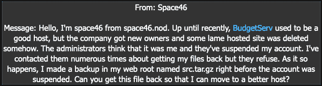

Message From Space46

# 探索 Web 应用程序

导航到 web 应用程序，我们可以看到它看起来像一个基本的主机提供商的网站。有很多导航选项，但没有一个链接到任何有趣的东西。如果我们找不到其他任何东西，我们可以尝试暴力破解一个网络邮件页面。

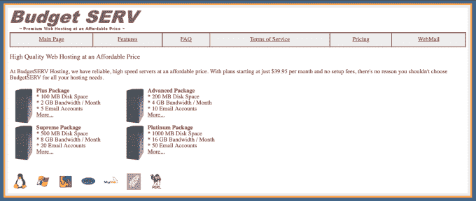

Web Application — Budget Serv

# 操作系统命令注入

引起我注意的一件事是应用程序调用页面的方式。似乎有一个 Perl 脚本正在用 page 参数调用不同的文件。您可以在下面看到一个调用特性页面的 Perl 脚本示例。

```
[https://www.hackthissite.org/missions/realistic/11/**page.pl?page=features**](https://www.hackthissite.org/missions/realistic/11/page.pl?page=features)
```

我们可以尝试利用这一功能，通过将 page 参数的值更改为 Linux 操作系统命令来利用它。在本例中，我们将使用 ls 命令列出当前目录的内容。

```
[https://www.hackthissite.org/missions/realistic/11/**page.pl?page=|ls|**](https://www.hackthissite.org/missions/realistic/11/page.pl?page=|ls|)
```

从下面的截图中可以看到，这个命令起作用了，我们可以看到目录的内容。我们应该记下列出的所有文件，因为它们将来可能会对我们有所帮助。

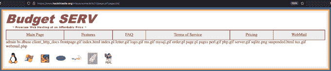

Web Application — OS Command Injection

# 进一步探索

OS 命令注入的结果显示了一个管理目录。导航到该目录会显示一个登录页面。不幸的是，我们还没有任何证书，所以我们将继续探索 web 应用程序。

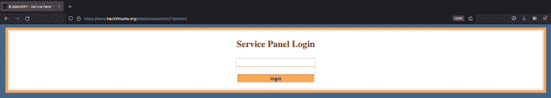

Admin Log In Page

清单中的下一个文件是一个“bs.dbase”文件，它似乎是一个数据库文件。不用说，我们无法访问它，但我们应该记住这个名称，以便以后使用。下一个目录是“client_http_docs”目录，该目录似乎包含所有托管的 web 应用程序。导航到这个目录会显示许多目录列表，包括 space46。遗憾的是，试图访问这个目录会产生一条错误消息，通知我们应用程序已被挂起。

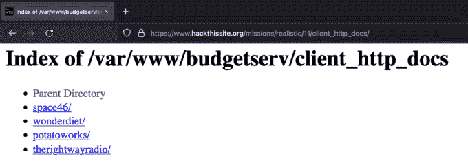

Directory Listing

其他目录似乎服务于其他应用程序。其中一个应用是神奇饮食，如下图所示。另一个是关于仍在建造中的马铃薯。浏览这些应用程序并没有提供太多我们可以利用的东西。

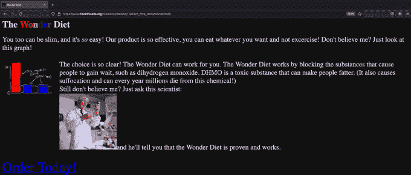

The Wonder Diet

# 合适的 Web 应用程序

rightwayradio 目录包含看起来像是一个广播 web 应用程序的内容。它似乎有一些基本的功能，包括一个登录表单。还有一条关于登陆年龄的消息来自用户“rsmith”。如果我们点击那个用户，它会把我们带到关于那个用户的“用户信息”页面。

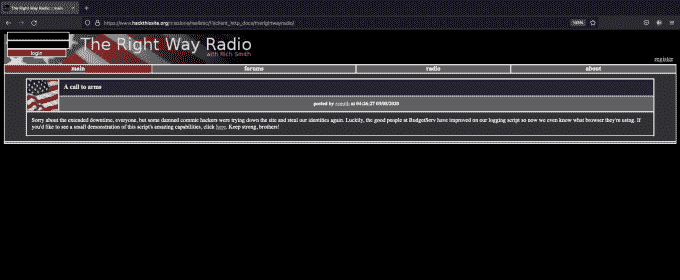

The Right Way Radio

# 利用 Web 应用程序用户

如果我们查看 URL，我们可以推断出用户页面是由 userinfo 脚本中的 id 参数调用的。此外，我们可以看到用户“rsmith”的用户 id 为-1。如果我们试验这个参数，我们可以检索其他用户的信息。

```
client_http_docs/therightwayradio/?page=userinfo&**id=-1**
```

通过将参数值从-1 更改为 0，我们可以检索用户“aclu_bomber_08290”的页面。从下图可以看出，我们还能够更改该用户的密码。起初，我认为这是荒谬的，因为我们没有认证。然而，我已经看到了很多奇怪的应用程序行为，所以这不应该让我感到惊讶。

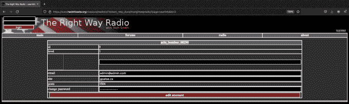

Changing Password

# Web 应用程序 SQL 功能

更改用户密码后，我们可以登录他们的帐户。他们的帐户似乎可以访问一个审核页面，该页面有一个用于 SQL 查询的输入框。从我们的 OS 命令注入中，我们还知道有一个名为 bs.dbase 的数据库文件。

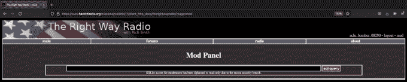

SQL Query

如果我们查看应用程序的页面源代码，我们可以看到有一个名为 sql_db 的隐藏参数，其值为 rwr.dbase。这不是我们想要查询的数据库。

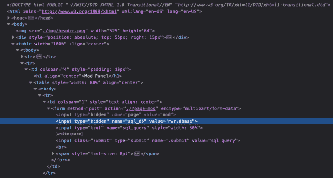

Web Application — Page Source

但是，我们可以修改参数，告诉它查询我们想要查询的数据库。我们还知道数据库的位置，因为我们的 OS 命令注入是在应用程序的根目录中运行的。通过修改参数并告诉它向上移动三个目录，我们应该能够查询主数据库。

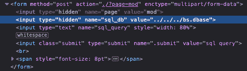

Changing Value

# 转储 Web 用户

因为这是一个 SQL Lite 数据库，所以我们需要查询 sqlite_master 表来找出数据库中保存了哪些表。我们可以通过运行下面的命令来做到这一点。我已经包含了输出，它通知我们有一个名为 web_hosting 的表。

```
SELECT name FROM sqlite_master WHERE type ='table';name
web_hosting
```

接下来，我们可以告诉数据库转储 web_hosting 表的全部内容。

```
SELECT * FROM web_hosting;
```

正如你从截图中看到的，我们能够得到一个用户列表，密码，电子邮件地址和他们的 web_package 标识符。我们可以从这些信息中看到，用户 wonderdiet 似乎是管理员用户。他们的 web_package id 是 1，这表明他们的站点是第一个创建的站点。此外，他们的电子邮件地址中有 admin。


Users and Passwords Returned

# 访问管理区

如果我们回到之前发现的管理区域。我们现在应该可以用 wonderdiet web 用户和他们的密码 suckereveryminute 登录了。一旦登录到管理区，我们有许多选项，包括下载文件的能力。

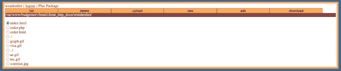

Admin Area

通过单击下载链接，我们将被重定向到一个页面，该页面显示正在下载的文件的完整路径。我们从客户给我们的目录列表和文件名中知道备份文件的位置。

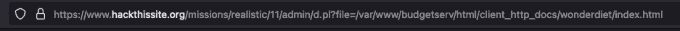

URL

通过修改 URL 指向客户指定的 src.tar.gz 文件，我们应该能够下载他们的备份文件并完成任务。我在下面包含了文件的完整 URL 路径。

```
[https://www.hackthissite.org/missions/realistic/11/admin/d.pl?file=/var/www/budgetserv/html/client_http_docs/space46/src.tar.gz](https://www.hackthissite.org/missions/realistic/11/admin/d.pl?file=/var/www/budgetserv/html/client_http_docs/space46/src.tar.gz)
```

恭喜你，你现在应该已经完成了这个任务。

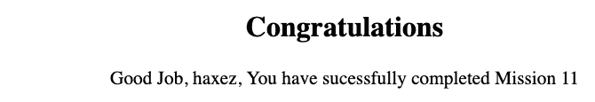