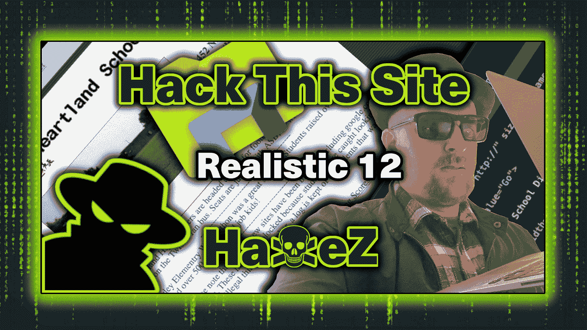
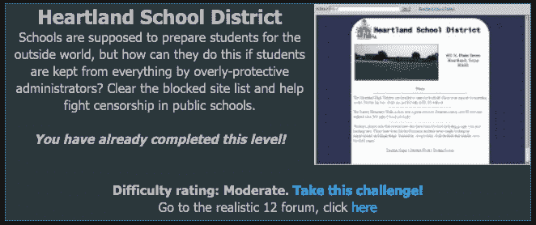
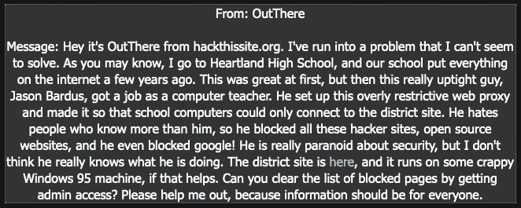
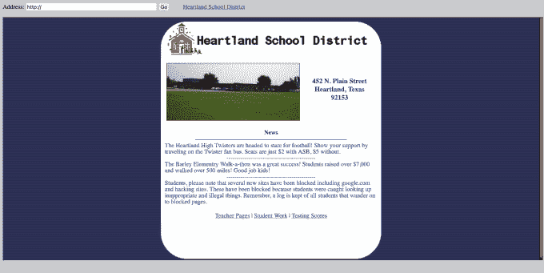
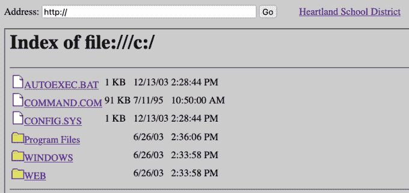
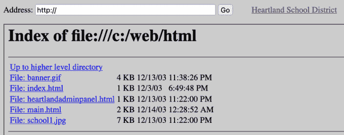
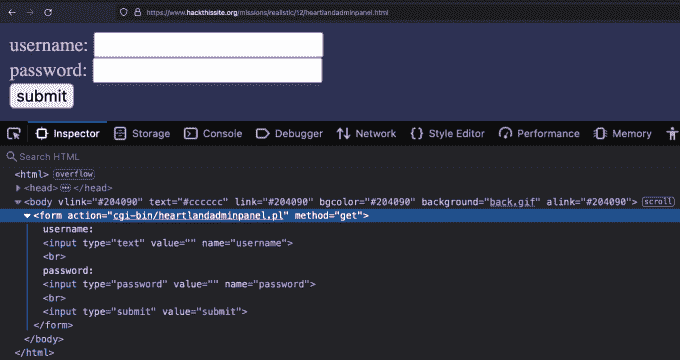
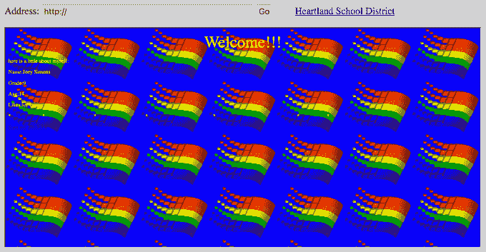
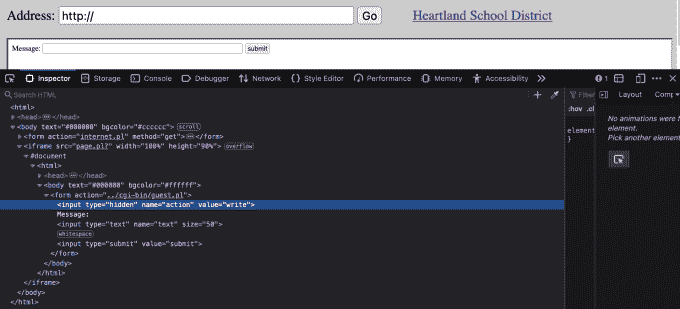
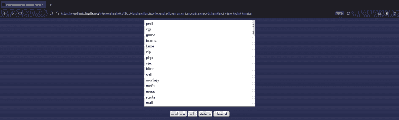

# 黑掉这个网站:现实的网络任务—12 级

> 原文：<https://medium.com/geekculture/hack-this-site-realistic-web-mission-level-12-a5c59133a0dc?source=collection_archive---------12----------------------->



Hack This Site: Realistic Web Mission — Level 12

欢迎来到哈克斯，今天我们要看的是[黑掉这个网站](https://hackthissite.org/)现实网络任务 12。这个任务要求我们使用一个粗略实现的 web 应用程序的内置功能来利用它。应用程序的功能是由许多 Perl 脚本驱动的，当以非预期的方式使用时，会对应用程序的安全性产生不利影响。如果你没有看过我在现实系列上的其他帖子，你可以在这里看到:[第一部分](https://haxez.org/2021/09/hack-this-site-realistic-web-missions-level-1/)、[第二部分](https://haxez.org/2021/09/hack-this-site-realistic-web-mission-level-2/)、[第三部分](https://haxez.org/2021/09/hack-this-site-realistic-web-mission-level-3/)、[第四部分](https://haxez.org/2021/09/hack-this-site-realistic-web-mission-level-4/)、[第五部分](https://haxez.org/2021/09/hack-this-site-realistic-web-mission-level-5/)、[第六部分](https://haxez.org/2021/09/hack-this-site-realistic-web-mission-level-6/)、[第七部分](https://haxez.org/2021/10/hack-this-site-realistic-web-mission-level-7/)和[第八部分](https://haxez.org/2021/10/hack-this-site-realistic-web-mission-level-8/)。



Heartland School District

# 介绍

我们收到了我们客户的信息。他解释说，他们的学校已经被一个残酷的系统管理员贾森巴杜斯的名字。此外，Jason 实施了许多限制，阻止他们访问除学校网站之外的任何网站。他还让我们知道该应用程序运行在 Windows 95 机器上，并要求我们将他们从互联网监狱中释放出来。



Message From OutThere

# 探索 Web 应用程序

如果我们导航到应用程序，我们会看到一个带有 URL 输入框的基本页面。值得注意的是，该页面有三个主要链接:教师页面、学生作业和考试分数。总的来说，访问这些页面并没有给我们提供多少可以利用的信息。



Web Application — Heartland School District

# Web 浏览器协议

Web 浏览器支持多种协议。例如，当访问一个网站时，HTTP 或 HTTPS 协议被加在域名的开头。本质上，HTTP 和 HTTPS 是超文本传输协议，负责获取你请求的内容。除了 HTTP 和 HTTPS，浏览器还支持许多其他协议，如 FTP 和 SMB 文件协议。

# 文件浏览

因为 Web 应用程序试图通过包含 URL 输入框来模仿浏览器功能。也许输入框也支持其他浏览器协议。通过反复试验，我们可以查看 web 服务器本地磁盘的内容。通过使用文件协议，我们可以指定一个我们想要浏览的目录。根据运行 web 服务器的服务的权限，我们可能只能访问某些目录。除非它实现得不好，让我们可以访问整个 C:/驱动器。



Web Application — C Drive Listing

# Web 应用程序结构

webservers 本地磁盘有一个名为 WEB 的目录，该目录下还有一个名为 HTML 的目录。很明显，这是我们试图破坏的应用程序的 webroot。值得注意的是，浏览器功能'`internet.pl`'的 Perl 脚本位于'`cgi-bin`'目录中。不管怎样，我们发现了一个有趣的页面，名为“`heartlandadminpanel.html`”。



Web Application C:/Web/HTML Listing

# 剖析 Perl

记住这一点，如果我们浏览到'【T3]'页面，就会看到一个登录表单。如果我们检查登录表单，我们可以看到它正在调用另一个名为 `'heartlandadminpanel.pl'`的 Perl 脚本。管理面板的用户名和密码可以硬编码到 Perl 脚本中，但是我们没有办法读取它。



Web Application — Admin Login Form

# 学生 Web 应用程序

重温学生网络应用程序，我们发现一些标准的青少年畏缩来自 Snezana Antic 和 Nolan Ethix。我们从莎拉·马西斯那里得到了一些有益健康的内容，但该死的乔伊·西蒙斯才是我们一直在寻找的英雄。这个孩子有潜力，希望我们能利用他的应用程序让他转向黑暗面，达到我们邪恶的目的。和其他学生一样，他的申请看起来相当简单，但他有一本留言簿。我愿意相信乔伊·西蒙斯看起来像那个电脑小子迷迷。你知道的。



Joey Simmons — Web Application

# 利用留言簿

来宾簿看起来相当简单。它有一个输入表单，允许访问者提交消息。然而，如果我们检查输入表单，我们可以看到它调用了一个名为'`guest.pl`'的 Perl 脚本。此外，该表单有一个名为 write 的隐藏值，允许它向来宾簿写入内容。或许，这个脚本也有一个我们可以利用的读取功能。



Guest Book

因此，我们知道 Perl 脚本的位置在'`cgi-bin`'目录中。我们还知道有一个名为'`guest.pl`'的 Perl 脚本，它允许我们'【T2]'另一个名为'`heartlandadminpanel.pl`'的脚本的内容。如果我们用 read 函数调用“`guest.pl`”脚本并指向“`heartlandadminpanel.pl`”，我们也许能找到管理面板的凭证。

```
[http://www.hackthissite.org/missions/realistic/12/cgi-bin/**guest.pl**?action=**read**&file=**heartlandadminpanel.pl**](http://www.hackthissite.org/missions/realistic/12/cgi-bin/guest.pl?action=read&file=heartlandadminpanel.pl)
```


Perl Authentication Script

```
#!perl
use strict;
print "Content-type: text/html\r\n\r\n";
require "db.cgi";
my $line;if ($ENV{QUERY_STRING} =~ /^username=jbardus&password=heartlandnetworkadministrator&blocked=/)
{
 clearlist();
}
elsif ($ENV{QUERY_STRING} =~ /^**username=jbardus**&**password=heartlandnetworkadministrator**/)
{
 print "
```

# 授予管理员访问权限

为了解释，我们使用了`'guest.pl'`脚本来读取“`heartlandadminpanel.pl`”脚本。当加载带有脚本的页面时，我们可以查看页面源代码并捕获`'heartlandadminpanel.html`页面的登录凭证。现在，如果我们返回到`'heartlandadminpanel.html`页面，使用我们刚刚恢复的凭证，我们应该能够登录。登录后，我们会看到一个显示黑名单的页面。我们所需要做的就是点击 clear all 按钮来删除列表，我们就应该完成任务了。



Blacklist

# 结论

这是一个有趣的挑战，教会了我一些关于 Perl 脚本的知识，以及对功能的推测如何会导致意想不到的行为。它表明，以非预期的方式使用软件会导致安全性受损。我们没有暴力或欺骗用户给我们发送凭证。我们使用应用程序的内置功能，以非预期的方式使用应用程序。这是一个在生产环境中容易被忽略的很好的例子。