# 黑掉这个网站:现实的网络任务-13 级

> 原文：<https://medium.com/geekculture/hack-this-site-realistic-web-mission-level-13-fbf337a45506?source=collection_archive---------15----------------------->

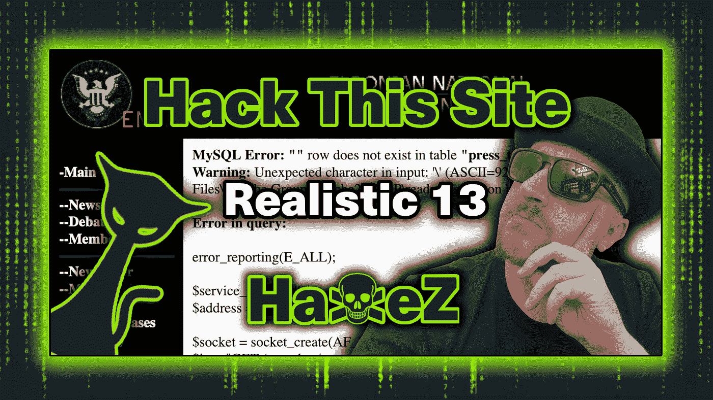

Hack This Site: Realistic Web Mission — Level 13

大家好，今天我们要看的是[黑掉这个网站](https://hackthissite.org)现实网络任务 13。这是一个有趣的挑战，要求您从错误消息中收集信息。获得这些信息后，您需要发现隐藏的 URL 来访问管理区域。最终，这项任务需要 web 应用程序错误、密码哈希和哈希破解方面的知识。如果你没有看过我在现实系列上的其他帖子，你可以在这里看到:[第一部分](https://haxez.org/2021/09/hack-this-site-realistic-web-missions-level-1/)、[第二部分](https://haxez.org/2021/09/hack-this-site-realistic-web-mission-level-2/)、[第三部分](https://haxez.org/2021/09/hack-this-site-realistic-web-mission-level-3/)、[第四部分](https://haxez.org/2021/09/hack-this-site-realistic-web-mission-level-4/)、[第五部分](https://haxez.org/2021/09/hack-this-site-realistic-web-mission-level-5/)、[第六部分](https://haxez.org/2021/09/hack-this-site-realistic-web-mission-level-6/)、[第七部分](https://haxez.org/2021/10/hack-this-site-realistic-web-mission-level-7/)和[第八部分](https://haxez.org/2021/10/hack-this-site-realistic-web-mission-level-8/)。

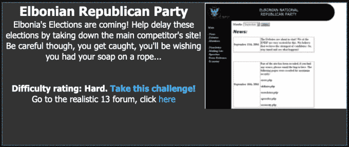

Elbonian Republican Party

# 介绍

我们收到了来自 Fr0zenB1t 的消息，解释说他们是 Elbonia 无政府主义者的一部分。发这条消息的原因是因为他们希望我们通过入侵他们竞争对手的网络应用程序来阻挠即将到来的选举。此外，他们解释说，侵入应用程序并将其关闭，即使是暂时的，也可能有助于推迟选举。

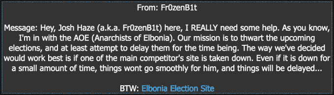

Message From Fr0zenB1t

# 探索 Web 应用程序

这个应用程序相当简单。值得注意的是，我们有一个带有许多链接的导航菜单。在中间，我们有这些链接的内容。有一个邮件列表，允许你提交你的电子邮件地址，但它不容易受到任何类型的注射。

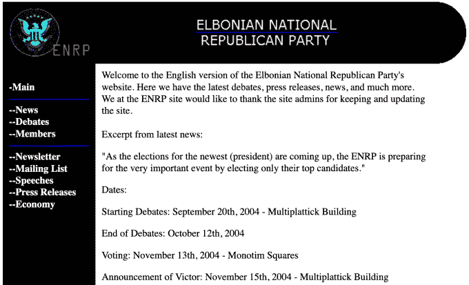

Web Application — Index Page

时事通讯页面有一些有趣的信息值得注意。它声称有一个隐藏的需要密码的登录网址。我们可以使用像 DIRB 或 Go-Buster 这样的工具暴力破解隐藏的 URL。但是，这可能需要很长时间，具体取决于目录的命名。

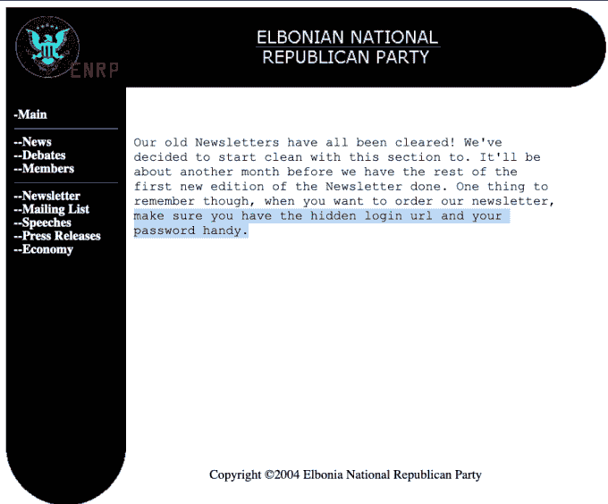

Press Release Page

# Web 应用程序错误

如果我们在页面上多逛一会儿，并在 URL 的末尾加上问号，我们可能会产生错误。这是可能的，因为页面在问号后面有所期待。下图显示了新闻稿页面上的一个错误。值得注意的是，该错误提到了文件路径`'/speeches/passwords`；。不过也提到了`'.md5('Speeches')'`。这表明有一个以单词 Speeches 的 md5 散列命名的目录。

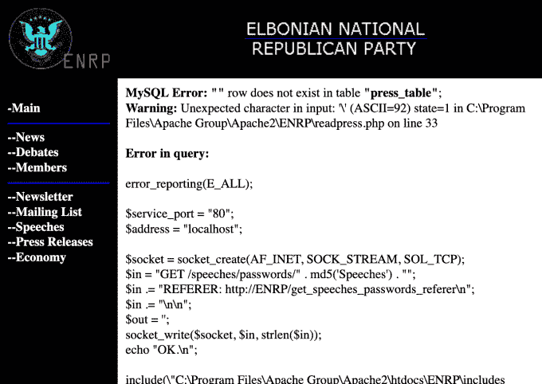

Web Application — Error Messages

# 散列路径

为了发现这个目录的名称，我们需要创建单词 Speeches 的 md5 散列(区分大小写)。需要注意的是，在创建散列时，需要包含`'-n'`标志。否则，创建的哈希将带有换行符，导致哈希与预期的完全不同。下面的代码演示了如何在 bash 中从单词 Speeches 创建 md5 散列。

```
Josephs-MacBook-Pro:~ Joe$ echo -n Speeches | md5
7e40c181f9221f9c613adf8bb8136ea8
```

创建完散列后，我们可以将它附加到 URL 的`'/speeches/password'`之后。访问该 URL 将产生一个目录列表，显示一个`'passwords.fip'`，如下图所示。

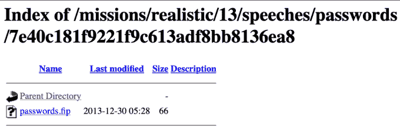

Hidden Directory

单击该文件的链接将在您的浏览器中打开它。该文件包含一个长字符串或由冒号分隔的两个字符串。这些字符串似乎是密码散列。我们可以从它们的长度来猜测散列可能是什么。

```
7bc35830abab8fced52657d38ea048df:21232f297a57a5a743894a0e4a801fc3
```

# 哈希识别

或者我们可以使用哈希识别工具。我在 homebrew 上发现了这样一个叫做 [name-that-hash](https://formulae.brew.sh/formula/name-that-hash#default) 的工具。这是一个简单的工具，易于安装和使用。通过分析散列，我们能够识别出散列最可能的候选者是 md5。有了这些信息，我们可以尝试破解它，揭示未加密的字符串是什么。

```
name-that-hash -t '7bc35830abab8fced52657d38ea048df'
```

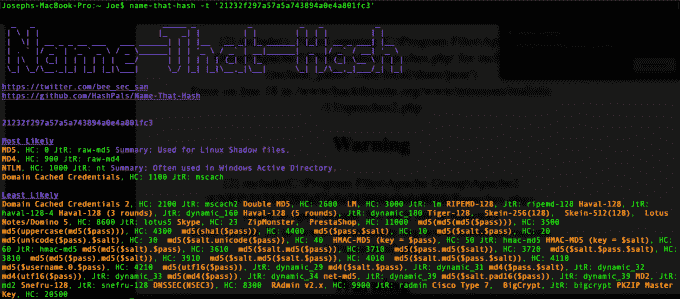

name-that-hash

# 破解杂凑

Hashcat 是一个流行的密码破解工具，也可以通过[家酿网站](https://formulae.brew.sh/formula/hashcat#default)找到。通过将发现的散列放到一个文本文件中，我们可以让 Hashcat 为我们破解散列。我用单词表 rockyou.txt 破解了哈希。我已经包括了语法和下面的破解哈希截图。

```
hashcat –m 0 hash.txt /path/to/wordlists/rockyou.txt
```

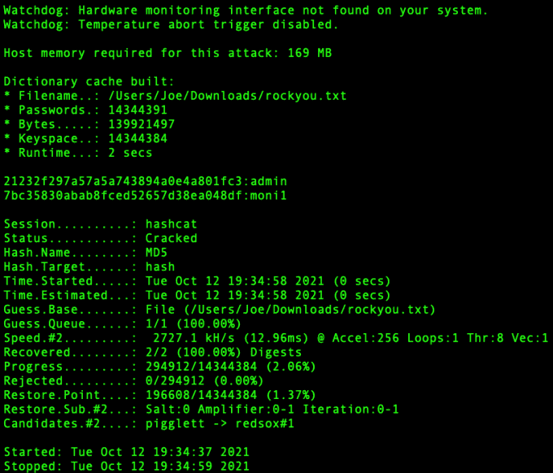

Hashcat

结果出来了，我们有两个词。它们似乎是用户名和密码的组合。

```
21232f297a57a5a743894a0e4a801fc3:admin           
7bc35830abab8fced52657d38ea048df:moni1
```

随着哈希的破解，我们可以前往管理区并尝试登录。但是，用户名和密码的组合都不起作用。我们被骗了。

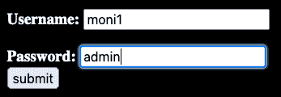

Admin Log In

# Web 应用程序完成

还记得新闻发布页上提到有一个秘密目录吗？如果他们指的不是 md5 语音目录呢？如果我们试图登录的/admin 登录页面是假的怎么办？原来是假的，正确的目录是单词 admin 的 md5 哈希。通过将“21232 f 297 a 57 a5a 743894 a 0 E4 a 801 fc 3”附加到 URL，您获得了正确的登录页面，这样，您就完成了任务。

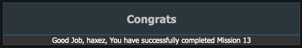

Congratulations

# 结论

这是一个有趣的挑战，显示了最小化 web 应用程序信息泄露的重要性。它还显示了使用强加密机制的重要性。不管怎样，我说完了。欢迎观看下面的视频。谢了。