# 黑掉这个网站:现实的网络任务——14 级

> 原文：<https://medium.com/geekculture/hack-this-site-realistic-web-mission-level-14-7c6b5653d2cc?source=collection_archive---------6----------------------->


Hack This Site: Realistic Web Mission — Level 14

大家好，欢迎来到 HaXeZ，今天我们要看的是[黑掉这个网站](https://hackthissite.org/)现实网络任务 14。不幸的是，这个任务现在看起来已经被破坏了，所以我无法用预定的方法来解决它。我希望有人能证明我是错的，并告诉我如何正确地完成这项工作。然而，在走进一个又一个死胡同后，我放弃了，并查看了一些演练。我看的第一本指南是[阿尔德伊德的](https://www.aldeid.com/wiki/Hackthissite/Realistic/Level14)。我还看了[查克·摩尔的 youtube 视频](https://www.youtube.com/watch?v=7PkywoOSzBc)，并在官方论坛上阅读了这篇[帖子](https://www.hackthissite.org/articles/read/681/)。所有这些指南都使用一个空字节来完成任务。如果你没有看过我在真人秀系列上的其他帖子，你可以在这里看到:[第一部分](https://haxez.org/2021/09/hack-this-site-realistic-web-missions-level-1/)，[第二部分](https://haxez.org/2021/09/hack-this-site-realistic-web-mission-level-2/)，[第三部分](https://haxez.org/2021/09/hack-this-site-realistic-web-mission-level-3/)，[第四部分](https://haxez.org/2021/09/hack-this-site-realistic-web-mission-level-4/)，[第五部分](https://haxez.org/2021/09/hack-this-site-realistic-web-mission-level-5/)，[第六部分](https://haxez.org/2021/09/hack-this-site-realistic-web-mission-level-6/)，[第七部分](https://haxez.org/2021/10/hack-this-site-realistic-web-mission-level-7/)，[第八部分](https://haxez.org/2021/10/hack-this-site-realistic-web-mission-level-8/)。

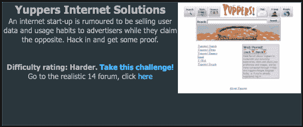

Yuppers Internet Solutions

# 介绍

我们收到了一条来自未知来源的消息，该消息想要揭露 Yuppers 互联网解决方案出售其用户数据的行为。这位匿名客户曾在雅痞公司实习，但在得知他们邪恶的数据出售活动后辞职了。他们无法带着证据逃脱，所以他们问我们是否能够侵入并找到他们出售数据的证据。


Message From Unknown Client

# 探索 Web 应用程序

该网站似乎有相当多的进展。它有一个搜索页面、一个新闻页面和许多其他页面。web 应用程序似乎正在使用 CGI 脚本。CGI(公共网关接口)脚本是作为服务器端的独立进程执行的程序。

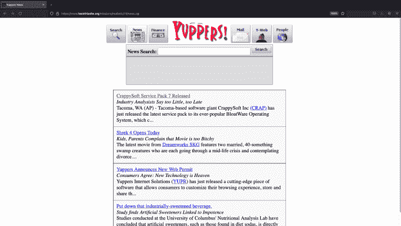

The Web Application

# Web 应用开发——预期的方式

正如我提到的，这个任务似乎已经失败了。完成这项任务的方法是在 news.cgi 脚本中使用一个空字节。使用空字节应该可以揭示 web 应用程序的根目录中有哪些文件。有了这些文件，您可以进一步了解应用程序，从而可以继续下一步。然而不幸的是，无论我怎么尝试，我都无法让空字节工作。news.cgi 脚本有一个名为 story 的参数。story 参数负责调用新闻故事。

```
[https://www.hackthissite.org/missions/realistic/14/news.cgi?**story=1**](https://www.hackthissite.org/missions/realistic/14/news.cgi?story=1)
```

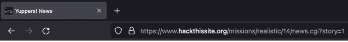

下面的屏幕截图举例说明了用于加载新闻的新闻故事参数。正如您在 URL 中看到的，story 参数调用第一个故事，该故事随后显示在搜索表单下方的框中。

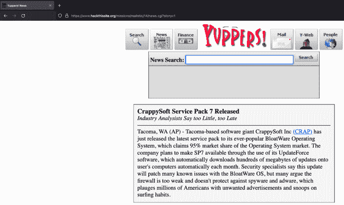

News Page — Story 1

为了利用这个 cgi 脚本，我们应该给故事参数`story=.%00`添加一个空字节。句号表示当前目录。输入空字节并执行 URL 后，我们应该会收到当前目录的内容列表。类似于我们在之前的任务中使用的`ls` OS 命令注入。

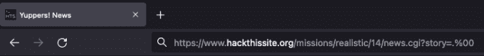

Null Byte Injection

然而，这种方法行不通。我已经尝试了各种不同的目录遍历，并尝试使用其他转义字符。它们或者产生消息“加载失败..或者他们产生一个错误消息，说它收到了格式错误的输入。我提交了超过 100 个不同的有效载荷使用 Burp 入侵者，没有成功。

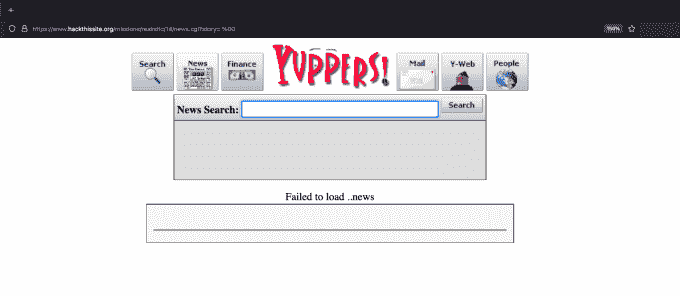

Error Message — Failed to load

# 进一步的调查

为了进一步支持这一点，如果我们用 Burp Suite 捕获请求并将其发送到 repeater 工具，我们可以快速测试有效负载。下面的截图显示，空字节无法从 CGI 脚本中逸出，因为`..news`被附加到“加载失败”消息中。我尝试了 URL 编码有效载荷和许多其他方法来触发漏洞，但都不成功。

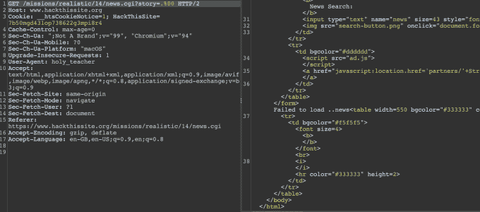

Burp Suite — Repeater

# Web 应用开发——我的方式

为了更进一步，我们需要知道根目录的内容。为了用另一种方式做到这一点，我使用了带有-X 标志的工具 DIRB 来指定我想要查看所有的 CGI 文件。果然，DIRB 找到了前进所需的 administrator.cgi 和 moderator.cgi 脚本。

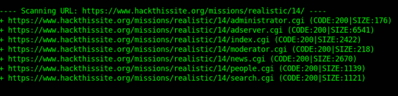

DIRB

不幸的是，没有办法解决任务的下一部分。这部分任务要求您使用一个空字节来读取 moderator.cgi 脚本的内容。我用其他页面参数进行了尝试，但最终得到了相同的结果。下面的示例 URL 应该允许您阅读不同脚本的内容。可悲的是，它们已经不起作用了。

**阅读版主. cgi 的网址**

```
[http://www.hackthissite.org/missions/realistic/14/news.cgi?story=**moderator.cgi%00**](http://www.hackthissite.org/missions/realistic/14/news.cgi?story=moderator.cgi%00)
```

**读取 administrator.cgi 的 URL**

```
[http://www.hackthissite.org/missions/realistic/14/news.cgi?story=**administrator.cgi%00**](http://www.hackthissite.org/missions/realistic/14/news.cgi?story=administrator.cgi%00)
```

不幸的是，正如你从下面的截图中看到的，这些只会导致错误消息。如果看不到这些脚本的内容，不查找答案就无法在任务中前进。

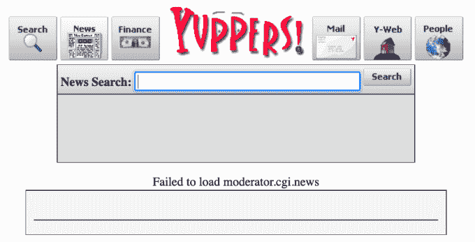

Error Message — Failed To Load

# 走向

如果空字节攻击成功了，那么我们就能看到 CGI 脚本的内容。CGI 脚本应该包含一个名为`'isadmin'`的用户名。使用这个用户名，我们可以导航到 moderator.cgi 文件并登录。

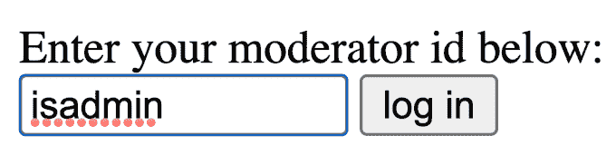

Moderator.cgi Login

登录后，我们会看到一个版主面板。该面板提供了两个选项，查看帐户信息和查看电子邮件流量。

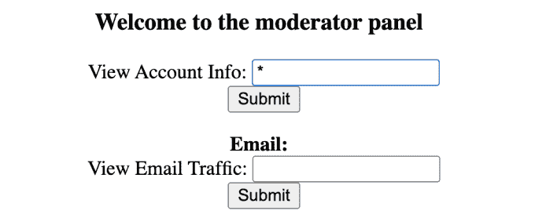

Moderator Panel

如果我们向帐户信息页面提交一个星号或通配符，那么我们将得到当前用户的所有信息列表。前两个条目是用户名和密码。

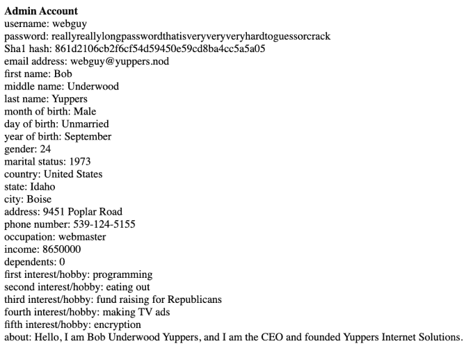

Account Details

# Web 应用程序—权限升级

有了这些信息，我们可以导航回应用程序的索引页面，并使用 Web Permit 登录表单以`'web guy'`的身份登录应用程序。

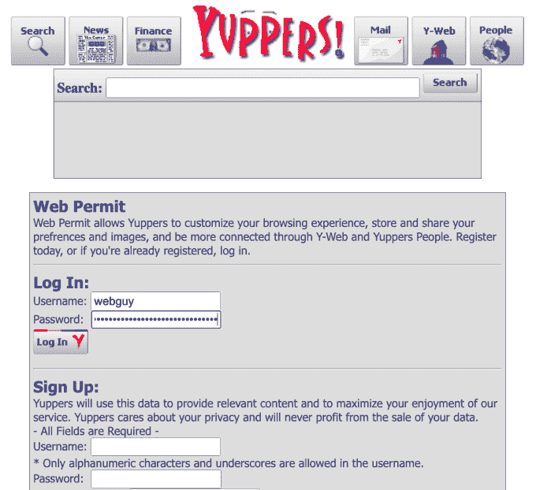

Log in page

登录并访问管理员面板后，我们应该完成任务。

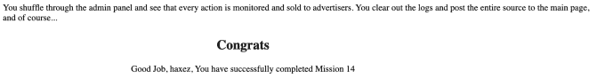

Congratulations

# 结论

很遗憾这个挑战似乎被打破了。如果不是，那么我想为我的虚假声明向 Hack This Site 团队道歉。然而，根据我在这篇文章中收集和展示的信息，我认为这是错误的。这是我遇到的唯一一个空字节注入的例子，所以它不再工作真的令人失望。我希望它被修理。