# 黑掉这个网站:现实的网络任务—15 级

> 原文：<https://medium.com/geekculture/hack-this-site-realistic-web-mission-level-15-20ae20e04e96?source=collection_archive---------6----------------------->

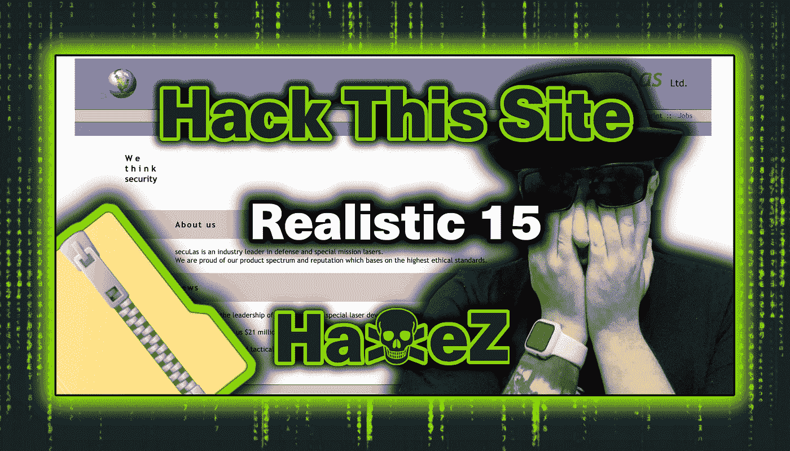

Hack This Site: Realistic Web Mission — Level 15

你好朋友，欢迎来到 HaXeZ，今天我们来看看[黑掉这个网站](https://hackthissite.org/)疯狂的困难现实的网络任务 15。为了完成这个任务，我们需要跟踪很多线索。这比其他任何任务都要复杂得多，我相信创造它的人只是想让人们受苦。

首先，它需要用已知的纯文本攻击来攻击加密的 zip 文件。其次，您需要修改您的请求，以管理员身份登录内部消息系统。第三，您需要利用 PHP 身份验证脚本来访问 PHP 外壳。第四，您需要在另一个身份验证脚本上执行缓冲区溢出，以获得对 patents 页面的访问。

和往常一样，如果你没有看过我在真人秀系列上的其他帖子，你可以在这里看到:[第一部分](https://haxez.org/2021/09/hack-this-site-realistic-web-missions-level-1/)、[第二部分](https://haxez.org/2021/09/hack-this-site-realistic-web-mission-level-2/)、[第三部分](https://haxez.org/2021/09/hack-this-site-realistic-web-mission-level-3/)、[第四部分](https://haxez.org/2021/09/hack-this-site-realistic-web-mission-level-4/)、[第五部分](https://haxez.org/2021/09/hack-this-site-realistic-web-mission-level-5/)、[第六部分](https://haxez.org/2021/09/hack-this-site-realistic-web-mission-level-6/)、[第七部分](https://haxez.org/2021/10/hack-this-site-realistic-web-mission-level-7/)和[第八部分](https://haxez.org/2021/10/hack-this-site-realistic-web-mission-level-8/)。

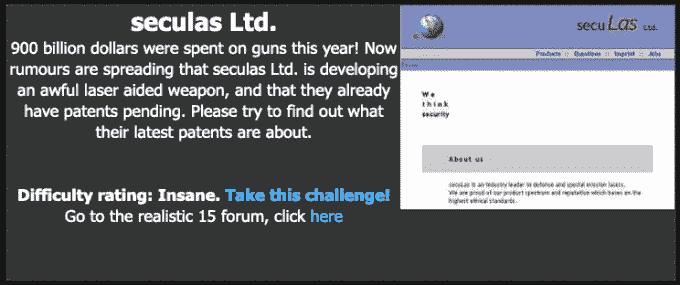

Seculas Ltd

# 介绍

所以，我们收到了一条来自 HTML 的消息，Seculas 有限公司开发了一种新的激光制导武器。HTML 已经寻求我们的精英黑客服务来侵入并窃取新武器的专利。HTML 还解释说，他们负责网站的新开发人员是那种会留下后门的人。

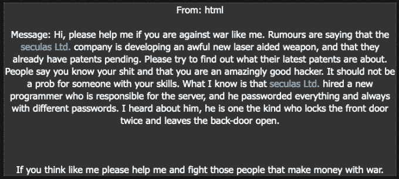

Message From html

# 探索 Web 应用程序

当导航到 web 应用程序时，我们会看到一个漂亮的网站，宣传它的好战工具。有许多页面，包括产品、问题、印记和工作。问题和工作页面有表格，我们可以填写并提交回服务器。

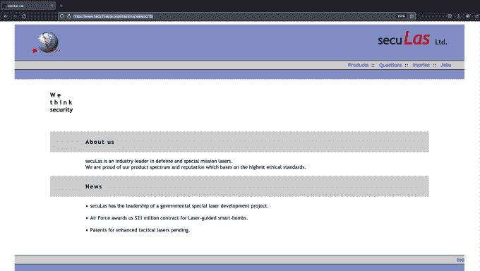

Web Application

如果我们查看索引页面的页面源，我们会立即看到似乎是用户名`'webadmin`，真实姓名为 Susy Slack。我们应该记下这一点，因为以后可能会有用。

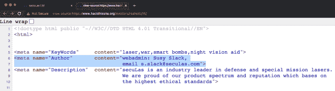

Page Source

# 弄清楚表格

如前所述，有一个问题页面和一个工作页面。两者都有可以填写并发送回服务器的表单。在填写并寄出“问题”表格后，没有什么特别的事情发生。然而，在填写工作申请表后，我们注意到编码有所不同。

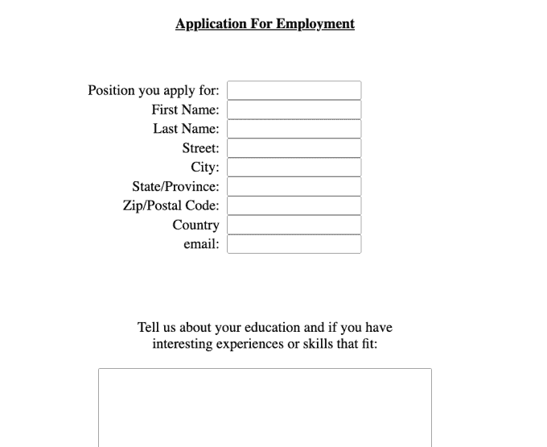

Job Application Form

的。正在加载的 gif 文件表示表单已发送，正在从不同的位置加载到“问题”表单上的位置。这张 gif 图片似乎是从一个名为`_backups_`的目录中加载的。下图显示了完成并发送职务表单后应用程序的页面源。

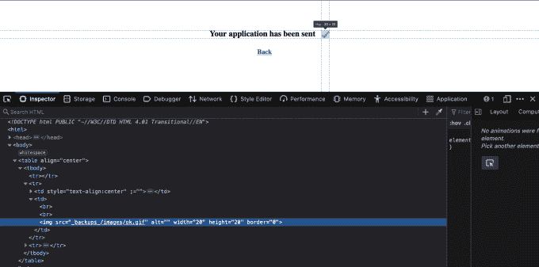

Job Application Page Source

如果我们导航到备份目录，我们将获得一个目录列表，其中包含名为 backup 的 zip 文件。这是一个很好的例子，说明为什么启用目录列表不是一个好主意。它为威胁参与者提供了关于应用程序结构的丰富知识。此外，备份不应保存在正在备份的同一台服务器上。也不应该保存在公开的目录中。如果驱动器出现故障，该备份将完全无用。此外，公开备份存档意味着任何老乔都可以下载和查看其内容。


Directory Listing

# Web 应用程序备份

如果我们下载并尝试打开备份文件，系统会提示我们输入密码。不要！，一个密码保护的 zip 存档，我唯一的弱点！老实说，这确实给我带来了一些问题。起初，我试图使用 zip2john 捕获密码散列并破解它。它似乎抓住了散列，但破解它被证明是困难的。

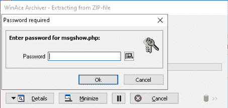

Zip File Password Required

有密码保护的 zip 存档的好处(或者坏处取决于你是谁)是我们可以看到内容。在这个特定的 zip 文件中，有一个名为 index.htm 的文件。如果这是我们攻击的主要网站的 index.htm，那么我们有一些已知的纯文本。如果我们有加密的文件，但知道其中一个文件的内容，那么我们可以执行已知明文攻击。这有点像二战时艾伦·图灵和布莱奇利团队是如何破译英格玛机并击败纳粹的。如果您知道编码文档的部分文本。您可以使用该文本来解码其余的编码文本。

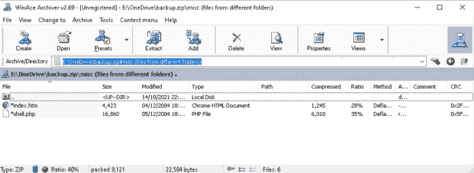

Zip File Listing

# 破解备份

为了破解 backup.zip，我们需要做的就是获取 index.htm 页面的副本。一旦我们有了这个页面，我们就可以使用与压缩加密的 backup.zip 相同的方法来压缩它。然后，我们可以使用'`pkcrack`'来比较两个 zip 存档，并解密加密的版本。首先，通过导航主页并单击鼠标右键，然后选择“另存为”来获取 index.htm 页面的副本(确保只保存 HTML)。其次，使用 WinAce 和以下参数创建一个新的 zip 归档文件:

```
**Archive type:** Zip
**Compression:** Maximum
**Encryption Method:** 256-Bit AES Encryption
```

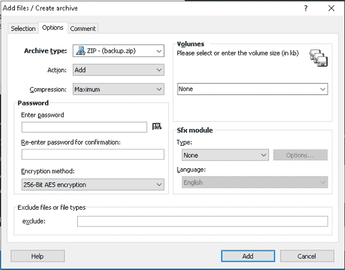

Creating Duplicate Zip File

第三，比较两个档案，确保两个 index.html 文件的压缩大小相同。如果使用的压缩和加密方法不同于加密档案上的方法，那么它就不会工作。

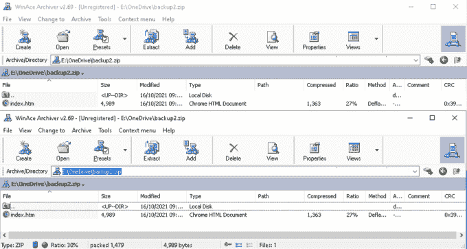

Comparing Zip Files

第四，掌握 Linux，安装 pk-crack，破解 zip 存档。好了，一步一步地浏览它有点超出了本演练的范围。然而，如果你已经完成了这个任务，那么你应该能够 git 克隆一个库。按照 git 上的说明构建它，然后运行'【T1]'来比较这两个文件。您应该会收到一个未加密的输出 zip 文件，其中包含加密 zip 文件的内容。

```
sudo ./pkcrack -C /media/sf_OneDrive/backup.zip -c "misc (files from different folders)/index.htm" -P /media/sf_OneDrive/index.zip -p index.htm -d decrypted_file -a
```

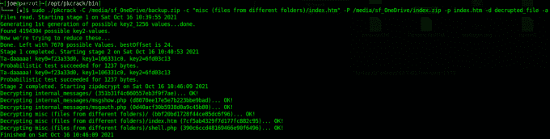

pk-crack Cracking Zip File

# Web 应用消息系统

有了输出，我们现在可以浏览文件了。如果我们打开 internal_messages 目录中的 PHP 文件，我们可以看到'`msgshow.php`'文件引用了'`internal_messages.php`'文件。

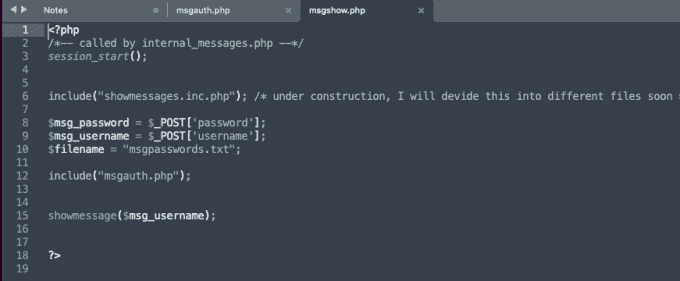

msgshow.php Code

如果我们导航到“`internal_messages.php`”页面，我们可以看到实际上有一个内部消息系统，需要密码才能访问它。

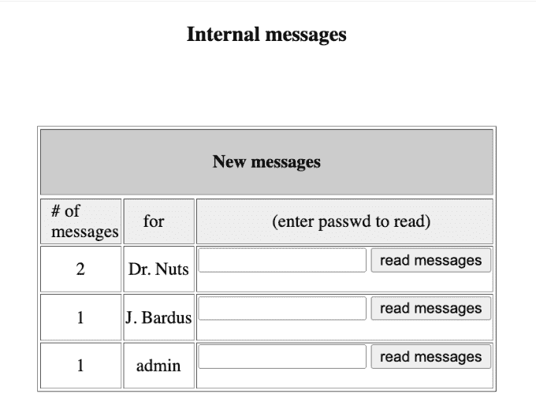

Internal Messages

这就是事情变得有点混乱的地方。如果我们再次查看索引页面的页面源代码，我们可以看到下面的代码。该代码似乎包含用户名`webadmin`和密码`Susy Slack,`。然而，这种“利用”要求我们使用用户的`admin'` 和相同的密码。也许开发人员是有意演示密码重用。

```
<meta name="KeyWords"     content="laser,war,smart bombs,night vision aid">
<meta name="Author"       content="**webadmin: Susy Slack**,
                                   email s.slack@seculas.com">
```

无论如何，如果我们看看 msgauth.php 文件，我们可以看到它似乎是一个认证脚本。它将用户提交的凭证存储到变量中。用户名存储在名为'`$msg_username`'的变量中，密码存储在'`$msg_password`'中。再往下，我们可以看到它正在执行下面的 if 语句来检查用户名和密码。格式似乎与我们在索引页面中找到的用户名和密码相同。

```
if (ereg(**$msg_username . ": " . $msg_password** . "\r*\n*$", $strLine, $regs))
```

# 利用信息系统

事情变得更加混乱。我们不能只把密码提交给上图看到的表单。我们必须截取一个请求，并修改它，用不同的参数发送到不同的 PHP 页面。当然，如果我们正在查看网站的备份文件，那么我们应该能够将密码提交给内部消息系统。它应该使用相同的 PHP 文件和相同的参数。我不知道第一个解决这个任务的人是怎么做到的。

如果我们捕获到对 msgshow.php 的请求，我们可以修改以下参数来访问消息。首先，我们需要更改 POST 请求，使其发布到'`msgauth.php`'而不是'`msgshow.php`'。其次，我们需要将密码参数改为'【T2 '，`'msg_username`'。第三，我们需要用用户名'`admin`'和密码'`Susy%20Slack,'` '填充这些参数。最后，我们需要添加 filename 的另一个参数，并将其设置为'`../../index.php`'。


Burp Repeater

现在，如果您发送请求，您应该会看到消息'`set admin OK`'。我不知道为什么这行得通，或者更重要的是，为什么向“内部消息”表单提交正确的密码行不通。此外，为什么用户在索引页面上被列为'`webadmin`'，而在内部消息页面上被列为 admin。我承认我不擅长编码，也许它被设计成这样是为了让它具有挑战性。然而，对我来说，这没有多大意义。无论如何，我们可以在下图中看到我们想要看到的信息。

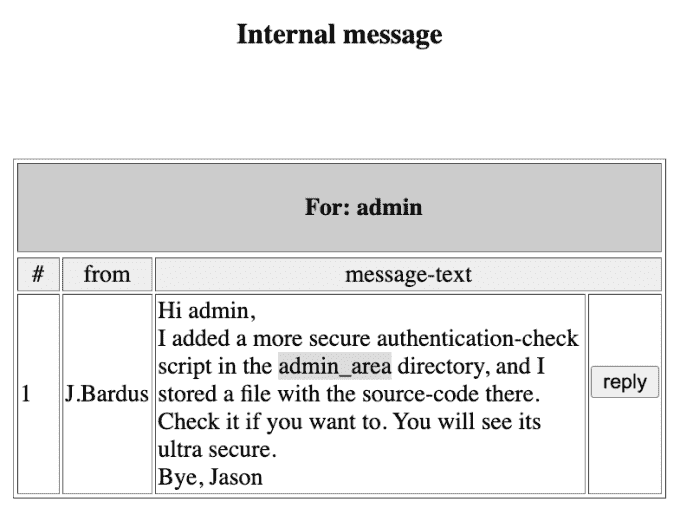

Admin Message

# 利用 PHP 认证

在所有这些工作之后，我们只收到一个新的要访问的目录。我们可以使用目录暴力工具找到这个目录，比如 DIRB 和 Go-Buster。我不知道我在期待什么。前往'`admin_area`'目录会产生一条禁止消息。由于无处可去，我们需要回到我们下载并解密的备份文件。那里有一份文件我们还没看过，shell.php。如果我们前往“`admin_area/shell.php`”，我们会得到一个登录提示。前面的凭证不起作用，所以让我们看看代码。首先要注意的是，它告诉我们用户名是什么。根的值被传递给变量'`$shellUser_root`'。不幸的是，看起来密码已经从备份文件中删除了，但是它被传递给了'`$shellPswd_root`'变量。

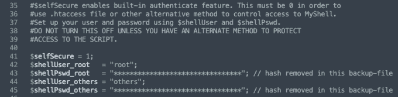

shell.php Code

此外，如果我们进一步查看代码，我们可以看到身份验证是如何执行的。我不知道为什么这很脆弱。PHP 不是我最擅长的领域，但我打算在未来多学一些。我所理解的是，有一个 if 语句检查'`shellUser_root`'的值和'`shellPswd_root`'的 md5 值，如果它们是正确的，它就加载页面。该漏洞可能与脚本将用户提交的值传递给变量的方式有关。

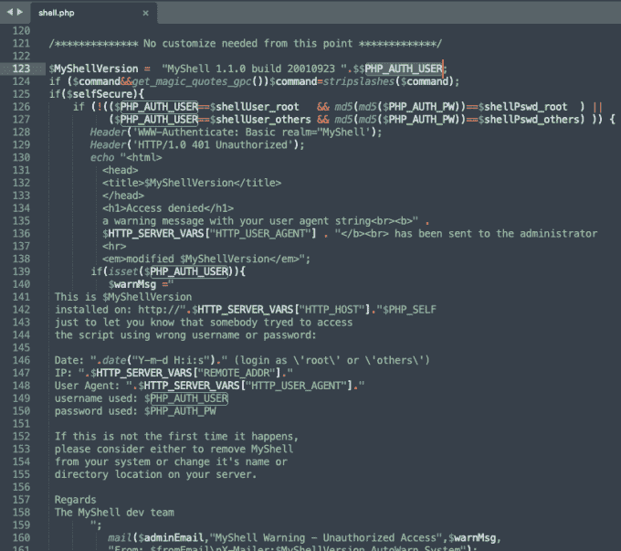

shell.php Authentication Mechanism

无论如何，如果我们加载 shell.php 页面并提交'【T2 ']到登录表单，我们可以强迫应用程序返回前面的错误页面上的散列。这样做的步骤是输入变量，单击 submit，然后当再次弹出登录表单时，单击 cancel。

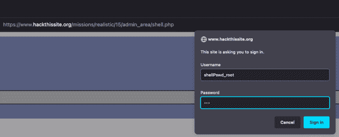

shell.php Login

单击 cancel 后，您应该会收到一条错误消息，指出访问被拒绝。然而，在消息的底部，有一些不应该出现的数据。它是从备份文件中删除的密码哈希，但保留在实际的 shell.php 文件中。

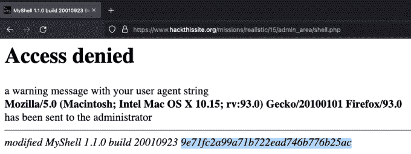

Error Message With Hash

# 破解杂凑

您应该知道的第一件事是，密码已经被散列为 MD5，然后该散列再次被散列。你可以试着用开膛手约翰或者 Hashcat 来破解。然而，最快的方法是把它提交给[破解站](https://crackstation.net/)。Crackstation 很快就完成了散列，从下图中可以看出，密码是 foobar。

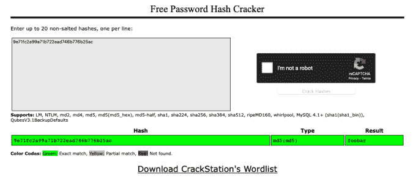

Crackstation

哈希破解后，我们就可以登录 shell.php 了。迎接我们的是一个允许我们列出目录内容的终端。ls 命令的输出显示了两个与专利相关的 PHP 页面。访问这些页面需要凭据，到目前为止，我们获得的凭据都不起作用。还有一个目录叫 test。

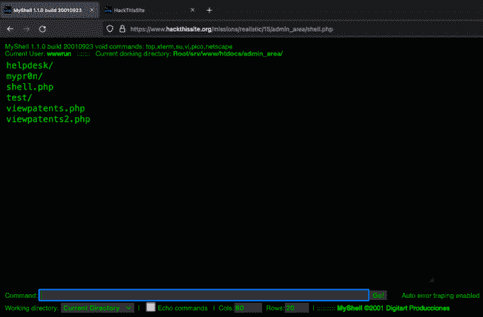

Web application terminal

如果我们在浏览器中导航到测试目录，我们可以看到目录列表已启用，并且有一个我们可以下载的 zip 文件。


Directory Listing

# 缓冲区溢出

如果我们下载 zip 文件并用文本编辑器打开它，我们可以看到这是另一个身份验证脚本。该脚本似乎是 viewpatents.php 页面的身份验证脚本。此外，如果我们仔细观察这个脚本，我们可以看到它将 200 个字符连接在一起。这意味着输入框有字符限制。

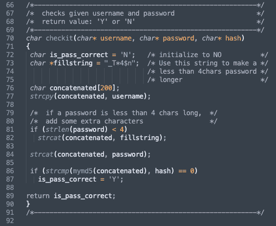

Authentication Code

这意味着我们可以执行缓冲区溢出。通过向用户输入框提交超过 200 个字符，我们可以避开分配的内存量，欺骗应用程序让我们登录。

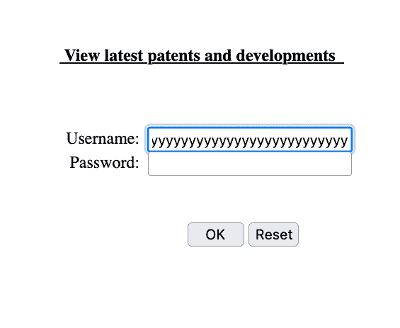

Buffer Overflow

登录后，会出现另一个登录表单。开个玩笑！就是这样。我们完了。感谢上帝。

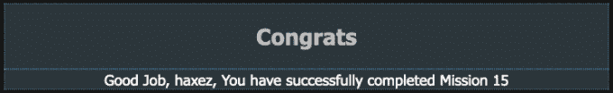

Congratulations

# 结论

我没有。我讨厌它。