# 黑客这个网站:现实的网络任务-16 级

> 原文：<https://medium.com/geekculture/hack-this-site-realistic-web-mission-level-16-30aac04d9dcb?source=collection_archive---------9----------------------->


Hack This Site: Realistic Web Mission — Level 16

你好，环球网，欢迎来到 [HaXeZ](https://haxez.org/) ，今天我们来看看[黑客网站](https://hackthissite.org/)的最后一个现实的网络应用任务。由于种种错误的原因，这项任务很困难。这并不是因为它是以一种富有挑战性的方式设计的。不，这是因为它使用的 Adobe Flash 已经死了一段时间了。尽管一路上遇到了技术问题，但挑战本身充满了乐趣。我不知道为什么我会诚实地抱怨，我在这个过程中学到了额外的信息。


Realistic 16

# 介绍

我们收到一个忘记留下姓名的人的信息。留言解释，他们怀疑女朋友出轨。此外，他们已经注意到他们的女朋友经常使用 simplemail.com。他们认为这可能是他的女朋友给她的秘密情人发信息的方式。我们被要求黑进 simplemail，阅读他女朋友的电子邮件。我不想成为一名美德战士，但在正常情况下，这将是我的通行证。


Message From Concerned Boyfriend

# 探索 Web 应用程序

在导航到应用程序时，我们看到一个可爱的酸橙绿色装饰，让人想起旧的 KazaA 下载应用程序。在互联网退化的 X 天里，Limewire 和 KazaA 是下载应用程序的首选。唉，该应用程序有许多选项，允许你注册，登录，搜索和执行其他活动。我真的很喜欢这个应用程序的外观和感觉。

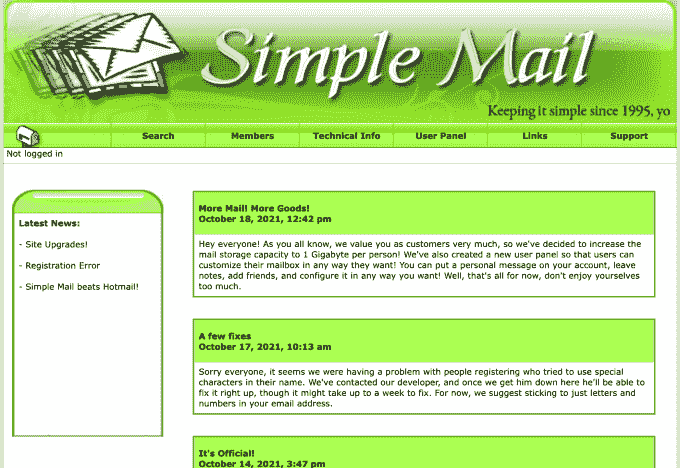

Simple Mail Web Application

# 搜寻源头

首先，让我们看看这个装饰精美的复古应用程序的内部是什么。这几乎就是你所期望的。然而，有一些评论引起了我的注意。从下面的截图可以看到，有一条评论提到了管理员登录。让我们前往网址，看看发生了什么。

```
[https://www.hackthissite.org/missions/realistic/16/index.php?module=admin_login](https://www.hackthissite.org/missions/realistic/16/index.php?module=admin_login)
```

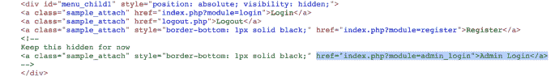

Web Application — Page Source

# 死路还是弯路？

这可不是你每天都能看到的。登录页面使用 Adobe Flash，自 2020 年 12 月 31 日*** Google it ***以来，浏览器就不再支持该页面。好吧，它还没死那么久，但令人惊讶的是 Adobe Flash 已经感觉像古代互联网的遗物了。

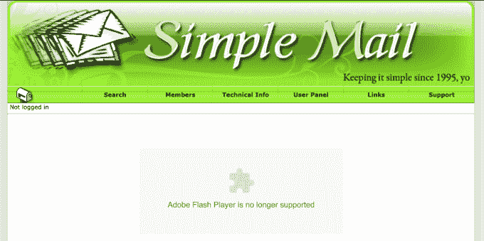

Simple Mail Flash Requirement

我们知道，大多数浏览器不再支持 Adobe Flash。我试着先安装一个旧版本的 Firefox 来让它工作，但是运气不太好。在谷歌搜索了一会儿之后，我偶然发现了这个奇迹，那就是莱夫。我首先尝试了一些其他的插件，但是没有一个能成功。然而，莱夫是惊人的，完美地完成了它的工作。

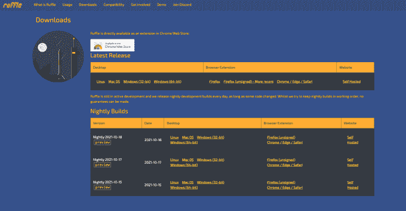

Ruffle

# 网络浏览器满足 Ruffle

由于 Ruffle 还没有出现在任何流行浏览器的默认插件商店中，你需要下载它并自己手动添加。为了在 Firefox 网络浏览器中做到这一点，你需要进入关于:在 URL 中调试。然后点击这个 Firefox，然后选择 Load temporary Add-ons，导航到你下载的文件。加载了该文件后，我们现在应该能够访问 URL 了。

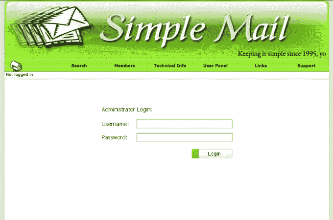

Web Application With Flash

# 拦截 Web 请求

在继续之前，请确保您打开了您最喜欢的 web 应用程序渗透测试工具(Burp Suite ),并配置为拦截流量。然后用测试数据填充用户名和密码表单，并单击 submit。检查进入 Burp 的请求，您会注意到它正在向 config.txt 文件发送 GET 请求。这让我想到，在尝试对我们进行身份验证之前，登录表单正在检查 config.txt 中的某些内容。

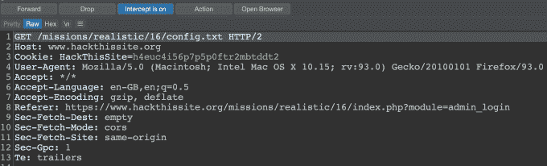

Burp Suite Intercepted Auth Request

# 注册网络邮件

现在我们知道了一点关于管理员登录的工作原理，让我们注册自己的帐户，看看是否有什么有趣的东西。我用 test 的密码注册了 test 的用户，因为谁会关心用户名和密码的复杂性要求。登录后，我环顾四周，注意到我们可以编辑我们的个人资料。如果我们查看这个应用程序的页面源代码，我们会注意到它链接到了一个 edit.php 页面。如果我们单击 edit.php 的链接来查看该页面的源代码，我们会注意到我们的配置文件配置存储在以下位置/users/username/config.txt

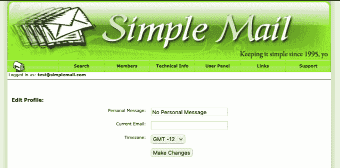

Edit Profile

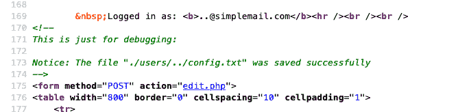

Config.txt

# 注册目录遍历

我们知道我们的配置文件存储在 config.txt 中，并且管理员身份验证脚本正在检查根目录(一个目录，还是两个目录？在我们上面)。也许我们可以用用户名注册一个目录遍历用户，这样当我们编辑我们的配置文件时，我们最终会编辑 admin config.txt。注销并转到注册页面，用用户名'`..`'注册一个用户。您将收到一条错误消息，称无法创建电子邮件地址，但您将收到一条冲突消息，称注册成功。

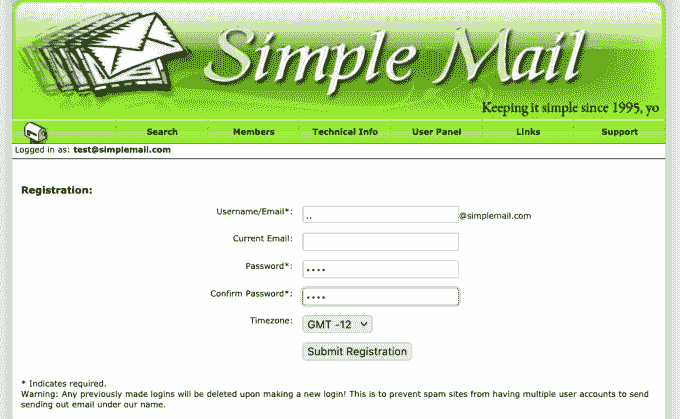

Registering Directory Traversal

# 管理员认证

对于新创建的用户，我们需要返回到编辑个人资料页面。这一次，我们将使用编辑配置文件来编辑根目录中的 config.txt 文件。我们需要在'【T1]'中输入以下值，这将允许我们进行身份验证。

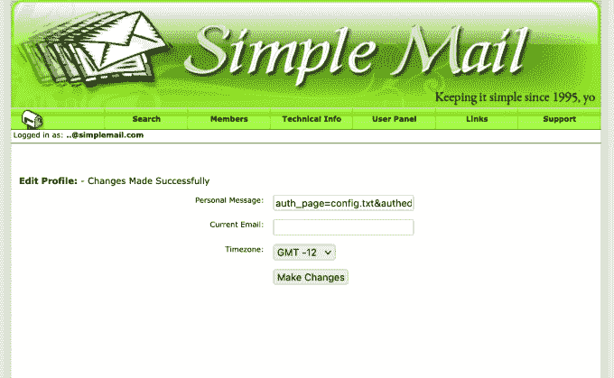

Editing Profile

# 管理员访问

好了，现在我们已经完成了。注销并返回到管理员 URL，用我们创建的另一个帐户登录。我用了用户名测试和密码测试。这次我们不应该再出现错误消息。相反，我们应该被重定向到管理面板。管理面板有许多选项，包括让我们阅读用户的电子邮件。然而，在提交我们客户的女朋友的电子邮件地址时，我们得到一条错误消息，说该功能因用户隐私而被禁用。

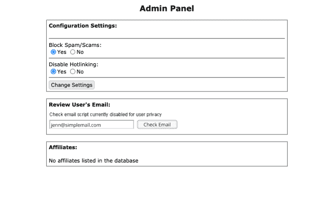

Admin Panel

# 混账闪！

如果我们再次查看页面源代码，我们可以看到这个“检查电子邮件”功能是由另一个 Flash 提供的。swf 文件。

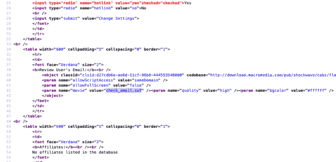

Web Application Page Source

这是我们需要切换到我们的 Linux 虚拟机的部分。我们需要对文件运行 wget，然后分解它，看看发生了什么。启动您的 linux 终端并运行以下 wget 命令。但是，如果您遇到错误，告知您 HackThisSite SSL 证书已经过期(像我一样)，那么您需要告诉 wget 跳过 SSL 检查。我会让你谷歌一下那个。

```
wget [https://www.hackthissite.org/missions/realistic/16/check_email.swf](https://www.hackthissite.org/missions/realistic/16/check_email.swf)
```

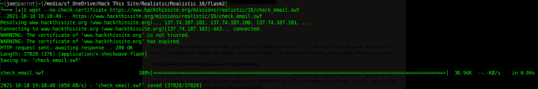

Wget

# 拆卸闪光灯

现在我们需要分解 Flash 文件，为此我使用了 swfmill 工具将其转换为 XML 文件。一旦 Flash 文件是一个 XML 文件，我们就可以通过它来找出为什么它不让我们检查用户的电子邮件。或者更好的是，我们可以找到它如何检查用户的电子邮件，我们可以用它来代替。将 SWF 转换为 XML 的命令如下:

```
swfmill swf2xml check_email.swf test.xml
```

然后，您可以 grep the 和 XML，您应该可以在文件中找到以下引用。

```
/check_email.php?auth=true&amp;id=63a4bf12cd&amp;email=
```

通过一些小的调整，我们可以添加链接到 Hack This Site URL 并解决这个问题。

```
[https://www.hackthissite.org/missions/realistic/16/check_email.php?auth=true&id=63a4bf12cd&email=jenn@simplemail.com](https://www.hackthissite.org/missions/realistic/16/check_email.php?auth=true&id=63a4bf12cd&email=jenn@simplemail.com)
```

就这样了，你现在已经完成了系列的最后一个现实任务，恭喜你。开始下一轮任务。

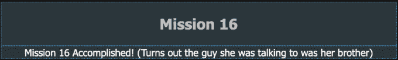

Congratulations