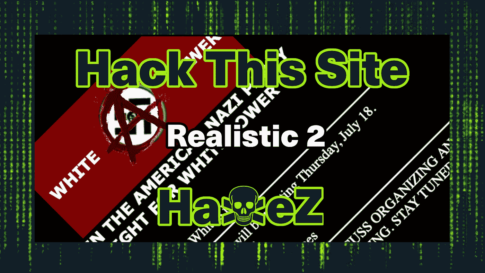
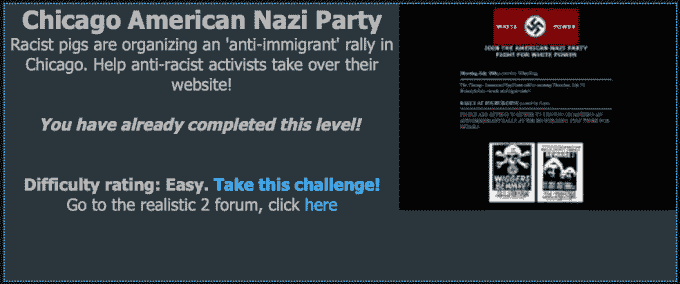
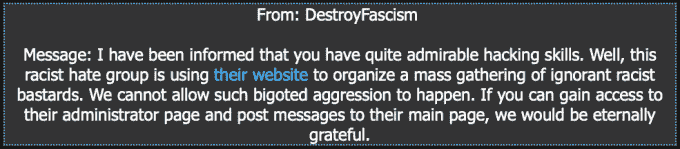
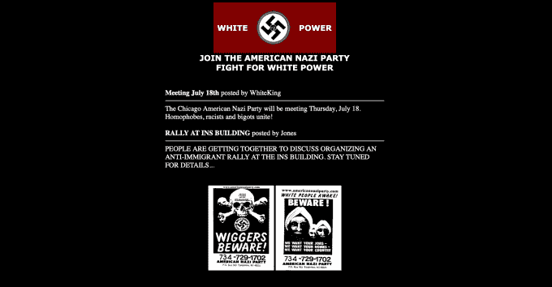
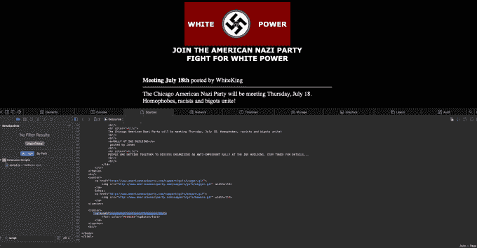
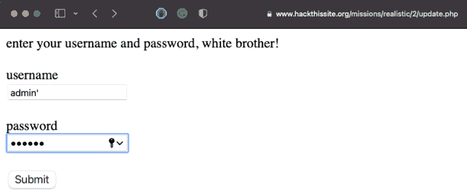
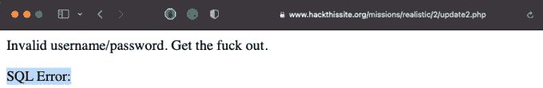
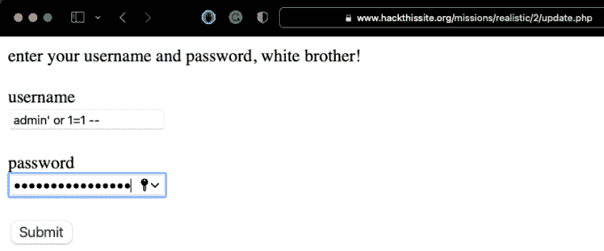

# 黑掉这个网站:现实的网络任务——第二级

> 原文：<https://medium.com/geekculture/hack-this-site-realistic-web-mission-level-2-e25cf07d8d97?source=collection_archive---------8----------------------->

Hack This Site: Realistic Web Mission — Level 2

今天，我们来看一下[黑掉这个网站](https://hackthissite.org/)现实任务第二关，我们需要黑掉纳粹。就我个人而言，我喜欢这个任务。这比基本的挑战更令人身临其境，因为你需要入侵的网站可能是真实的。虽然 web 应用程序只有两个页面，但是主页面立刻就定下了基调。为了完成这个任务，我们需要在 Nazi Web 应用程序的登录页面上执行 SQL 注入。如果你还没有看过我写的关于[现实 1](https://haxez.org/2021/09/hack-this-site-realistic-web-missions-level-1/) 的文章，请看看吧。

Chicago American Nazi Party Web Application

导航到现实 2 给你一条来自一个叫 DestroyFacism 的人的消息。他们听说我们是个优秀的黑客，想要我们帮忙对付纳粹。纳粹正在组织反对移民的仇恨集会。我们不能这样，让我们把他们拿下。

Message from DestroyFacism

# 探索 Web 应用程序

加载他们的 web 应用程序，象征性很强。如果你很容易被纳粹的象征主义所冒犯，那么这个可能不适合你。就我个人而言，我喜欢我可以黑掉纳粹的事实，这感觉太棒了。总之，回到技术层面。该网站似乎是基本的，除了图像没有其他互动。我不建议点击它们，因为它们链接到一个真正的纳粹网站。

Main Web Application Page

由于表面上没有太多的变化，让我们来看看幕后发生了什么。除了一个我们在主页上没有看到的网址，没有什么可看的。该 URL 引用了一个名为 update.php 的页面，因为主页可能是 index.html 或 index.php，我们可以假设这是一个不同的页面。

Main Web Application Page Source

导航到 update.php，我们得到一个登录表单。这将是我们用来破解应用程序的方法。可能有许多技术可以用来破解它(如暴力破解)，但我们应该测试应用程序是否容易受到 SQL 注入攻击。为此，我们可以使用单引号来转义 login forms SQL 查询，并将我们自己的数据追加到查询中。

Application Admin Login Page

# 网络应用黑客

向应用程序提交单引号会导致应用程序出错。这意味着应用程序没有为 SQL 查询使用准备好的语句。为了详细说明，准备好的语句使用占位符(如问号)来引用 SQL 查询。这意味着 SQL 查询不能转义，因为占位符正在调用它。然而，由于这个应用程序产生了一个 SQL 错误，它肯定没有使用准备好的语句，这意味着我们可以攻击它。

SQL Error On Admin Login Page

通过输入一个值并用单引号将其转义，我们可以将自己的 SQL 查询追加到当前查询中。我们要追加的值是‘or 1 = 1—’。这个值将帮助我们绕过身份验证，因为答案是真的。1 确实等于 1，因此 SQL server 将允许我们访问登录表单所保护的应用程序区域。

SQL Injection On Admin Login Page

提交值后，您就完成了任务。这是迄今为止我在实验室遇到的最好的任务之一。这是一个简单的实验室，但它的主题是辉煌的，谁不喜欢黑纳粹。它还使用了一种在野外仍然常见的实用方法。直到最近，注射攻击一直是 OWASP 十大攻击的第一名。从中可以吸取的教训是，当您的 web 应用程序需要查询 SQL server 时，请使用准备好的语句。