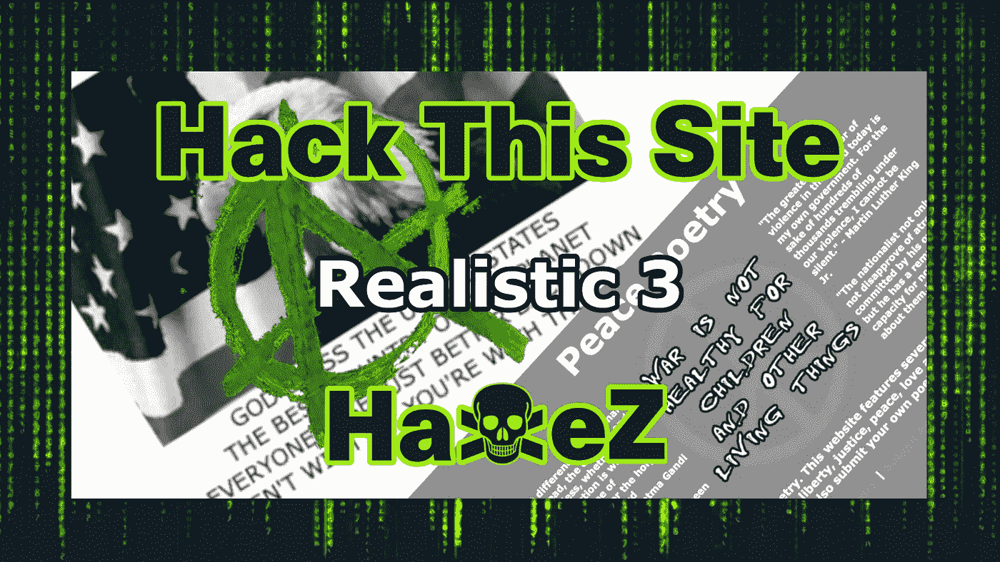
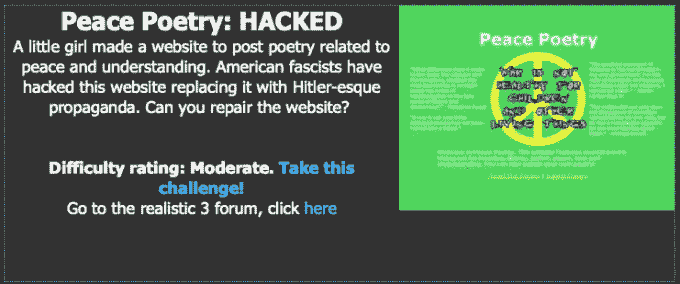
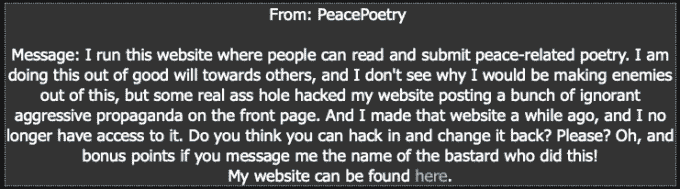
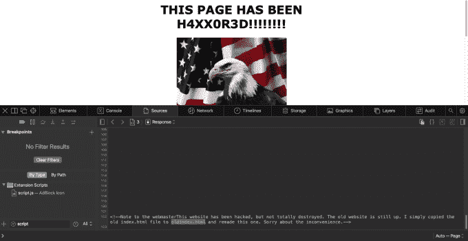
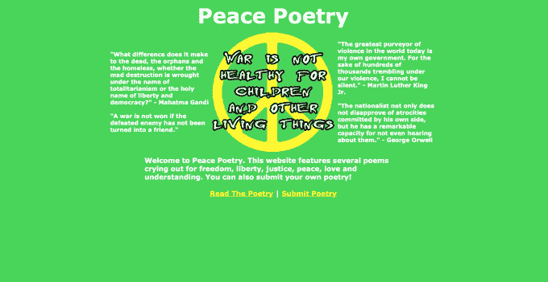
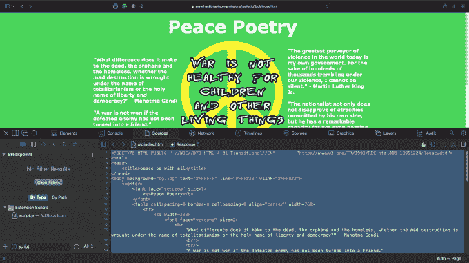
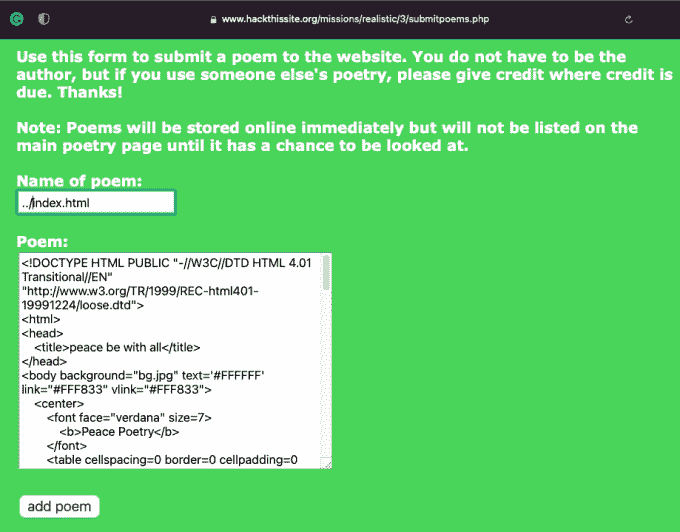

# 黑掉这个网站:现实的网络任务——第三级

> 原文：<https://medium.com/geekculture/hack-this-site-realistic-web-mission-level-3-39800ecf5ecd?source=collection_archive---------9----------------------->

Hack This Site: Realistic Web Mission — Level 3

今天我们来看看[黑掉这个网站](https://hackthissite.org/)现实任务 3。这项任务需要网站结构和网络表单如何工作的知识。总之，这是一个有趣的任务，但有些语法是不正确的，除非我错了。如果你没有看过我的其他帖子是现实系列，你可以在这里看:[第一部分](https://haxez.org/2021/09/hack-this-site-realistic-web-missions-level-1/)，和[第二部分](https://haxez.org/2021/09/hack-this-site-realistic-web-mission-level-2/)。

在导航到现实任务 4 时，你会收到来自 PeacePoetry 的以下消息。该消息解释说，她已经建立了自己的网站来提交和分享与和平有关的诗歌。然而，有人黑了她的网站，张贴了支持战争的宣传。她问我们是否可以黑掉她的网站来恢复原来的内容。

Message From PeacePoetry

# 探索网站

访问该网站时，我们看到一个标题，称该页面已被黑客攻击。有一幅雄壮爱国的雄鹰图。除此之外，该网站没有太多功能。

Defaced Web Application

因为在表层没有太多的东西，所以让我们再深入一点，看看在页面源代码中发生了什么。下面的图片显示了网页的来源，黑客友好地留下了一个信息，告诉我们旧网站的位置。旧址可以在 oldindex.html 找到。

Defaced Web Application Page Source

导航到 oldindex.html，我们发现原来的网站。它有一点动态功能，允许你提交和阅读诗歌。诗歌提交系统似乎是将诗歌直接写到网站所在的目录中。我们可以使用诗歌提交系统来恢复被黑的网站。

Original Web Application

# 恢复网站黑客

如果您返回到 oldindex.html 页面，您可以查看页面源代码。选择所有的页面源，并将其复制到剪贴板或保存在记事本文件中。一旦你抄好了，回到诗歌提交系统。

Original Web Application Page Source

将 oldindex.html 页面的页面源粘贴到诗歌内容框中。另外，给你的诗命名..我不确定为什么我们需要升级一个目录来覆盖当前的 index.html 页面。浏览网站内容，所有内容似乎都存储在/3/目录中。它不应该需要目录遍历来覆盖页面。我离题了，用这首诗的名字作为../index.html，应该会用原网站的页面源覆盖当前被黑的 index.html。这不会修复漏洞。但是，它会将旧网站恢复为主页。

Poem Submission System

点击提交将解决挑战