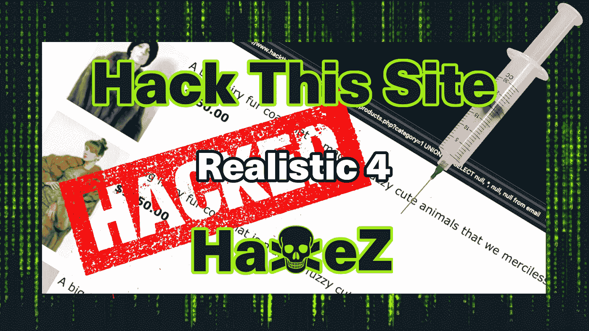
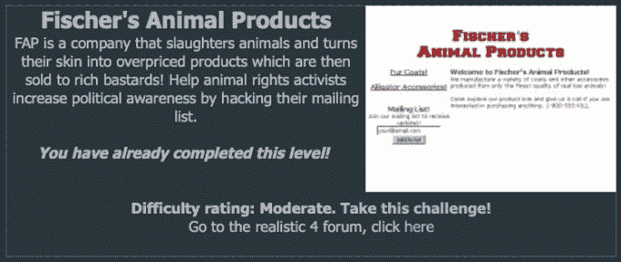
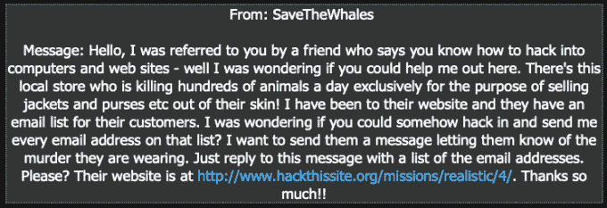
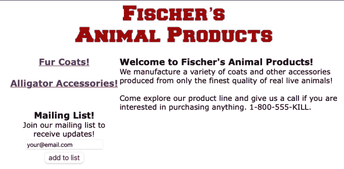
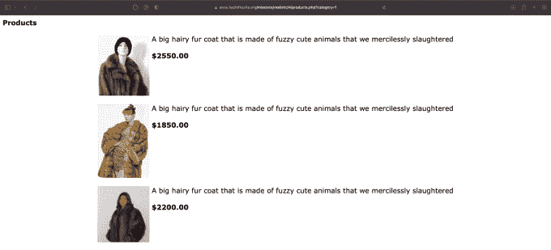
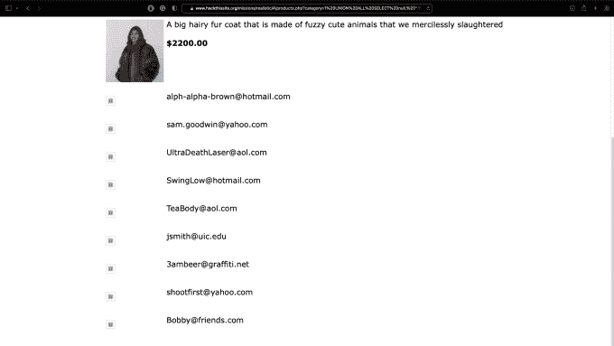
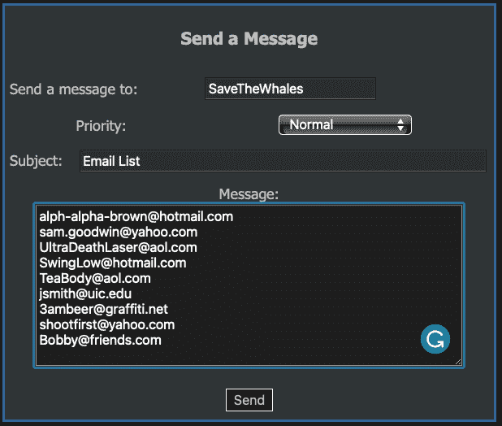

# 黑掉这个网站:现实的网络任务——第 4 级

> 原文：<https://medium.com/geekculture/hack-this-site-realistic-web-mission-level-4-5837af1f104?source=collection_archive---------4----------------------->



Hack This Site: Realistic Web Mission — Level 4

大家好，欢迎来到 HaXeZ，今天我们来看看[黑掉这个网站](https://hackthissite.org/)现实网络任务第 4 级。我喜欢这个挑战，尽管我对完成任务的语法感到困惑。该任务要求您执行 UNION ALL SQL 注入，以便从数据库中获取电子邮件地址。一旦你有了电子邮件地址，你需要把它们发送给客户。如果你没有看过我的其他帖子是现实系列，你可以在这里看到:[第一部分](https://haxez.org/2021/09/hack-this-site-realistic-web-missions-level-1/)、[第二部分](https://haxez.org/2021/09/hack-this-site-realistic-web-mission-level-2/)和[第三部分](https://haxez.org/2021/09/hack-this-site-realistic-web-mission-level-3/)。



Fischer’s Animal Products

如果你选择接受这个任务，那就是入侵 FAP 网站，窃取邮件列表上每个人的电子邮件地址。为什么？，因为 FAP 杀动物是为了把它们的毛皮卖给有钱的顾客。SaveTheWhales 好心地问我们是否可以得到邮件列表并发给他，以便他可以“联系他们”。



Message From SaveTheWhales

# 探索网站

访问该网站时，你会看到一个相当简单的页面，解释这个 web 应用程序是什么。有一个提交框，可以将您的电子邮件地址添加到邮件列表中。还有两个链接，一个是皮衣，一个是鳄鱼配饰(可怜的鳄鱼)。我们可以尝试攻击邮件列表提交系统，但是现在，让我们继续探索应用程序。



Main Web Application Page

点击毛皮大衣和鳄鱼皮配饰链接，您将进入相应的产品页面。这些页面看起来是动态的，好像是由 SQL 查询生成的。如果我们看一下页面的结构，它可以分为三个数据库列:图片、描述和价格。我们还可以假设有一个电子邮件地址表。



Web Application Product Page

# 网站黑客

尽管应用程序在追加单引号时没有出现错误。我们仍然可以尝试建立一个联合 SQL 注入。特定 SQL 注入检索数据的语法让我有点困惑。例如， [W3Schools](https://www.w3schools.com/sql/sql_ref_union.asp) 和 [Portswigger](https://portswigger.net/web-security/sql-injection/union-attacks) 都有关于 UNION SELECT 和 UNION SQL 注入的优秀文章。W3Schools 解释说 UNION SELECT 和 UNION ALL SELECT 的区别在于 UNION ALL SELECT 将包含重复值，而 UNION SELECT 则不会。我们从数据库中提取的信息没有重复值，但是 UNION SELECT 注入不起作用。此外，Portswigger 有许多例子，它们都以单引号开始，以脱离现有的 SQL 查询。在这里向 UNION ALL SELECT 命令添加单引号不起作用。我可能误解了正在发生的事情，但请随时给我留下评论。

无论如何，回到黑客。所以我们知道可能有三个表列。一个用于产品图片，一个用于产品描述，一个用于产品价格。我们还知道可能有一个叫做电子邮件的表格。有了这些信息，我们就可以构造 UNION ALL SELECT 命令了。

首先，我们告诉数据我们正在执行什么类型的查询。

```
UNION ALL SELECT
```

其次，我们告诉数据库我们想要什么列，以及我们想要将数据注入到什么列中。这适用于第二列和第三列。然而，如果你把它放入第二列，你的字体将会是正常的，但是如果你把它放入第三列，你的字体将会是粗体的。这与网站的格式相匹配。

```
NULL, *, NULL, NULL
```

最后，我们告诉它我们想从哪里查询数据。例如，我们想从电子邮件表中提取数据。我们还需要用分号结束查询。

```
FROM EMAIL;
```

把所有这些放在一起，你应该有一个看起来如下的 SQL 注入。

```
UNION ALL SELECT NULL, *, NULL, NULL FROM email;
```

接下来，我们需要将 SQL 注入追加到 URL 末尾的 1 之后。根据您的注入点和字符的大小写，查询应该类似于下图。


UNION ALL SELECT SQL Injection

完成后，按键盘上的 return 键，您应该看到 web 应用程序加载了一些附加信息。邮件列表中的电子邮件地址已包含在产品查询中。



UNION ALL SELECT SQL Injection Returned Results

从页面上复制电子邮件地址，然后返回到主 HackThisSite 网站。点击你的名字在左边，然后当你的个人资料加载，再次点击它。你将看到一个发送信息框。将收件人改为 SaveTheWhales，并将你从 FAP 网站窃取的电子邮件地址列表发送给他们。



Replying to SaveTheWhales

就这样，你现在应该已经完成了这个任务。这是一个有趣的任务，使用了一种基于联盟的 SQL 注入形式的实用开发技术。虽然我认为语法有点奇怪，我会等着有人来纠正我，然后再改变主意，但这是一个很好的例子。从中我们可以了解到，对后端数据库的查询应该使用准备好的语句。使用准备好的语句！！！

不管怎样，今天就到这里，希望你喜欢。请观看视频，我们下次再见。