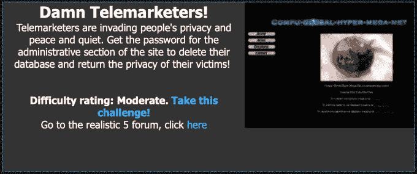
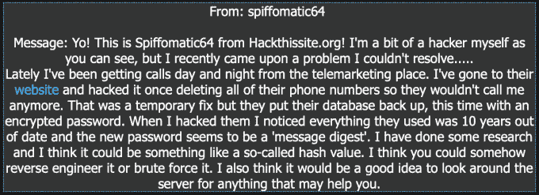
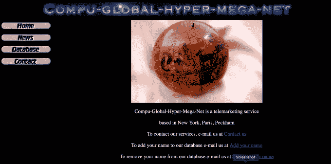
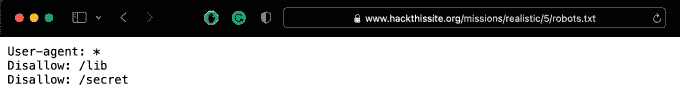
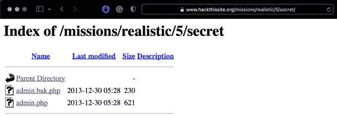
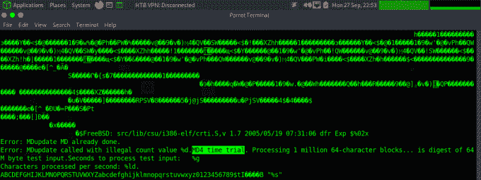
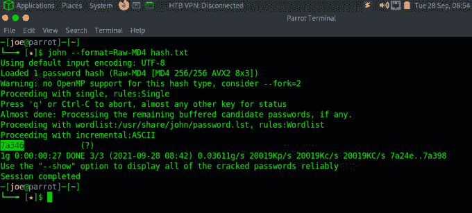

# 黑掉这个网站:现实的网络任务-第 5 级

> 原文：<https://medium.com/geekculture/hack-this-site-realistic-web-mission-level-5-876ff4cfe2ec?source=collection_archive---------6----------------------->


Hack This Site: Realistic Web Mission — Level 5

今天我们来看看黑客网站现实任务 5。这是一个有趣的挑战，要求您枚举 web 应用程序，然后破解发现的散列。为了完成这个任务，你需要一些关于 Linux web 服务器如何工作的基础知识，以及一些关于什么是密码散列和如何破解它们的知识。如果你没有看过我在现实系列上的其他帖子，你可以在这里看到:[第一部分](https://haxez.org/2021/09/hack-this-site-realistic-web-missions-level-1/)、[第二部分](https://haxez.org/2021/09/hack-this-site-realistic-web-mission-level-2/)和[第三部分](https://haxez.org/2021/09/hack-this-site-realistic-web-mission-level-3/)。



Realistic Web Mission — Level 5 Damn Telemarketers

这个任务的目的是破解一个电话销售网站的密码。有了这个密码，我们就可以破坏数据库，从而恢复受害者的隐私。为了获得密码，我们需要浏览 web 应用程序来寻找线索。登录后，我们收到以下来自的信息



Message From Spiffomatic64

# 探索网络应用

Spiffomatic64 为我们提供了一个电话销售应用程序的链接。访问 web 应用程序时，我们会看到下图所示的页面。该应用程序具有一些基本功能，如新闻页面、联系人页面和数据库页面。



Main Web Application Page

导航到新闻页面会告诉我们关于应用程序的很多信息。可能比造物主应该告诉我们的还要多。例如，他们告诉我们网站以前被黑客攻击过。他们还告诉我们，谷歌正在抓取它不应该抓取的链接，所以他们采取了额外的预防措施。为了阻止 google 索引 web 应用程序的某些部分，您可以在您的域的根目录中添加一个 [Robots 排除标准](https://en.wikipedia.org/wiki/Robots_exclusion_standard)文件。通过向 robots.txt 文件添加 URL，你是在告诉 Google，下次它抓取应用程序时，你不希望这些 URL 被编入索引。


Main Web Application News Feed

# 深入探究

导航到 robots.txt 文件，我们可以看到该文件告诉所有用户代理(用星号表示)不允许索引/lib 和/secret。搜索引擎蜘蛛有自己的用户代理，允许应用程序识别它们并将它们列入白名单。参见我在[用户代理切换](https://haxez.org/2021/09/bypass-web-application-paywalls-with-user-agent-switching/)上的帖子，了解这可能会被滥用。



Main Web Application Robots.txt

浏览这些目录会发现一些有趣的文件。首先，在秘密目录中，我们有一个 admin.bak.php 文件和一个 admin.php 文件。我们可以推断 admin.bak.php 很可能是 admin.php 文件的备份。试图访问 admin.php 文件会导致密码错误警告。这让我们可以断定 admin.php 页面就是我们试图访问的页面。



Secret Directory Listing

接下来，让我们看看 admin.bak.php 的档案。我已经将这个文件的副本下载到我的虚拟机上，并使用 cat 命令来显示内容。我们可以从文件中看到有一个对 MD4 的引用。MD4 是一种用于哈希密码的哈希算法。哈希密码试图在密码泄露的情况下保护密码。



Backup Admin.php File MD4 Hash

# 应用黑客

回到 robots.txt 文件，有另一个名为 lib 的目录。导航到这个目录会显示一个名为 hash 的文件。如果我们下载该文件并查看其内容，似乎我们已经恢复了密码哈希“51 ba 17 c 17338 c 1031 e 11432 DFB 47105 a”。


Lib DIrectory Listing

根据我们在 admin.bak.php 文件中找到的信息，我们可以有把握地假设散列是 MD4。幸运的是，MD4 是一种相当古老的哈希算法，很容易被破解。我试图使用 crackstation.net 和其他几个网站在线破解哈希，但似乎黑客网站的偷偷摸摸的管理员喜欢定期改变哈希，而这个哈希以前没有被破解过。所以为了破解这个难题，我们需要联系我们的老朋友约翰。使用开膛手约翰，我指定了 MD4 的格式，并告诉约翰要破解哪个文件。通常我会指定一个单词表，但我让 John 使用他的默认单词表。破解散列的命令如下。

```
john --format=raw-MD4 <file-to-crack>
```



Hash Cracking MD4 With John The Ripper

一旦恢复了正确的密码，您就可以转到主页上的数据库链接并粘贴它。这应该能完成任务。