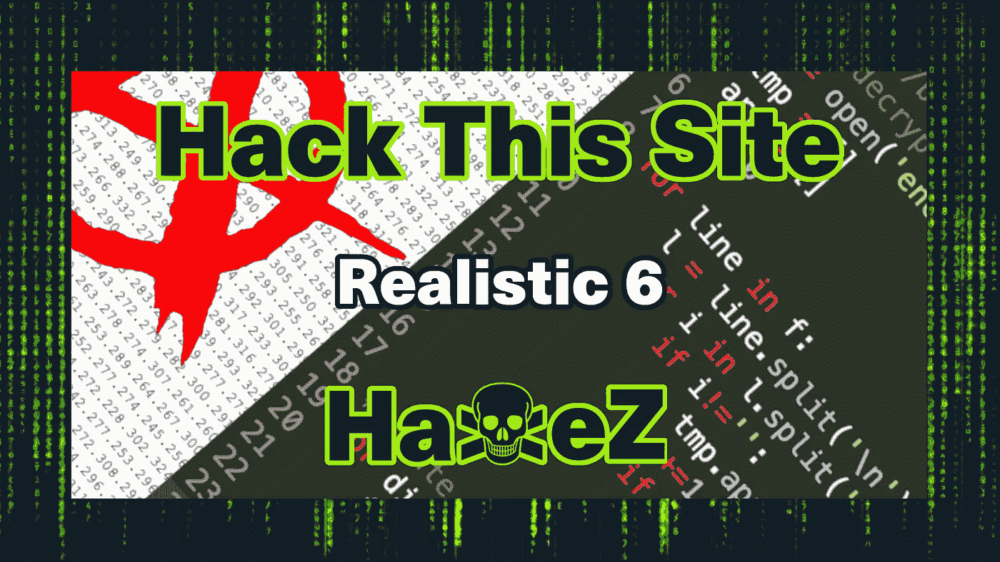
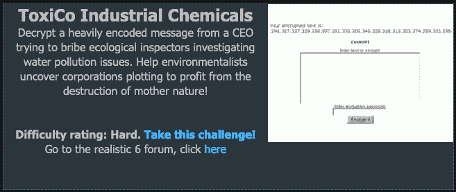
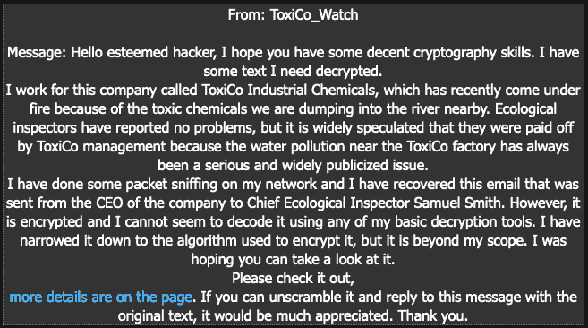
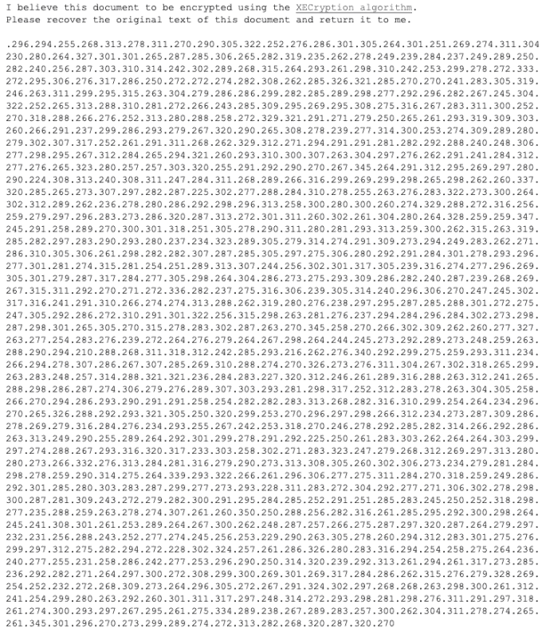
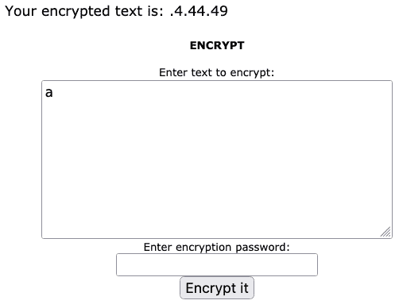
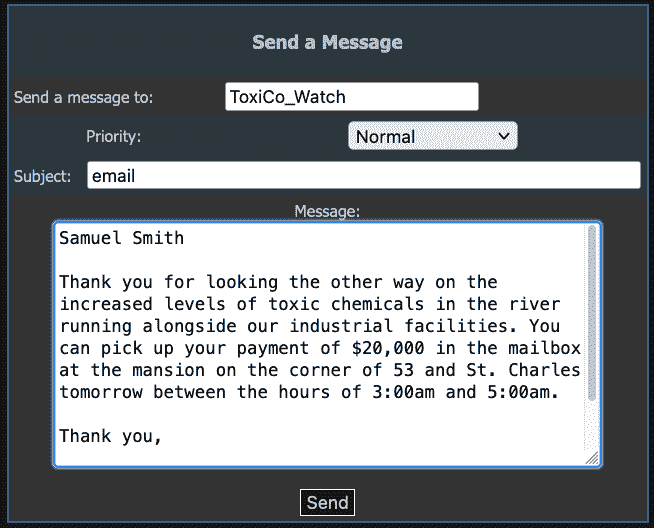

# 黑客这个网站:现实的网络任务-第 6 级

> 原文：<https://medium.com/geekculture/hack-this-site-realistic-web-mission-level-6-88d4c22df06?source=collection_archive---------17----------------------->

Hack This Site: Realistic Web Mission — Level 6

感谢你的来访，今天我们来看看黑客这个网站现实网络任务第 6 级。我已经暂停了这项任务，试图编写一个 bash 脚本来解密加密。然而，写了几次都没什么进展，我决定用别人的剧本。我明白算法是如何工作的，以及如何逆转它。然而，写一些东西来逆转被证明比预期的更难。如果你没有看过我在现实系列上的其他帖子，你可以在这里看到:[第一部分](https://haxez.org/2021/09/hack-this-site-realistic-web-missions-level-1/)、[第二部分](https://haxez.org/2021/09/hack-this-site-realistic-web-mission-level-2/)、[第三部分](https://haxez.org/2021/09/hack-this-site-realistic-web-mission-level-3/)、[第四部分](https://haxez.org/2021/09/hack-this-site-realistic-web-mission-level-4/)和[第五部分](https://haxez.org/2021/09/hack-this-site-realistic-web-mission-level-5/)。

ToxiCo Industrial Chemicals

# 介绍

我们有一条来自毒物观察的消息。他们解释说，由于有毒废物丑闻，他们一直在窥探他们公司的网络。他们认为公司已经买通了检查员，但是想要证据来证明这一点。在他们的网络嗅探过程中，他们能够捕获到他们认为是加密的信息。然而，他们在解码信息时遇到了困难，请求我们帮助。

Message From ToxiCo_Watch

# 密文

ToxiCo_Watch 为我们提供了一个包含编码信息的网络应用程序的链接。该应用程序还包含一个到用于编码它的 web 应用程序工具的链接。您可以从下图中看到，该消息似乎是一个句号，后面跟着三个数字。这种模式一直重复到消息结束。

Encoded Message

# Web 加密工具

如果我们转到提供的链接，我们有一个要加密的文本输入框。我们还有一个加密密码输入框。如果我们提交一个没有密码的值，我们会在屏幕顶部得到一些数字(4，44，49)。如果我们把这些数字加在一起，我们得到 97。97 是字母 A 的 ASCII 十进制数，我们可以对其他字母重复这个过程，并得到它们相应的 ASCII 十进制值。但是，当我们向加密密码框中添加一个值时，该值会发生变化。提供给加密密码框的值也将被转换为 ASCII 十进制数，该十进制数将被添加到提交的文本 ASCII 值中。然后，它被分成三个数字，计算时等于文本的 ASCII 值加上加密密码。

Web Encryption Tool

# Web 解密工具

如果我对加密过程解释得足够好，我应该能够解释如何解密它。首先，我将把编码后的消息复制到一个文本文件中。其次，我将使用 sed 删除句号。第三，我将使用一个带有“expr substr”的循环从文件中提取 3 个字符。我还打算给我们一个变量，增加 3 位数，跳转到下三个字符。第四，我要计算这三个数的值。接下来，我将从总值中减去一个增量值(代表加密密码)。然后，脚本会将结果回显到终端。

这应该允许我识别正确的转换。然而，剧本并没有按计划进行。由于其他的承诺，我没有足够的时间来做这件事。幸运的是，我的编程无能可以用别人的编程天才绕过。Graeme Robinson 的博客有一个很棒的 JavaScript 解决方案，我们可以用它来解码信息。

Web Decryption Tool

# 给客户发电子邮件

一旦我们有了解码的信息，我们就可以把它发送到 ToxiCo_Watch。这应该完成了挑战。我希望你能原谅我没有写我自己的脚本来解决这个问题。我已经准备好了一个基本的概念证明，但是还没有时间来完成它。也许我会在将来更新这个博客。

Emailing The Client