# 黑客这个网站:现实的网络任务-第 7 级

> 原文：<https://medium.com/geekculture/hack-this-site-realistic-web-mission-level-7-7404c9909c39?source=collection_archive---------14----------------------->

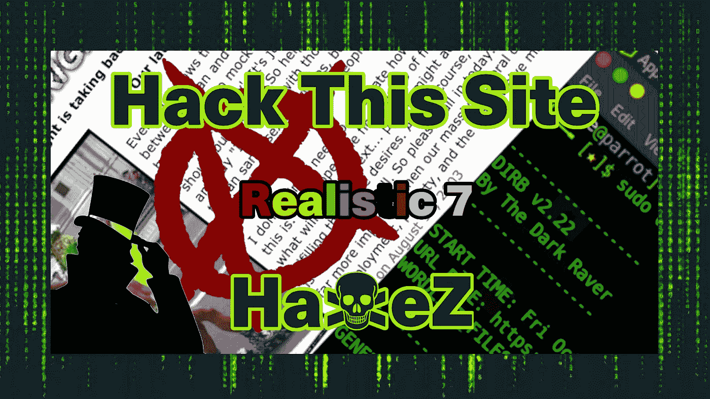

Hack This Site: Realistic Web Mission — Level 7

感谢您的光临，今天我们来看看[黑掉这个网站](https://hackthissite.org/)现实网络任务第 7 级。这次挑战非常有趣。不管这个网站的黑客历史有多长，它仍然是测试你黑客技能的最具沉浸感的平台之一。所使用的技术今天仍然适用。然而，许多你肯定不希望在大公司网站上发现的漏洞。如果你没有看过我在现实系列上的其他帖子，你可以在这里看到:[第一部分](https://haxez.org/2021/09/hack-this-site-realistic-web-missions-level-1/)、[第二部分](https://haxez.org/2021/09/hack-this-site-realistic-web-mission-level-2/)、[第三部分](https://haxez.org/2021/09/hack-this-site-realistic-web-mission-level-3/)、[第四部分](https://haxez.org/2021/09/hack-this-site-realistic-web-mission-level-4/)、[第五部分](https://haxez.org/2021/09/hack-this-site-realistic-web-mission-level-5/)和[第六部分](https://haxez.org/2021/09/hack-this-site-realistic-web-mission-level-6/)。

What’s Right For America

# 介绍

导航到此挑战，您将收到来自 FreedomOfChoice 的消息。套用这条信息，他们解释了他们是如何发现一个要求黑客攻击的仇恨言论网站的。该网站是一个仇视同性恋的网站，喜欢规定其他人应该如何生活。令人担忧的是，尽管这些挑战由来已久，但这些问题在今天仍然具有相关性。我猜进展很慢。我跑题了，FreedomOfChoice 想让我们黑进网站的管理区，他认为这个管理区藏在目录结构的某个地方。

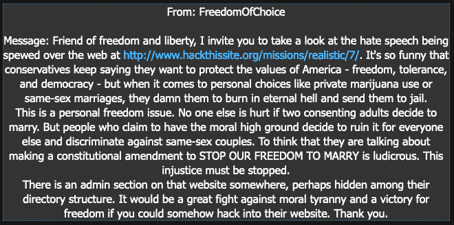

Message From FreedomOfChoice

# 探索 Web 应用程序

在访问这个应用程序时，我们看到的是标准的仇恨言论，互联网可以少用一些。不过没关系，通过我们的努力，这个网站将不复存在。乍一看，这个网站似乎相当简单，只有几个超链接。我们需要更深入地研究应用程序的黑暗角落，以找到我们可以利用的东西。

Web Application

点击应用程序后，我注意到它以一种奇怪的方式调用图像文件。这很奇怪，因为它似乎是在执行本地文件包含来访问文本文件。本地文件包含立即敲响了警钟。如您所见，showimages.php 脚本有一个名为 file 的参数，它调用 patriot.txt

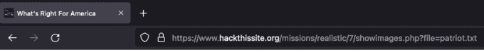

Web Application — File Parameter

如果我们导航到 patriot.txt，我们可以看到它有一个图像目录中的图像列表。这是一种将图像嵌入网站的奇怪方式。或许，我们可以利用这一点。

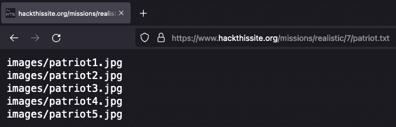

Web Application — Patriot.txt

# Web 目录列表已启用

导航到图像目录，我们已经得分。如您所见，下图显示启用了目录列表。请注意，网络安全的一个重要因素是尽量减少信息泄露。启用目录列表可能会泄露有关应用程序的信息，如其结构、使用的技术，甚至通过可读文件泄露其他敏感信息。似乎有一个管理目录。

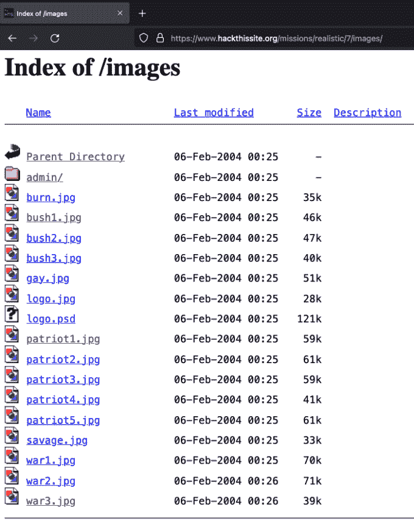

Web Application — Directory Listing

试图访问 admin 目录会给我们预期的未授权错误信息。但是，登录提示似乎是由 htaccess 和 htpasswd 文件组合生成的。以前，我们看到的其他挑战使用 SQL 支持的应用程序登录。

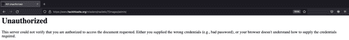

Web Application — Authentication Failure

# 开发 Web 应用程序

此时，可以安全地假设应用程序正在使用 htpasswd 进行身份验证。我们还知道 file 参数执行本地文件包含来获取图像文件。总而言之，也许我们可以利用本地文件包含来获得我们的优势，并列出管理目录的内容，而无需进行身份验证。

为了测试这一点，我使用了一个叫做 DIRB 的工具。DIRB 是一个目录和文件暴力工具。管理目录的位置在/images/admin，所以我告诉 DIRB 通过 showimages.php 搜索这个目录？文件=参数。

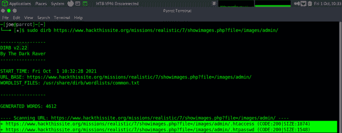

Web Application — DIRB Directory Brute Force

# Web 本地文件包含

上图显示了运行 DIRB 的结果。如您所见，DIRB 发现了隐藏在 admin 目录中的 htaccess 和 htpasswd 文件。这也意味着，我们可以使用 showimages.php。file=参数来读取这些文件的内容。让我们从 htaccess 文件开始。从下图可以看出，htaccess 文件引用的是 htpasswd 文件。这证实了我们的怀疑，它被用于认证。

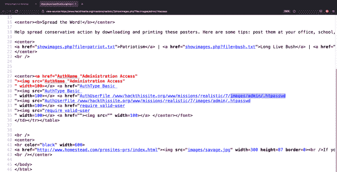

Web Application — .htaccess File

现在，如果我们去查看 htpasswd 文件。我们可以看到 htpasswd 文件包含管理员用户的密码散列。或许，我们可以破解这个密码散列，并使用它登录到应用程序的管理区域。

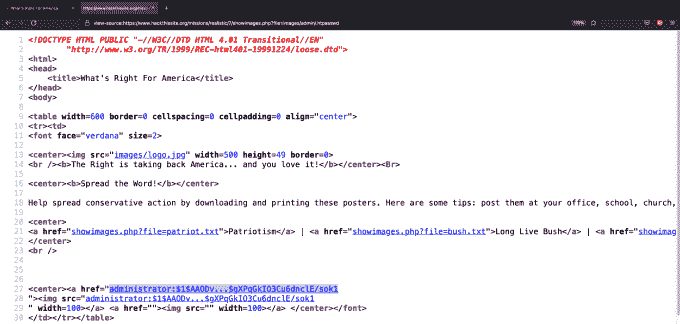

Web Application — .htpasswd File

# 哈希破解

散列保存在一个名为 hash.txt 的文件中，我们启动我们的 Linux ParrotOS 虚拟机，并请我们亲爱的老朋友 John The Ripper 为我们破解它。我没有提供任何标志，我只是把文件指给约翰，他就开始工作了。约翰很快识别出这是一个 MD5 散列。鉴于我是在虚拟机上运行密码，约翰破解密码的速度也快得惊人。然而，我假设 shadow 在默认单词列表中的位置相当高。

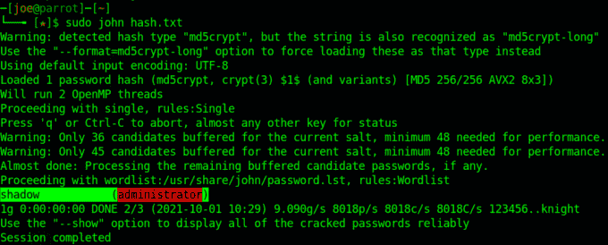

John The Ripper — Hash Cracking

随着哈希的破解和密码的保存，我们可以导航回/images/admin 目录，看看我们新获得的管理员密码是否有效。当登录框弹出时，输入用户名 administrator 和密码 shadow。点击登录，你应该通过验证。

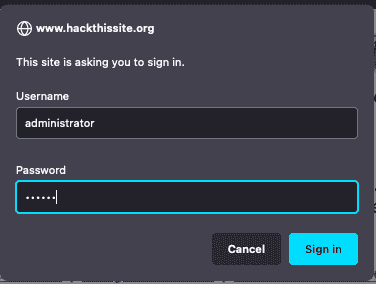

Web Application — Authenticating

至此，你应该完成了，祝贺你现在已经完成了一个现实的 7。

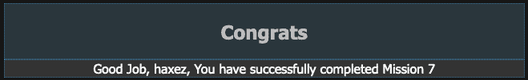

Congratulations

# 结论

这项任务中有相当多的部分需要分解。让我们把目录列出来，因为这是我们以前接触过的东西。目录列表会将敏感信息暴露给公众。在大多数 web 服务器上关闭是相当容易的，这样做将限制恶意行为者可以获得的关于环境的信息量。

本地文件包含是我们用来收集应用程序信息的下一项技术。我很高兴看到应用程序使用了相对路径而不是绝对路径。这最大限度地减少了信息泄露，但问题在于应用程序调用图像文件的方式。它没有将它们硬编码到源代码中，而是使用了一个参数。这允许我们利用该参数的信任，并使用它来调用 web 服务器上的其他文件。

许可也很宽松。这个参数允许我们访问 admin 目录中的文件，这是不可能的。

无论如何，我感觉有点像马后炮队长，所以随着挑战的完成，我希望你喜欢这篇文章。请稍后回来查看更多黑客攻击。