# 黑客这个网站:现实的网络任务-第 8 级

> 原文：<https://medium.com/geekculture/hack-this-site-realistic-web-mission-level-8-938d6cb9f712?source=collection_archive---------12----------------------->

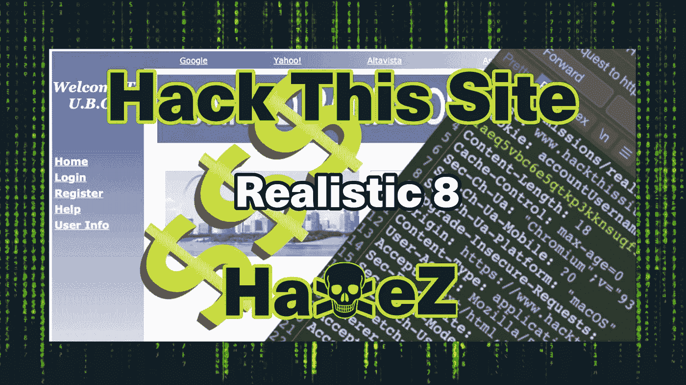

嗨，谢谢你访问我的博客。今天我们来看看[黑掉这个网站](https://hackthissite.org/)现实网络任务第 8 关。这项任务要求我们执行 SQL 注入以获取受害者的用户名。一旦我们有了用户名，我们需要注册一个帐户并操作 cookies，以便从受害者的帐户转移一千万美元到我们客户的帐户。之后，我们需要通过删除日志文件来隐藏我们邪恶行为的所有证据。如果你没有看过我在现实系列上的其他帖子，你可以在这里看到:[第一部分](https://haxez.org/2021/09/hack-this-site-realistic-web-missions-level-1/)、[第二部分](https://haxez.org/2021/09/hack-this-site-realistic-web-mission-level-2/)、[第三部分](https://haxez.org/2021/09/hack-this-site-realistic-web-mission-level-3/)、[第四部分](https://haxez.org/2021/09/hack-this-site-realistic-web-mission-level-4/)、[第五部分](https://haxez.org/2021/09/hack-this-site-realistic-web-mission-level-5/)、[第六部分](https://haxez.org/2021/09/hack-this-site-realistic-web-mission-level-6/)和[第七部分](https://haxez.org/2021/10/hack-this-site-realistic-web-mission-level-7/)。

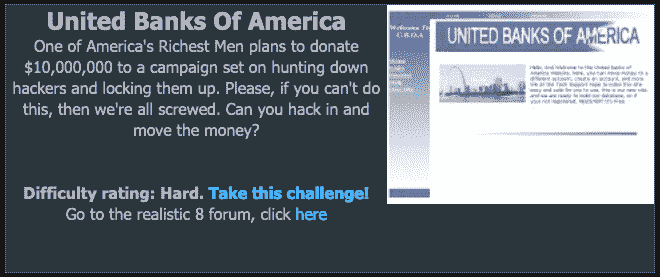

United Banks of America

# 介绍

我们收到了黑暗之王发来的信息。该消息解释说，一位名叫加里·亨特的企业家将一千万美元存入了他的美国联合银行账户。存款的目的是为了让他能把钱捐给一项运动。这场运动的目标是追捕并锁定黑客。客户希望我们闯进去偷这笔钱。


Message From DarkOneWithANeed

# 探索 Web 应用程序

首先，让我们看看应用程序，看看我们在处理什么。乍一看，这个 web 应用程序似乎相当简单。它有许多页面，包括主页、登录、注册、帮助和用户信息。如果我们回头看这条消息，第一个挑战是找到 Gary Hunter 的帐户。幸运的是，似乎有一个用户信息页面。

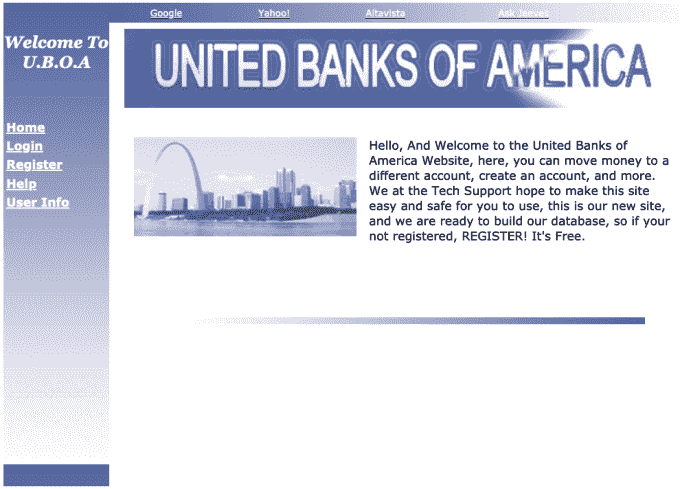

Web Application — United Banks of America

# Web 应用程序用户信息 SQL 注入

用户信息页面允许我们搜索用户。然而，如果我们搜索 Gary 这个名字，我们会得到一个用户返回。我们可以尝试搜索字母 A，希望它会返回名称中带有 A 的所有用户，但这不起作用。如果我们输入一个单引号，就会得到一个 SQL 错误，说明从表“users”中获取用户名信息时出现了问题。这表明该应用程序易受 SQL 注入攻击。

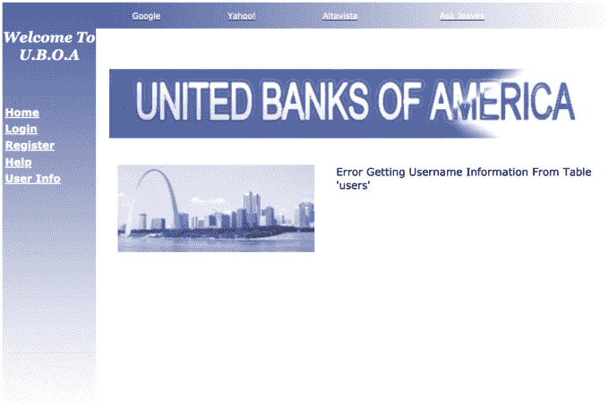

Web Application — User Info SQL Error

如果我们在搜索框中使用下面的有效载荷，我们应该得到一个用户列表。这样做的原因是我们避开了语法，添加了我们自己的语法，并注释掉了其余的语法。我们的语法是告诉 SQL server 返回用户“a”或任何为真(存在)的内容。

```
' or 1=1 --
```

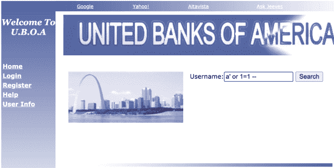

Web Application — SQL Injection

一旦我们提交了有效负载，我们应该得到一个返回的用户列表。如果我们在键盘上按 ctrl+f，我们可以搜索加里。第一个结果应该是我们的受害者加里·亨特。将他的名字和–$ $ $ $-值复制并粘贴到您的笔记中，因为我们稍后会用到它。

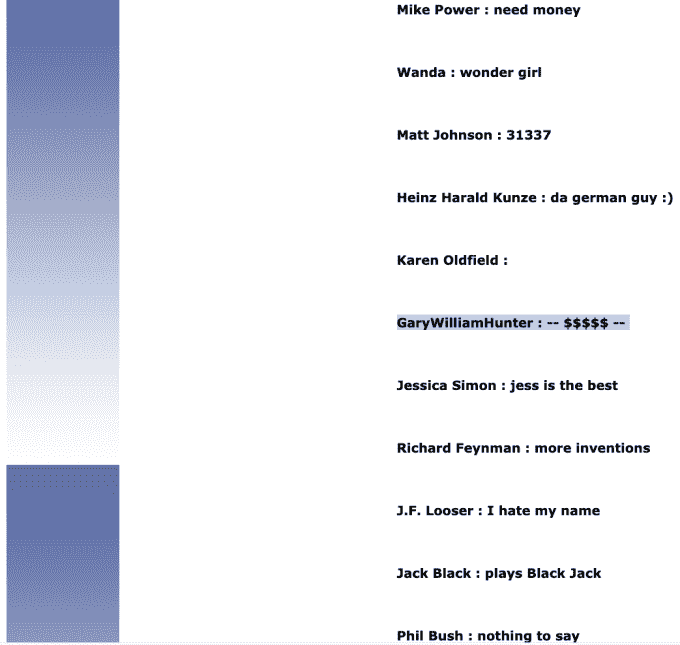

SQL Injection — Results

# 移动资金 Cookie 操作

现在我们有了受害者的用户名，我们需要把一千万美元从他们的账户转到我们客户的账户。为了做到这一点，我们需要注册自己的帐户，看看我们有什么功能。我注册了用户名哈克斯。

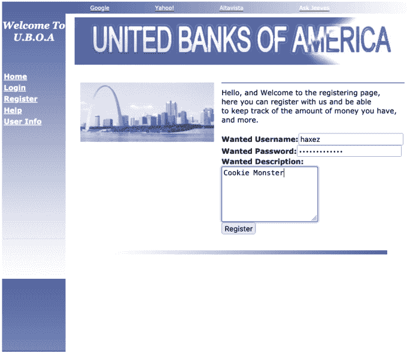

Web Application — Register Account

创建帐户后，登录。您应该看到您有您的帐户信息和两个选项。清除个人文件夹中的文件，并将资金转移到不同的帐户。不幸的是，就像在现实生活中一样，我们的银行账户里没有钱。然而，也许我们有办法欺骗网络应用程序，让它认为我们是加里·亨特。如果我们预先填充移动资金选项，并加载我们最喜欢的 web 应用程序渗透测试工具 Burp Suite。我们可以在请求发送到服务器之前拦截它。

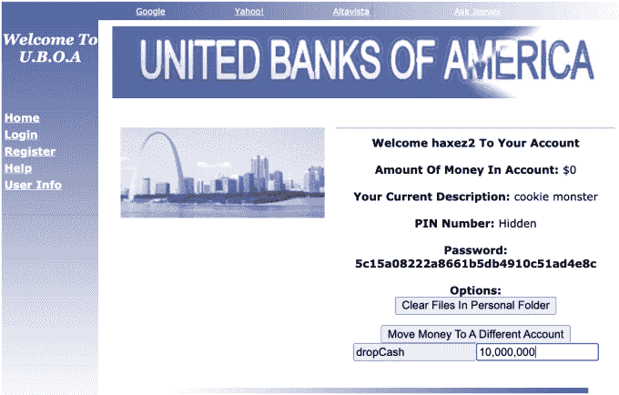

Web Application — Move Money

一旦您填充了“移动资金”参数，请确保 Burp Suite intercept 处于打开状态，然后单击“移动资金”按钮。你应该会看到一个像下面这样的窗口(取决于你的主题，黑暗模式规则)。如果我们分析该请求，您可以看到该请求被发送到 movemoney.php。请求的内容是两个参数，`*TO=dropCash*`和`AMOUNT=1000000000`。然而，值一千万可能看起来很奇怪，因为它是 URL 编码的。您还应该看到有许多 cookies。我们想要操作的 cookies 是“`accountUsername`和“`accountPassword"`”。幸运的是，Burp 允许我们在提交之前直接修改这些值。编辑 cookies 并用我们从 SQL 注入(`accountUsername=GaryWilliamHunter; accountPassword=-- $$$$$ --;`)获得的值替换它们。转发请求。

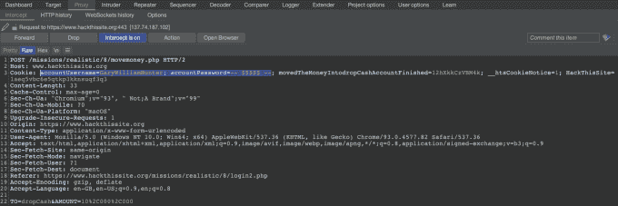

Request — Interception

# Web 应用程序清除文件黑客

既然我们犯下了世纪罪行，我们需要掩盖我们的痕迹。客户的电子邮件告诉我们，日志保存在一个名为 logFiles 的目录中。转移资金后，您将从应用程序中注销。重新登录到应用程序，并再次打开打嗝拦截。单击“清除个人文件夹中的文件”按钮。跳回打嗝，你应该看到请求。在标题的底部，您会看到参数`dir=<usernameSQLFiles>`。将该值更改为 logFiles 并转发请求。

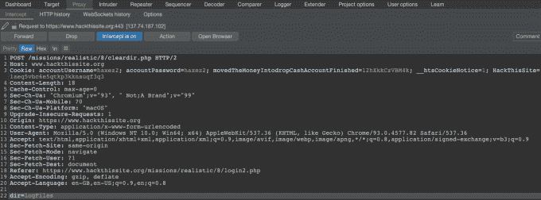

Request — Modification

之后，你可以回到你的浏览器，你应该看到你已经成功地完成了任务。

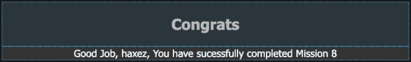

Congratulations

# 结论

这是一个有趣的挑战，让我们再次戴上义务黑客的帽子。虽然该应用程序已经过时，但它证明了糟糕的设计选择会导致安全性方面的缺陷。SQL 注入是可能的，因为应用程序没有使用准备好的语句。这可以通过类似下面的方法来缓解。

```
$stmt = $conn->prepare"SELECT FROM Users (Username, Description) VALUES (?)"0;$stmt->bind_param("s", $Username, $Description);
```

用于转移资金的 cookie 操作是一种有趣的技术。这是为什么会话令牌和反跨站点请求伪造令牌很重要的一个例子。通过使用唯一的非描述性 cookie 和服务器端检查来验证这些 cookie，您可以确保恶意威胁参与者无法劫持其他用户的会话，或者在这种情况下，无法冒充用户并提交数据。

清除日志文件表单上的目录操作是另一个很好的例子，说明了为什么从用户浏览器传输的任何内容都不应该被信任。数据可能被操纵，并产生意想不到的后果。这可以通过使用会话令牌来引用存储在服务器端缓存中的属性来缓解。也可以通过在处理值之前对其进行验证来缓解这一问题。

无论如何，我希望你喜欢这篇文章。下次回来，我们将看看现实 9。