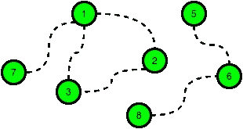

# HackerRank 道路和图书馆解决方案

> 原文：<https://medium.com/geekculture/hackerrank-roads-and-libraries-solution-dd15a99360c4?source=collection_archive---------2----------------------->

## 解决黑客道路和图书馆问题


Photo by [Martin W. Kirst](https://unsplash.com/@nitram509?utm_source=medium&utm_medium=referral) on [Unsplash](https://unsplash.com?utm_source=medium&utm_medium=referral)

## 问题

确定为所有哈克兰市民提供图书馆服务的最低成本。从 *1* 到 *n* 共有 *n* 个城市。目前，没有图书馆，城市之间也没有连接。在*城市*中列出的任何一对城市之间都可以修建双向道路。在下列情况下，公民可以进入图书馆:

*   他们的城市有一座图书馆。
*   他们可以通过公路从他们的城市旅行到一个有图书馆的城市。

**例子**

下图是 HackerLand 的示例地图，其中虚线表示可能的道路:



```
c_road = 2
c_lib = 3
cities = [[1,7],[1,3],[1,2],[2,3],[5,6],[6,8]]
```

建任何一条路的成本是 *c_road = 2* ，建任何一个城市的图书馆的成本是 *c_lib = 3* 。花费 *5 x 2 = 10* 修建 *5* 条道路，花费 *6* 修建 *2* 座图书馆。循环 1 → 2 → 3 → 1 中的可用道路之一不是必需的。

有 q 个查询，其中每个查询由 HackerLand 的地图和 *c_lib* 和 *c_road* 的值组成。对于每个查询，找出使图书馆对所有公民开放的最低成本。

**功能描述**

在下面的编辑器中完成函数 roadsAndLibraries。
roadsAndLibraries 有以下参数:

*   int n:整数，城市的数量
*   int c_lib: integer，构建库的成本
*   int c_road:整数，修复道路的成本
*   int cities[m][2]:每个 *cities[i]* 包含两个整数，表示可以通过新道路连接的城市

**返回**
int:最小成本

黑客排名的问题在于

[](https://www.hackerrank.com/challenges/torque-and-development/problem) [## 道路和图书馆| HackerRank

### 确定为所有哈克兰市民提供图书馆服务的最低成本。有编号从到的城市…

www.hackerrank.com](https://www.hackerrank.com/challenges/torque-and-development/problem) 

## 解决办法

使用 DFS 和分组有几种方法可以解决这个问题。但是，如果意识到还没有道路，而这些链接只是潜在的要修建的道路，问题就可以简化了。

所以*如果 c_lib < c_road* ，我们不需要考虑任何道路，只需要一个 lib 对应一个城市。如果 c_road < c_lib ，我们有动力修路，但只是在潜在的路段上。然后，我们可以将所有这些可以连接的城市分组，并通过计算道路成本为所有这些城市指定一个城市。

考虑到这一点，我们可以在下面用 C++想出一个解决方案。实现指的是讨论小组。

```
#include <bits/stdc++.h>

using namespace std;

string ltrim(const string &);
string rtrim(const string &);
vector<string> split(const string &);

// simple hashes, though limited to space
int Size[100001];
int Parent[100001];

int find(int a) {
    if(a == Parent[a]) return a;
    return Parent[a] = find(Parent[a]);
}

// Group cities based on the potential roads
void group(int a, int b) {
    a = find(a);
    b = find(b);
    if (a == b) return;
    if (Size[a] < Size[b]) swap(a, b);
    Parent[b] = a;
    Size[a] += Size[b];
}

/*
 * Complete the 'roadsAndLibraries' function below.
 *
 * The function is expected to return a LONG_INTEGER.
 * The function accepts following parameters:
 *  1\. INTEGER n
 *  2\. INTEGER c_lib
 *  3\. INTEGER c_road
 *  4\. 2D_INTEGER_ARRAY cities
 */

long roadsAndLibraries(int n, int c_lib, int c_road, vector<vector<int>> cities) {

    // if lib cost is cheaper than that of road
    if (c_lib <= c_road) 
        return n * 1LL * c_lib;

    for (int i = 1; i <= n; i++) {
        Size[i] = 1;
        Parent[i] = i;
    }

    for (auto c: cities) {
        group(c[0], c[1]);
    }

    // visited flag map
    unordered_map<int, bool> umap;
    long long cost = 0;

    // check each city
    for (int i = 1; i <= n; i++) {
        int p = find(i);
        if (umap[p]) continue;
        cost += c_lib;
        cost += ((Size[p] - 1) * c_road);
        umap[p] = 1;
    }

    return cost;
}

int main()
{
    ofstream fout(getenv("OUTPUT_PATH"));

    string q_temp;
    getline(cin, q_temp);

    int q = stoi(ltrim(rtrim(q_temp)));

    for (int q_itr = 0; q_itr < q; q_itr++) {
        string first_multiple_input_temp;
        getline(cin, first_multiple_input_temp);

        vector<string> first_multiple_input = split(rtrim(first_multiple_input_temp));

        int n = stoi(first_multiple_input[0]);

        int m = stoi(first_multiple_input[1]);

        int c_lib = stoi(first_multiple_input[2]);

        int c_road = stoi(first_multiple_input[3]);

        vector<vector<int>> cities(m);

        for (int i = 0; i < m; i++) {
            cities[i].resize(2);

            string cities_row_temp_temp;
            getline(cin, cities_row_temp_temp);

            vector<string> cities_row_temp = split(rtrim(cities_row_temp_temp));

            for (int j = 0; j < 2; j++) {
                int cities_row_item = stoi(cities_row_temp[j]);

                cities[i][j] = cities_row_item;
            }
        }

        long result = roadsAndLibraries(n, c_lib, c_road, cities);

        fout << result << "\n";
    }

    fout.close();

    return 0;
}

string ltrim(const string &str) {
    string s(str);

    s.erase(
        s.begin(),
        find_if(s.begin(), s.end(), not1(ptr_fun<int, int>(isspace)))
    );

    return s;
}

string rtrim(const string &str) {
    string s(str);

    s.erase(
        find_if(s.rbegin(), s.rend(), not1(ptr_fun<int, int>(isspace))).base(),
        s.end()
    );

    return s;
}

vector<string> split(const string &str) {
    vector<string> tokens;

    string::size_type start = 0;
    string::size_type end = 0;

    while ((end = str.find(" ", start)) != string::npos) {
        tokens.push_back(str.substr(start, end - start));

        start = end + 1;
    }

    tokens.push_back(str.substr(start));

    return tokens;
}
```

该解决方案 100%被 HackerRank 成功接受。好好享受吧！

*问题，想法？请在下面的回复中留下评论。如果你喜欢解决棘手问题的旅程，请联系我。*