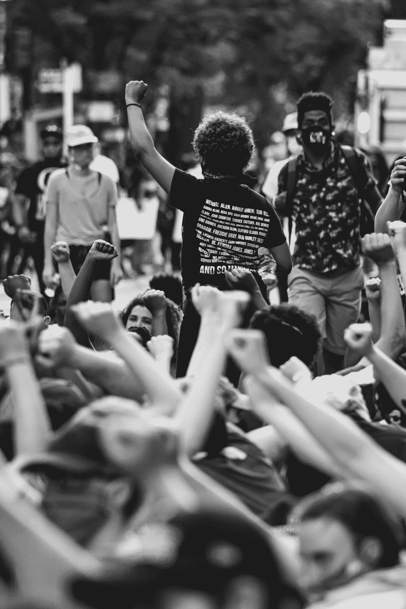

# 21 世纪兴起的黑客行动主义

> 原文：<https://medium.com/geekculture/hacktivism-on-the-rise-in-the-21st-century-2ea858b96b15?source=collection_archive---------21----------------------->

## 互联网的兴起给了黑客行动主义者两个突出的新工具来为自己和他们所支持的问题辩护:一个方便而强大的方式来在全球传播他们的信息，以及进行网络操作和攻击的能力。

Photo by [Gayatri Malhotra](https://unsplash.com/@gmalhotra?utm_source=medium&utm_medium=referral) on [Unsplash](https://unsplash.com?utm_source=medium&utm_medium=referral)

# 背景:

什么是黑客行动主义？这个词最早是由死牛邪教(the Cult of the Dead Cow)创造的，这是一个由致力于推进人权的国际黑客组成的组织。从本质上来说，世界各地的黑客行动主义者利用他们的编程技能来支持重要问题，如言论自由和隐私(Denning 2015)。黑客行动主义者不同于传统的活动分子，他们通过使用针对特定目标的黑客技术来破坏互联网，而不是简单地使用互联网来支持议程的普通活动分子。黑客行动主义出现在 20 世纪 80 年代的某个时候，但直到 1996 年的“非正义部门”事件才广为人知。在这一臭名昭著的事件中，有人将美国司法部网站改为“非正义部”，并显示色情内容，以抗议《通信体面法》(Denning 2015)。该法案后来被裁定违宪，很明显，黑客行动主义是实现公共政策变革的一种非常有效的方式。本文将阐明黑客行动主义的概念，包括使用黑客行动主义和 Anonymous 兴起背后的基本原理。

# 为什么是黑客行动主义？

Photo by [Markus Spiske](https://unsplash.com/@markusspiske?utm_source=medium&utm_medium=referral) on [Unsplash](https://unsplash.com?utm_source=medium&utm_medium=referral)

黑客行动主义日益流行的背后有几个简单的原因。首先，尽管 hacktivism 这个名字听起来令人生畏，但它是一种低成本的操作，用户友好且易于上手。使用匿名“低/高轨道离子炮”等工具，任何人都可以发动攻击，而被抓住的风险最小(Denning 2015)。其次，政府机构从不调查大多数案件，因为不可能同时跟踪数千名攻击者。此外，互联网激进主义允许远程攻击者在家中舒适地进行操作，而无需外出。最后，攻击的结果通常是立即可见的，例如当网站因 DoS 攻击而离线时，或者当一条消息通过 Twitter 和脸书传播时(Denning 2015)。随着世界范围内对言论自由和隐私的呼声越来越高，黑客行动主义可能会越来越多地被用作倡导社会正义和有意义变革的一种方式。

# 无名氏的崛起:

Photo by [Ahmed Zayan](https://unsplash.com/@zayyerrn?utm_source=medium&utm_medium=referral) on [Unsplash](https://unsplash.com?utm_source=medium&utm_medium=referral)

当谈到黑客行动主义时，匿名者组织和他们的行动通常会成为这场运动的领导者。“匿名者”是一个无组织的激进分子团体，以戴盖伊·福克斯面具和“？”而闻名在他们的头上(丹宁 2015)。2008 年进入公众视线，匿名者发起了 Chanology 项目，审查汤姆·克鲁斯赞美山达基教会的视频。此后，该组织声称对全球数千起网络攻击负责，包括针对政府、恐怖分子和企业巨头的攻击(Denning 2015)。最值得注意的是,“匿名者”发起了 2010 年针对互联网版权侵权反对者的“报复行动”。这一行动始于宝莱坞公司雇佣第三方对网站发起攻击，而这些网站对从其服务器上删除版权内容没有反应。“匿名者”不赞成这一行动，并发起了一系列针对企业利益的网络攻击，压制人们的权利。后来，当亚马逊、贝宝和万事达卡切断了与维基解密(匿名者的盟友和一个发布泄密的非政府组织)的服务时，这一行动扩大了。虽然“匿名者”无法扳倒亚马逊，但对贝宝的攻击尤其致命，因为该公司估计损失价值 350 万美元(BBC 2012)。PayPal 后来向 FBI 提供了 1000 名攻击者的 IP 地址，导致超过 14 人被捕(Musil 2013)。“匿名者”在数字领域的影响至今仍很重要，该组织也干预过过去的选举。如果一个重大的有争议的互联网事件在不久的将来发生,“匿名者”很可能会卷入其中。

# 黑客主义的后果:

Photo by [Bill Oxford](https://unsplash.com/@bill_oxford?utm_source=medium&utm_medium=referral) on [Unsplash](https://unsplash.com?utm_source=medium&utm_medium=referral)

由于在互联网和全球事务中如此强大的影响力，黑客行动主义者在世界范围内被逮捕也就不足为奇了。PayPal 事件中提到的 14 人已经在美国联邦法院被起诉并认罪(Musil 2013)。此外，土耳其官员逮捕了 32 名参与对土耳其政府网站进行网络攻击的人。在圣克鲁斯县网站遭到攻击后，匿名领导人克里斯·多永(别名 X 司令)也被逮捕。他最终在 2012 年弃保潜逃到加拿大(Anderson 2012)。上面提到的三个例子只是政府应对黑客行动主义的冰山一角。问题是:未来政府应该在多大程度上对黑客行动主义者进行控制和采取行动？

# 结论:

不可否认，黑客行动主义是当今政治格局中的一个主要角色。作为这场运动的领导者,“匿名者”通过“报复行动”和数千次其他网络攻击改变了世界舞台。展望未来，黑客行动主义可以被视为一把双刃剑。如果黑客行动主义者负责任地行动，并恰当地利用技术，他们可能成为社会正义和变革的强大行动者。然而，如果黑客行动主义者越界并威胁到国家安全，执法部门别无选择，只能逮捕他们。

参考资料:

*匿名(黑客团体)*。(未注明)。维基百科。2021 年 8 月 10 日检索，来自[https://en . Wikipedia . org/wiki/Anonymous _(hacker _ group)# Operation _ pay back _(2010)](https://en.wikipedia.org/wiki/Anonymous_(hacker_group)#Operation_Payback_(2010))

丹宁博士(2015 年 9 月 8 日)。*黑客主义的兴起*。乔治敦国际事务杂志。

北卡罗来纳州安德森(2012 年 12 月 11 日)。逃亡中的无名氏:X 指挥官是如何弃保潜逃到加拿大的。Ars 技术公司。[https://ars technica . com/tech-policy/2012/12/anon-on-the-run-how-commander-x-jumped-Bai/3/。](https://arstechnica.com/tech-policy/2012/12/anon-on-the-run-how-commander-x-jumped-bai/3/.)

BBC。(2012 年 11 月 22 日)。*匿名黑客‘花费 PayPal 3.5m 万’*。BBC 新闻。[https://www.bbc.com/news/uk-20449474.](https://www.bbc.com/news/uk-20449474.)

s . musil(2013 年 12 月 9 日)。*匿名黑客承认 2010 年 PayPal 网络攻击*。CNET。[https://www . CNET . com/tech/services-and-software/anonymous-hackers-认罪 2010-paypal-cyberattack/。](https://www.cnet.com/tech/services-and-software/anonymous-hackers-plead-guilty-to-2010-paypal-cyberattack/.)