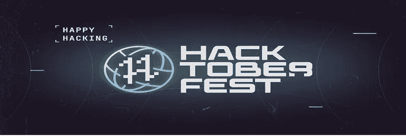

# 黑客啤酒节现场直播

> 原文：<https://medium.com/geekculture/hacktoberfest-is-live-e322d29a782f?source=collection_archive---------18----------------------->

HacktoberFest

**Hacktoberfest 2022—****最** **期待已久的开源社区** **节**已经如火如荼！为期一个月的活动从 9 月 26 日开始，将持续到 10 月 31 日。

只剩下 **18 天**了，您现在可以参加由行业领导者举办的激动人心的活动、研讨会和网络研讨会。您还可以与领先的开源社区一起探索最新的开源趋势和新兴技术理念。

下面列出了一些最受欢迎的项目:

# [freeCodeCamp](https://github.com/freeCodeCamp)/[freeCodeCamp](https://github.com/freeCodeCamp/freeCodeCamp)，[the algorithms](https://github.com/TheAlgorithms)/[Python](https://github.com/TheAlgorithms/Python)，[微软](https://github.com/microsoft) / [vscode](https://github.com/microsoft/vscode) ， [axios](https://github.com/axios) / [axios](https://github.com/axios/axios) ，[story book js](https://github.com/storybookjs)/[story book](https://github.com/storybookjs/storybook)，[ansible](https://github.com/ansible)/

以下是您的参与方式:

1.  我可以为哪个开源项目/社区做贡献？

你可以选择任何符合 Hacktoberfest 准则的项目来参与。

2.我在哪里可以查看 Hacktoberfest 活动指南？

请访问活动指南的网址—[https://hacktoberfest.com/participation](https://hacktoberfest.com/participation)

3.什么是公共 Github URL？

这将是你的 Github 个人资料网址，类似于:[https://github.com/thomas-wu2](https://github.com/thomas-wu2)