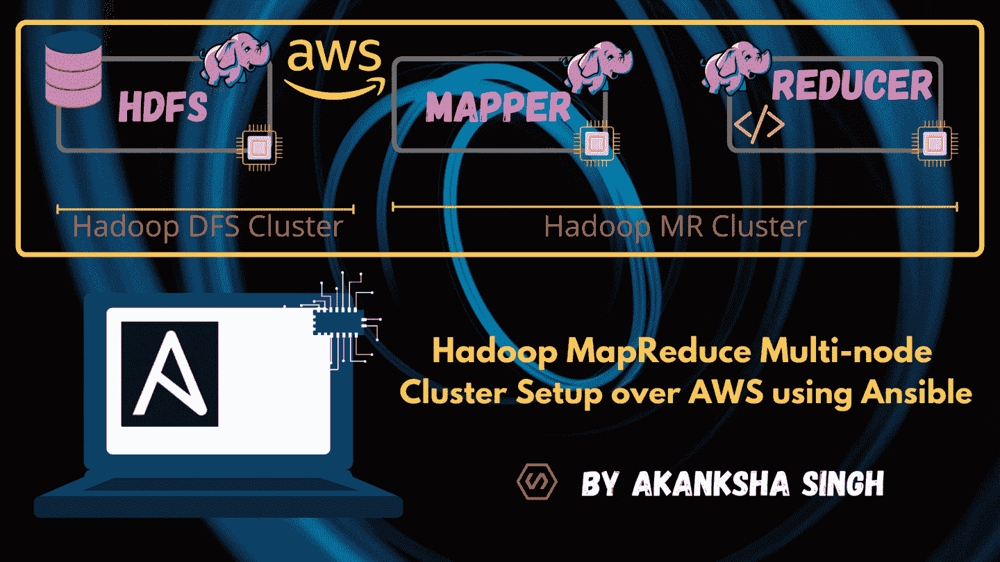
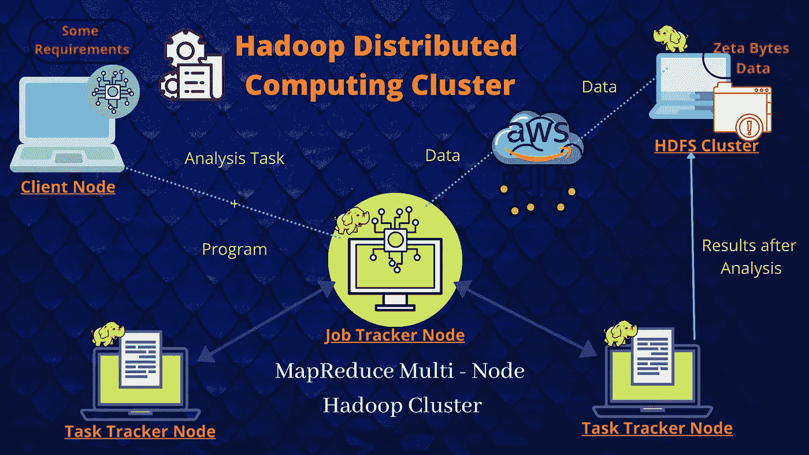
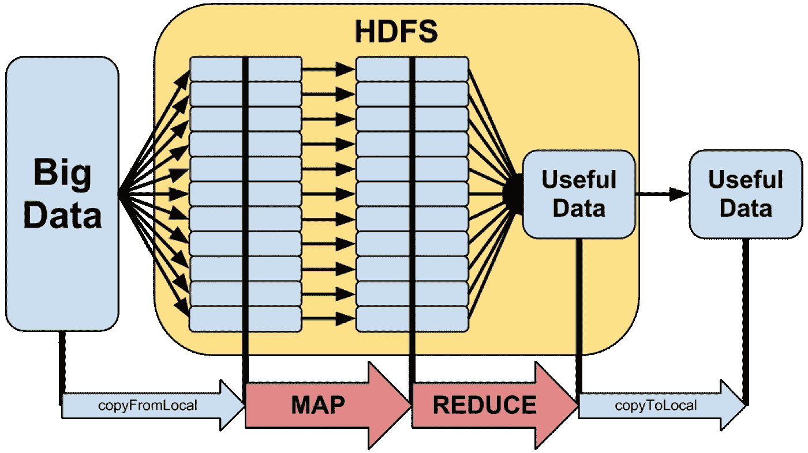
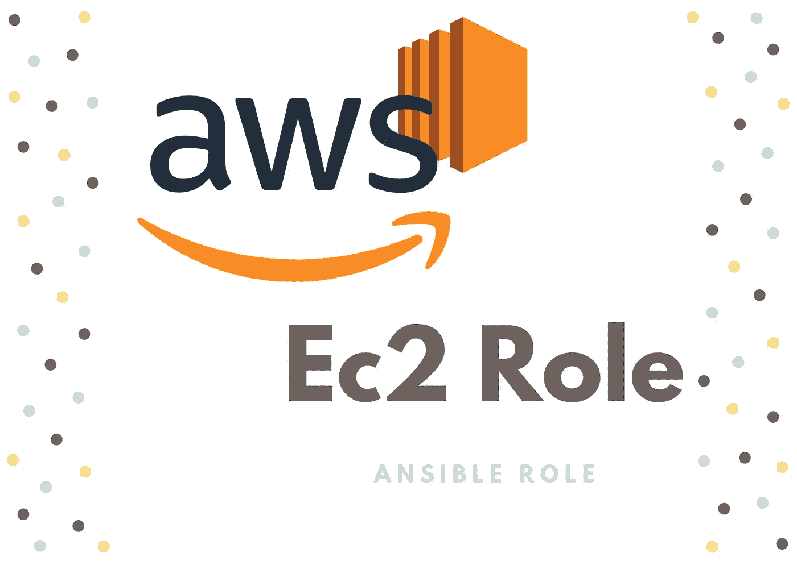
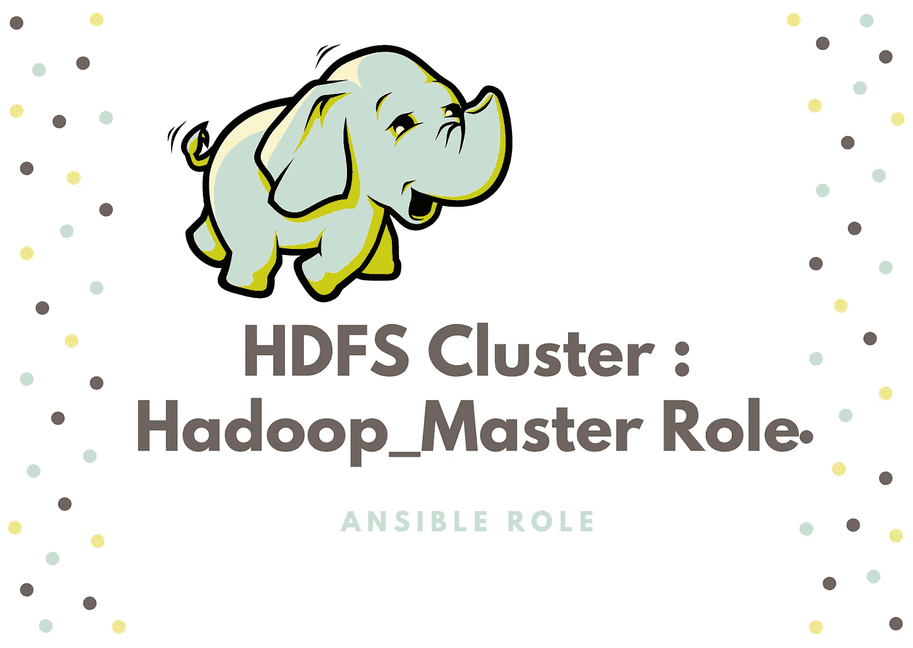
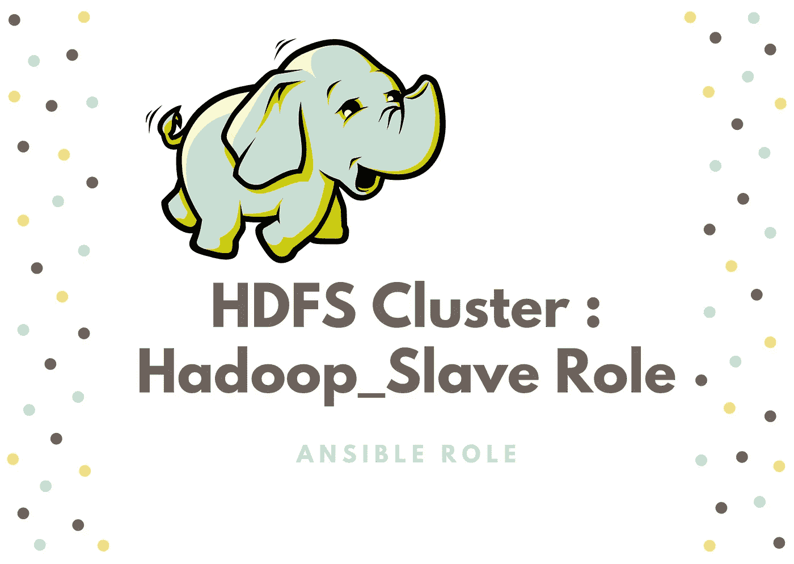
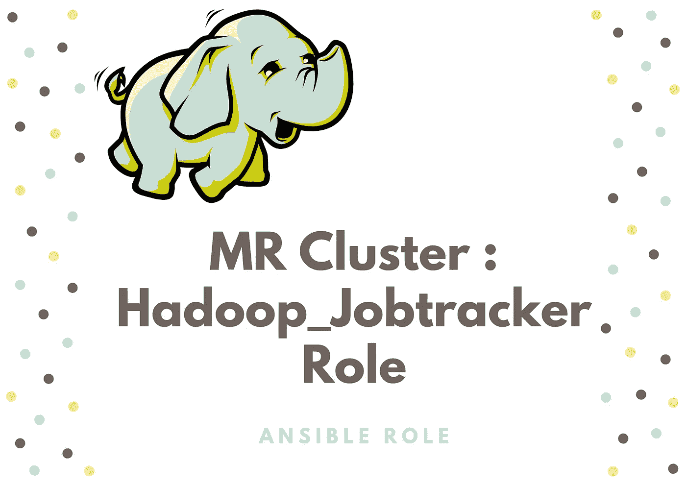
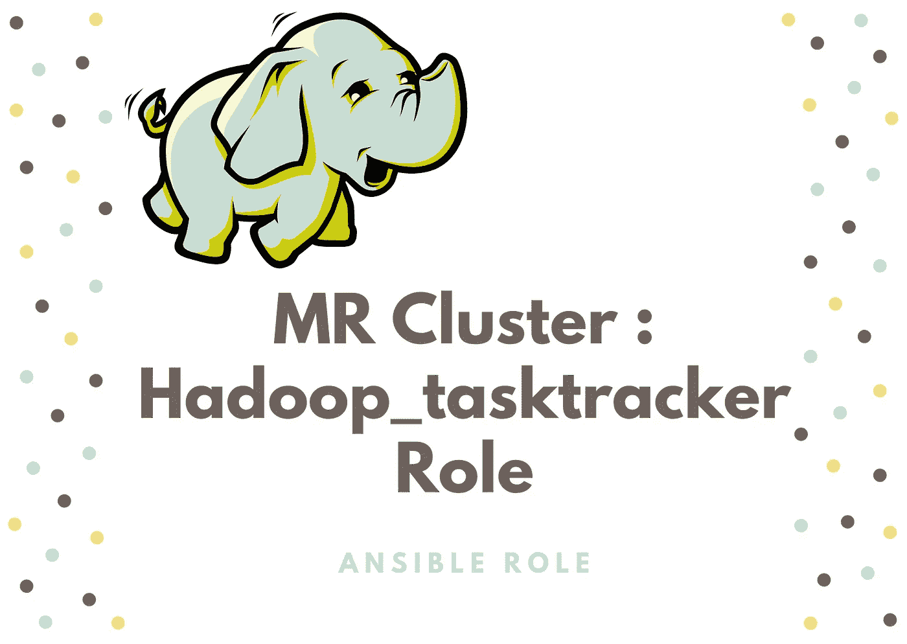

# 使用 Ansible Automation 的基于 AWS 的 Hadoop MapReduce 多节点集群

> 原文：<https://medium.com/geekculture/hadoop-mapreduce-multi-node-cluster-over-aws-using-ansible-automation-56970a22cf81?source=collection_archive---------61----------------------->



**Created by Akanksha**

## 使用作为 MR 集群的一部分的作业跟踪器和任务跟踪器节点来来回回地完成文档和分析，并提供运行分析程序的好处，从而提供分布式计算资源…

读者们好，这篇博客是我之前的博客的扩展版，在我之前的博客中，我讨论了 HDFS 集群设置(Hadoop 提供的分布式存储文件系统)，我们已经使用配置管理工具“Ansible”在 AWS 上完成了这个设置。

[](https://akanksha77.medium.com/big-data-hadoop-multi-node-cluster-over-aws-using-ansible-28215fa562a5) [## 使用 Ansible 的 AWS 上的大数据 Hadoop 多节点集群

### Apache 框架—通过分布式方法进行大数据计算和存储。大文件被剥离出来…

akanksha77.medium.com](https://akanksha77.medium.com/big-data-hadoop-multi-node-cluster-over-aws-using-ansible-28215fa562a5) 

🤔我们要在这里讨论什么新闻？

*   Hadoop 分布式计算集群
*   作业跟踪器节点的工作
*   任务跟踪器节点的工作
*   Hadoop 如何提供内部排序程序？
*   如何设置工作追踪系统？
*   如何设置任务跟踪器？

Hadoop 是一个大数据存储和分析工具，永远不要采用多节点设置。实际上，当我们实施 Hadoop DFS(分布式文件系统)或 Hadoop DCC(分布式计算集群)时，数据文件条带会分布在从属节点上，进而元数据或格式文件系统会跟踪存储的数据，这有助于稍后快速检索原始数据。

## Hadoop 分布式计算集群:



**Fig 1\. Hadoop Distributed Computing Cluster**

MapReduce 框架只是定义数据处理任务。它关注的是原始数据应该关注的逻辑。分布式计算集群将在多台机器上运行数据处理任务，管理内存，管理处理等。用户使用 MapReduce API to Job Tracker 节点定义映射器和缩减器任务。它可以帮助我们使用 Java 和其他已定义的语言。Map defines id 程序被打包到由 Hadoop 中的集群执行的作业中。

众所周知，HDFS 是一种文件系统，用于管理群集中跨计算机的数据存储。也许 MapReduce 是一个跨多个服务器处理数据的框架。因此，它从 HDFS 集群中获取数据，并在任务跟踪器节点中填充映射器和缩减器程序，任务跟踪器节点处理原始数据集并给出所需的输出。输出也是数据，因此它存储在 Hadoop 分布式存储集群中。

Hadoop 用于大数据处理和业务分析操作，为了获得业务报告，我们继续通过一些 Java 或任何其他语言程序来解决用例，这些程序在对数据和程序进行分类后分发数据和程序，然后执行 Reducer 函数最终结果。这就是所谓的“MapReduce 多节点 Hadoop 集群”。

## 作业跟踪器节点的工作:

Job Tracker 的功能是资源管理，跟踪资源可用性，跟踪容错进度。作业跟踪器与名称节点通信，以确定数据的位置。查找任务跟踪器节点以在给定节点上执行任务。它跟踪从本地到从节点的 Map Reduce 的执行。它是 HDFS 集群与任务跟踪器节点的通信点，用于数据分发和处理单元。



**Fig 2\. Flow Diagram of Hadoop Data Flow**

## 任务跟踪器节点的工作

每个任务跟踪器都配置有一组*插槽*，这些插槽表示它可以接受的任务数量。当作业跟踪器试图在 Map Reduce 操作中寻找某个位置来调度任务时，它首先在托管包含数据的数据节点的同一服务器上寻找空插槽，如果没有，它就在同一机架中的机器上寻找空插槽。

## Hadoop 如何提供内部排序程序？

在搜索关于映射器和缩减器程序的实际工作的事实时，得出的结论是，当我们具有从 HDFS 集群导入数据的映射器程序和使缩减器程序在大数据集中运行得更快和更准确的排序规则时，我们具有与缩减器程序一起在过滤和管理程序两个部分中工作的一些算法。

Reducer 主要工作在 *R-way merge* 排序算法上，而在 Hadoop 的场景映射器后面，内部提供了一个名为 Quick Sort 的内置排序算法，它工作在任务跟踪器节点上，在将数据推送到 reducer 程序之前，根据用户\组织的用例过滤和管理数据。

reduce-Merge 排序用于 reduce 端。合并排序是 MapReduce 的默认功能。不能改变 MapReduce 排序方法，原因是数据来自不同的节点到一个点，所以这里可以使用的最佳算法是合并排序。

## 如何设置工作追踪系统？

作业跟踪器与名称节点对话，以确定数据的位置。作业跟踪器定位在数据处或数据附近具有可用槽的任务跟踪器节点。作业跟踪器将工作提交给所选的任务跟踪器节点。任务跟踪器节点被监控。如果它们没有足够频繁地提交心跳信号，它们就被认为失败了，工作被安排在不同的任务跟踪器上。当任务失败时，任务跟踪器会通知作业跟踪器。作业跟踪器决定接下来做什么:它可能会在其他地方重新提交作业，它可能会将该特定记录标记为要避免的内容，甚至可能会将任务跟踪器列入不可靠的黑名单。当工作完成时，作业跟踪器更新其状态。客户端应用程序可以轮询作业跟踪器以获取信息。

## 如何设置任务跟踪器？

任务跟踪器产生一个独立的 JVM 进程来完成实际的工作；这是为了确保流程失败不会关闭任务跟踪器。任务跟踪器监视这些衍生的进程，捕获输出和退出代码。当该过程完成时，无论成功与否，跟踪器都会通知作业跟踪器。任务跟踪器还向作业跟踪器发送心跳消息，通常每隔几分钟一次，以向作业跟踪器保证它还活着。这些消息还通知作业跟踪器可用插槽的数量，因此作业跟踪器可以及时了解集群中可以委派工作的位置。这里，映射程序并行工作，而缩减程序作为合并器工作。

# 现在让我引导你到实际的部分，

我们将在这里创建两个集群— **MR 集群** (Map Reduce 集群)和 **HDFS 集群** (Hadoop 分布式文件系统)集群，我们将分别用于客户端数据操作和存储。为了对数据执行任何操作，我们需要将程序和最重要的数据放在一个地方，但是如前所述，**任务跟踪器(TT)** 节点通过**作业跟踪器(JT)** 节点分配处理部分，它们在两个处理中评估任务，即**使用映射程序**和**使用简化程序**以获得所需的输出。输出进一步存储在**数据节点(DN)** 中，因为 JT 节点和 **NN(名称节点)**在大数据的整个过程中相互依赖。因此称为 Hadoop 分布式计算和 Hadoop 分布式存储文件系统特性。

在此实践中，我们包括 9 个实时实例，其中我们将配置 3 个节点作为数据节点，3 个节点作为任务跟踪节点，3 个节点将是一个名称节点，一个作业跟踪节点，最后是一个 Hadoop 客户端节点，我们将提到两个群集的地址。这 9 个实例将通过使用 EC2 服务的公共云(AWS)启动，在 Ansible 角色的帮助下动态启动。我们将使用动态清单概念进一步配置集群部分，这些主机组将实例分为 5 个不同的类别，即


**Fig 3\. Practical Setup of our HDFS and MR Cluster**

1.  **名称节点:**名称节点也称为主节点。名称节点仅存储文件系统中所有文件的目录树 HDFS 的元数据，并跨群集跟踪文件。
2.  **作业跟踪器节点:**作业跟踪器是 Hadoop 中的一项服务，它将 MapReduce 任务分配给集群中的特定节点，理想情况下，这些节点拥有数据，或者至少在同一个机架中。客户端应用程序向作业跟踪器提交作业。
3.  **Hadoop 客户端节点:**客户端与名称节点和作业追踪器通信，用于存储数据，并通过到达作业追踪器节点，使用一组程序对其进行处理，以获得所需的输出。
4.  **任务追踪器节点:**任务追踪器是集群中的一个节点，它接受来自作业追踪器的任务——映射、减少和重排操作。每个任务跟踪器都配置有一组*插槽*，这些插槽指示它可以接受的任务数量。
5.  **数据节点:**数据节点也称为从节点。名称节点和数据节点持续通信。当一个数据节点启动时，它向名称节点通告它自己以及它所负责的块的列表。

**我的本地机器配置:**
>VBox Manager 上的 RHEL 8 虚拟机，2 个 CPU，4GB RAM。
安装了 ansi ble 2 . 10 . 4 版本。
>使用桥接适配器进行适当的网络连接。


***第一步:创建可行的配置文件:***

Ansible 是一个无代理的自动化工具，它需要控制器节点上的清单文件，我已经提到这是我们的本地系统。清单文件可以在路径(/etc/ansible/ansible.cfg)中的控制器节点内全局创建，也可以在我们将要运行剧本/角色的工作区中创建。

***为此项目创建工作区:***

```
**# mkdir hadoop-ws
# cd hadoop-ws
# mkdir roles**
```

***配置文件:***

**Fig 4\. ansible.cfg File**

有关上述文件的解释，请访问！

***第二步:创建两个文件***

*   ***首先:***

一个名为`cred.yml`的安全库文件，包含 IAM 访问权限和用于验证您的 AWS 帐户的密钥。在您的目录“my-ws”中使用`ansible-vault create cred.yml`创建(给出密码)

```
*file format:* access_key: GUJGWDUYGUEWVVFEWGVFUYV 
secret_key: huadub7635897^%&hdfqt57gvhg
```

*   ***第二***

创建名为`hadoop_instance.pem`的文件，这是我们用来通过 AWS 帐户远程创建 ec2 实例的密钥对。

## 步骤:

*   *转到 AWS 管理控制台*
*   *EC2 仪表板*
*   *钥匙对*
*   *创建新的密钥对*
*   *起名叫* `*hadoop_instance*`
*   *选择’。PEM '文件格式*
*   *将密钥下载到您的本地系统*
*   *将密钥转移到您的角色为* `*hadoop-ws*`的同一目录下的 Ansible Controller 节点

***第三步:创建职责角色***

接下来，我们将创建六个主要角色，即
◼ AWS-EC2 实例创建和动态 IP 检索角色、
◼Hadoop-主配置和启动名称节点服务角色、
◼Hadoop-从配置和启动数据节点服务角色、
◼Hadoop-客户端配置和注册到集群、
◼ Hadoop-JobTracker 配置和启动作业跟踪器服务角色、
◼ Hadoop-TaskTracker 配置和启动任务跟踪器服务角色。

```
**# mkdir role
# cd role
# ansible-galaxy init ec2
# ansible-galaxy init hadoop_master
# ansible-galaxy init hadoop_slave
# ansible-galaxy init hadoop_client
# ansible-galaxy init hadoop_jobtracker
# ansible-galaxy init hadoop_tasktracker**
```

现在我们已经有了所有的任务、模板、变量文件*和其他基于已知文件结构*的可解析工件，它们都被预嵌入到角色中，我们只需要通过包含模块和 jinja 属性注释来编写我们所需要的所有东西的声明/描述(用 YAML 语言)。

[欲了解更多角色信息，请访问！](https://docs.ansible.com/ansible/latest/user_guide/playbooks_reuse_roles.html)



***第四步:编写 EC2 角色:***

Ansible 的 EC2 模块提供了通过 AWS Cloud 启动和供应实例的属性。我们更喜欢用 **t2.micro 作为 instance_type** 和 **Amazon Linux 2 image 作为 AMI** 。我们还有**安全组，允许来自任何地方的所有流量**，而不是您可以使用 HDFS 协议和一些 SSH 以及一些端口入站出站规则，如端口 9001、50070、9002 和 10020…等等。

```
**# cd role/ec2/tasks
# vim main.yml**
```

**Fig 5\. Task File for EC2 Role**

模板和变量文件夹中包含了一些变量和文件，如***instance _ tags*******Python _ pkg*******SG _ name*******region _ name*******subnet _ name***根据 Ansible 工件，可以在 ec2 roles/ec2/tasks/main.yml 文件中直接调用这些变量。****

```
****# cd role/ec2/vars
# vim main.yml****
```

****Fig 6\. Variable File for EC2 Role****

****

*****第五步:编写 Hadoop_master 角色:*****

**Hadoop master 具有以 xml 格式写在 core-site.xml 文件上的集群的主要元数据，如集群 ID 和端口，我们需要在此主节点上执行的关键事情是格式化我们的 master 共享文件夹，只需执行一次。此外，我们必须给出主设备与其从设备和客户端通信的端口，即端口 9001。**

**考虑需要在 hadoop_master/tasks 文件夹的 main.yml 中编写以下代码。**

```
****# cd role/hadoop_master/tasks
# vim main.yml****
```

****Fig 7\. Tasks for Master Ansible Role****

**我们在 template 文件夹中包含的 **jinja2 格式文件**该文件是我们的 master 在配置 master 时配置的**HDFS-site . XML**；**

```
****# cd role/hadoop_master/templates
# vim hdfs-site.xml.j2****
```

****Fig 8\. hdfs-site.xml.j2 file****

**我们有变量文件，它包含在角色执行时将被直接调用/替换的值。这些变量包括— *pkgs_name 和 hadoop_folder* 。**

```
****# cd role/hadoop_master/vars
# vim main.yml****
```

****Fig 9\. Variable file for Hadoop-master Role****

**Hadoop 中有两个文件需要配置，一个是 core-site.xml，另一个是 hdfs-site.xml。要通过 ansible 配置这两个文件，我们有两种策略，一种是使用复制模块复制它们，另一种是使用模板模块复制它们并做一些更改。通常我们在拷贝时使用模板进行数据处理，这些模板文件是以 jinja2 文件格式编写的。**

**您需要做的是将 core-site.xml 文件放在我们角色的 files 文件夹中。所以只要转到 hadoop_master/files，把下面的文件。**

```
****# cd role/hadoop_master/templates
# vim main.yml****
```

****Fig 10\. core-site.xml.j2 file****

****

*****第六步:编写 Hadoop_slave 角色:*****

**现在我们必须配置 Hadoop-slave，我们希望有多少 Hadoop slave 就有多少，以获得分布式存储能力和计算资源。下面是 task/main.yml 文件，其中所有步骤都以 YAML 格式声明。从安装依赖项开始，然后在最后，我们在 slave 中的最终任务是运行数据节点服务。**

```
****# cd role/hadoop_slave/tasks
# vim main.yml****
```

****Fig 11\. Hadoop-Slave Task File****

**下面是来自我们的 **hadoop_slave** 角色的 var/main.yml 文件，其中我们有两个 var， **pkgs_name** 和 **hadoop_folder** ，我们需要调用它们来获取各自的值。**

```
****# cd role/hadoop_slave/vars
# vim main.yml****
```

****Fig 12\. Hadoop-Slave Variable File****

**由于我们必须在 task/main.yml 文件中使用模板模块，以便在进行一些处理后将两个文件都复制到文件中，或者说将更改复制到文件中，然后将文件复制到从节点，这些文件是 **core-site.xml** 和 **hdfs-site.xml** 它们在 **jinja2** 文件格式中的角色模板文件夹中提到:**

```
****# cd role/hadoop_slave/templates
# vim core-site.xml.j2****
```

****Fig 13\. core-site.xml.j2 File****

```
****# cd role/hadoop_slave/templates
# vim hdfs-site.xml.j2****
```

****Fig 14\. hdfs-site.xml.j2 File****

****

*****第七步:编写 Hadoop_jobtracker 角色:*****

**作业跟踪器节点配置由该角色完成，该角色遵循一个任务流，在该任务流中，下载 JVM 并进一步安装 Hadoop 和 Java。该角色有助于为 MR 集群设置主节点，该集群加载映射器和缩减器程序，并将它们分发到从节点，即用于分布式计算的任务跟踪器节点。为此，我们在路径/roles/Hadoop _ job tracker/tasks ansi ble role 目录下的 main.yml 文件中编写以下任务:**

```
****# cd role/hadoop_jobtracker/tasks
# vim main.yml****
```

****Fig 15\. Task File for Job Tracker Role****

**许多任务，包括安装 Hadoop 软件、配置将这些节点连接到其 MR 集群主机(JT)的 mapred-site.xml 文件，以及下一次启动任务跟踪节点服务，并在诸如 ***命令、模板、lineinfile、shell 和 get_url 等可扩展模块的帮助下使服务守护进程永久化。*****

**接下来，在 hadoop_jobtracker 角色内的 vars 目录中提到了这些变量:名为***pkgs _ name****的变量保存了我们安装 hadoop 所需的包的值。***

```
*****# cd role/hadoop_jobtracker/vars
# vim main.yml*****
```

*****Fig 16\. Variable File for Job Tracker Role*****

***我们在角色的模板文件夹中找到了两个主要的配置文件，用于进一步配置作业跟踪器节点。名为 ***core-site.xml.j2*** 的文件将管理 HDFS 集群与作业跟踪器的连接，另一个名为***mapred-site . XML . J2***的文件用于 MR 集群设置。***

```
****# cd role/hadoop_jobtracker/templates
# vim core-site.xml.j2****
```

****Fig 17\. Core-Site.xml.j2 File****

```
****# cd role/hadoop_jobtracker/templates
# vim mapred-site.xml.j2****
```

****Fig 18\. Mapred-Site.xml.j2 File****

****

*****第八步:编写 Hadoop_tasktracker 角色:*****

**任务跟踪器节点在数量上更多。它们被配置为与作业跟踪器节点通信，并为映射器和缩减器获取数据和程序输入。任务跟踪器节点的主要思想是对大量数据进行并行计算。因此，我们在 hadoop_tasktracker 角色中为节点配置编写了以下剧本:**

```
****# cd role/hadoop_tasktracker/tasks
# vim main.yml****
```

****Fig 19\. Task File for Task Tracker Role****

**在这里，我们有许多任务，如安装 Hadoop 软件、配置 mapred-site.xml 文件，该文件将这些节点连接到它们的 MR 集群主节点(JT ),以及下一次启动任务跟踪节点服务，并在诸如 ***命令、模板、lineinfile、shell 和 get_url 等可转换模块的帮助下使服务守护进程永久化。*****

**以下是 hadoop_tasktracker 角色内 vars 文件夹中的变量文件。main.yml 文件内。它只包含一个名为 ***pkgs_name*** 的变量，该变量包含在我们的任务跟踪器节点中安装 hadoop 所需的包名。**

```
****# cd role/hadoop_tasktracker/vars
# vim main.yml****
```

****Fig 20\. Variable File for Task Tracker Role****

**接下来是我们的角色文件下的 templates 文件夹，它包含一个主地址文件，用于我们的任务跟踪器节点的主连接。mapred-site.xml.j2 文件将在模板模块的帮助下在指定位置进行处理和复制。**

```
****# cd role/hadoop_tasktracker/templates
# vim mapred-site.xml.j2****
```

****Fig 21\. Mapred-Site.xml.j2 File****

****

*****第九步:编写 Hadoop_client 角色:*****

**客户端的目标是使用主 IP 访问群集，然后执行放/读/写/编辑/删除任何其他操作，将大文件存储在所需的块大小中，并进一步复制以提高其文件的可用性。**

**此外，对于 MR (Map Reduce)操作代码，Hadoop 提供了一个单独的计算集群，这些程序文件将在其中分发，通过从 HDFS 集群获取数据块，它将适当的输出提供给客户端，客户端将进一步存储在我们的 HDFS 集群中。下面是我们角色的 roles/Hadoop _ client/task/main . yml 文件，其中给出了客户端配置的描述性代码:**

```
****# cd role/hadoop_client/tasks
# vim main.yml****
```

****Fig 22.Tasks for Hadoop Client Role****

**变量将在 vars/main.yml 文件夹中提及，该文件夹包括- **pkgs_name** ，其中包含安装 Hadoop 软件所需的软件包名称。**

```
****# cd role/hadoop_client/vars
# vim main.yml****
```

****Fig 23\. Variable File for Hadoop Client Role****

**由于在配置客户端节点时我们只需要提到主节点名称，因此我们只需要更改文件 **core-site.xml** ，对于作业跟踪器节点，我们以 jinja 2 格式配置 **mapred-site.xml.j2** ，我们将把它放在我们角色的模板文件夹中:**

```
****# cd role/hadoop_client/templates
# vim core-site.xml.j2****
```

****Fig 24\. Core-Site.xml.j2 File****

```
****# cd role/hadoop_client/templates
# vim mapred-site.xml.j2****
```

****Fig 25\. Mapred-Site.xml.j2 File****

**在这里，我们通过我们的动态清单中的事实**主机变量**来检索 mater IP，我们从我们的主配置输出中获得 mater 将侦听/响应的端口，即 9001、9002 和其他端口。**

**最后，我们完成了所有角色的创建，现在我们只需要运行这些角色，为此我们必须创建一个剧本，并通过以逻辑方式一个接一个地包含这些角色来继续运行这些角色。我们知道，首先需要通过 AWS 启动节点，然后是主配置，接着是从配置、作业跟踪器和任务跟踪器配置，最后是客户端注册到 HDFS 和 MR 集群。**

****

*****步骤 10:创建设置行动手册以运行所有角色并在 AWS 上创建集群:*****

**下面是我们的工作目录`*hadoop-ws*` *中需要的剧本文件——setup . yml。*这里我们通过调用 ***include_role*** 模块和相关变量文件中的角色名称来编写所有角色，作为 ***vars_files*** 参数。**

****Fig 26\. setup.yml File****

**因此，我们调用了我们在这里创建的所有五个角色:ec2 角色、hadoop_master 角色、hadoop_slave 角色、hadoop_jobtracker 角色、hadoop_tasktracker 角色和 hadoop_client 角色。其中一个变量文件名为 cred.yml，它是一个包含登录 AWS 公共云平台的凭据的 vault 文件。**

****步骤 11:运行剧本 Setup.yml****

**使用 ansible-playbook 命令运行剧本，并提供 vault 密码以验证和登录 AWS 帐户。(请参考上述步骤中的 vault 文件创建)。**

```
**# ansible-playbook setup.yml -ask-vault-pass**
```

**因此，我们已经实现了“使用 Ansible Automation 在 AWS 上实现 Hadoop MapReduce 多节点集群”的目标。**

**你可以在我的 GitHub 上找到这个项目，只要 fork 和 let 使这个项目对客户来说更加系统独立和可靠。**

**[](https://github.com/akankshaS77/Hadoop-HDFS-MR-Multi-Node-Cluster-AWS-Ansible.git) [## akankshas 77/Hadoop-HDFS-MR-多节点-集群-AWS-Ansible

### 创建可启动 9 个 AWS EC2 实例的角色。动态获取 IP 并创建清单以运行进一步的…

github.com](https://github.com/akankshaS77/Hadoop-HDFS-MR-Multi-Node-Cluster-AWS-Ansible.git) 

如果您想为这个项目做出贡献，或者有进一步的疑问或意见，您可以通过 LinkedIN 联系我:

[](https://www.linkedin.com/in/akanksha-singh-as/) [## 阿康沙·辛格-成功负责人@ ARTH -技术学院- LinuxWorld Informatics Pvt 有限公司…

### 在全球最大的职业社区 LinkedIn 上查看阿康沙·辛格的个人资料。阿康沙有 3 个工作列在…

www.linkedin.com](https://www.linkedin.com/in/akanksha-singh-as/) 

(: — )

## 感谢阅读。希望这个博客给你一些有价值的输入！！**