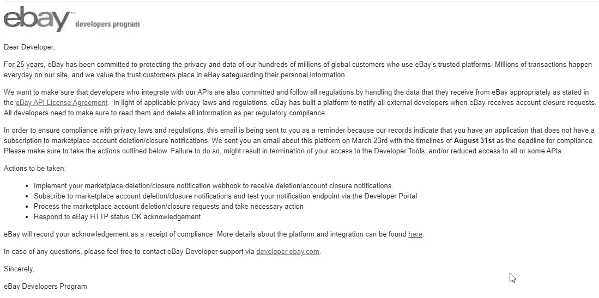
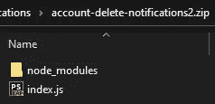
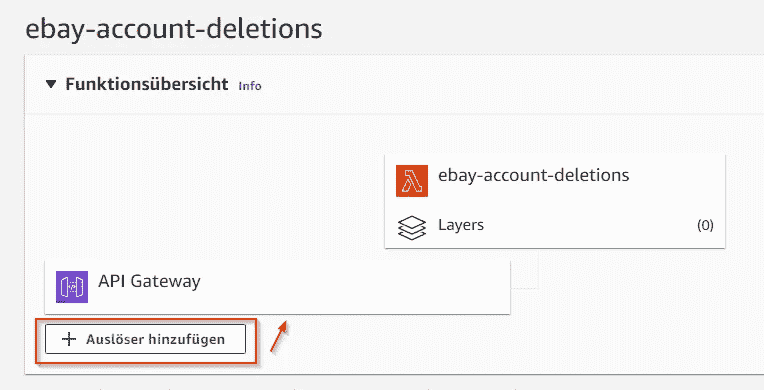

# 处理易贝市场帐户删除通知

> 原文：<https://medium.com/geekculture/handle-ebay-marketplace-account-deletion-notifications-98843ac4589e?source=collection_archive---------16----------------------->

Photo by [Jan Tinneberg](https://unsplash.com/@craft_ear?utm_source=medium&utm_medium=referral) on [Unsplash](https://unsplash.com?utm_source=medium&utm_medium=referral)

也许你得到了和我一样的信息:

[https://developer.ebay.com/marketplace-account-deletion](https://developer.ebay.com/marketplace-account-deletion)

# ***那么，为什么这个真的很重要呢？***

> 回调 URL 应该立即用 HTTP 状态代码确认每个易贝市场帐户删除/关闭通知，表明响应成功。200 OK、201 Created、202 Accepted 和 204 No Content 都是可接受的。对于任何没有回复易贝市场账户删除/关闭通知的回拨网址，易贝将重新发送通知到回拨网址，直到它被确认。在 24 小时内收到来自回调 URL 的多个未确认通知后，回调 URL 被标记为关闭，易贝将向开发者发送一封警告电子邮件，告知回调 URL 没有响应。收到电子邮件后，开发人员将有 30 天的时间来解决他们的回拨 URL 确认易贝市场帐户删除/关闭通知的问题。**如果问题没有在 30 天内解决，开发商将被标记为不合规。**

你读了最后一句了吗？
**如果你明白了，你就知道，这能毁了你的整个生意！**

Photo by [Benjamin Davies](https://unsplash.com/@bendavisual?utm_source=medium&utm_medium=referral) on [Unsplash](https://unsplash.com?utm_source=medium&utm_medium=referral)

我不会在这里详述，我只想建议使用 [AWS Lambda](https://aws.amazon.com/lambda/?nc1=h_ls) ，因为这是迄今为止处理易贝通知最简单的方法。

我不是 Lambda 专家，也不是 NodeJS 专家，我很乐意完成这项工作，其他的我不在乎，因为我的主要语言是 PHP)
但是这样的事情用 NodeJS 很容易，https://github.com/eBay/event-notification-nodejs-sdk[易贝也提供了一个新的通知 SDK](https://github.com/eBay/event-notification-nodejs-sdk)

使用 Lambda 给你带来的好处是没有自己的服务器，在维护和监控方面，你可以承受所有的压力，当然，Lambda 需要一些成本，但这些成本是一个笑话，[自己看](https://aws.amazon.com/lambda/pricing/?loc=ft)。

因此，在您的本地 dev env 中，以下是实现这一点的步骤:

*   npm 初始化
*   npm 安装事件-通知-节点 js-sdk

所以在这之后，你实际上拥有了你需要的一切。

现在，我们从 ebay SDK 中获取[示例，并将其转换为 Lambda 函数:](https://github.com/eBay/event-notification-nodejs-sdk/blob/main/examples/example.js)

是的，请不要怪我复制粘贴代码；-)
如果你想在易贝每次发送东西的时候得到一个延迟通知，可以随时更新配置并启用它。如果您想以任何其他方式处理易贝数据，请随意修改一切以满足您的需求。

您应该“压缩”这个 index.js 和“node_modules”:

转到 AWS Lambda，创建一个新的“函数”并选择“HTTP-API”并上传您的 zip。之后，您应该添加“API-Gateway”作为触发器，这样您将获得一个 HTTPS 端点，您可以使用它从外部访问您的函数。

如果你不是一个开发者，这是我的框架压缩文件，但是你仍然需要配置“index.js ”,当然还要在你的易贝开发者账户中设置所有的东西。

sorry, it´s german

事实上，就是这样。您应该通过测试挑战 URL 来测试您的端点:

> [https://xxxxxxxx . execute-API . eu-central-1 . Amazon AWS . com/default/ebay-account-deletions？challenge_code=123](https://xxxxxxxx.execute-api.eu-central-1.amazonaws.com/default/ebay-account-deletions?challenge_code=123)

希望你会得到这样的结果:

> {
> " challenge response ":" 5fe 38234682368903 fbd5a 529599 e9 f 5 "
> }

如果没有，请检查您的函数的 CloudWatch-Logs，您应该会在这里看到任何类型的错误。

Photo by [Joshua Hoehne](https://unsplash.com/@mrthetrain?utm_source=medium&utm_medium=referral) on [Unsplash](https://unsplash.com?utm_source=medium&utm_medium=referral)

**有一件非常重要的事情，你需要知道！**

因为我在这个我不太熟悉的异步 javascript 世界中捕捉异常有困难，我不知道如何帮助自己，**所以我在这里修改了 eBays SDK 代码的一些部分；(**

即使在阅读了[这篇漂亮的文章](https://itnext.io/error-handling-with-async-await-in-js-26c3f20bc06a)之后，我也无法捕捉到这里的异常，我认为它应该可以工作。

我很确定，如果你在 javascript 方面的知识比我好，你将能够在不修改 eBays SDK 代码的情况下处理这个问题；)

无论如何，[请看我在这个分支](https://github.com/michabbb/event-notification-nodejs-sdk/commits/michabbb-patch-1/)中的提交，看看，我改了什么。

我之所以做出这样的更改，是因为在调用“EventNotificationSDK.process”时，我无法捕捉到“validator.js”中的验证错误。因此，如果您知道如何正确捕捉错误和异常，请告诉我！

Photo by [Tim Mossholder](https://unsplash.com/@timmossholder?utm_source=medium&utm_medium=referral) on [Unsplash](https://unsplash.com?utm_source=medium&utm_medium=referral)

我知道，如果你以前从未使用过 Lambda，这种东西会让你很困惑，但是现在有大量的教程，创建一个 Lambda 函数——真的——只需点击几下，非常简单。

试试看！

尽管这篇文章很琐碎，但我仍然希望它能帮助一些人，因为我知道自己很难找到关于易贝的有价值的信息。

如果你是一个 PHP 开发人员，像我一样，你经常要处理易贝 API，请随意查看 GitHub 上的[我的库，也许你会在那里找到有用的东西；)](https://github.com/michabbb?tab=repositories)