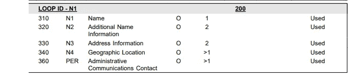
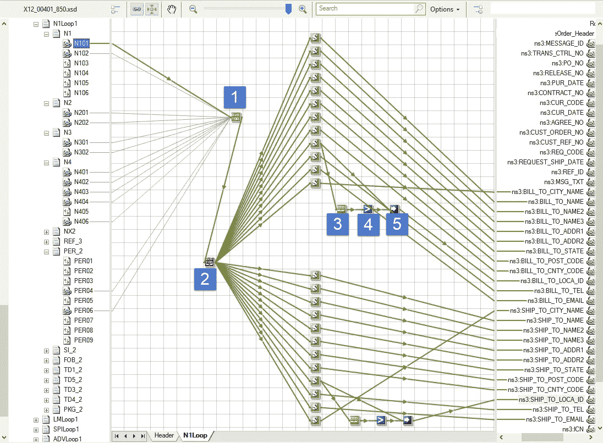
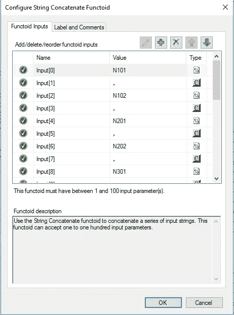
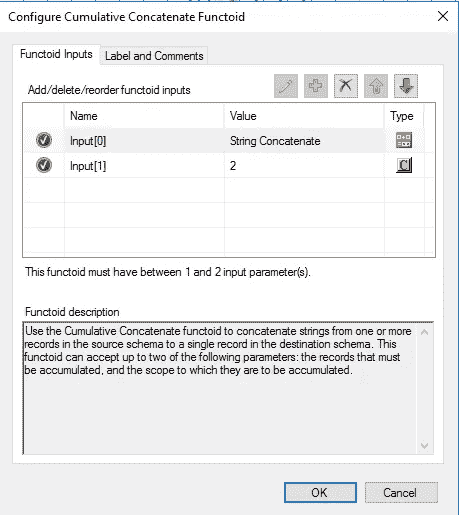
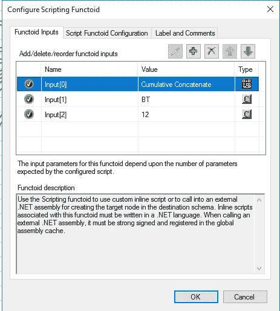
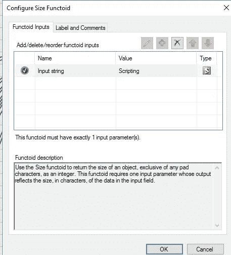
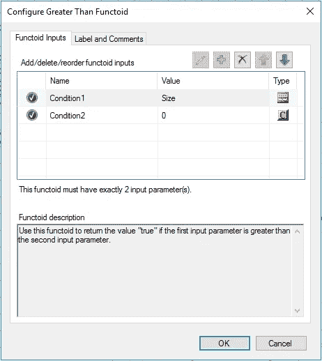
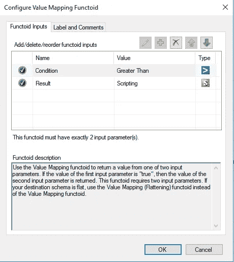

# 处理从 X12 模式到数据库模式的空值

> 原文：<https://medium.com/geekculture/handle-null-empty-value-from-x12-schema-to-database-schema-9f2e8c5b8aad?source=collection_archive---------61----------------------->

## BizTalk —以 EDI 850(X12 _ 00401)N1 looking 部分为例


Photo from: [https://safe-software.gitbooks.io/fme-desktop-basic-training-2017/content/DesktopBasic2Transformation/2.04.SchemaMapping.html](https://safe-software.gitbooks.io/fme-desktop-basic-training-2017/content/DesktopBasic2Transformation/2.04.SchemaMapping.html)

处理 EDI850 的默认途径可能是:

```
1\. Receiving EDI850 (source in)
2\. BizTalk mapping and processing
3\. Store into database table (target)
4\. ERP processing
5\. Others...
```

根据 EDI 850 模式，我们在报头部分有如下定义的 N1 元素。



查看 N1 的原始数据可能如下所示:

```
N1*BT* Accts Payable~
N3*P.O. Box 149257~
N4*Austin*TX*78714-4927~
N1*ST*Address IT~
N2*Address CO*Address IT~
N3*Address*15/Address, IT Address~
N4*Address*IA*76763*US*SP*TEST~
[PER*BD**TE*515-242-3492*EM*Mail@domin.COM](mailto:PER*BD**TE*515-242-3492*EM*Mail@domin.COM)~
```

以下是 EDI 元素→数据库字段之间 N4 扇区设计的物理映射:

```
# IF *N101* IS **BT**
N401 --> BILL_TO_CITY_NAME
N402 --> BILL_TO_STATE
N403 --> BILL_TO_POST_CODE
N404 --> BILL_TO_CNTY_CODE
N405 --> By Pass(Fixed code: SP for this case)
N406 --> BILL_TO_LOCA_ID

# IF *N1101* IS **ST**
N401 --> SHIP_TO_CITY_NAME
N402 --> SHIP_TO_STATE
N403 --> SHIP_TO_POST_CODE
N404 --> SHIP_TO_CNTY_CODE
N405 --> By Pass(Fixed code: SP for this case)
N406 --> SHIP_TO_LOCA_ID
```

因此，N1 循环总体映射图可能如下所示:



> 注意，我们有 N405:SP 的固定值，所以我们决定此时不传递给数据库。

我们在 N1 循环上做了些手脚:

```
1) Concatenate Functoid
  - Separated each element with in delimiter '，'
  - Separated whole N1 sector with in delimiter '；'
```

功能输入如下:



```
2) Cumulative Concatenate Functoid
 - Input the string of concatenate from step-(1)
 - Output cumulative concatenate string to script 
```



在脚本内部，我们在内联 C#下面写下:

```
// source data combined two parts
// using code (N101: BT/ST) to decide the part
// the Idx: index sequence of location that create by the step-(1)
// return the value of each element (N101/N102...N406)
public string GetData (string SourceData, string Code, int Idx) {
      string Result = "";
      string[] a = SourceData.Split ('；');
      foreach (string word in a) {
          string[] b = word.Split ('，');
          if (b[0] == Code) {
              Result = b[Idx];
              break;
          }
      }
      return Result;
  }
```

根据“脚本”functoid，我们可以设置相应的“代码”和“Idx”输入，以获取所需的元素并映射到目标数据库字段。



这里我们面临的问题是，根据 EDI 定义，N405 和 N406 对应该是存在或不存在的对。但是，有时我们会遇到接收以下格式的问题:

```
# N4 without N405 & N406
N4*Address*IA*76763*US*~
```

N4 条目的格式导致目标数据库字段 SHIP_TO_LOCA_ID 变成了 *""* (空值)而不是 *null* 值。所以我们补充道:

```
3) Size Functoid
  - Input from the step-(2)4) Greater Than Fuctoid
 - Input from the step-(3)
```



所以我们有了最后一步:

```
5)  Value Mapping Fucntoid
-  If the Sizeof(step-(4)) > 0 then assign the value of step-(4) to the target database field
- Otherwise the target database remain null
```



# 参考

*   [https://blog . Sandro-Pereira . com/2014/06/12/biztalk-mapper-working-with-nil lable-values-xsiniltrue/](https://blog.sandro-pereira.com/2014/06/12/biztalk-mapper-working-with-nillable-values-xsiniltrue/)
*   [https://docs . Microsoft . com/en-us/biztalk/core/technical-reference/cumulative-concatenate-functoid](https://docs.microsoft.com/en-us/biztalk/core/technical-reference/cumulative-concatenate-functoid)
*   [https://stack overflow . com/questions/60898340/concatenating-values-from-the-repeating-nodes-under-repeating-nodes-in-biztalk-m](https://stackoverflow.com/questions/60898340/concatenating-values-from-the-repeating-nodes-under-repeating-nodes-in-biztalk-m)