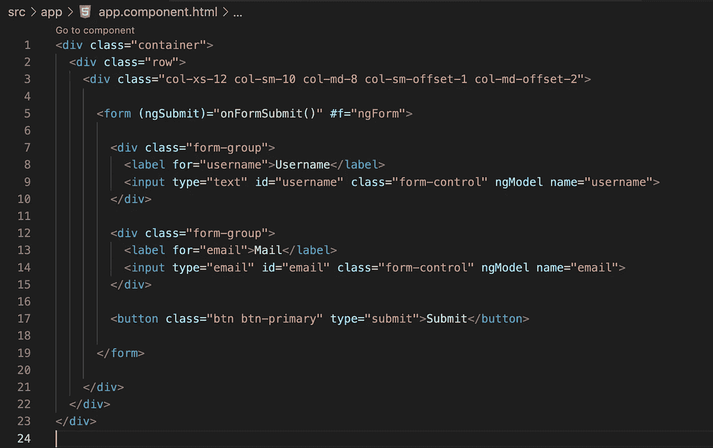
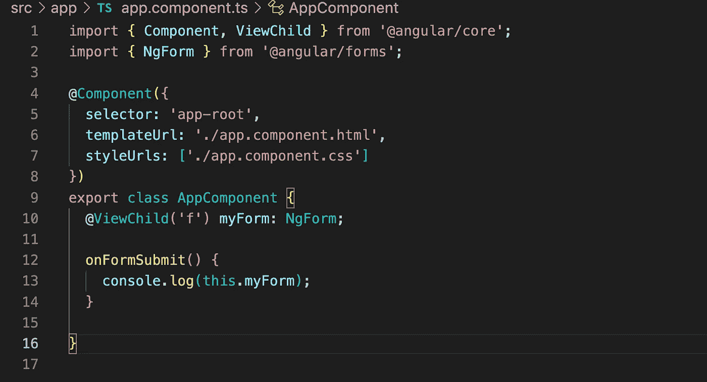
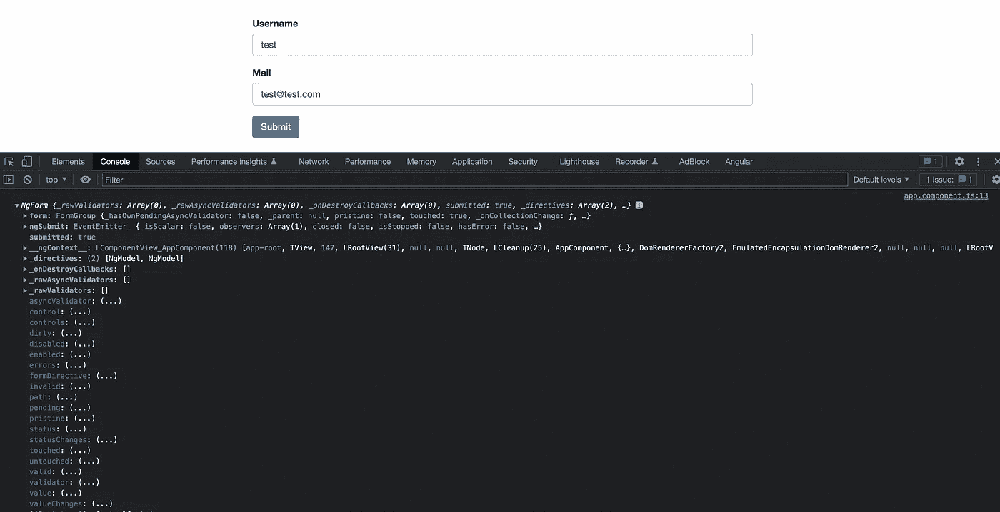

# 以角度处理表单

> 原文：<https://medium.com/geekculture/handling-forms-in-angular-f71ee08766b8?source=collection_archive---------4----------------------->

## 在 Angular 中理解模板驱动和反应式表单


Handling Forms in Angular

用表单处理用户输入始终是应用程序的重要组成部分。应用程序使用表单使用户能够登录、更新配置文件以及执行许多其他数据输入任务。

Angular 为我们提供了两种处理表单的方法:模板驱动和反应式方法。

模板驱动是指我们在 HTML 模板中处理大部分与表单相关的东西，并让 angular 通过放置一些指令如 NgForm、NgModel、NgModelGroup 等来处理用户输入。另一方面，在反应式表单中，所有与表单相关的逻辑都是在组件类本身中编写的，我们在 HTML 模板中编写的极少量逻辑只是为了绑定 formGroup、(ngSubmit)、formControlName 等内容。

让我们尝试构建基本表单并理解这两种方法:

# **模板驱动的表单**

在模板驱动的表单中:

1.  使用`ngForm`指令设置表单
2.  使用`ngModel`指令设置控件
3.  `ngModel`还提供了双向数据绑定

为了使用模板驱动的表单，我们必须导入`FormsModule`

我们在 app.module.ts 中这样做:

```
import { BrowserModule } from '@angular/platform-browser';
import { NgModule } from '@angular/core';
import { AppComponent } from './app.component';
**import { FormsModule } from '@angular/forms';**@NgModule({declarations: [
AppComponent
],imports: [
BrowserModule,
**FormsModule,**
],...})
export class AppModule { }
```

在此之后，我们的任务是创建一个常规的 HTML 表单，然后将其转换为模板驱动的表单，angular 为我们做了这些。在这里，我将创建一个基本的形式，占用用户名和电子邮件。

我们所要做的就是将 **ngForm 指令**添加到我们的表单中，并将其设置为一个局部变量。在这里，我将它设置为#f。它可以如下完成:

```
<form (ngSubmit)="onFormSubmit()" **#f="ngForm"**>
```

`ngForm`会自动为我们做以下事情:

1.  将自身绑定到`<Form>`指令
2.  创建顶级`FormGroup`实例
3.  为每个拥有`ngModel`指令的子控件创建`FormControl`实例。
4.  为每个`NgModelGroup`指令创建`FormGroup`实例。

所以我们的下一个任务是将 **ngModel 指令**添加到我们希望 angular 获取的所有表单控件中。`ngModel`将使用`name`属性为它所附加的每个`Form`字段创建`FormControl`实例。

现在，一旦模板准备好了，我们就可以放入最后一部分向组件提交数据。

我们使用`ngSubmit`事件将表单数据提交给组件类。我们使用[事件绑定](https://www.tektutorialshub.com/angular/angular-data-binding/)(括号)将`ngSubmit`绑定到组件类中的`onFormSubmit`方法。当用户点击提交按钮时，将触发`ngSubmit`事件。



A simple HTML form with Angular Forms Controls added to it

在我们的组件中，我们只记录 NgForm 数据，onFormSubmit 方法中没有其他内容。



A component which will log our NgForm data

现在**使用 ng serve 运行应用**并且**转到 Chrome 开发者工具的控制台。**现在尝试添加一些数据，单击提交，您将看到 NgForm 数据记录在控制台中(如下图所示)。



Application showing logged NgForm data

NgForm 为我们提供了大量数据来控制表单、设置验证和获取值,我们将在另一篇文章中讨论这些内容。现在，要获取这些值，我们可以做 console . log(this . my form . values)；

值将是保存数据的对象:

```
values: Object { **email**: “test@test.com”
 **username**: “test”}
```

# **反应形式**

要处理反应式表单，您将使用`ReactiveFormsModule`而不是`FormsModule`。在代码编辑器中打开`app.module.ts`，并添加`ReactiveFormsModule`:

```
import { BrowserModule } from '@angular/platform-browser';
import { NgModule } from '@angular/core';
**import { ReactiveFormsModule } from '@angular/forms';**

import { AppComponent } from './app.component';

@NgModule({
  declarations: [
    AppComponent
  ],
  imports: [
    BrowserModule,
    **ReactiveFormsModule,**
  ],
  providers: [],
  bootstrap: [AppComponent]
})
export class AppModule { }
```

使用反应式表单方法，我们的整个逻辑是在组件类本身中编写和处理的。让我们创建一个基本的 HTML 模板，然后转移到组件类逻辑。

```
<form **[formGroup]="myForm"** **(ngSubmit)="onSubmit(myForm)"**>
  <div>
    <label>
      Name:
      <input **formControlName**="name" placeholder="Your name">
    </label>
  </div>
  <div>
    <label>
      Email:
      <input **formControlName**="email" placeholder="Your email">
    </label>
  </div>
  <div>
    <label>
      Message:
      <input **formControlName**="message" placeholder="Your message">
    </label>
  </div>
  <button type="submit">Send</button>
</form>
```

这里我们使用**表单组**,因为这个指令将告诉 Angular 把它当作一个表单组，并且它已经被命名为 myForm。然后，我们开发了一个基本的表单模板，允许用户输入他们的姓名、电子邮件和一些消息，并通过发送按钮提交。**提交**与表单提交时触发的 **(ngSubmit)** 事件绑定。然后，我们在每个表单字段上都有一个 **formControlName** ，它是一个带有值的指令，该值将是组件类中使用的名称。

在 component 类中，我们定义了一个 FormGroup，在 FormGroup 中有单独的 FormControls。如果在*更新* a `FormControl`时提供了一个值，它将被用作该字段的初始值。我们还可以提供更多的参数，比如一组内置的和定制的验证，以及类似的异步验证，我们将在另一篇文章中讨论。

```
import { Component, OnInit } from '[@angular/core](http://twitter.com/angular/core)';
**import { FormControl, FormGroup } from '**[**@angular/forms**](http://twitter.com/angular/forms)**';**[@Component](http://twitter.com/Component)({
  selector: 'app-root',
  templateUrl: './app.component.html',
  styleUrls: ['./app.component.css']
})
export class AppComponent implements OnInit {
  **myForm: FormGroup;**ngOnInit() {
    **this.myForm = new FormGroup({
      name: new FormControl('Sammy'),
      email: new FormControl(''),
      message: new FormControl('')
    });**
  }onSubmit(form: FormGroup) {
    **console.log('Valid?', form.valid); // true or false
    console.log('Name', form.value.name);
    console.log('Email', form.value.email);
    console.log('Message', form.value.message);**
  }
}
```

在这里，我们没有将表单数据提交到某个外部服务器，我们只是记录所有的表单值。