# 使用 Tidyr 处理 R 中的缺失值

> 原文：<https://medium.com/geekculture/handling-missing-values-in-r-using-tidyr-da49766203f1?source=collection_archive---------3----------------------->

您是否听说过 R 中的缺失值，并想知道如何处理这些缺失值？那么，如果你把这篇文章看完，那是最好的。这篇文章不仅将讨论丢失值，而且我们将在这里花费大量时间实践如何使用 tidyr 包处理丢失值的情况。Hadley Wickham 和他的团队创造了 tidyr 包来帮助你从杂乱的数据变得整洁。

在我们开始讨论之前，还有一件事。我写过两篇重要的文章，非常详细地阐述了整齐数据的概念。你可以在这里阅读第一篇[，在这里](https://arimoroolayinka.medium.com/a-gentle-introduction-to-tidy-data-in-r-b6673b4d304c)阅读第二篇[。](https://arimoroolayinka.medium.com/tidy-data-case-studies-using-r-648c87b40ecf)

在标题为**“tidy 数据简介”**的 Tidy 数据系列的第一篇文章中，我深入探讨了主要的 Tidy 数据原则。在那篇文章中，我还强调了在讨论整洁数据的概念时需要注意的其他整洁数据原则。

我们在这里讨论的动机是基于其中一个原则，即 ***“任何单元格值都不应该包含缺失值”。***

接下来，在我们检查如何处理丢失的值之前，最好知道 R 中丢失的值是什么。

## **R 中有哪些缺失值？**

当一个值未知时，我们就说它丢失了。在 R 中，我们用符号 **NA** (不可用)来表示缺失值，而不可能的值(例如被零除)用 **NaN** (不是数字)来表示。与 SAS 等软件不同，R 对字符和数字数据使用相同的符号(NA)。

请注意，NA 不是字符串或数值，而是缺失的指示符。NA 是一个唯一值，其属性不同于其他值。NA 是 R 中为数不多的保留字之一，意思是你不能给任何东西起这个名字。

**关于 R 中缺失值的重要说明**

*   is.na()用于测试对象是否为 na
*   is.nan()用于测试 nan
*   一个 NaN 值也是 NA，但反之则不成立

有了这些，我相信你现在对 r 中的缺失值有了高层次的理解。

现在，让我们看看如何使用 tidyr 包来处理丢失的值。

tidyr 包提供了一组处理缺失值的函数。注意，我不会详尽地解释如何使用每个函数(及其所有参数)；然而，我会告诉你你需要知道什么来帮助你解决未来的价值缺失问题。

请放心，在这篇文章中，您将会学到很多好主意。你可以在 GitHub 上找到这个实践演练[的脚本，以便重现。](https://github.com/Predicare1/Tidy-Data-Case-Studies-in-R)

为了演示如何使用 tidyr 处理 R 中的缺失值，我们将使用 **ggplot2** 包中的 **msleep** 数据集。 **msleep** 是哺乳动物睡眠数据集。这是一个有 83 行和 11 个变量的数据集。你可以在这里阅读数据。

第一步是将 **tidyverse** 包加载到 r 中。

接下来，我们将把 ggplot2 包加载到 R 中，因为我们将在这个演示中使用的 msleep 数据集就在那个 ggplot2 包中。之后，我们将使用 **data()** 函数将 msleep 数据集加载到 r 中。最后，我们将使用 **head()** 函数返回 msleep 数据集的前六(6)行。

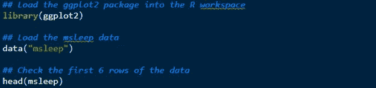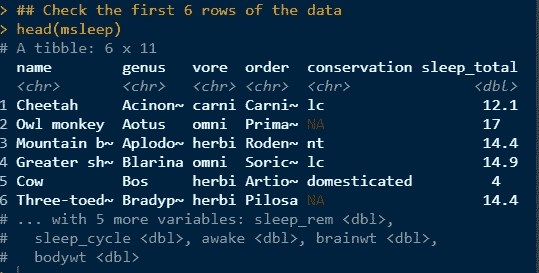

**head(m sleep)**函数的结果让我们一次性浏览数据集，而不必查看所有数据。

接下来，让我们分别使用 **dim()** 和 **names()** 函数来检查数据集中列的维度和名称。这些初始步骤对于理解和熟悉我们想要在本文中使用的数据至关重要。

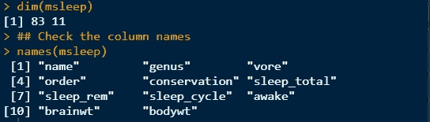

正如我上面提到的，这个数据帧有 83 行和 11 个变量。此外，我们可以看到数据集中列的名称。我建议您阅读数据文档，了解每个列名代表什么。

现在，让我们计算数据集中每个变量缺失值的数量。我认为这是我们应该采取的一个重要步骤，因为我们对处理丢失的值感兴趣。

我们可以用一个基本的 R 函数来完成这个任务。

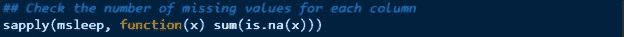

sapply()函数是 r 中的一个循环函数。上面的代码将遍历 msleep 数据的每一列或变量，并计算该变量中缺失值的总数。为了计算缺失值的数量，我编写了一个简单的匿名函数。

现在，让我们看看下面的结果:

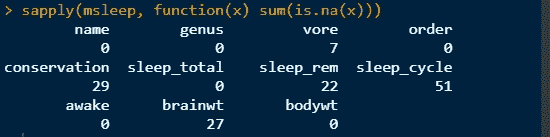

vore 列包含七个缺失值(NAs)。conservation 列有 29 个，sleep_rem 有 22 个，sleep_cycle 有 51 个，brainwt 有 27 个缺失值。

我们还可以使用 purrr 包(tidyverse 包之一)中的 **map()** 函数来实现这个确切的目的。

**注意:我没有返回这段代码的结果。我把它放在这里是为了向您展示如何使用 map()函数来实现同样的目的。**

再者，我觉得在 msleep 数据中计算出每个变量中的缺失比例是有意义的。现在，我将使用 **map()** 函数来完成这项工作。

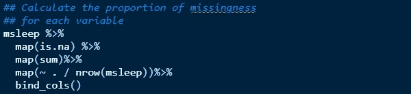

上面的代码计算每个变量中缺失值的比例。你可能想知道 **% > %** 是什么意思。它被称为管道操作符，用于按顺序和层次顺序将函数链接在一起。这里，我们想要获取 msleep 数据并检查每个变量的缺失值。然后，将其传递到下一行 **map(sum)** 中，以计算每个变量中缺失值的总和。然后，**地图(~。/ nrow(msleep))** 表示选取之前计算的每个变量中缺失值的总和，除以 msleep 数据集中的行数(我们知道是 83) **。**最后， **bind_cols()** 按列高效绑定多个数据帧。

有意思！现在，让我们看看结果。

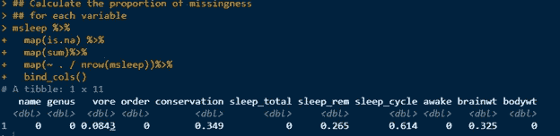

太神奇了！vore 变量有大约 8%的缺失值，守恒有 34.9%，sleep_rem 有 26.5%，sleep_cycle 有 61.4%，brainwt 有 32.5%的缺失值。

这些比例将帮助我们决定如何处理每个变量中缺失的值。随着我们的深入，对于我们这里的工作，我们将引用 vore、sleep_rem、sleep_cycle 和 brainwt 列，因为它们包含 NA 值并且是数字列。

**注意:我没有包括 conversation 列，因为它是一个字符列，包含大约 35%的缺失值。简而言之，我们不会在这里使用该专栏。**

从原始的 msleep 数据中，我们将使用 dplyr 包中的 **select()** 动词/函数来选择我们需要的列。我们可以将结果保存为一个名为 **msleep_data** 的新对象，以便将来使用。

**注:**DP lyr 包隶属于 tidyverse 包家族。 **dplyr** 包非常强大，事实上，它是 R 中对数据操作最有用的包。这是我有史以来最好的数据处理软件包。你可以点击 **在 R** [查看我在 Coursera 上题为**用 dplyr 进行数据操作的项目课程。我在那个课程中介绍了 dplyr 包的使用。**](https://www.coursera.org/learn/data-manipulation-with-dplyr-in-r/home/welcome)

现在，让我们打印我们创建并保存在 msleep_data 对象中的新数据，并检查数据的维度。

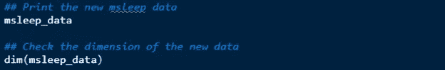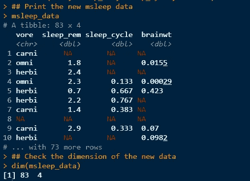

正如所料，我们可以看到我们选择的四列；维度确认仍然有 83 行，但不是 11 列，我们现在有 4 列。

回想一下，vore 变量只有 7 个(约 8%)缺失值。我们可以决定删除 vore 列中 NA 值的行。我们将在 vore 列上使用 tidyr 中的 **drop_na()** 函数。

**注意:在使用 drop_na()函数之前，一定要删除一列中缺少的行，因为这将删除整行数据或观察数据，从而影响其他列中该行的值。**

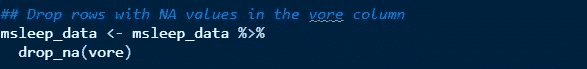

现在，让我们检查新的数据维度，我们已经从 vore 列中删除了七个缺失的值。

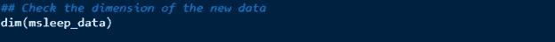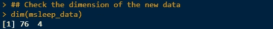

结果显示数据现在有 76 行和 4 列。回想一下，最初的 msleep 数据有 83 行。因此，当我们从 83 中去掉 7 行时，我们将剩下 76 行。同样，回想一下我们使用 dplyr 包中的 **select()** 动词从原始数据集中的 11 个列/变量中选择 4 个；这就是为什么我们有四列。

根据新 msleep_data 的结果，您会注意到 sleep_rem、sleep_cycle 和 brainwt 列中缺少值。让我们看看如何处理这些缺失的价值观。

接下来，我们想用零整数值(0L)替换 sleep_rem 列中的 NA 值。为此，我们将使用 **replace_na()** 函数。该函数用指定的值替换 NAs。它需要一个名为 **replace** 的重要参数—如果数据是一个数据帧，则“replace”需要一个值列表，其中每一列都有一个要替换的 NA 值。你可以在这里阅读 replace_na()文档[。](https://www.rdocumentation.org/packages/tidyr/versions/1.1.4/topics/replace_na)

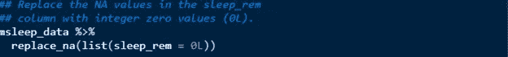

因为我们想用 0 替换 sleep_rem 列中的 NAs，所以我们使用了 **0L** 来指定正确的数据类型。另外，这是一个数据帧，因此使用了**列表(sleep_rem = 0L)。**

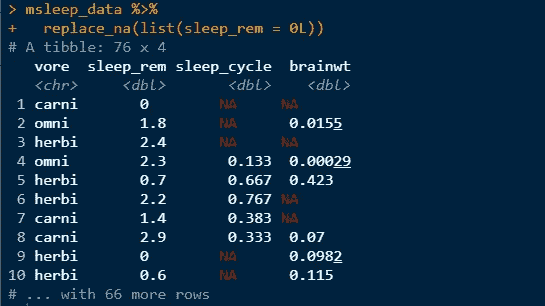

太棒了。！！sleep_rem 列中缺少的值用 0 填充。注意我们有 0L；这是为了让我们替换的新值具有正确的数据类型 **—整数(dbl)。**

我们还可以向上或向下填充 brainwt 列中缺少的值。也就是说，我们可以用缺失值之前或之后的值来填充。这完全取决于您希望如何填充缺失的值。

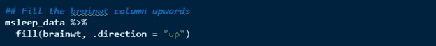

这里，我们使用了 fill()函数。tidyr 包中的 fill()函数使用下一个或上一个条目填充选定列中的 NA 值。这在通用输出格式中很有帮助，在这种格式中，值不会重复，只有在发生变化时才会被记录。

的。方向参数指示填充缺失值的方向。我们可以填写“下”(默认)、“上”、“下上”(即先下后上)或“上下”(先上后下)。

在这种情况下，我们希望向上填充(用当前缺失值之后的下一个值填充当前缺失值)。

有了这个解释，让我们看看返回的结果。

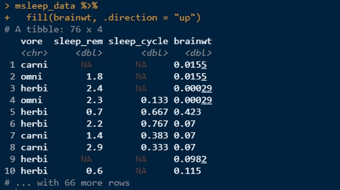

如果您返回到之前的最后一个结果，您会注意到在 brainwt 列中，第一个、第三个、第六个和第七个值丢失了。在此结果中，brainwt 列的第一个值(或第一行)现在被替换为 0.0155(这是该列的第二个值且非缺失值)。

类似地，先前丢失的第三个值现在替换为 0.00029(该列的第四个值)。此外，第 6 行和第 7 行被替换为下一个非缺失值，即第 8 个值-0.07。如果您检查 brainwt 列，您将看到我们向上填充了缺少的值。

请再看一遍这个解释，确保你理解了我在这里的解释，然后再继续。

让我们继续前进。同样，您会注意到 sleep_rem 列仍然有 NAs，尽管我们在前面用 0 替换了它。为了解决这个问题，我们将把我们一起执行的最后两个操作链接起来。

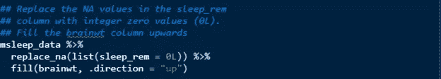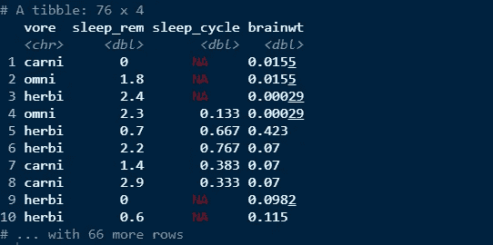

太神奇了！！！现在，我们得到了预期的结果。我们已经处理了 sleep_rem 和 brainwt 列中缺失的值。

我们也可以决定向下填充 brainwt 列(即使用之前的值)。

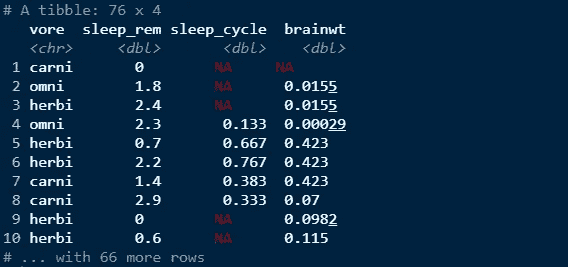

这里的结果与我之前解释的向上填充正好相反。这里，向下填充用以前的值填充 brainwt 列中缺少的值。显然，从结果来看，即使在使用 fill()函数之后，brainwt 列的第一个值仍然缺失(NA ),因为没有以前的值来填充它。

**注:你也可以填写“downup”和“updown”。您可以更改。方向参数设置为“downup”或“updown ”,看看它是什么样子，并返回结果。**

我将让您按照自己的选择来处理 sleep_cycle 变量中缺少的值。能够做到这一点将有助于您巩固在本文中学到的知识。

最后，可能会有这样的情况，您希望用平均值或中值来填充列中缺少的值。我更喜欢使用中位数来填充缺失值，因为它是一个有抵抗力的统计量(不容易受到异常值的影响)。

**让我们看看如何做到这一点。**

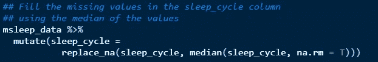

哇…这里有很多信息。让我给你分析一下。我们这里有非常直接的。我们将 msleep_data 传递给一个名为 **mutate 的 dplyr 动词或函数。**动词 **mutate()** 帮助创建新列，同时保留其他列。记住 replace_na()函数是如何工作的。

因为我们希望用中值替换 sleep_cycle 列中缺少的值，所以我们使用了 **median()** 函数。 **na.rm = T** 参数意味着我们希望在计算中值之前删除该列中缺失的值。如果您不添加该参数，那么当您计算中值时，它将返回 NA。我认为这很直观。

我在这里传达的想法是，您不能对缺失值执行任何计算；因此，需要首先删除那些丢失的值，计算中值，然后使用 replace_na()函数用中值替换丢失的值。最后，我们将这个被替换的列保存到原始列中，以实现我们刚才所做的更改。

让我们看看上面代码的结果。

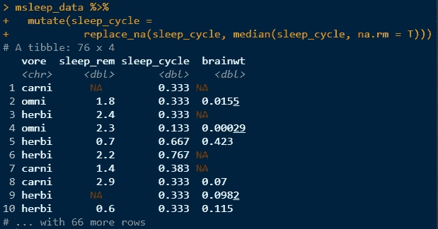

漂亮！！！这一列的中值是 0.333，这里替换的就是这个。您可以决定将中值改为平均值，并用平均值填充缺失值。这取决于你如何看待你解决问题的过程。

为了在每一列中获得所需的干净数据，我们需要使用管道操作符将所有操作链接在一起，并将干净数据保存在同一个 msleep_data 对象中。干净的数据可用于未来的分析。

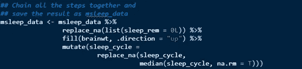

**让我们看看最终的结果。**

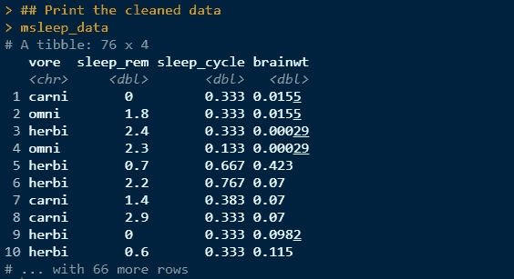

太神奇了！！！你做得很好。干得好！！！我们已经成功处理了该数据集中缺失的值。

## **总结**

在本文中，我们看到了如何实现整洁数据原则之一，即 ***【任何观察都不应有缺失值】*** 。这种理解对于作为数据爱好者或数据专家的您是有益的。在数据生命周期的初始阶段处理丢失的值，会让您在到达数据生命周期的分析阶段时省去很多“头痛”的事情。我在这里阐述的一个想法是，作为一个数据爱好者，你必须确定你希望如何处理数据集中缺失的值。当你清楚自己想要采取的方法时；然后 R 里有几个工具，函数，包可以帮你实现这个；在本文中，我们只是检查了使用 tidyr 包。

让我给你留下这些名言:

> 幸福的家庭都是相似的，但不幸的家庭各有各的不幸 ~列夫·托尔斯泰
> 
> *“整洁的数据集都是相似的，但每一个杂乱的数据集都有自己的杂乱之处。”* ~哈德利·韦翰

请在下面的评论区留下您的评论，并与他人分享这篇文章。如果你喜欢这篇文章，如果你能点击“鼓掌”图标(最多允许 50 次鼓掌)，这将对我意义重大。

如果你想参加我在 Coursera 上教的关于处理 R 中缺失值的基于项目的指导课程，以获得一个可验证的证书，那么点击[这里](https://www.coursera.org/projects/handling-missing-values-r-using-tidyr)。

作为 Coursera Guided Project Network 的一名基于项目的课程讲师，我教授了几门关于使用 r 的课程。你可以点击[这里](https://www.coursera.org/instructor/arimoro-olayinka)查看这些课程。谢谢大家！下次见！

**参考文献**

*   [https://www.statmethods.net/input/missingdata.html](https://www.statmethods.net/input/missingdata.html)
*   [https://stats . idre . UCLA . edu/r/FAQ/how-do-r-handle-missing-values/](https://stats.idre.ucla.edu/r/faq/how-does-r-handle-missing-values/)
*   [https://FAQ-ans . com/en/Q % 26A/page = 9 CAC 166 c8 d 89978 dad 8d CB 632 a 53 c 0 # S2](https://faq-ans.com/en/Q%26A/page=9cac166c8d89978dad8d8dcb632a53c0#s2)
*   https://faculty.nps.edu/sebuttre/home/R/missings.html[中缺少值](https://faculty.nps.edu/sebuttre/home/R/missings.html)
*   用 tidyr-R 整理数据科学[图书]。[https://www . oreilly . com/library/view/r-for-data/9781491910382/ch09 . html](https://www.oreilly.com/library/view/r-for-data/9781491910382/ch09.html)
*   [缺失值—用 R [Book]进行回归分析。https://www . oreilly . com/library/view/regression-analysis-with/9781788627306/52f 1995 e-940 c-47fd-a35f-2f 58331 a 3746 . XHTML](https://www.oreilly.com/library/view/r-for-data/9781491910382/ch09.html)