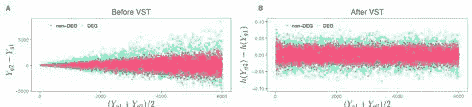
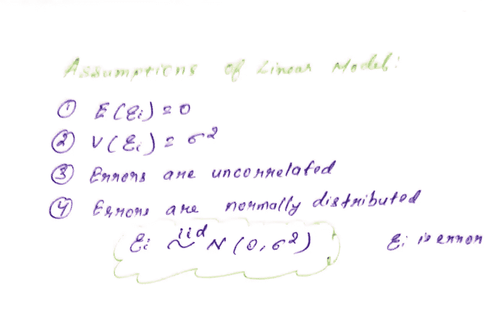
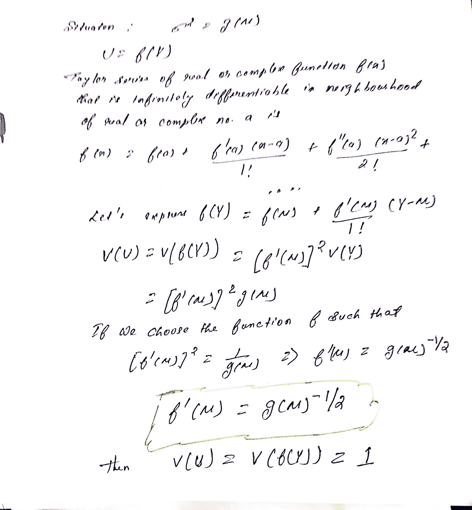
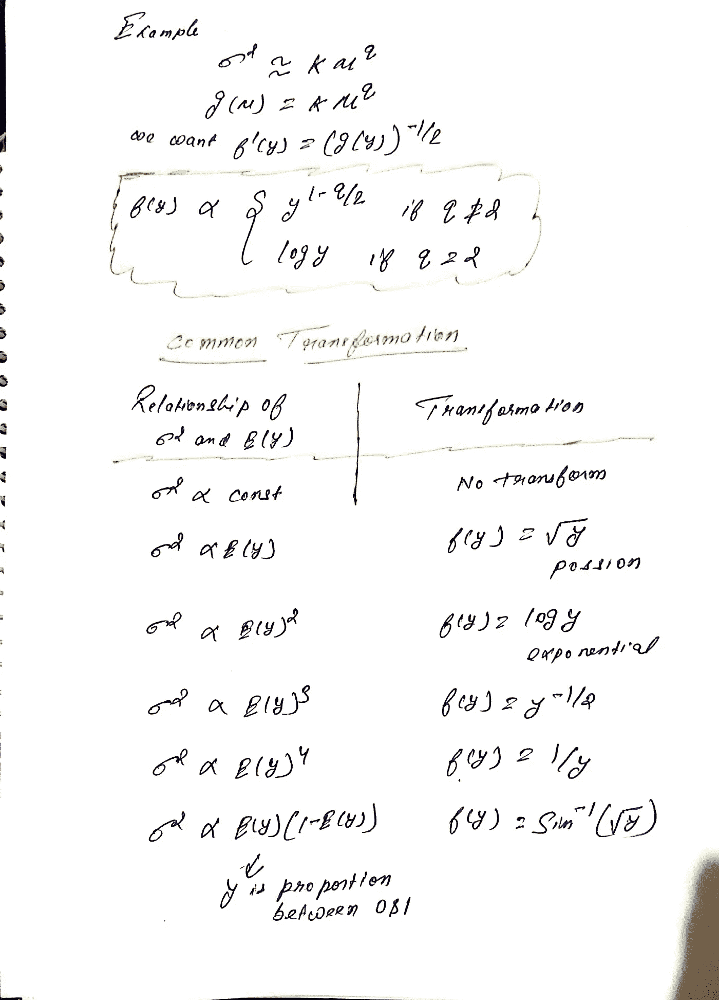
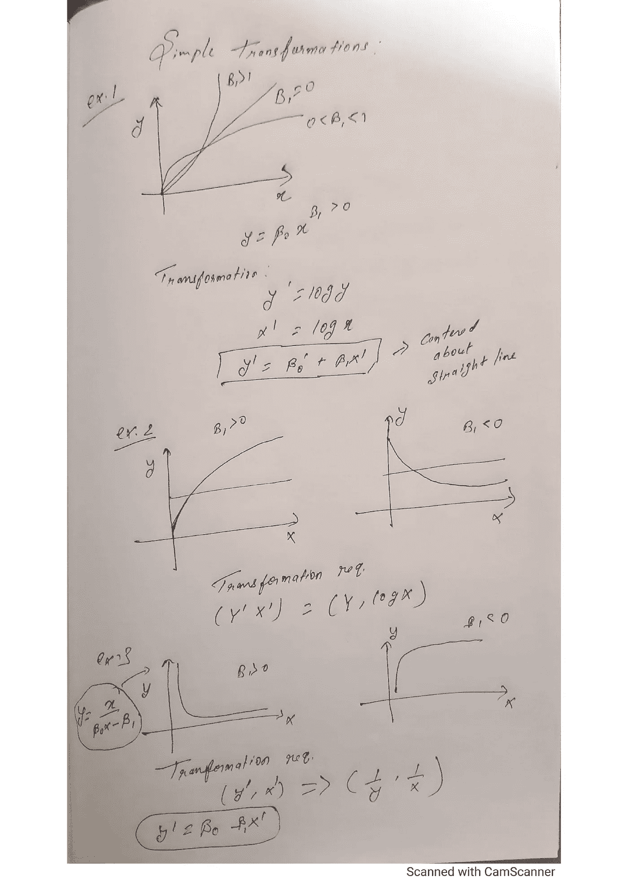
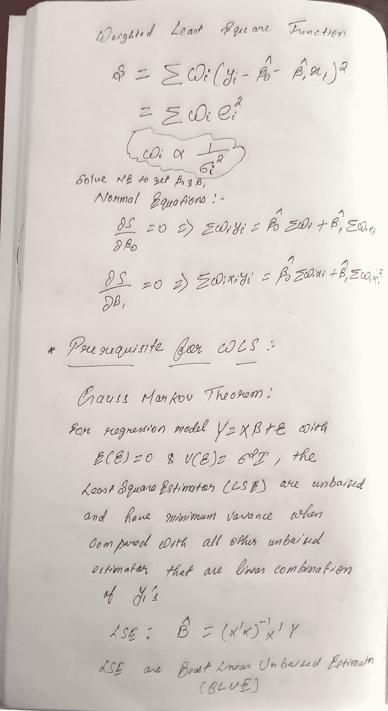
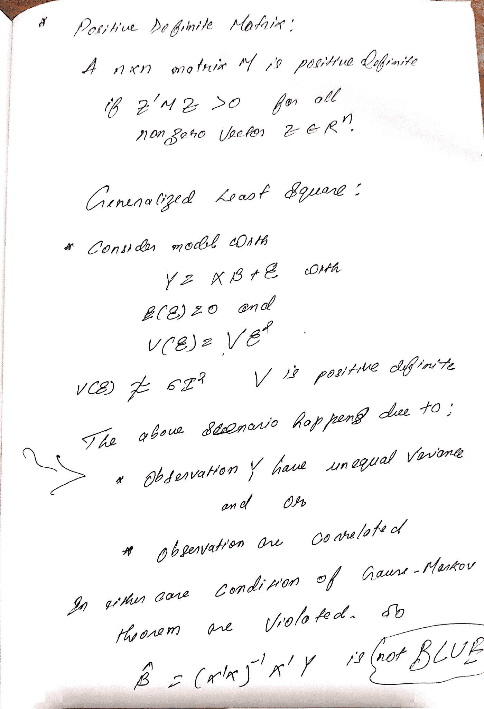
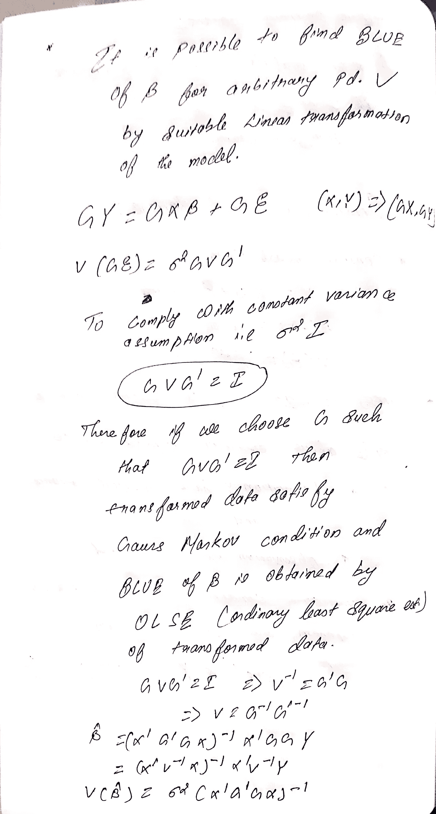
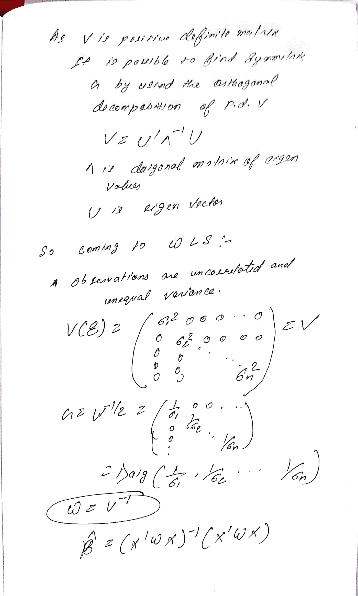
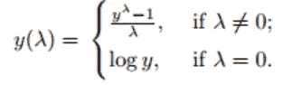

# 处理模型缺陷—线性回归

> 原文：<https://medium.com/geekculture/handling-model-inadequacies-linear-regression-4b3b0ed4d02d?source=collection_archive---------53----------------------->

本文讨论了处理线性模型不足之处的方法。

因此，首先我们必须回忆线性模型的假设是什么，一旦它们被违反，我们要做什么来恢复它们。

线性模型的假设:

修正模型缺陷的变换和加权方法

1.  **方差稳定变换**:

每当违反恒定方差假设时，最常见的原因是响应变量不符合正态分布。

假设响应变量有均值μ和方差 square，方差与μ相关，使用函数 g，然后让我们看看如何制定一个通用方法，为 y 找到一个函数 f，以稳定它的方差。

当方差是多项式函数 w.r.t 均值μ时，最常见的变换

2.**将模型线性化的变换**:

给定一组数据，我们假设响应变量和回归变量之间的线性关系。评估关系技术是散点图或残差图。

通过适当的变换可以线性化的函数称为可线性化函数。

下面是一些可线性化函数

3.**广义加权最小二乘法**:

非常方差线性回归模型可以用加权最小二乘法拟合。

什么是 WLS，这是了解 GWLS 的先决条件

加权最小二乘法(WLS)只是广义加权最小二乘法(GWLS)的一个特例。当观测值的方差不相等但不相关时，就会出现这种情况。这就是为什么我们看到之前的变换方程 w(i)与 s 处方程中的方差(I)成反比

一旦我们有这些违反，那么蓝色将不再是最好的估计，因为这些将违反高斯马尔可夫定理，所以我们需要转换我们的成本函数，即上述方程中的 S，以便恢复恒定方差假设。

让我们看看它是如何工作的:

我们已经在上面看到了 WLS 的权重(W)是如何从 GWLS 中得到的

因此，为了找到 w(i ),该算法首先将回归变量聚类成小组，然后在这些小组的顶部评估回归变量的平均值，同时计算因变量的样本方差，然后尝试根据这两个计算的变量拟合回归模型，因此，现在我们可以输入回归变量值以获得相应的方差，该方差将作为权重合并到原始模型中。

4.**分析模型**:

**Box Cox 变换**:

Box Cox 变换是非正态[因变量](https://www.statisticshowto.com/dependent-variable-definition/)到正态形状的[变换](https://calculushowto.com/transformations/)。[正态性](https://www.statisticshowto.com/assumption-of-normality-test/)是许多统计技术的重要假设；如果您的数据不正常，应用 Box-Cox 意味着您能够运行更多的测试。

Box Cox 变换的核心是一个指数 lambda (λ),它在-5 到 5 之间变化。考虑λ的所有值，并为您的数据选择最佳值；“最佳值”是产生正态分布曲线的最佳近似值的值。Y 的变换具有以下形式:

这个测试只对阳性数据有效。

* * * * *感谢阅读…