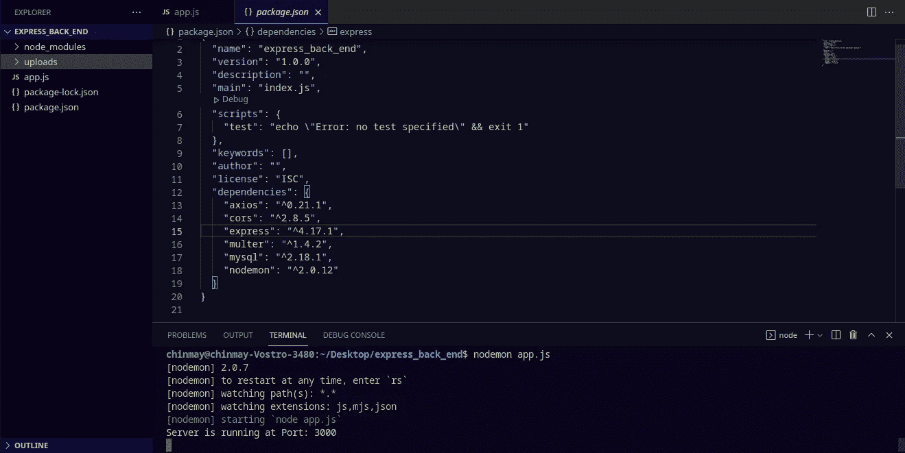
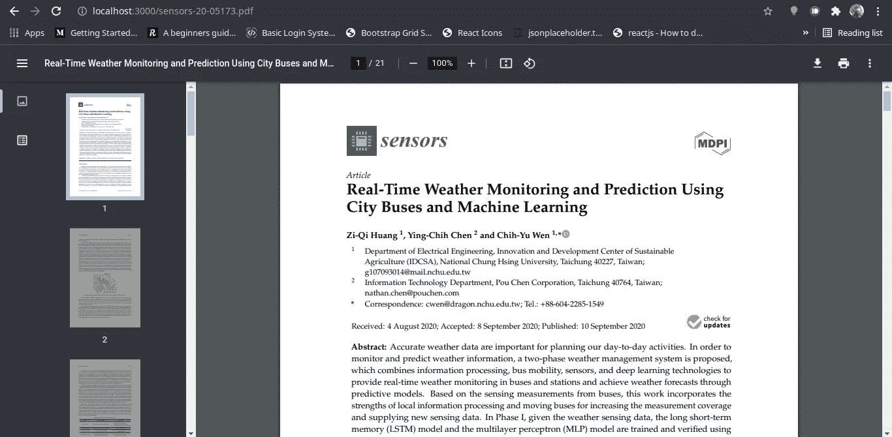

# 通过 Axios 使用 React.js、Express API 和 MySQL 处理多部分表单请求，并使用 Multer 上传文件。

> 原文：<https://medium.com/geekculture/handling-multipart-form-requests-with-react-js-5d773856cf86?source=collection_archive---------4----------------------->

> 在本文中，我们将看到如何在 React.js 和 Express.js 中处理来自多部分表单的 post 请求，以及针对各种输入类型的 Axios 和 Multer。我会尽可能用最简单易懂的方式记录下来。
> 
> 我在几个地方保存了 **console.log** 语句，因为它们对理解代码的行为非常有帮助。根据您的要求，您可以随意保留或删除它们。

在开始主题的实际开发之前，我们需要确保 Node 和 npm 已经安装。如果已安装，使用以下命令检查您的节点版本和 npm 版本；

```
node -v // for checking version of node if installed.
npm -v  // for checking version of npm if installed.
```

同样，我们需要看到我们的系统上安装了 MySQL。

```
mysql -V 
```

现在我们可以继续讨论我们文章的主要目标了。

## **第一步:设置 MySQL 数据库和表来查询数据:**

我们将首先通过运行以下查询来创建一个新数据库(取决于您的需求，如果您愿意，可以在现有的数据库中创建您的表):

```
CREATE DATABASE *products_db*;
```

成功创建数据库后，使用以下命令开始使用数据库:

```
USE DATABASE *products_db*;
```

现在，我们将创建一个表，用于存储我们产品的详细信息，随着我们的进一步发展，我们最终会添加这些信息。我们将创建包含以下各列的表:name、price 和 file。

```
CREATE TABLE products (
  product_id int NOT NULL AUTO_INCREMENT,
  name varchar(50) NOT NULL,
  price int NOT NULL,
  file varchar(50) NOT NULL,
  PRIMARY KEY (product_id)
);
```

## **第二步:设置我们的快递环境:**

首先，我们将创建我们想要执行后端操作的目录。为此，请在系统中您觉得合适的任何位置创建一个目录…

```
mkdir express_backend
```

现在我们有了自己的文件夹，我们将初始化其中的开发环境。在终端中运行以下命令来设置您的环境。

```
npm init -y 
```

成功运行这个命令将在您的项目目录中创建一个 **package.json** 文件。我们已经使用了'-y '标志来初始化环境，而没有经过所有的命名手续，npm 将配置它，这是完全可选的。接下来，我们将在您的项目结构的根目录下创建一个名为 **app.js** (您可以根据自己的选择命名)的文件。这个 app.js 文件将保存我们所有的 Express API 路由。现在，我们继续安装我们在开发过程中需要的所有依赖项。

对于我们的主题，如前所述，我们将使用 express、MySQL、Axios(参见下面的 React.js 部分)和 Multer。要安装这些依赖项，请运行:

```
npm i express@4.17.1 // install express
npm i cors@2.8.5   // install cors
npm i mysql@2.18.1   // install mysql
npm i multer@1.4.2   // install multer
npm i nodemon@2.0.12 // install nodemon
```

我们安装 nodemon 是为了在每次进行和保存更改时不用手动启动服务器。Nodemon 将监视 **mjs、js 和 json** 扩展。现在，我们已经拥有了所有必需的依赖项。这就是完成这些步骤后项目结构和 **package.json** 的样子。



Project Structure for the Express API and installed dependencies in package.json

我们还增加了 CORS 套餐。**代表**跨产地资源共享**。我们使用 CORS 的原因是，如果客户机(在我们的例子中是 react.js 应用程序)和服务器(我们创建的 express 服务器)不在同一个地方，浏览器默认情况下会阻止请求。CORS 允许客户端和服务器之间基于两个不同来源的通信。现在我们需要 app.js 文件中的依赖项。参见下面的代码:**

**我们的服务器应该在“localhost:3000”上。接下来，我们将建立到 MySQL 数据库的连接:**

**我已经将我的数据库凭证作为环境变量传递，如果您在本地进行测试，那么您的主机将是 host: 'localhost '和 user: 'root '(在大多数情况下)，使用您为访问 MySQL 设置的任何密码。请注意 connection 内部名为 tls 的对象键。tls (TLS)代表传输层安全性(参考链接在最后给出)。这里，我们将 tls rejectUnauthorized 设置为 false，这意味着您基本上禁用了服务器证书验证。**警告:**这种方法只适用于本地开发，不适用于生产。**

## ****步骤 3:设置 Multer:****

**我们将使用 Multer 上传文件到我们的服务器。我们已经在 app.js 中安装并要求了 Multer(见上文)。Multer 是一个 Node.js 中间件，我们用它来处理来自 **multipart/form-data** 的请求，特别是处理文件上传。**

****设置:**将下面几行代码添加到 app.js 本身。或者，如果您愿意，也可以将它作为一个模块从另一个文件中导出。**

**在项目结构的根级别创建一个名为 **uploads** 的新路径。接下来，我们为 API 创建 post 路由，以处理来自表单的 POST 请求。**

**POST Request for uploading the file to DB**

**记住**上传**将是一个静态文件夹，它将存储我们上传到其中的所有文件。因此，我们需要提供静态文件，我们将通过以下方式做到这一点:**

```
// Serve Static Filesapp.use(express.static('uploads'));
```

**使用 Multer，我们可以指定是上传单个文件还是多个文件，因此在这里，我们指定 **upload.single('file')** 作为 app.post()中的参数。请注意，在 upload.single()中，我指定了一个名为“file”的字符串。我将很快回来讨论它(参见 React.js 一节)。至此，我们已经完成了我们的明确要求，现在可以继续我们的主题部分了，在这里我们用 React.js 绑定所有内容。**

## **步骤 4:设置 React.js:**

**如果您的系统上没有安装 React.js，请通过以下方式安装它:**

```
npm install -g create-react-app
```

**现在我们将创建 react 应用程序，它将向我们的后端提供数据。对于该运行:**

```
npx create-react-app multipart-form
```

**您可以在您希望安装 react 应用程序的系统目录中运行这个命令。安装后，我们将设置基本结构。我在 src 文件夹中的 components 文件夹下创建了一个名为 **multiform.js** 的文件，并将其导入到我的 **App.js** 中。**

****注意**:为我们的表单提供 encType 是很重要的，在我们的例子中是 multipart/form，因为 Multer 不处理任何不是 multipart 的表单。另外，请注意，我在 POST 请求中提到的参数**‘file’**实际上是 file 类型的输入字段的名称。现在在 **App.js** 中:**

**这是该文件夹的结构外观:**

****

**React.js Project Structure**

****创建变更和处理表单提交的事件处理程序:****

**我们现在将创建三个事件处理程序，第一个是 handleChange 处理程序，第二个是 fileSelectedHandler，最后一个是 fileUploadHandler。为此，我们将首先在 React 应用程序中安装 Axios，以便向服务器发出 POST 请求:**

```
npm i axios@0.21.1  // install axios
```

**然后使用以下命令导入 multiform.js 文件中的 Axios:**

```
import axios from 'axios';
```

**创建各种处理程序，它们的名字我已经在上面提到过了:**

**在 **handleChange** 处理程序中，我们通过从表单接收的值来设置名称和价格的状态。在 **fileSelectedHandler** 中，我们为文件名和将要上传的文件设置状态。**

**我们将我们的值追加到 **formData** 中，然后我们将它和一个配置对象一起传递给我们的 Axios post 处理程序，该配置对象指定我们正在发送一个多部分表单数据**‘多部分/表单’**。**注意**:在调用 **render () {}** 方法之前，指定你的状态和处理程序。否则，您将得到错误，指出 XYZ 处理程序未定义，状态未定义，等等。**

**完成以下步骤后，我们的文件上传系统就可以使用 React、Express 和 Multer 了！**

> **问:如何查看我用 localhost 上传的文件？**

**在浏览器的 URL 中，只需输入**localhost**/nameoftefilethayouhaveuploaded。在我的情况下，我有一个 PDF 文件，我已经上传到我的 express 服务器，这是如何查看它:**

****

**Uploaded PDF as viewed from our express server on localhost:3000.**

## **第 5 步:从 React.js 查看您上传的文件:**

**这是我们话题的最后一步。我们将从用户界面访问我们的文件。为此，我们将创建一个名为 **viewpdf.js** 的新文件。在 viewpdf.js 文件中，我们将为文件列表设置一个状态。**

**我们根据从 API 接收到的数据设置 **listOfItems** 的状态。然后，我们通过状态映射来显示我们的数据和查看我们的文件。最后，我们将它导入回我们的 App.js。**

```
import ViewPDF from "./components/viewpdf";
```

**就是这样！我将添加一点点的风格，这是你可以选择的，因为你可以用自己的方式来设计。谢谢你。**

## **GitHub 资源库的链接:**

***快递服务器* : [链接到 GitHub 仓库。](https://github.com/chinmaykarmokar/multer-express-server)**

***React App* : [链接到 GitHub 库。](https://github.com/chinmaykarmokar/react-multipart-form)**

## **参考资料:**

***TLS* : [点击这里了解更多。](https://levelup.gitconnected.com/how-to-resolve-certificate-errors-in-nodejs-app-involving-ssl-calls-781ce48daded)**