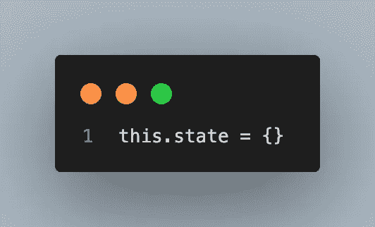

# 在 React 中处理状态和道具不需要挂钩

> 原文：<https://medium.com/geekculture/handling-state-and-props-in-react-without-hooks-e215a197bd81?source=collection_archive---------9----------------------->



在 React 中处理状态是我最喜欢的框架之一！理解什么是状态以及如何在组件之间传递状态是 React 简化 web 开发的重要方式之一。

**this.state = {}**
什么是状态？
状态是一个已定义的 JavaScript 对象的当前值。当您在 React 中创建一个组件时，您可以定义多个 JS 对象的状态，然后用一些 JavaScript 魔术来更改它们！

```
class ParentComp extends React.Component {
  constructor() {
    super()
 **this.state = {
      item: ''
    }**
  }
}
```

**this.state.[object]** 要使用您已经声明的状态，只需在 HTML 中使用普通的 JavaScript 语法。
下面的示例将 div 的内部文本设置为空字符串。

```
class ParentComp extends React.Component {
  constructor() {
    super()
    this.state = {
      item: ''
    }
  }
  render() {
    return (
      <>
       <div>{**this.state.item**}</div>
      </>
    )
  }
}
```

**this.setState()
setState()是一个内置函数，它允许我们改变先前定义的 JS 对象的状态。
您可以编写您通常编写的 JavaScript 来更新变量；但是，对于这个，您只需调用 setState()函数来更新组件中的状态。
在下面的示例中，我们可以看到，每当我们单击按钮时，它都会触发一个名为“handleClick”的功能。在这个函数中，我们看到 setState()被调用。这将“item”的状态从空字符串更改为“Hello”。**

```
class ParentComp extends React.Component {
  constructor() {
    super()
    this.state = {
      item: ''
    }
    **this.handleClick = this.handleClick.bind(this)**
  }
  **handleClick = (e) => {
      e.preventDefault()
      this.setState({ item: 'Hello' })
    }**
  render() {
    return (
      <>
       <div>{this.state.item}</div>
      ** <button onClick={this.handleClick}>Click Me!</button>**
      </>
    )
  }
}
```

**传球道具** *<组件道具= { this . state . item }/>*传球道具(属性)是一个庞大的概念，在使用基于组件的项目时需要理解。总的来说，这是一个很容易开始的概念，但是随着嵌套组件越来越深，它会变得越来越复杂。要将属性传递给一个组件，只需在父组件中调用它的地方添加一个属性。我们将在下一节看看如何使用这些道具。

```
class ParentComp extends React.Component {
  constructor() {
    super()
    this.state = {
      item: 'Hello'
    }
    this.handleClick = this.handleClick.bind(this)
  }
  handleClick = (e) => {
      e.preventDefault()
      this.setState({ item: 'Howdy' })
    }
  render() {
    return (
      <>
       ** <ChildComp props={this.state.item} handleClick={this.handleClick} />**
      </>
    )
  }
}

class ChildComp extends React.Component {
  constructor(props) {
    super(props)
  }
  render() {
    return (
      <>
  **     <button onClick={this.props.handleClick}>Click Me!</button>**
      </>
    )
  }
}
```

在你的组件中使用道具就像使用变量一样简单。你可以用一个变量来声明你的道具，也可以解构这些道具。如果你只传递一个变量，那么只使用‘this . props . item’就可以了，但是如果你传递多个属性，那么解构会好得多。

```
class ParentComp extends React.Component {
  constructor() {
    super()
    this.state = {
      item: 'Hello'
    }
    this.handleClick = this.handleClick.bind(this)
  }
  handleClick = (e) => {
      e.preventDefault()
      this.setState({ item: 'Howdy' })
    }
  render() {
    return (
      <>
        <ChildComp props={this.state.item} handleClick={this.handleClick} />
      </>
    )
  }
}

class ChildComp extends React.Component {
  constructor(props) {
    super(props)
  }
  render() {
 **const { props } = this.props**
    return (
      <>
       **<div>{props}</div>**
       <button onClick={this.props.handleClick}>Click Me!</button>
      </>
    )
  }
}
```

我希望您有兴趣更深入地使用 React 中的状态，因为这肯定不是全部！但是我觉得这是一个很好的介绍！

**来自布兰登的提示或引用:**
今天我有一个引用！

> “如果你在模仿你周围的人，那么你只会和他们一样优秀。再好不过了。”

这是我自己的引用，所以我想我会解释一下。主要的信息是，你应该始终意识到你周围的人是谁。我主要用这个来尝试和激励我的乐队学生去练习，听专业人士的意见，并积极努力变得更好。显然，也有例外，但我相信总的想法是正确的。如果你只看到你周围的东西是“好的”,那么你永远不会努力变得更好。或者更糟，你会努力变得更好，但仅仅是一点点。