# 通过开放教育实践数据科学

> 原文：<https://medium.com/geekculture/hands-on-for-data-science-via-open-education-a89d825508f8?source=collection_archive---------46----------------------->

如果你想进入数据分析和数据科学领域

> **简介**:参与并与 Omdena 和 **Omdena 印度分会合作**

# 1.开放教育——什么|由谁|如何

一、**什么**:这是一种协作学习&教育方式，远程工作。通过数据科学(AI)工具和技术，帮助提升技能并获得实践经验，以构建数字化的软件解决方案来解决现实世界(真实生活)的挑战。

二。**由谁** : ***Omdena*** —这是一个协作平台，支持上述方法。

三。**如何做**:通过这个平台，你将有机会结识来自不同地方的合作者和建立关系网。

四。**工具** : Python3、熊猫、Plotly Express&Graph _ Objects、Dash、Jupyter 笔记本

*   **熊猫**:数据预处理库
*   **Plotly** :交互式图形库
*   Dash :为 EDAs 构建提供交互功能的 web 应用程序的库
*   Jupyter 笔记本:数据科学、EDAs 和开源项目的网络编辑器

动词 （verb 的缩写）如果你想进入人工智能领域，提高技能或者获得实践经验，我建议你注册 Omdena。我还在最后的“ ***资源*** ”部分按顺序提供了访问我构建和部署的 Dash web 应用程序的所有链接。他们也有来自不同国家的地方分会。

# 2.我参与的项目:

***利用 AI 分析印度 covid 19***产生的社会经济影响。

我们有子任务，积极的合作者致力于交付项目的每个部分。

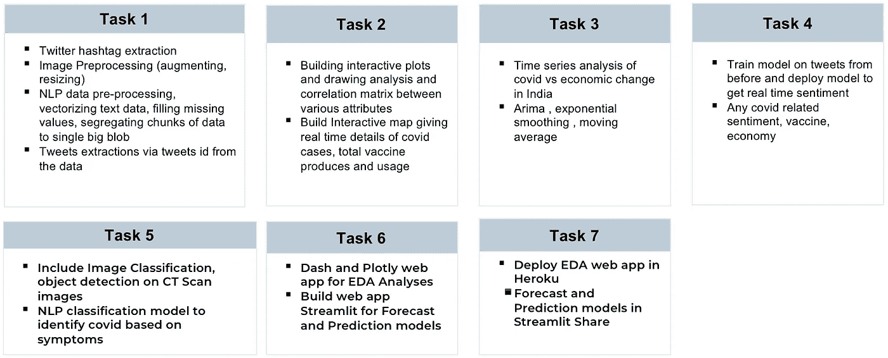

Workflow of the project in terms of subtasks.

> **E** 探索 **D** 数据 **A** 分析:在探索和分析数据时，我执行的步骤是:

*   从开源和可信的资源中收集数据。
*   探索所需的数据集并了解它们的字段/列。
*   删除不必要的字段，并根据需要将日期字段转换为 *datetime* 类型。
*   根据要求填写缺失值。
*   如果字段名不一致，则使字段名一致，或者根据需要对其进行重命名(例如:打字错误)。

# 3.目标:

*分析 covid19 对印度*和*的社会和经济影响，建立预测和预报模型*。从 *Kaggle* 、 *GitHub* 、*我们的世界中收集的数据集*、 *Covid19India* 和*印度外交部*。

如果你是初学者，你可以阅读我在' ***资源*** *'* 部分解释的关于*数据分析*和 *EDA* 的参考文章(这两篇文章都发表在*极客文化*刊物上)。

# 4.我参与了什么:

*   我作为任务负责人参与了*数据收集和预处理、*
*   最终转入 *EDAs* ，从事描述性*数据*分析，以分析社会和经济影响。
*   在 Heroku 构建和部署 Dash web 应用程序。
*   主持最终演示，并演示了 *Dash web 应用程序*。

你可以从我的 GitHub repo 浏览 EDA 笔记本，如果你想访问的话，在最后提供。

> **Dash Web App**截图:

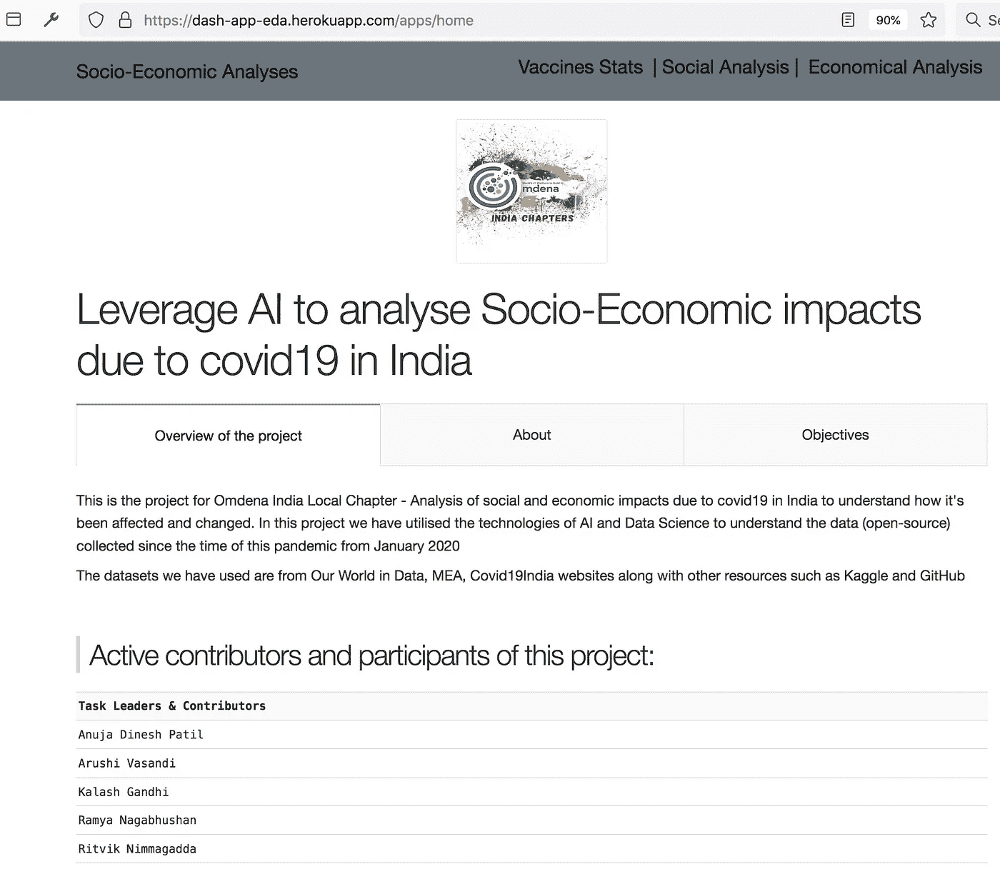

Home Page of Dash web app

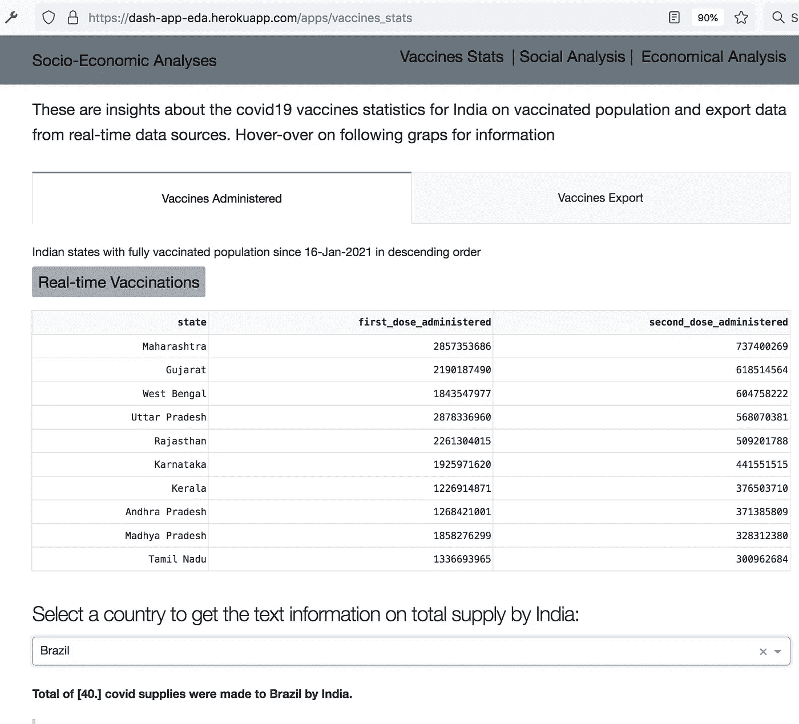

Vaccines statistics for first & second doses and covid19 vaccines supplied by India to different countries.

Social impact analysis

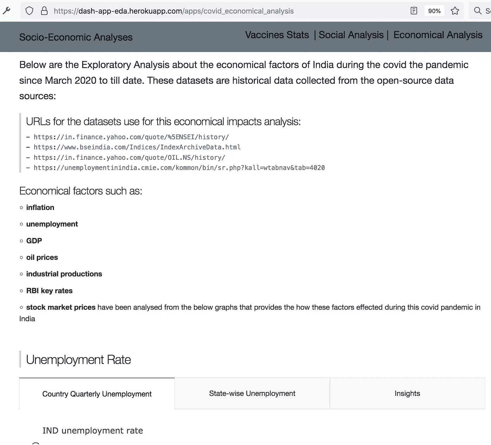

Economic impact analysis

> 以下代码片段是数据可视化及其相关输出的示例:

1.  **线状图显示*总确诊*病例状态**

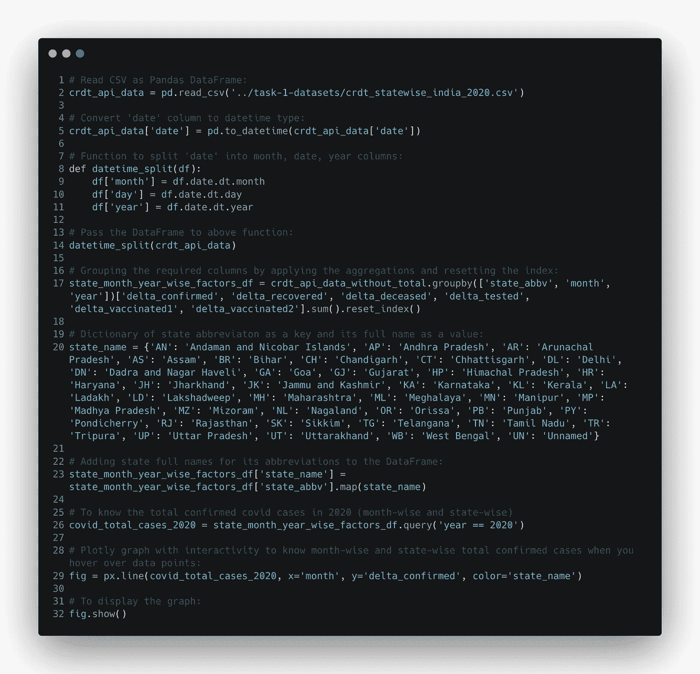

Code snippet I have written for the below graph that provides info on total confirmed (delta_confirmed) cases in 2020 — month-wise and state-wise in the Jupyter notebook.

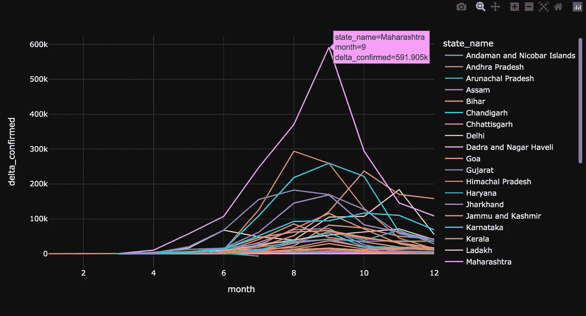

Plotly Express graph to display total confirmed cases in 2020 — month-wise and state-wise.

2.**在中使用 Plotly Express 和 Dash 库绘制图形。py 模块**

为了获得上述数据集的映射图，需要根据特定场景对 Dash 库进行一些语法更改。下面的代码片段是我做的破折号代码的例子，通过地图图形显示洞察力。

> **2a:散点图框**类型的**地图图形**使用**plotely Express**跟随其图形使用 **Dash** 库在 web app 中显示。

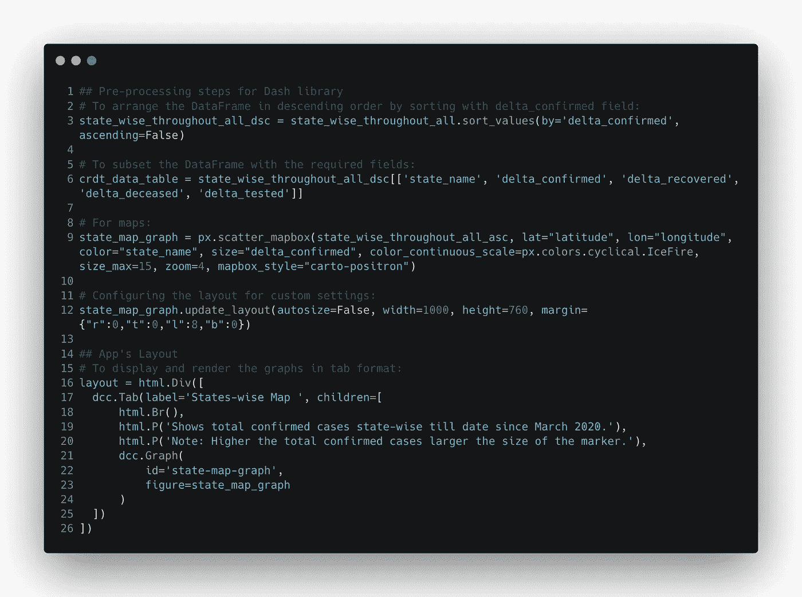

Code snippet I have written for the below graph that provides info on total confirmed (delta_confirmed) cases in 2020 — month-wise and state-wise in the Jupyter notebook.

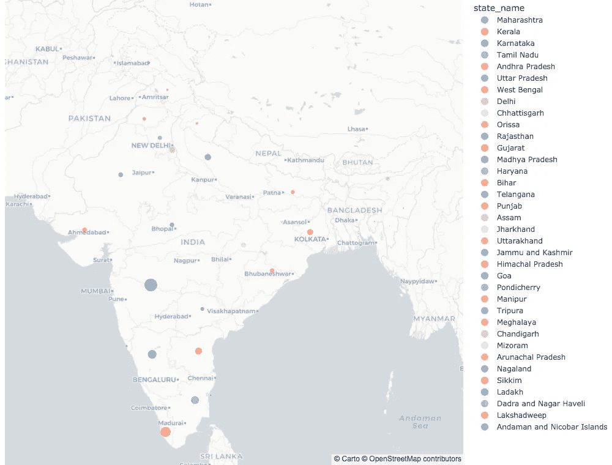

State-wise map graph for total confirmed (delta_confirmed) cases in 2020 — month-wise and state-wise. This graph displayed in web app using **Dash** library.

> **2b:饼状图**使用 **Python** 、 **Plotly** 和 **Dash** 库来表示印度人口超过 2000 万的邦内完全接种疫苗人口的比例。

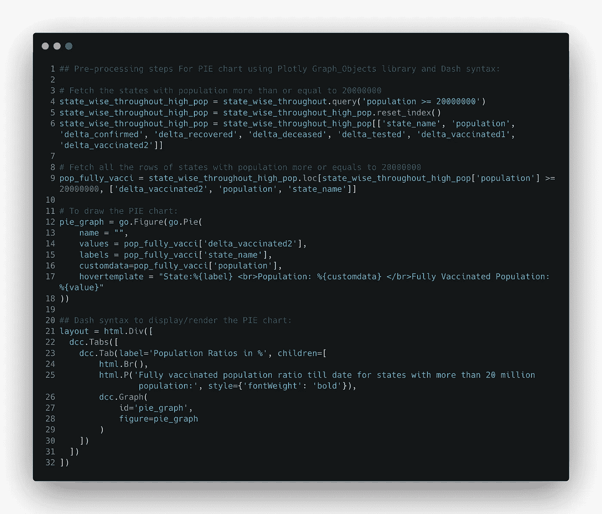

Pre-processing steps using **Python** andto display in **Dash** **web app**.

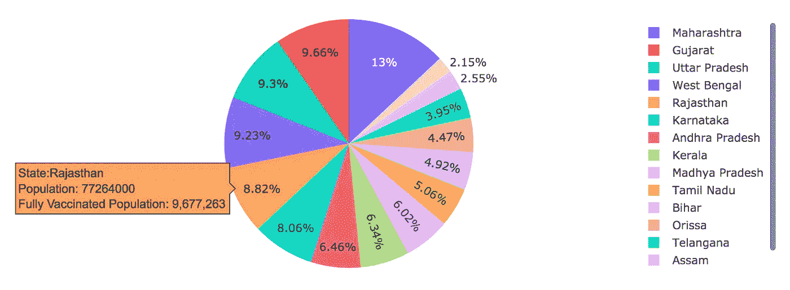

**PIE chart** using **Plotly Graph_Objects**.

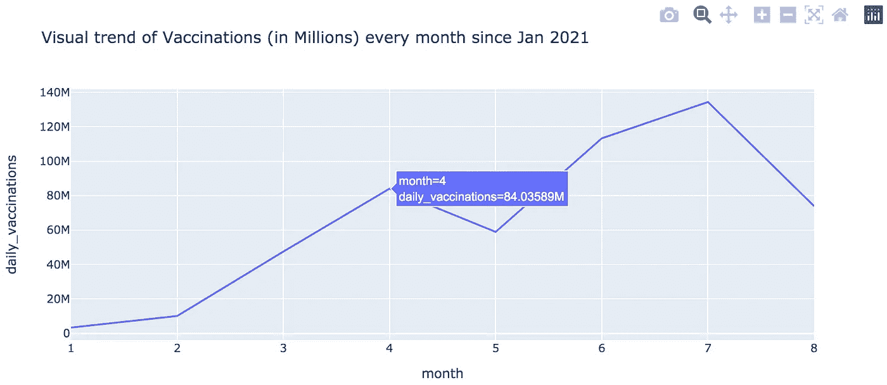

Similarly I have done the line graph for trend of daily vaccinations in India overall.

# 5.我学到的东西和技能:

在这个项目中，学习了 Plotly 制作交互式数据可视化和图形以及 Dash 库，为 EDA 笔记本电脑构建 web 应用程序，并将其托管在 Heroku 等平台上。

使用这些工具是一次很棒的经历，也是一次合作和交流的机会。

# 6.这方面的进一步范围:

*   这个 Dash web 应用程序可以增强用户界面和用户体验，
*   可以添加下拉功能来获得信息的深入级别，例如:可以显示 2020 年和 2021 年(通过使用实时数据到目前为止)以及每月的州级社会影响因素。

# 7.资源:

**Dash Web app**:[https://dash-app-eda.herokuapp.com](https://dash-app-eda.herokuapp.com/)——这是我用 VS 代码构建的应用，部署在 Heroku 上。(PS:如果浏览器显示错误，请重新加载，因为 Heroku 中的 dynos 可能需要重新启动！)

**本次申请视频**:【https://www.youtube.com/watch?v=K9Dv4Bn0MSA 

***数据集:***[***covid 19 India***](https://data.covid19india.org/)， [**MEA**](https://www.mea.gov.in/vaccine-supply.htm) ， [***我们的世界在数据***](https://github.com/owid/covid-19-data/tree/master/public/data/vaccinations)

**延伸阅读** : [**破折号**](https://dash.plotly.com/introduction) 和 [**情节性**](https://plotly.com/)

**奥姆德纳**:[https://omdena.com/](https://omdena.com/)——如果你有兴趣参加，你可以通过这个链接获得更多信息。

**数据分析**:[https://medium . com/geek culture/Data-Analysis-da-with-python-c 570264 edeab](/geekculture/data-analysis-da-with-python-c570264edeab)

**用数据库进行探索性数据分析**:[https://medium . com/geek culture/EDA-with-SQL-MySQL-4a C1 ea 1d 977 b](/geekculture/eda-with-sql-mysql-4ac1ea1d977b)

**我的 GitHub 回购**:[https://github.com/rnedesigns/exploratory_data_analysis](https://github.com/rnedesigns/exploratory_data_analysis)

谢谢你