# 使用 BigQuery 进行回归分析

> 原文：<https://medium.com/geekculture/hands-on-regression-analysis-with-bigquery-7925dca179ff?source=collection_archive---------5----------------------->

如何使用 BiqQuery 执行线性回归分析的分步指南

[Image Source](http://www.freepik.com)

我们生活在大数据时代。很难给出大数据的准确定义。然而，作为一个很好的经验法则，如果数据集不能放在单个系统的内存或磁盘中，它可以被称为大数据。大数据用于医疗保健、生物学、生物信息学和教育等领域。

经典计算机足以分析中小型数据。但是大数据从根本上改变了数据分析。这些计算机无法分析大数据，因为大数据不适合内存。

云计算改变了游戏规则。现在云计算平台中的工具可以分析大数据。在本文中，我将向您展示如何使用 BigQuery 执行线性回归分析，并涵盖以下主题:

*   什么是 BiqQuery？
*   什么是 BigQuery ML？
*   BigQuery 定价
*   使用 BigQuery 的线性回归分析

让我们开始吧！

# 什么是 BigQuery？

[**BigQuery**](https://cloud.google.com/bigquery/docs/introduction) 是一个完全托管的无服务器数据仓库，允许您使用内置功能(如机器学习、地理空间分析和商业智能)来管理和分析您的数据。使用 BigQuery 可以在几秒钟内查询 TB，在几分钟内查询 Pb。

您可以在 Google 云控制台界面和 BigQuery 命令行工具中访问 BigQuery。您还可以使用 [Python](https://github.com/googleapis/python-bigquery) 、Java、JavaScript 和 Go 中的客户端库以及 BigQuery 的 REST API 和 RPC API 来转换和管理数据。

BigQuery Page

# 什么是 BigQuery ML？

您可以使用 BigQuery 来查询大数据，也可以使用标准 SQL 查询来构建机器学习模型。BigQuery ML 允许您发现、实现和管理数据工具，以做出关键的业务决策。

[BigQuery Cheatsheet](https://cloud.google.com/static/bigquery-ml/images/ml-model-cheatsheet.pdf)

如你所知，在大数据集上建立机器学习模型需要大量的编程和 ML 框架知识，如 TensorFlow 和 PyTorch。BigQuery ML 帮助 SQL 从业者使用现有的 SQL 工具和技能建立和评估机器学习模型。

以下是 BigQuery ML 的一些优点:

*   BigQuery ML 民主化了机器学习的使用，你只需要懂 SQL。
*   它提供了各种可以开箱即用的预构建模型。
*   不用从数据仓库导出数据，就可以快速建立机器学习模型。
*   它易于使用，可以集成到现有的工作流程中。
*   它具有成本效益，可用于在现收现付的基础上训练模型。

[Data Processing Pipeline](/google-cloud/how-to-integrate-external-data-sources-with-bigquery-9e126d5751ea)

您可以通过以下方式使用 BigQuery ML:

*   谷歌云控制台
*   `bq`命令行工具
*   BigQuery REST API
*   外部工具，如 Jupyter 笔记本电脑或商业智能平台

# BigQuery 定价

Bigquery 不是免费的，它向你收取数据存储和运行查询的费用。但是作为谷歌云免费层的一部分，BigQuery 免费提供一些资源，直到一个特定的限制。这些免费使用限制在免费试用期期间和之后可用。关于免费使用层的更多信息，你可以在这里查看[。](https://cloud.google.com/bigquery/pricing#free-tier)

# 使用 BigQuery 进行回归分析

线性回归是一种统计技术，用于根据给定的自变量预测因变量的未来值。因变量是被预测的变量，而自变量是用于进行预测的变量。

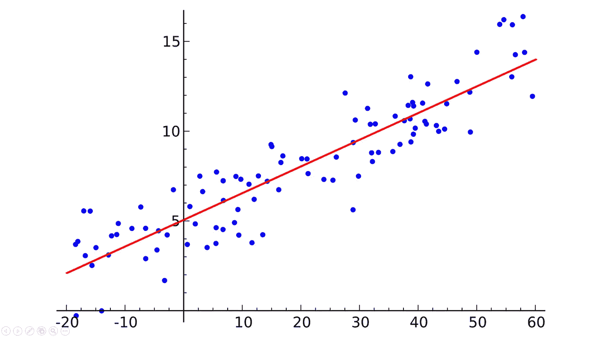

[Linear Regression](https://simple.wikipedia.org/wiki/Linear_regression)

以下是线性回归的一些优点:

1.  线性回归是一种简单易用的技术。
2.  这是一种强大的技术，可以用来预测未来的价值。
3.  这是一种可靠的技术，可用于获得准确的预测。
4.  这是一种灵活的技术，可用于预测不同自变量的值。
5.  这是一种广泛使用的技术，为许多统计学家所熟知和理解。

让我们看看如何通过 6 个步骤使用 BigQuery 执行线性回归分析。

## 第一步。创建数据集

在建立机器学习模型之前，您需要创建一个数据集。为此，我们先转到 bigquery 页面。之后，点击项目名称旁边的三个点，然后按下*创建数据集*。

Creating dataset

在 **Create dataset** 页面上，输入一个名称，比如说 *reg_analysis，*保留所有其他选项的默认值，然后单击 Create dataset。

Creating dataset

## 第二步。探索数据集

我要用的数据集是 **new_york_citibike** 数据集**。**该数据集存在于托管所有 bigquery 公共数据集的**big query-public-data**GCP 项目中。让我们来看看这个数据集。打开**big query-public-data**GCP 项目，找到 **new_york_citibike** 数据集。然后点击 citibike_trips 表。

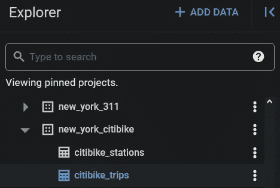

The new york citibike dataset in bigquery-public-data project

将打开一个新窗口，显示关于数据集的信息。

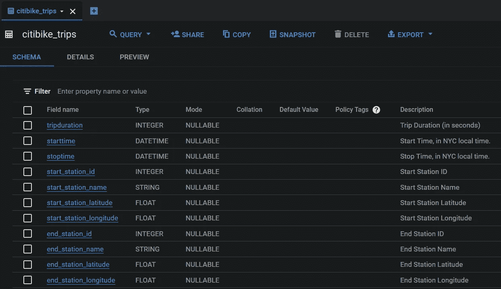

The citibike_trips table

在方案选项卡中，citibike_trips 表的结构显示了可用作标注和要素的所有字段。在这里，tripduration 字段指示每次自行车租赁的持续时间，以秒为单位。这个列将是我们的目标变量。表中的所有其他字段都是潜在要素，因为这些字段与要经过的距离直接相关，并影响行程的持续时间。

现在让我们用一个 SQL 查询来看看 tripduration 列的行数。

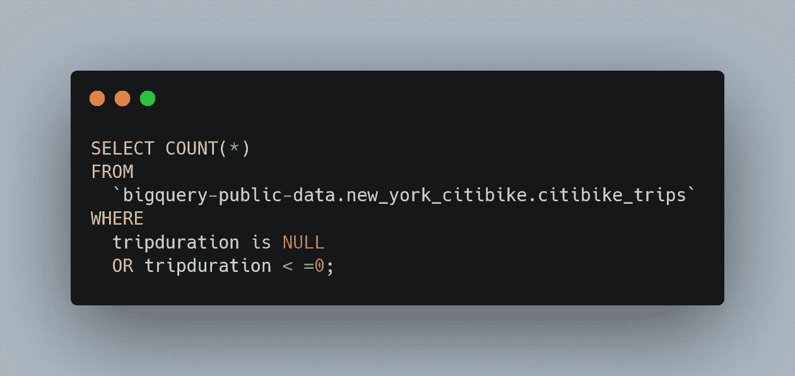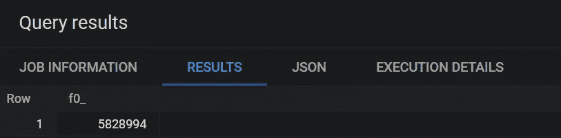

如您所见，有超过 500 万条记录的 tripduration 字段没有被正确赋值。

## 第三步。创建表

在训练模型之前，数据集在机器学习项目中被分成三组。这些是训练集、验证集和测试集。模型是用定型集构建的，模型是用验证集评估的，测试集中的值是用模型预测的。

让我们首先创建训练集:

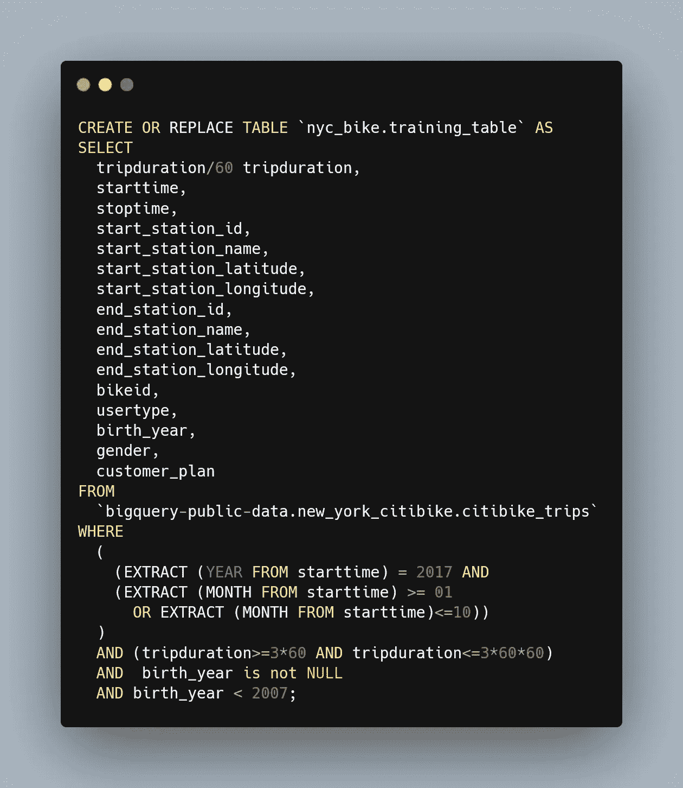

Creating the training table

让我们检查一下这些 SQL 注释。您可以使用`CREATE OR REPLACE TABLE`语句创建一个新表。查询的结果存储在新的`nyc_bike.training_table`中。您可以在`SELECT`语句中编写想要使用的列。

`WHERE`语句用于过滤数据。在这个语句中，我使用了`EXTRACT`方法从`starttime`字段中获取年份和月份，这表示自行车旅行开始的确切时间。为了排除 **tripduration** 列中的异常值，我只考虑最小租赁时间为 3 分钟、最大租赁时间为 3 小时的行。我还可以为我们的客户的出生年份添加一个过滤器，通过过滤所有带有空 **birth_year** 的记录，忽略所有出生于 **2007** 之后的客户。

运行该查询后，您将看到如下表格。

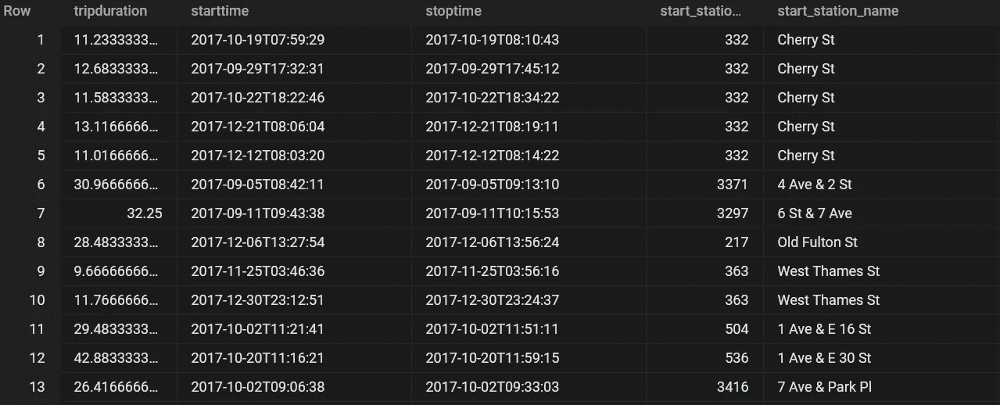

The training table

让我们创建评估表。

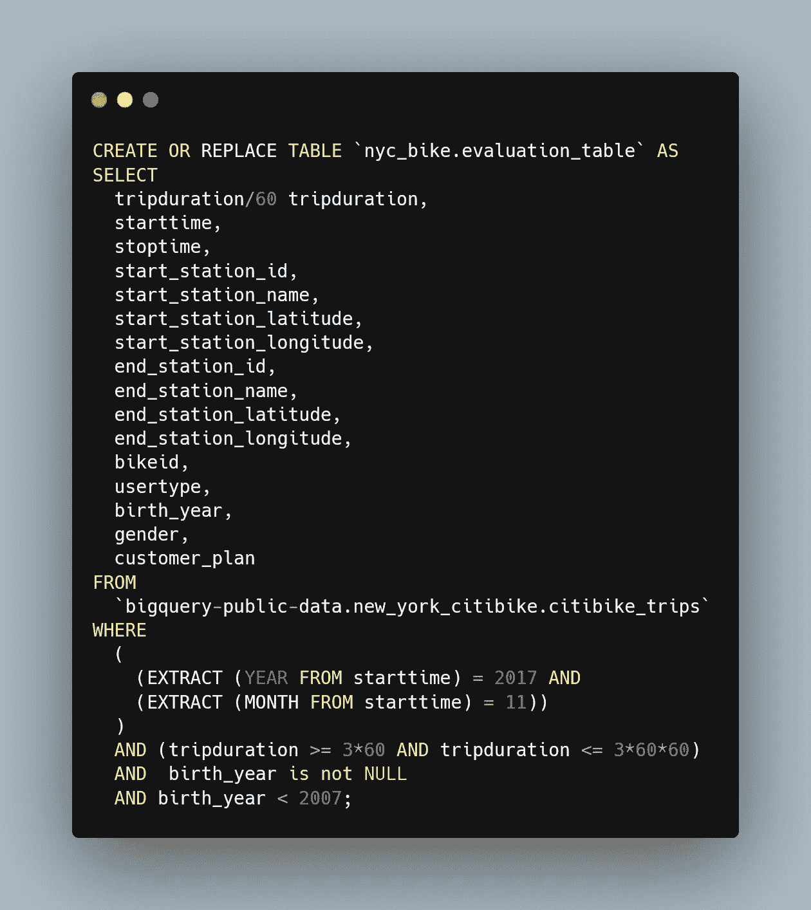

The evaluation table

之后，让我们创建预测表。

The prediction table

不错！我们创造了桌子。下一步是使用训练表创建回归模型

## 第四步。构建模型

现在让我们使用带有 BigQuery 的训练表构建一个线性回归模型。我们可以使用下面的标准 SQL 查询来构建用于预测旅行持续时间的模型。我要给模型起个名字，就说`reg_model`吧。

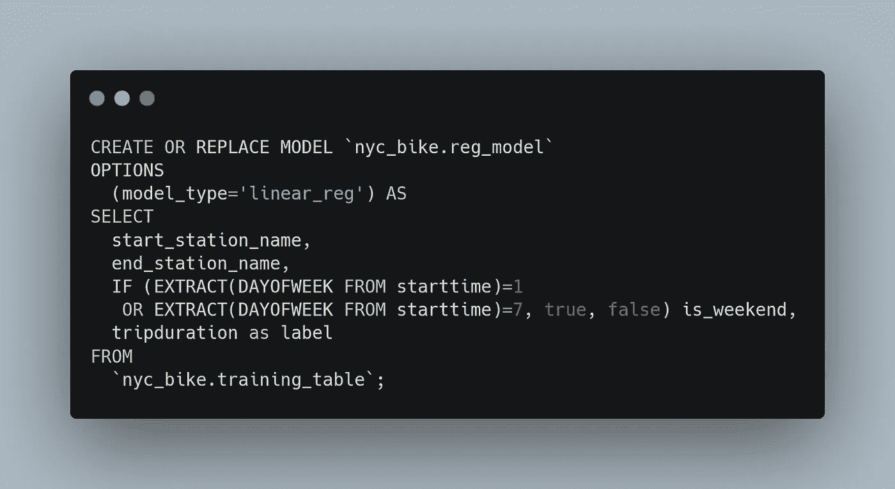

Building the model

## 查询详细信息

您可以使用`CREATE MODEL`子句通过`OPTIONS(model_type='linear_reg')`子句创建并训练名为`nyc_bike.reg_model` 的模型。

我想加一个`is_weekend`。该字段是一个**布尔值**，用于计算和提取自行车租赁发生在一周中的哪一天。它由一条 **IF** 语句生成，如果当天是星期天或星期六，该语句返回 **true** ，用值 **1** 和 **7** 表示；否则就是**假**。`tripduration`列是我们的输入标签列。

单击 run 按钮后，查询大约需要 30 秒，然后您的模型会出现在导航面板中。注意，因为我们使用了一个`CREATE MODEL`语句来创建一个表，所以我们看不到查询结果。

单击 reg_model 查看模型定型统计信息。然后点击教育选项卡，然后点击表。结果应该是这样的:

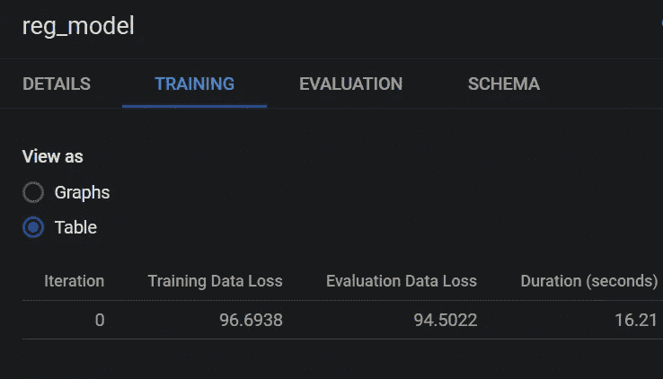

The mean squared error metric

默认情况下，您可以看到均方误差指标。

## 第五步。评估模型

创建您的模型后，您可以使用`ML.EVALUATE`函数来评估模型。让我们使用以下查询来评估评估表上的 ML 模型:

Evaluating the model using the evaluation_table

## 查询详细信息

最上面的`SELECT`语句从模型中检索列。我在`FROM`子句中设置了`ML.EVALUATE`函数来评估模型。当您运行这个查询时，结果如下所示

The metrics

## 第六步。使用模型预测结果

评估模型后，下一步是用它来预测结果。让我们使用预测表中的数据来预测标注:

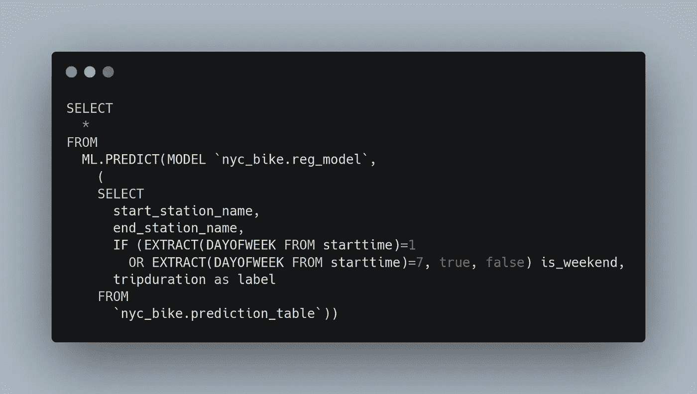

Predicting the data in the prediction_table

## 查询详细信息

我在`FROM`子句中设置了`ML.PREDICT`函数来预测预测表中的数据。在下面的截图中，可以看到预测的标签。

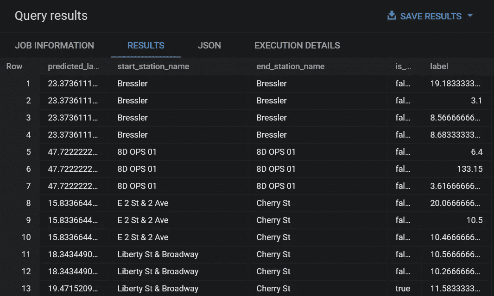

Predicting the data in the prediction table

就是这样。在本教程中，我们首先创建了一个线性回归模型，然后使用该模型来预测在构建模型时没有使用的数据。

# 打扫

为了避免您的 Google Cloud 帐户因本教程中使用的资源而产生费用，您可以删除您创建的项目，或者保存项目并删除数据集。

# 结论

在这篇文章中，我一步一步地展示了如何使用 BigQuery 执行线性回归分析。您可以通过微调超参数获得更好的输出。你可以在这里找到我在本教程中使用的 BigQuery 查询。这里还有一个 youtube 视频，展示了我在这篇文章中讨论的分析。

感谢阅读。我希望你喜欢它。别忘了关注我们的[YouTube](https://jovian.ai/outlink?url=http%3A%2F%2Fyoutube.com%2Ftirendazacademy)|[Medium](https://jovian.ai/outlink?url=http%3A%2F%2Ftirendazacademy.medium.com)|[Twitter](https://jovian.ai/outlink?url=http%3A%2F%2Ftwitter.com%2Ftirendazacademy)|[GitHub](https://jovian.ai/outlink?url=http%3A%2F%2Fgithub.com%2Ftirendazacademy)|[Linkedin](https://jovian.ai/outlink?url=https%3A%2F%2Fwww.linkedin.com%2Fin%2Ftirendaz-academy)|[ka ggle](https://jovian.ai/outlink?url=https%3A%2F%2Fwww.kaggle.com%2Ftirendazacademy)😎

[提伦达兹艾](https://tirendazacademy.medium.com/?source=post_page-----7925dca179ff--------------------------------)

## 用 Python 实践机器学习

[View list](https://tirendazacademy.medium.com/list/handson-machine-learning-with-python-24dbaf45d18a?source=post_page-----7925dca179ff--------------------------------)19 stories

# 资源

*   [Google BigQuery ML 文档](https://cloud.google.com/bigquery-ml/docs/)
*   [使用 BigQuery 的机器学习](https://www.amazon.com.tr/Machine-Learning-BigQuery-ML-learning/dp/1800560303)

如果这篇文章有帮助，请点击拍手👏按钮几下，以示支持👇