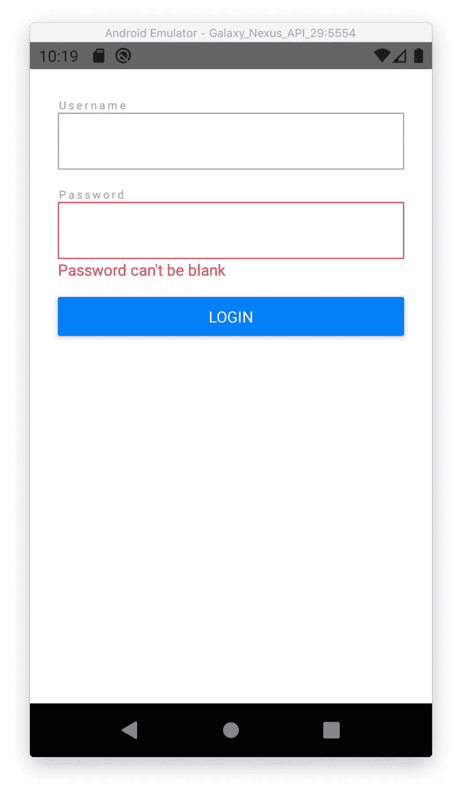

# 使用 React-hook-form useController 在 React Native 中进行方便的表单验证

> 原文：<https://medium.com/geekculture/handy-form-validation-in-react-native-with-react-hook-form-usecontroller-3d4c4297e843?source=collection_archive---------4----------------------->


在 React Native 中管理表单与在 web React 中不同。我们没有快捷方式和 HTML 来通过 ref 注册字段。

我的目标是创建一个方便的解决方案来满足这些需求:

*   很容易理解，
*   可扩展，
*   可重复使用，
*   小样本，
*   钩子居中。

经过几天的实验，我终于找到了一个令我满意的解决方案。这篇文章是我工作的总结。相信这对你会有帮助。

# 如何使用 react-hook-form 和 React Native

我决定使用`react-hook-form`，因为它越来越受欢迎，这是有充分理由的。

本文可以被视为 React Native 中的表单教程。

您可以将本文中介绍的方法与`formik`或您选择的其他类似包一起使用。先通读完，检查你的表单管理包有没有类似的 API。

代码片段中不包含导入、导出和其他杂项代码，如 PropTypes，以避免过载。示例是原始文件的简化版本，可以在本文所附的 git 资源库中找到[。](https://github.com/dkoprowski/react-native-form-validation-tutorial)

# 0.准备项目

我已经创建了一个新的 React 本地项目，并为我们的示例准备了它。

```
npx react-native init ElegantFormManagementcd ElegantFormManagementyarn && yarn start
```

# 1.创建没有任何逻辑的登录表单用户界面

让我们从一个简单的任务开始。我们将首先创建表单的线框。在项目的根目录里面添加`src/components`目录。

现在我们需要两个新文件`Input.js`和`Login.js`:

```
src
├── components
│   ├── Input.js
│   └── Login.js
```

# 输入. js

`Input.js`是 React Native 的`TextInput`组件的包装器。它具有扩展功能，在输入字段上方显示标签，在其下方显示*(如果提供)*验证错误。

```
<Label>{label}</Label>
<TextInput />
{isError && <Error>{error}</Error>}
```

## 关于样式组件的一句话

`styled-components`将在示例中使用，以使组件更具可读性。

```
yarn add styled-components
```

感谢`'styled-components/native'` *(注意* `*/native*` *后缀)*我们可以用 React Native 的组件代替 HTML 元素。例如用`styled.View`代替`styled.div`。

如果你不熟悉这种风格的方法，这是一个快速的比较:

## Input.js 代码

在下面的代码中，你可以看到条件渲染`{Boolean(value) && <Something />}`受到了`Boolean()`函数的保护。如果你很好奇或者不明白我为什么这么做，请阅读 React Native 中的[条件渲染可能会导致你的应用崩溃](https://koprowski.it/2020/conditional-rendering-react-native-text-crash/)。

# Login.js

`Login.js`将是我们的形式。目前，它只是被嘲笑的成分。它由用户名&密码的两个输入框和一个提交按钮组成。

# App.js

`App.js`是 React Native 的标准输入起始场景。删除所有的东西，只在里面渲染`<Login />`的形状。

```
// App.js

const App = () => {
  return (
    <View>
      <Login />
    </View>
  )
}
```

现在我们的应用程序看起来像这样:



要检查这一步的完整源代码，请访问 git 库上的分支`[01-create-basic-ui](https://github.com/dkoprowski/react-native-form-validation-tutorial/tree/01-create-basic-ui)` [。](https://github.com/dkoprowski/react-native-form-validation-tutorial/tree/01-create-basic-ui)

# 2.创建表单

安装`react-hook-form`包的时间到了。

# 安装反应钩模板

使用以下命令停止 metro bundler 并安装软件包:

```
yarn add react-hook-form
```

现在我们准备将一些逻辑引入我们的 UI `<Login />` mock。

# 导入表单的大脑

我们的表单将存在于由`useForm()` hook 返回的对象中。我们姑且称这个对象为`formMethods`。

现在导入需要的钩子并在`<Login />`组件中添加`const formMethods = useForm()`。

接下来，我们将不得不与表单域进行通信。为此，我们将把`formMethods`传递给我们的输入组件。

完整源代码:[02-在 git repo 上创建表单](https://github.com/dkoprowski/react-native-form-validation-tutorial/tree/02-create-form)。

# 3.与表单域建立通信

以优雅的方式制作东西的最大挑战是避免太多的“魔法”。代码需要易于阅读，但也能被其他程序员理解。我们为自己和同事编写代码，而不是为计算机。如果我们要为计算机写代码，那么我们应该使用汇编语言或者更低级的语言。

React Context 只是一个小魔术。它将简化代码，当小心使用时，不会给我们的解决方案增加太多复杂性。

# 什么是反应上下文？

长话短说，我们将向组件的子组件提供相同的信息和所谓的“上下文”,而不是传递大量的组件道具。然后每个孩子都可以通过一个钩子访问上下文🎣。

# 添加 FormProvider 以传递表单上下文

我提到过我们的形体生活在`formMethods`里面。我们必须将这个对象的内容传递给表单字段。在这种情况下，我们的字段是用户名和密码的`<Input />`组件。

我们把`formMethods`里面的一切放入上下文中。为此，我们必须从`react-hook-form`进口`<FormProvider />`。现在我们使用对象扩展操作符`{...formMethods}`将所有内容从`formMethods`传递到`FormProvider`。

请注意，我没有将`Button`包装成`FormProvider`的子对象。这是我们的形式的一个关键因素，因为按下它将提交整个事情。我们将使用良好的旧道具与按钮交互，这样它就不必知道表单中发生的所有事情。

见分支[03-传递上下文到字段](https://github.com/dkoprowski/react-native-form-validation-tutorial/tree/03-pass-context-to-fields)

# 4.向输入组件添加逻辑

我们的 UI 框架`<Input />`除了显示标签和错误还没有做任何事情。它不提供操纵内部`<TextInput />`的道具。

# 将属性传递给输入

我们将再次使用 spread 运算符将所有`Input`道具(除了`label`和`error`)分配给名为`textInputProps`的对象。接下来，我们必须将这个对象传递给`StyledInput`，它只是标准 React Native `TextInput`组件的一个样式版本。

# 创建输入包装

我们有一个非常简单的`Input`组件，在将来很容易测试和扩展。保持这种方式。

我们想给这个组件添加逻辑。我们将创建一个新的组件，而不是直接在`Input`中添加逻辑并将其与我们的表单管理解决方案绑定。它将在内部使用`Input`，并为其配备额外的功能。

# FormInput 控制输入

`FormInput`比`Input`需要一点不同的道具。例如，它会在内部决定`error`和`Input`的`value`道具，所以我们不能将这些道具传递给它。

我们与前总部建立了联系。为了实现这一点，我们添加了`useFormContext()`钩子，它返回我们已经通过`<FormProvider />`传递的对象。例如，我们可以读取所有访问`formContext.errors`字段的表单错误。

看一看:

## `name`道具

要求表单中的每个字段都有一个唯一的名称。因此，我们将`name` prop 传递给每个表单字段。**它是一个字段的标识符。**

## 错误对象

要在`Input`组件上显示适当的错误，请从上下文访问`errors`对象。然后检查我们的字段`errors[name].`是否有错误消息。如果没有错误，那么`errors[name]`是未定义的——因此我们必须小心。为了访问错误消息，我使用了一个全新的**可选链接**操作符(`**?.**`)。

> *`*?.*`*操作符的功能与* `*.*` *链接操作符类似，只是如果引用是*[*nullish*](https://developer.mozilla.org/en-US/docs/Glossary/Nullish)*(*`[*null*](https://developer.mozilla.org/en-US/docs/Web/JavaScript/Reference/Global_Objects/null)`*或* `[*undefined*](https://developer.mozilla.org/en-US/docs/Web/JavaScript/Reference/Global_Objects/undefined)` *)，表达式会短路，返回值为* `*undefined*` *。**

*如果有错误信息，那么`Input`将会收到该信息。否则，它将收到`undefined`。*

## *使用控制器*

*我们与形式有联系，所以让我们使用它！嗯，…差不多了。*

*我们现在将使用我们的表单来存储这个`FormInput`的值。首先，我们必须用`useController`钩子创建我们的字段实例。看看下面的代码示例:*

*在`useController`中，最重要的配置字段是前面提到的`name`和`control`对象。通过向控制器提供`control`对象来建立字段和表单之间的连接。*

***记住** `**control**` **是形体**的一个中心点，这就是我之前提到的“形体的大脑”。*

*为了给字段添加一些限制(如`maxLength`，`required`)，有`rules`对象。我们也可以使用`yup`模式或自定义解析函数。*

## *领域*

*为了保持`Input`的值和状态，我们有一个`field`对象。*

*从现在开始`Input`由`field`对象控制，所以我们传递`value`和事件处理程序 *(* `*onBlur*` *和* `*onChange*` *)* 。*

*字段的所有属性:`{ onChange, onBlur, value, name, ref }`。*

*注意，在`Input`组件上，我们使用`onChangeText`道具从输入字段`onChangeText={field.onChange}`中获取`string`而不是`event`。*

# *注册*

*在我们的主窗体视图`Login.js`中将`Input`组件改为`FormInput`。*

*我还从密码输入中删除了`error`道具，因为这不再是演示视图——它几乎可以工作了！*

## *登录 _ 字段*

*表单会随着时间的推移而增长，所以明智的做法是将所有的常量保存在变量中。我已经为字段名创建了`LOGIN_FIELDS` const。它可以防止在未来的几个小时里出现打字错误和寻找小错误。*

*现在，我们的表单存储值并对变化做出反应。字段与中央`formMethods`对象连接，但是我们缺少任何验证和提交。让我们在下一节深入探讨它。*

*查看 git 存储库上的完整源代码检查分支 [04-create-form-input](https://github.com/dkoprowski/react-native-form-validation-tutorial/tree/04-create-form-input) 。*

# *5.验证并提交*

*要从表单发送数据，我们必须注意登录按钮。*

*创建两个处理程序:*

*   *`onSubmit`当它有效时，它以一个完整的形式作为一个论点，*
*   *`onErrors`它将处理表单中的错误。*

*现在我们把`handleSubmit`功能从`formMethods`传递到按钮的`onPress`道具。`handleSubmit`函数以两个回调函数作为参数- `onSubmit`和`onError`。*

# *没有规则*

*没有规则，所以表单总是有效的！此时，每按一次按钮就会调用`onSubmit`。`onErrors`被忽略。我们必须为用户名和密码添加一些限制。*

*将`rules`对象作为道具传递给`FormInput`。注意，像`minLength`这样复杂的规则由一个对象表示，而像`required`这样简单的规则可以由一个带有错误消息的字符串表示。要了解规则如何工作，请参见`react-hook-form`文档。*

**此时，我们可以用* `*yup*` *模式来代替规则。模式在表单验证方面要强大得多。为了不使本文过于复杂，我在这里不做介绍。如果你感兴趣，请在评论中告诉我！我可以准备“第二部分”的形式冒险。**

*我们已经处理了一个非常基本的登录表单场景。现在，让我们看看在这个简单的解决方案中我们可以改进什么。*

*要在此时检查完整的源代码，请检查 git repo 上的 [05-submit-form](https://github.com/dkoprowski/react-native-form-validation-tutorial/tree/05-submit-form) 分支。*

# *6.使每个表单域防错*

*我们之前提到过表单域需要`name`和表单上下文。为此，我们通过 prop 传递`name`,并从`useFormContext` hook 获取上下文。*

*假设代码的作者和团队中的每个开发人员总是会传递适当的 prop 并在`FormProvider`中包装我们的表单，这太乐观了。我们必须让代码防错。*

*如果能给开发人员一个适当的信息，告诉他们有东西被遗忘了，那就太好了。除非我们想向用户展示其中一个错误:*

*   *当你忘记传递道具名称时，*
*   *`TypeError: Cannot read property 'control' of null`当字段未被`FormProvider`包裹时弹出。*

*我们可以像这样简单地尝试应用条件渲染:*

*但是不有条件地调用钩子会违反 React 规则，如果您正确配置了 ESLint，您会看到这样错误:*

*`React Hook "useController" is called conditionally. React Hooks must be called in the exact same order in every component render. Did you accidentally call a React Hook after an early return?`*

# *另一个包装纸*

*乍看之下，这可能并不那么美好，但它让事情得以完成:*

*   *它保持钩子调用顺序不变，*
*   *使包装的组件安全。*

*在下面的代码片段中，我将旧的`FormInput`组件重命名为`ControlledInput`，并删除了其中的`export`，使其成为“私有”组件。这可以防止在项目的其他文件中导入`ControlledInput`。*

*接下来，我创建了一个新的“公共”组件——包装器。现在这个叫`FormInput`，从文件导出。包装器内部的逻辑非常简单。它检查`formContext`或`name`是否为假，如果是，包装器返回`<Input />`一个正确的错误信息。我还阻止了对这些字段的编辑，以确保集成测试失败。*

*添加错误消息使得将来出现问题时更容易调试。由于这一点，你的自动测试或 QA 团队将立即发现有问题。*

*此时要查看`FormInput.js`的完整源代码，请检查分支[06-防错字段](https://github.com/dkoprowski/react-native-form-validation-tutorial/tree/06-error-proof-fields)。*

# *下一步是什么？*

*使用`FormInput.js` base，您可以类似地构建其他表单字段，如:`FormChecbox`、`FormTextArea`等。*

*我可以在这里添加更多内容，如:*

*   *使用 yup 模式，*
*   *描述如何从键盘上聚焦密码字段，*
*   *如何通过`ref`到`FormInput`，*
*   *为共享表单域逻辑创建一个自定义挂钩，*
*   *如何测试形式…*

*我这篇文章的初稿包含了所有这些东西，但是它开始超载了！如果你想看的话，我下次可以用。让我知道！*

# *生产就绪表单*

*在撰写本文时，我决定为 React Native 创建生产就绪的表单！*

*带有组件库和**整体视图**的移动应用模板，您可以在应用中重复使用。*

*比如即用型注册表单、登录表单、app 意见表、聊天等。*

*一切可以加速 React 本地开发人员或团队工作的东西。我正在准备一个预建的移动应用程序，包含所有这些表单。您可以下载它并根据自己的需要进行调整。*

*点击这里查看项目:【ProductionReadyForms.com】T2。*

*当这个包裹准备好的时候我会通知你！你可以在[网站](https://productionreadyforms.com/)上以简讯的形式给我留下你的电子邮件。*

*   **最初发布于*[*https://koprowski . it*](https://koprowski.it/react-native-form-validation-with-react-hook-form-usecontroller)*。**
*   ***查看我的推特**[**Koprowski _ it**](https://twitter.com/Koprowski_it)*