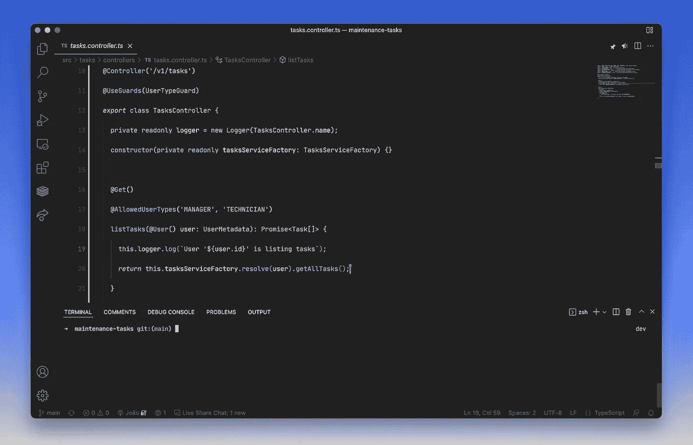

# 🥋快乐的团队与编码道场

> 原文：<https://medium.com/geekculture/happy-teams-with-coding-dojos-de1ff74de23?source=collection_archive---------10----------------------->

建立和壮大软件开发团队不仅仅是雇佣优秀的开发人员。这也是为了让他们保持快乐、充满挑战和积极参与。

Photo by [Thao Le Hoang](https://unsplash.com/@h4x0r3?utm_source=medium&utm_medium=referral) on [Unsplash](https://unsplash.com?utm_source=medium&utm_medium=referral)

在过去的几年里，我一直在推动与我一起工作的团队在他们的成员之间分享知识。我已经通过*知识分享会议*、*实践会议*和最近的*编码道场*做到了这一点。所有这些对团队都有很大的好处，但是我注意到*编码道场*不仅有很大的技术和社会影响，而且对团队成员的快乐也有很大的贡献。

让我们来看看两个*编码 Dojo*基础部分和我最喜欢的帮助它们的工具。

> *“编码道场是一群程序员聚在一起应对编程挑战的会议。”——*[*codingdojo.org*](http://codingdojo.org)

# 挑战

根据定义，主要目标是解决编程挑战。挑战就是你想要解决的问题。有这么多不同的选择，对我来说通常最困难的是选择一个。

选择挑战总是取决于你到底想从技术上解决什么问题。我倾向于根据我从团队日常工作中看到和理解的东西来选择:困难、改进或新的主题，以保持学习的进行。

以下是挑战赛通常想要解决的几个话题:

*   坚实的原则
*   结对编程
*   重构
*   测试驱动开发(TDD)
*   …

这里有几个*网站*可以帮你找到它们:
[leet code](https://leetcode.com/)
[道场谜题](https://dojopuzzles.com/)
[Kata-Log](https://kata-log.rocks/index.html)

# 限制

正如我最初所说的，*编码 Dojo*不仅仅是关于技术影响，也是关于社会影响。限制是你希望挑战如何解决。我喜欢称之为道场有趣的部分。它们是参与者必须遵守的一组规则，因此结果是有效的。

下面是我通常为 Dojos 选择的一些约束:

*   1 名飞行员(编码)+ 1 名副驾驶(帮助)+安静休息。
*   没有在方法之间传递原语作为参数或返回类型。
*   不要用“else”。
*   每个方法不超过 2 个参数。

通过向挑战添加约束，我们可以:

*   迫使参与者选择特定的技术主题来克服挑战。
*   加强参与者之间的协作和沟通。

# 工具

目前，越来越多的团队在远程环境中工作，因此我们应该使用正确的工具来帮助我们。我主要使用 IDE/代码编辑器和团队用于调用的任何提供者的组合。这里的目标是让每个人在同一时间同一地点编写和阅读代码，同时他们能够相互交流。

VS 代码是我的首选。它允许多人同时使用 [Live Share](https://marketplace.visualstudio.com/items?itemName=MS-vsliveshare.vsliveshare) 扩展来处理代码，性能非常好！此外，不同的开发人员使用不同的 ide 和代码编辑器，VS 代码可以在 *Web* 浏览器中运行，只需进入 [vscode.dev](http://vscode.dev/) 。我的意思是，任何人都可以在不到 5 分钟的时间内准备好并运行*编码 Dojo* 并获得他们需要的几乎所有东西。

VS Code — Host

VS Code — Participant in a *Web* browser

我一直在使用*编码 Dojo*主要有三个原因:

*   技术技能提高
*   让团队参与社交活动，一起玩乐
*   引入社区趋势和最佳实践

我们接受了一个挑战，这是关于我们想在技术方面解决的问题。我们选择的挑战通常与我们希望团队基于 TDD、坚实的原则、重构技术等主题改进或学习的主题有关！

解决问题，从技术上提高人和团队是伟大的。但是没有什么比做这件事更有趣的了！为了做到这一点，我们通常会在挑战中添加一些约束条件，以影响人们之间的互动方式。

所以现在你自己去试试吧！如果你做了，让我知道结果。👋