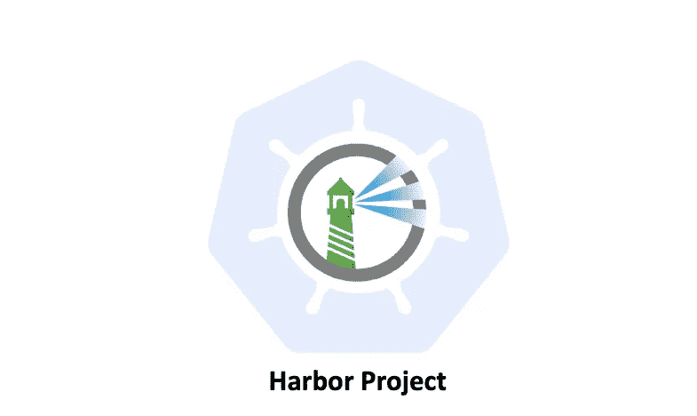

# 港口工程-简介

> 原文：<https://medium.com/geekculture/harbor-project-introduction-595e1e9ff088?source=collection_archive---------7----------------------->

## 什么是港口工程

# 名字

“海港”这个名字本身就和集装箱有关。港口是将集装箱装上或卸下船只的地方。而且“Harbor”这个词比较简单，容易发音和记忆，是项目推广的有力选择。

# 历史