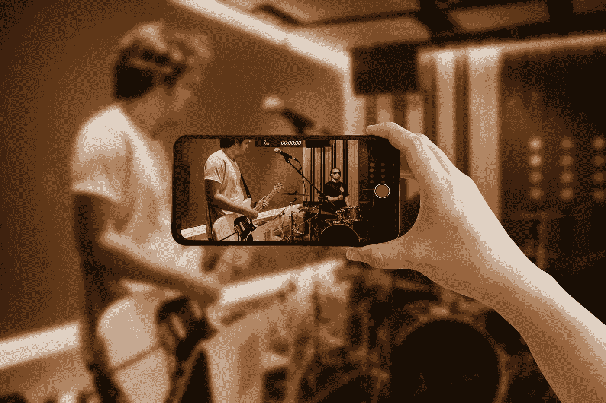

# 利用 NFT 流媒体平台风险模型领先一步！

> 原文：<https://medium.com/geekculture/harness-the-nft-streaming-platform-venture-model-to-be-steps-ahead-18bc9a93a18b?source=collection_archive---------9----------------------->

随着数字媒体成为世界上主要的娱乐来源，我们也应该知道全球娱乐业价值数万亿美元。虽然从经济角度来看，如此巨大的现金流听起来不错，但相比之下，创作者群体获得的收益微不足道。NFTs 等 Web3 应用的兴起几乎每天都会带来创新，娱乐业也未能幸免。 [**NFT 流媒体平台**](https://www.blockchainappfactory.com/nft-streaming-platform-development-solutions?utm_source=medium&utm_medium=30%2F08%2F22&utm_campaign=srinivasan+) 风险企业已经开始成为击败传统流媒体公司的真正竞争者，它们的发展是 Web3 爱好者最近密切关注的事情。

NFT Streaming

# NFT 流媒体平台上的破冰船

在 NFT 流媒体平台上，媒体片段(**音频** / **视频**)以非转播权的形式提供，艺术家可以从代币销售中赚取更多的比例。甚至版税也是可能的，这在以前对于不太出名的表演者来说是不可想象的。如今，[**YouTube**](https://www.youtube.com/)**Twitch****Spotify****Apple Music**[**网飞**](https://www.netflix.com/in/)**和 **Prime Video** 等流媒体平台让世界各地的人们只需点击几下鼠标就能访问全球内容。然而，通过 NFT 的流媒体平台，那些不太出名的创作者可以获得足够的认可和资金来继续他们的好工作。常见的流式内容类型包括视频、音乐、直播视频和游戏。**

# **NFT 视频流展开**

**NFT 流平台最重要的应用是利用 NFTs 进行视频流传输。**在这种情况下，数字令牌**可以附加到视频剪辑上，并发布在这些平台上。然后，可以将它们出售给用户，根据会员级别提供部分所有权。创作者(和粉丝，如果是部分令牌所有权的话)可以通过每个流的**加密令牌**得到激励。视频流的 NFT 对那些通常因多种原因被中央政府审查的内容帮助很大。在 [**【区块链】**](https://en.wikipedia.org/wiki/Blockchain) 上注册这些视频意味着人们永远不能把它们拿下来或者剽窃它们作为自己的来赚钱。**

# **NFT 现场直播透露**

**直播流的 NFT 本质上与视频流相同，但它可以扩展到广播和游戏流。虽然 NFT 游戏玩家可以通过各种赚钱机制赚得盆满钵满，但游戏流媒体可以让他们更贴近粉丝，并获得额外的收入。此外，对于**视频博客**和**播客**、 [**直播的 NFT 可以受益**](https://www.blockchainappfactory.com/nft-streaming-platform-development-solutions?utm_source=medium&utm_medium=30%2F08%2F22&utm_campaign=srinivasan+) ，因为这些代币可以采取高级订阅会员的形式，它们可以帮助这些人维持一个紧密团结的社区。把生活贴出来，视频可以转换成多个 NFT 发布给大众销售。目睹了足够多的人可能知道直播中“瞬间的力量”。**

# **NFT 音乐平台曝光**

**NFT 流媒体平台最受欢迎的应用可能是 NFT 音乐平台。已经有许多 NFT 音乐市场向粉丝出售基于会员等级的歌曲部分所有权代币。这些应用使 [**音乐人在金钱和名声方面赚得更多**](https://www.blockchainappfactory.com/nft-streaming-platform-development-solutions?utm_source=medium&utm_medium=30%2F08%2F22&utm_campaign=srinivasan+) (可能对大多数人来说去掉了“被低估”的标签)。与粉丝建立密切的关系不会比分享流媒体所有权和利润更密切，这比演唱会舞台提供的要多得多。甚至还有正在开发的广播和播客平台，这可能会彻底改变普通听众接触的内容量。**

**NFTs Streaming platform**

# **基于 NFT 的白牌直播平台**

**虽然预制的解决方案在 Web3 领域几乎无处不在，但一个总部位于 NFT 的白色标签直播平台可能是给有抱负的企业家的意想不到的礼物。这些解决方案可以用于直播，尽管可以开发类似的视频和音频平台。这种平台是事先开发和测试的，这使得想要在旅途中利用这一运动的创业爱好者更加容易。启动平台的过程需要用户修改/添加他们选择的用户端功能。这样做的成本将是 [**从头开发一个类似的 NFT 流媒体平台**](https://www.blockchainappfactory.com/nft-streaming-platform-development-solutions?utm_source=medium&utm_medium=30%2F08%2F22&utm_campaign=srinivasan+) 成本的零头。**

# **这些商业平台中有什么？**

**虽然博客的主要部分集中在创作者的利润，甚至在某些情况下是粉丝的利润，但了解关联企业如何赚钱也很重要。NFT 流媒体平台可以收取内容列表费、市场费和会员费。他们还可以利用**原生令牌**作为他们的官方支付手段来提升他们在 Web3 生态系统中的商业价值。这些企业甚至可以收费为创作者提供营销服务，这可能证明对双方都有利。此外，流媒体版税一般相当于一个百分比；即使是 80%，一个视频可能会被**播放几百万次**，即使是 20%也会产生巨大的收入。**

# **最后的想法**

**因此，我们可以说，如果采用 Web3 技术，流媒体平台作为主要娱乐来源在当前世界中的相关性可以进一步提高。作为一名渴望充分利用竞争激烈的 NFT 空间的企业家，NFT 流媒体平台可能是最佳选择。随着新技术的出现，娱乐行业预计将会增长，而非功能性技术是不可避免的。如果你想开发这样一个平台，NFT 流媒体平台开发公司可以提供最好的帮助。**