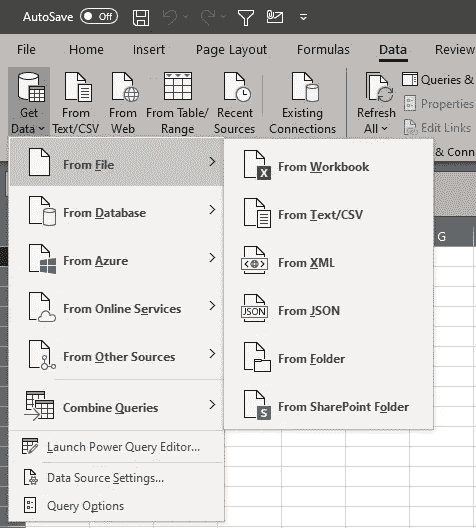
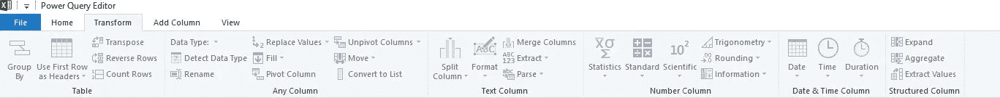
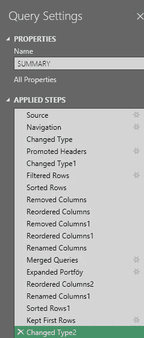
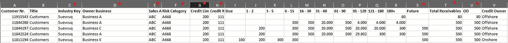
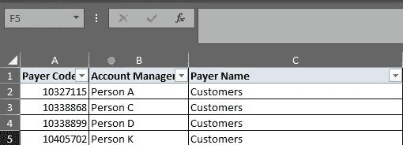
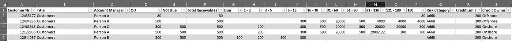

# 利用 Microsoft Excel 强大的查询功能，无需为重复任务编写代码

> 原文：<https://medium.com/geekculture/harness-the-power-of-power-query-in-microsoft-excel-with-no-coding-for-your-repetitive-tasks-d12ee2fe9c26?source=collection_archive---------54----------------------->

如果您发现自己在 Microsoft Excel 中重复相同的步骤，Power Query 可以帮您节省大量时间

当您想到自动化任务、生成报告以及执行除创建和组织电子表格之外的其他功能时，您可能会意识到，最强大的[Visual Basic for Applications(VBA)](https://en.wikipedia.org/wiki/Visual_Basic_for_Applications)已经存在了将近 13 年，毫无疑问，它提供了优秀的业务解决方案。它有数不清的优势，特别是考虑到 Excel 被商业世界的绝大多数用户所接受。我甚至发表了一篇关于[如何利用 VBA 解决无聊任务的帖子](https://burak-piskin.medium.com/five-handy-excel-macros-to-take-boring-chores-out-of-your-workday-7a6ab888ae47)。但是，首先，您必须知道如何用 Visual Basic 语言编码。其他用户必须有自己的副本来执行你的帅 VBA 计划。当事情出错时(这在 VBA 很可能发生)，你的技术支持技能在调试领域是受欢迎的。此外，不同版本的 Excel 之间的兼容性问题会给你带来一些“娱乐性”的挑战。

Photo by [JESHOOTS.COM](https://unsplash.com/@jeshoots?utm_source=medium&utm_medium=referral) on [Unsplash](https://unsplash.com?utm_source=medium&utm_medium=referral)

既然我已经完成了对 VBA 的诋毁，我们可以转向 [Power Query](https://support.microsoft.com/en-us/office/about-power-query-in-excel-7104fbee-9e62-4cb9-a02e-5bfb1a6c536a) ，一个强大的数据转换和准备引擎。

首先，Power Query 使您能够从不同的资源中提取数据；工作簿、文本文件、数据库、在线服务、web、Azure 等。

Available Data Sources for Power Query

您可以在“转换”和“添加列”选项卡下找到惊人的功能，以便高效地处理数据。全面计算得益于[幂查询 M 公式语言](https://docs.microsoft.com/en-us/powerquery-m/)。

Some of the amazing functions

此外，您应用的步骤被保存，这对于任务自动化来说是一个极好的特性。

You can go back to the step you applied and simply change the settings by clicking the gear icon.

在我的例子中，我通过连接另一个 excel 表中的一列，更改列名并重新排序，创建了一个基于每日报告的修改报告。每日报告的内容是变化的，由于不同的数字，但任务是完全相同的，没有附加值和发展。此外，由于这是一项手动任务，因此特别容易出错。

下面我展示了报告是如何转换的，以及我的输出是什么样子:

Red dots represent the columns that have been transformed

The column with the yellow dot is merged from the other source

瞧啊。如您所见，C、D、E 和 F 等列已被更改。当列 C 加入来自另一个源的报告时，列 D 被重新排序，列 E 被重命名(以前为“未来”)。

但是，如果每天的数字都在变化，您如何生成报告呢？它是如此简单。您只需要通过保持相同的名称来替换源，并点击“数据”选项卡下的“全部刷新”按钮(如果您喜欢，可以按 Ctrl + Alt + F5)。

你可能会听到有人说，创建这样一个报告只需要五到十分钟，他们并不介意；直到他们通过简单的数学运算看到蝴蝶效应。让我们假设他们一年创建这个报告 260 次，并且他们做得完美无缺(很现实，对吧？).260 乘以 5 分钟等于 21 小时，差不多是一年三个工作日！

Photo by [Chris Liverani](https://unsplash.com/@chrisliverani?utm_source=medium&utm_medium=referral) on [Unsplash](https://unsplash.com?utm_source=medium&utm_medium=referral)

现在深呼吸一下，想想你的日常工作，试着计算一下如果你知道这些不需要编码的简单功能，你可以在工作中节省多少时间，提高你和你同事的工作效率。

我期待你的评论。