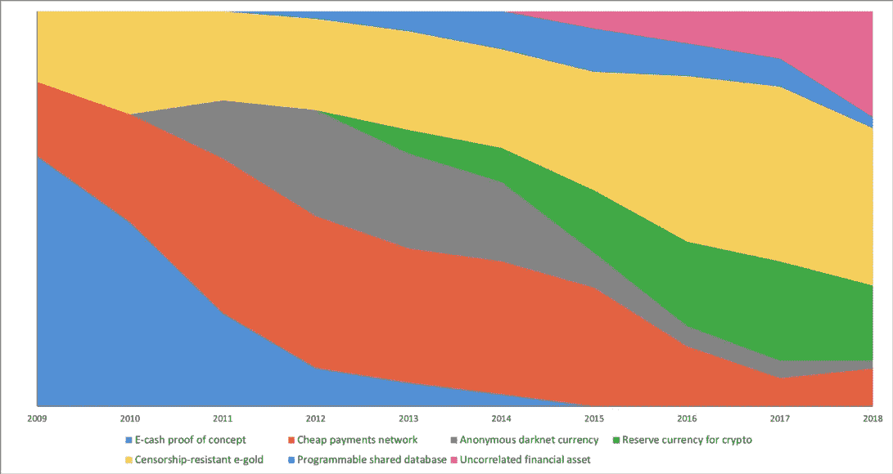

# 比特币失败了吗？

> 原文：<https://medium.com/geekculture/has-bitcoin-failed-68cb19b72b04?source=collection_archive---------5----------------------->

## 对其不同方面的主观评价

Bitcoin’s changing tides, from [https://medium.com/@nic__carter/visions-of-bitcoin-4b7b7cbcd24c](/@nic__carter/visions-of-bitcoin-4b7b7cbcd24c)

这些年来，关于比特币的各种不同说法不断发展。关于比特币和其他加密货币的潜力，有很多非常乐观的说法，也有很多非常悲观的说法！各种各样的马克思主义者声称加密货币和“区块链”将解决世界上所有的问题…