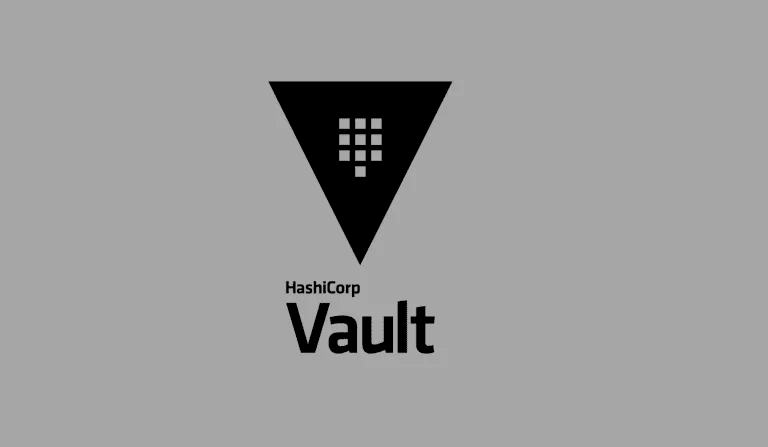

# 哈希公司金库——秘密管理系统

> 原文：<https://medium.com/geekculture/hashicorp-vault-secret-management-system-1ab58dc9ccbd?source=collection_archive---------2----------------------->

## 哈希公司金库简介

你如何管理工作中的大量秘密信息？通常你选择以下方法之一:

*   以配置文件的形式固化，存储在服务器文件或数据库中
*   使用私有的`git`库，并严格控制对该库的访问权限