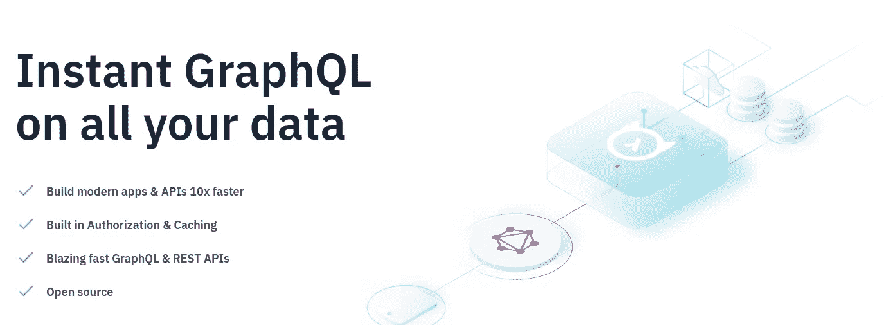

# 一言以蔽之，哈苏拉

> 原文：<https://medium.com/geekculture/hasura-in-a-nutshell-2c1cce3b948d?source=collection_archive---------2----------------------->

## 后端即服务 Hasura 简介。

Screenshot taken from [Hasura website](https://hasura.io/).

> [Hasura](https://hasura.io/) 是一种**后端即服务**技术，它使人们能够直接从 SQL 数据库提供 API。

哈苏拉**将人们从开发后端功能中解放出来，通过 API** 使 SQL 数据库中的数据可读可写。开发时…