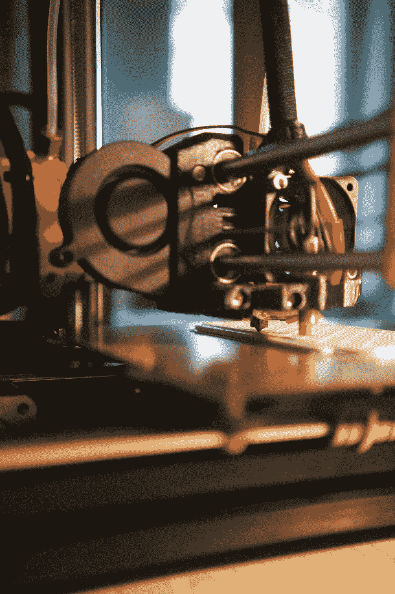

# 你考虑过 3D 打印机吗？

> 原文：<https://medium.com/geekculture/have-you-considered-a-3d-printer-f3c839b73f34?source=collection_archive---------25----------------------->

Photo by [Kadir Celep](https://unsplash.com/@kadircelep?utm_source=medium&utm_medium=referral) on [Unsplash](https://unsplash.com?utm_source=medium&utm_medium=referral)

你可能会认为 3D 打印机是普通大众遥不可及的昂贵玩具。几乎任何事情都是如此，但是如果我告诉你他们不需要这样呢？

我将做一点概括，因为有[多种类型的 3D 打印机](https://www.protolabs.com/resources/blog/types-of-3d-printing/)，我将主要关注最常见的`FDM`类型。当人们提到 3D 打印机时，他们几乎总是指这种类型。