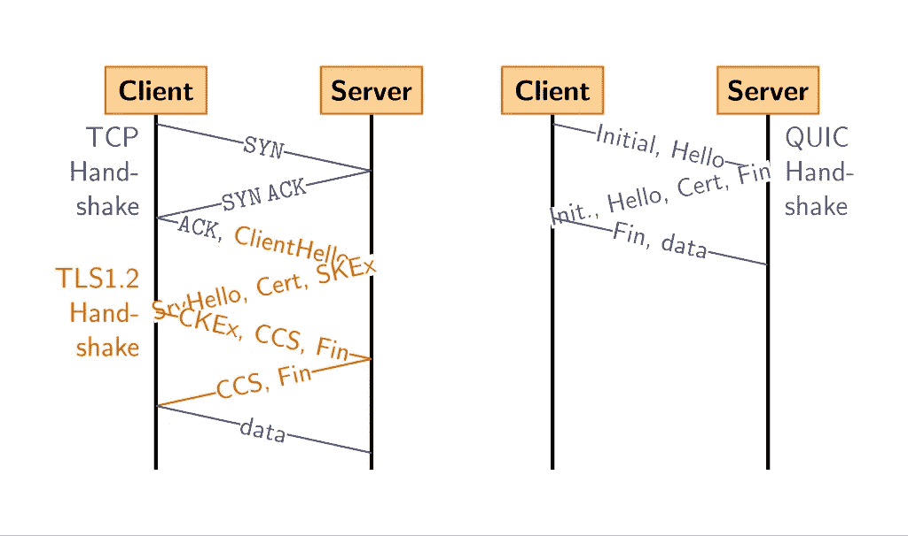

# 你听说过 QUIC 协议吗？

> 原文：<https://medium.com/geekculture/have-you-heard-about-quic-protocol-yet-be7a37ee8572?source=collection_archive---------14----------------------->

我们都知道 TCP 和 UDP 是传输层用于 web 通信的协议。你听说过 QUIC 协议吗？它代表谷歌在 2012 年开发的 ***快速 UDP 互联网连接*** 。我们知道 TCP 是面向连接的，它确保数据按顺序传送，没有任何丢失和损坏。在 TCP 中，这由 TCP 握手过程来确保，以形成连接和 TCP 报头中使用的其他参数，如校验和、序列号等。但是在 TCP 中存在一个被称为**行首阻塞**的问题，因为它按顺序将数据传送给接收应用程序。如果数据包丢失，TCP 接收器会保留该连接上所有后续收到的数据包，直到收到丢失数据包的重新传输。因此，应用程序将不得不等待接收到该重传，即使它可能已经使用了随后接收到的数据包。另一方面，UDP 提供了高速度，但它不能确保数据的有序传递。

Google 试图开发一个名为 QUIC 的协议，它提供与 TCP 相同的服务，但通过定制 UDP 协议大大减少了延迟，并且还解决了 TCP 中存在的行首阻塞问题。来开发 QUIC —

1.  Google 已经 ***使用 UDP 代替 TCP，*** 这就是他们如何减少连接建立时间的开销。UDP 不包括丢失恢复。为了处理丢失恢复和 ***行首阻塞问题*** ，在 QUIC 中，打开多个流，这些流受流量控制，丢失的数据在 QUIC 层传输，而不是在 UDP 层传输。
2.  第二个变化是通过减少作为称为 QUIC 握手的初始握手的一部分的设置密钥交换的开销来完成的。由于 web 上的大多数 HTTP 连接都需要 TLS，所以这是通过在客户端打开连接时在响应数据包中发送设置密钥和支持的协议来实现的。

On the left, a TCP handshake with a TLS handshake is shown. On the right, a QUIC handshake is shown. Picture Source:[https://en.wikipedia.org/wiki/QUIC#/media/File:Tcp-vs-quic-handshake.svg](https://en.wikipedia.org/wiki/QUIC#/media/File:Tcp-vs-quic-handshake.svg)

3.另一个实现是 ***处理网络切换事件*** ，就像当移动设备的用户从本地 wifi 热点移动到移动网络时一样。当 TCP 上出现这种情况时，会启动一个漫长的过程，其中每个现有连接都会超时，然后根据需要重新建立。为了解决这个问题，QUIC 包含了一个连接标识符，它唯一地标识了到服务器的连接，而不考虑连接的来源。这允许简单地通过发送总是包含该 ID 的分组来重新建立连接，因为即使用户的 [IP 地址](https://en.wikipedia.org/wiki/IP_address)改变，原始连接 ID 仍然有效。

QUIC 还没有标准化。但它被谷歌服务、优步移动应用和 Instagrams 所采用。chrome、firefox、edge 和 safari 等大多数浏览器现在都支持 QUIC。QUIC 可以为用户提供更快的网络体验。